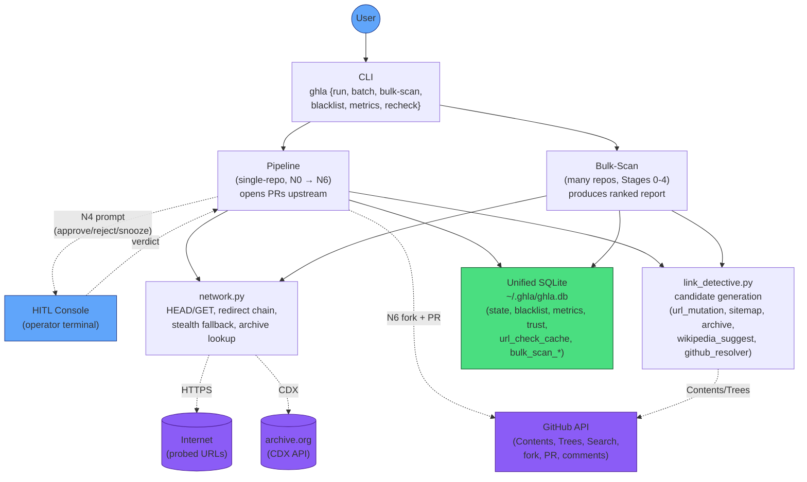

# Architecture

System overview of gh-link-auditor. Conforms to `AssemblyZero/docs/standards/0004-mermaid-diagrams.md`.

## System Diagram

## Components

### CLI (`src/gh_link_auditor/cli/`)

Argparse-based entry point. Subcommands route to the relevant subsystem:

- `run` — single-repo audit + PR pipeline
- `batch` — orchestrates many `run`s with rate limiting
- `bulk-scan` — unattended thousand-repo audit (no PRs)
- `blacklist`, `metrics`, `recheck` — operational tooling against the unified DB

### Pipeline (`src/gh_link_auditor/pipeline/nodes/`)

LangGraph state machine. N0 loads docs → N1 scans for dead links → N2 generates candidates → N3 scores → N4 HITL → N5 writes the diff → PR Preview Gate → N6 forks the repo and opens the PR upstream. See `docs/design/pipeline-process.md` for the flowchart.

### Bulk-Scan (`src/gh_link_auditor/bulk_scan/`)

Five-stage unattended audit:

- **Stage 0 — Selection:** GitHub Search by star-range slices, seeds the run
- **Stage 1 — Inventory:** Per-repo: list doc files via Git Trees API, fetch via raw CDN, extract URLs
- **Stage 2 — Liveness:** HEAD-probe every unique URL with 20-worker pool. Results persisted to `url_check_cache` as they complete (#230) — crashes don't lose work.
- **Stage 3 — Investigation:** Run `LinkDetective` on dead URLs; tier-1 candidates only
- **Stage 4 — Scoring:** Filter at confidence ≥ 0.7, top-N per repo, render the markdown report

### Shared infrastructure

- **`network.py`** — HTTP layer. HEAD-first with GET fallback on common bot-blocker codes (#193), redirect chains, stealth-Playwright with `channel="chrome"` for JS-challenge pages (#190, #198).
- **`link_detective.py`** — candidate generator. Tier-1 methods (high precision) are `url_mutation`, `strip_index`, `wikipedia_suggest`, `github_api_redirect`. Tier-2 methods (lower precision, gated) are `sitemap_search`, `archive_only`.
- **Unified SQLite (`unified_db.py`)** — single DB at `~/.ghla/ghla.db`, schema v5. Tables: `bulk_scan_*` (runs/repos/findings), `url_check_cache`, `repos`, `blacklist`, `repo_trust`, `interactions`, `pr_outcomes`, etc.

### External services

- **GitHub API** — Contents/Trees for doc inventory, Search for repo discovery, fork + PR for submission. PAT-authenticated via `auth.resolve_github_token()` (env → `gh auth token` fallback).
- **Internet HTTP** — destination URLs being probed.
- **archive.org** — CDX API lookup for archived snapshots in N2 / Stage 3 investigation (tier-2; held out of bulk-scan envelope).

## Storage layout

`~/.ghla/ghla.db` is the single source of truth. The CLI's `--db-path` flag overrides the default.

| Table | Purpose | Touched by |
|---|---|---|
| `bulk_scan_runs` | One row per bulk-scan run | bulk-scan |
| `bulk_scan_repos` | Per-repo state within a run | bulk-scan |
| `bulk_scan_findings` | URL + candidate per finding | bulk-scan |
| `url_check_cache` | Persistent URL liveness cache (30-day TTL) | bulk-scan, pipeline |
| `repos` | Per-repo state (trust tier, last-scanned) | pipeline |
| `blacklist` | Repo-level skip list with source attribution | pipeline, bulk-scan |
| `repo_trust` | `new` → `tier1_pending` → `tier1_proven` → `tier2_eligible` | pipeline |
| `interactions` | HITL verdicts and other observations | pipeline |
| `pr_outcomes` | PR state machine (open/merged/closed/fix_stolen) | pipeline + `metrics refresh` |
| `recheck_queue` | Snoozed verdicts waiting for re-verification | pipeline + `recheck` |
| `rewrite_queue` | `[d]ead-product` HITL captures for batch issue-filing | pipeline |

## Notes

- **No LLM in the audit pipeline.** All audit decisions are algorithmic (regex, HTTP semantics, URL similarity). `repo_scout` (discovery) uses an LLM brainstormer but is a separate flow.
- **No-coordination workers.** The bulk-scan worker pool writes to sqlite via a single main-thread callback (#230); no inter-thread DB locking needed.
- **Auth resolution.** Any GH-API caller resolves token via `auth.resolve_github_token()` — env first, `gh auth token` fallback. Never `os.environ.get("GITHUB_TOKEN")` directly.
