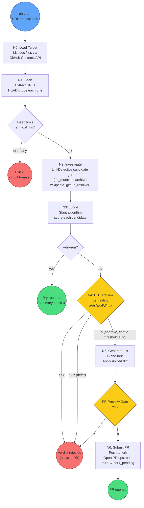
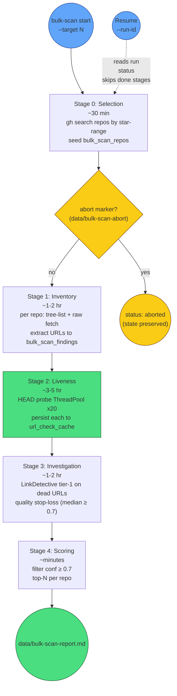

# Pipeline Process

Two operating modes:

1. **Single-repo pipeline** (`ghla run`) — N0 through N6, includes HITL and PR submission
2. **Bulk-scan stages** (`ghla bulk-scan`) — Stage 0 through Stage 4, audit-only

Diagrams conform to `AssemblyZero/docs/standards/0004-mermaid-diagrams.md`.

## Single-repo pipeline (`ghla run <target>`)

**HITL keys at N4:**

| Key | Action |
|---|---|
| `a` / `y` | Approve replacement |
| `r` / `n` | Reject — keep dead URL as-is in PR |
| `s` | Skip — defer this verdict, continue |
| `z` | Snooze — punt to `recheck` queue (default 7d) |
| `g` | Open Google search for the dead URL in browser |
| `l` | Mark as live — false-positive flag for post-run analysis |
| `d` | Dead-product flag — punt to `rewrite_queue` for batch issue-filing |
| `m` | Manual URL entry — type a replacement directly |
| `u` | Show URL again (re-display verdict) |
| `x` | Exit — reject all remaining verdicts |

High-confidence verdicts (≥ 0.8 by default) auto-approve and don't show in HITL. Lower `--confidence` to gate more verdicts.

## Bulk-scan stages (`ghla bulk-scan start`)

**Stage 2 persistence (#230):** The green-highlighted Stage 2 writes every probe result to `url_check_cache` as the future completes (30-day TTL). On resume, the runner reads cache and skips already-probed URLs. Power cuts and OOMs no longer lose this stage's work.

**Quality stop-loss (Stage 3):** First 100 surfaced candidates are sampled; median confidence < 0.7 → run auto-aborts with `status: quality_aborted`. Do not restart with same `run_id`; diagnose post-trip and start a fresh run.

**Resume semantics (#231):**

| Invocation | Behavior |
|---|---|
| `start` (no `--run-id`) | Auto-generates timestamped id, creates new run |
| `start --run-id <existing>` | Resumes — picks up at current stage |
| `start --run-id <unknown>` (no `--new-run`) | **Error 2** + "Did you mean..." suggestions |
| `start --run-id <unknown> --new-run` | Creates new run under chosen id |
| `start --run-id <existing> --new-run` | **Error 2** — drop `--new-run` to resume |

## Files written

| File | When | Purpose |
|---|---|---|
| `data/bulk-scan-heartbeat.txt` | Every ~5 min (Stages 1/3/4; Stage 2 gap tracked in #234) | Phone-readable status snapshot |
| `data/bulk-scan-sample.md` | After first 100 surfaced findings | Spot-check the quality before walking away |
| `data/bulk-scan-report.md` | At end of Stage 4 | The deliverable — ranked candidate list |
| `data/bulk-scan-abort` | When operator runs `bulk-scan stop` | Sentinel file — runner exits at next batch boundary |
| `~/.ghla/ghla.db` | Continuously | All state; resumable via `--run-id` |
