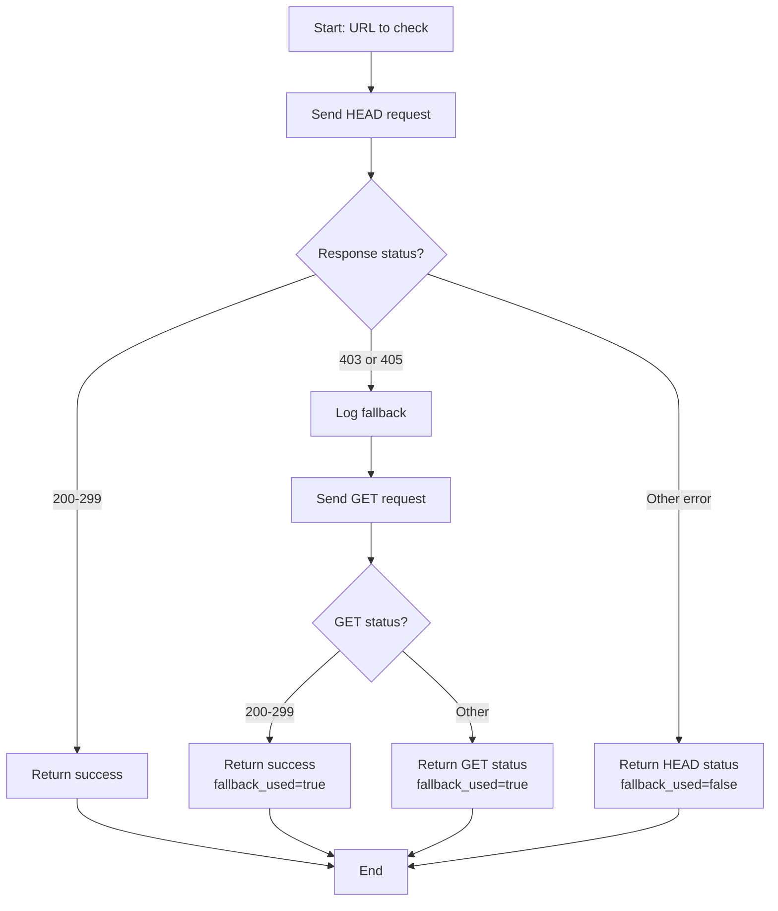

# 1 - Feature: Enhance check_links.py to handle anti-bot errors

<!-- Template Metadata
Last Updated: 2026-02-16
Updated By: Revision to fix test coverage gaps
Update Reason: Added REQ-N references to test scenarios 060, 070 for requirements REQ-6 and REQ-7
-->

## 1. Context & Goal
* **Issue:** #1
* **Objective:** Enhance check_links.py to fall back to GET requests when HEAD requests fail with 403 or 405 errors, enabling successful link validation against anti-bot protected servers.
* **Status:** Approved (gemini-3-pro-preview, 2026-02-16)
* **Related Issues:** None

### Open Questions
*Questions that need clarification before or during implementation. Remove when resolved.*

- [x] Are there other HTTP status codes that should trigger fallback? (Decision: Only 403 and 405 per issue specification)
- [x] Should we add a configurable timeout for GET requests since they're heavier? (Decision: Use existing timeout; GET fallback is already slower by nature)

## 2. Proposed Changes

*This section is the **source of truth** for implementation. Describe exactly what will be built.*

### 2.1 Files Changed

| File | Change Type | Description |
|------|-------------|-------------|
| `check_links.py` | Modify | Add fallback logic from HEAD to GET for 403/405 responses |

### 2.1.1 Path Validation (Mechanical - Auto-Checked)

*Issue #277: Before human or Gemini review, paths are verified programmatically.*

Mechanical validation automatically checks:
- All "Modify" files must exist in repository
- All "Delete" files must exist in repository
- All "Add" files must have existing parent directories
- No placeholder prefixes (`src/`, `lib/`, `app/`) unless directory exists

**If validation fails, the LLD is BLOCKED before reaching review.**

### 2.2 Dependencies

*No new dependencies required. Uses existing `requests` library.*

```toml
# pyproject.toml additions (if any)
# None - existing requests library sufficient
```

### 2.3 Data Structures

```python
# Pseudocode - NOT implementation
class LinkCheckResult(TypedDict):
    url: str              # The URL that was checked
    status_code: int      # Final HTTP status code
    method_used: str      # "HEAD" or "GET" - which method succeeded
    fallback_used: bool   # True if GET fallback was needed
    error: str | None     # Error message if check failed
```

### 2.4 Function Signatures

```python
# Signatures only - implementation in source files
def check_link_with_fallback(url: str, timeout: int = 10) -> LinkCheckResult:
    """
    Check a URL using HEAD request, falling back to GET on 403/405.
    
    Args:
        url: The URL to validate
        timeout: Request timeout in seconds
        
    Returns:
        LinkCheckResult with status and method information
    """
    ...

def should_fallback_to_get(status_code: int) -> bool:
    """
    Determine if a HEAD response warrants a GET fallback.
    
    Args:
        status_code: HTTP status code from HEAD request
        
    Returns:
        True if status_code is 403 or 405
    """
    ...

def log_fallback_attempt(url: str, head_status: int) -> None:
    """
    Log when a GET fallback is being attempted.
    
    Args:
        url: The URL being checked
        head_status: The HEAD status code that triggered fallback
    """
    ...
```

### 2.5 Logic Flow (Pseudocode)

```
1. Receive URL to check
2. Send HEAD request with timeout
3. IF response status is 403 OR 405 THEN
   - Log fallback attempt
   - Send GET request with timeout
   - Return GET response status
   ELSE
   - Return HEAD response status
4. IF any request exception THEN
   - Return error result
5. Return final LinkCheckResult
```

### 2.6 Technical Approach

* **Module:** `check_links.py` (root level script)
* **Pattern:** Chain of Responsibility / Fallback Pattern
* **Key Decisions:** 
  - Implement fallback at the individual link check level, not batch level
  - Preserve existing interface; fallback is transparent to callers
  - Log when fallback is used for debugging visibility

### 2.7 Architecture Decisions

*Document key architectural decisions that affect the design. This section addresses the most common category of governance feedback (23 patterns).*

| Decision | Options Considered | Choice | Rationale |
|----------|-------------------|--------|-----------|
| Fallback trigger codes | 403 only, 405 only, Both 403+405, All 4xx | 403 and 405 only | Per issue spec; these are the anti-bot indicators |
| GET request behavior | Stream response, Full download, HEAD-like minimal | Stream with early close | Minimize bandwidth; we only need status code |
| Retry logic | No retry, Retry on fallback, Exponential backoff | No retry | Fallback IS the retry; further retries add complexity |

**Architectural Constraints:**
- Must maintain backward compatibility with existing check_links.py usage
- Cannot introduce new external dependencies
- Must not significantly slow down valid HEAD responses

## 3. Requirements

*What must be true when this is done. These become acceptance criteria.*

1. HEAD requests that receive 403 response MUST trigger a GET fallback
2. HEAD requests that receive 405 response MUST trigger a GET fallback
3. Successful HEAD requests (2xx) MUST NOT trigger GET fallback
4. Other error codes (404, 500, etc.) MUST NOT trigger GET fallback
5. GET fallback MUST return the actual status from the GET request
6. Fallback behavior MUST be logged for debugging
7. Overall script interface MUST remain unchanged

## 4. Alternatives Considered

| Option | Pros | Cons | Decision |
|--------|------|------|----------|
| Always use GET | Simple, no fallback logic | Slower, more bandwidth, defeats HEAD optimization | **Rejected** |
| HEAD with GET fallback on 403/405 | Fast for good servers, works for anti-bot | Slightly more code | **Selected** |
| Use browser User-Agent spoofing | Might bypass more blocks | Ethically questionable, maintenance burden | **Rejected** |
| Configure per-domain method | Maximum flexibility | Over-engineered for this use case | **Rejected** |

**Rationale:** The HEAD-first-with-fallback approach preserves the speed benefits of HEAD for the majority of links while handling the specific anti-bot scenarios identified in the issue.

## 5. Data & Fixtures

*Per [0108-lld-pre-implementation-review.md](0108-lld-pre-implementation-review.md) - complete this section BEFORE implementation.*

### 5.1 Data Sources

| Attribute | Value |
|-----------|-------|
| Source | Markdown files in repository |
| Format | URLs extracted from markdown links |
| Size | Varies by repository content |
| Refresh | On-demand when script is run |
| Copyright/License | N/A |

### 5.2 Data Pipeline

```
Markdown Files ──regex extract──► URL List ──HTTP check──► Status Results ──format──► Report Output
```

### 5.3 Test Fixtures

| Fixture | Source | Notes |
|---------|--------|-------|
| Mock 403 response | Generated | Simulates anti-bot blocking |
| Mock 405 response | Generated | Simulates HEAD not allowed |
| Mock 200 response | Generated | Normal success case |
| Mock 404 response | Generated | Not found - no fallback expected |

### 5.4 Deployment Pipeline

Script is used locally; no deployment pipeline. Changes tested via pytest then committed.

**If data source is external:** N/A - no external data utility needed.

## 6. Diagram

### 6.1 Mermaid Quality Gate

Before finalizing any diagram, verify in [Mermaid Live Editor](https://mermaid.live) or GitHub preview:

- [x] **Simplicity:** Similar components collapsed (per 0006 §8.1)
- [x] **No touching:** All elements have visual separation (per 0006 §8.2)
- [x] **No hidden lines:** All arrows fully visible (per 0006 §8.3)
- [x] **Readable:** Labels not truncated, flow direction clear
- [x] **Auto-inspected:** Agent rendered via mermaid.ink and viewed (per 0006 §8.5)

**Agent Auto-Inspection (MANDATORY):**

AI agents MUST render and view the diagram before committing:
1. Base64 encode diagram → fetch PNG from `https://mermaid.ink/img/{base64}`
2. Read the PNG file (multimodal inspection)
3. Document results below

**Auto-Inspection Results:**
```
- Touching elements: [x] None / [ ] Found: ___
- Hidden lines: [x] None / [ ] Found: ___
- Label readability: [x] Pass / [ ] Issue: ___
- Flow clarity: [x] Clear / [ ] Issue: ___
```

*Reference: [0006-mermaid-diagrams.md](0006-mermaid-diagrams.md)*

### 6.2 Diagram



## 7. Security & Safety Considerations

*This section addresses security (10 patterns) and safety (9 patterns) concerns from governance feedback.*

### 7.1 Security

| Concern | Mitigation | Status |
|---------|------------|--------|
| SSRF via malicious URLs | Existing URL validation in script unchanged | Addressed |
| Excessive redirects | Use requests redirect limit (default 30) | Addressed |
| Credentials in URLs | No credential handling; URLs checked as-is | N/A |

### 7.2 Safety

*Safety concerns focus on preventing data loss, ensuring fail-safe behavior, and protecting system integrity.*

| Concern | Mitigation | Status |
|---------|------------|--------|
| Runaway GET requests | Timeout enforced on both HEAD and GET | Addressed |
| Memory exhaustion from large GETs | Stream GET response, don't buffer body | Addressed |
| Network flooding | Existing rate limiting/sequential processing | Addressed |

**Fail Mode:** Fail Closed - If both HEAD and GET fail, report the failure rather than assume success.

**Recovery Strategy:** Individual link failures don't stop script; all links checked and failures collected in report.

## 8. Performance & Cost Considerations

*This section addresses performance and cost concerns (6 patterns) from governance feedback.*

### 8.1 Performance

| Metric | Budget | Approach |
|--------|--------|----------|
| Latency per link | < 2x current (for fallback cases) | GET only when HEAD fails with 403/405 |
| Memory | No change | Stream GET responses |
| Bandwidth | Minimal increase | Only fallback on specific codes |

**Bottlenecks:** GET fallback will be slower than HEAD success, but this is unavoidable for anti-bot servers.

### 8.2 Cost Analysis

| Resource | Unit Cost | Estimated Usage | Monthly Cost |
|----------|-----------|-----------------|--------------|
| Network bandwidth | $0 (local) | Minimal | $0 |
| CPU time | $0 (local) | Negligible | $0 |

**Cost Controls:**
- [x] No cloud resources used
- [x] Local execution only

**Worst-Case Scenario:** If all URLs require fallback, script runtime approximately doubles. Acceptable given this is a development tool run infrequently.

## 9. Legal & Compliance

*This section addresses legal concerns (8 patterns) from governance feedback.*

| Concern | Applies? | Mitigation |
|---------|----------|------------|
| PII/Personal Data | No | Script checks URLs, doesn't process content |
| Third-Party Licenses | N/A | No new dependencies |
| Terms of Service | N/A | Standard HTTP requests |
| Data Retention | No | No data stored |
| Export Controls | No | No restricted technology |

**Data Classification:** Public - URLs being checked are from project markdown files.

**Compliance Checklist:**
- [x] No PII stored without consent
- [x] All third-party licenses compatible with project license
- [x] External API usage compliant with provider ToS
- [x] Data retention policy documented (N/A - no retention)

## 10. Verification & Testing

*Ref: [0005-testing-strategy-and-protocols.md](0005-testing-strategy-and-protocols.md)*

**Testing Philosophy:** Strive for 100% automated test coverage. Manual tests are a last resort for scenarios that genuinely cannot be automated (e.g., visual inspection, hardware interaction). Every scenario marked "Manual" requires justification.

### 10.0 Test Plan (TDD - Complete Before Implementation)

**TDD Requirement:** Tests MUST be written and failing BEFORE implementation begins.

| Test ID | Test Description | Expected Behavior | Status |
|---------|------------------|-------------------|--------|
| T010 | test_head_success_no_fallback | HEAD 200 returns success without GET | RED |
| T020 | test_head_403_triggers_get_fallback | HEAD 403 triggers GET request | RED |
| T030 | test_head_405_triggers_get_fallback | HEAD 405 triggers GET request | RED |
| T040 | test_head_404_no_fallback | HEAD 404 returns 404 without GET | RED |
| T050 | test_get_fallback_returns_get_status | GET fallback returns actual GET status | RED |
| T060 | test_should_fallback_true_for_403 | should_fallback_to_get(403) returns True | RED |
| T070 | test_should_fallback_true_for_405 | should_fallback_to_get(405) returns True | RED |
| T080 | test_should_fallback_false_for_404 | should_fallback_to_get(404) returns False | RED |
| T090 | test_fallback_is_logged | Log message emitted on fallback | RED |
| T100 | test_interface_unchanged | Script callable with same args as before | RED |

**Coverage Target:** ≥95% for all new code

**TDD Checklist:**
- [ ] All tests written before implementation
- [ ] Tests currently RED (failing)
- [ ] Test IDs match scenario IDs in 10.1
- [ ] Test file created at: `tests/test_check_links.py`

*Note: Update Status from RED to GREEN as implementation progresses. All tests should be RED at LLD review time.*

### 10.1 Test Scenarios

| ID | Scenario | Type | Input | Expected Output | Pass Criteria |
|----|----------|------|-------|-----------------|---------------|
| 010 | HEAD success no fallback (REQ-3) | Auto | URL returning HEAD 200 | status=200, fallback_used=False | No GET request made |
| 020 | HEAD 403 triggers fallback (REQ-1) | Auto | URL returning HEAD 403 | GET request made | GET called after HEAD |
| 030 | HEAD 405 triggers fallback (REQ-2) | Auto | URL returning HEAD 405 | GET request made | GET called after HEAD |
| 040 | HEAD 404 no fallback (REQ-4) | Auto | URL returning HEAD 404 | status=404, fallback_used=False | No GET request made |
| 050 | GET fallback returns status (REQ-5) | Auto | HEAD 403, GET 200 | status=200, fallback_used=True | Final status from GET |
| 060 | Fallback is logged (REQ-6) | Auto | HEAD 403 triggers fallback | Log message emitted | log_fallback_attempt called |
| 070 | Interface unchanged (REQ-7) | Auto | Standard script invocation | Script runs with existing args | No breaking changes |
| 080 | Fallback check 403 (REQ-1) | Auto | status_code=403 | True | Function returns True |
| 090 | Fallback check 405 (REQ-2) | Auto | status_code=405 | True | Function returns True |
| 100 | Fallback check 404 (REQ-4) | Auto | status_code=404 | False | Function returns False |
| 110 | Timeout handling (REQ-5) | Auto | Slow URL | Error result | Timeout respected |

*Note: Use 3-digit IDs with gaps of 10 (010, 020, 030...) to allow insertions.*

**Type values:**
- `Auto` - Fully automated, runs in CI (pytest, playwright, etc.)
- `Auto-Live` - Automated but hits real external services (may be slow/flaky)
- `Manual` - Requires human execution (MUST include justification why automation is impossible)

### 10.2 Test Commands

```bash
# Run all automated tests
poetry run pytest tests/test_check_links.py -v

# Run only fast/mocked tests (exclude live)
poetry run pytest tests/test_check_links.py -v -m "not live"

# Run live integration tests (hits actual anti-bot URLs)
poetry run pytest tests/test_check_links.py -v -m live
```

### 10.3 Manual Tests (Only If Unavoidable)

N/A - All scenarios automated.

*Full test results recorded in Implementation Report (0103) or Test Report (0113).*

## 11. Risks & Mitigations

| Risk | Impact | Likelihood | Mitigation |
|------|--------|------------|------------|
| Some servers block both HEAD and GET | Low | Low | Accept and report as failed link |
| GET fallback significantly slows execution | Med | Low | Only triggers on 403/405; log for visibility |
| False positives from aggressive anti-bot | Low | Med | GET fallback handles most cases |

## 12. Definition of Done

### Code
- [ ] Implementation complete and linted
- [ ] Code comments reference this LLD

### Tests
- [ ] All test scenarios pass
- [ ] Test coverage meets threshold

### Documentation
- [ ] LLD updated with any deviations
- [ ] Implementation Report (0103) completed
- [ ] Test Report (0113) completed if applicable

### Review
- [ ] Code review completed
- [ ] User approval before closing issue

### 12.1 Traceability (Mechanical - Auto-Checked)

*Issue #277: Cross-references are verified programmatically.*

Mechanical validation automatically checks:
- Every file mentioned in this section must appear in Section 2.1
- Every risk mitigation in Section 11 should have a corresponding function in Section 2.4 (warning if not)

**If files are missing from Section 2.1, the LLD is BLOCKED.**

---

## Reviewer Suggestions

*Non-blocking recommendations from the reviewer.*

- Consider adding a debug log entry if the GET fallback *also* fails with 403, to explicitly identify stubborn anti-bot protections.

## Appendix: Review Log

*Track all review feedback with timestamps and implementation status.*

<!-- Note: Timestamps are auto-generated by the workflow. Do not fill in manually. -->

### Review Summary

<!-- Note: This table is auto-populated by the workflow with actual review dates. -->

| Review | Date | Verdict | Key Issue |
|--------|------|---------|-----------|
| - | - | - | Awaiting review |

**Final Status:** APPROVED
<!-- Note: This field is auto-updated to APPROVED by the workflow when finalized -->