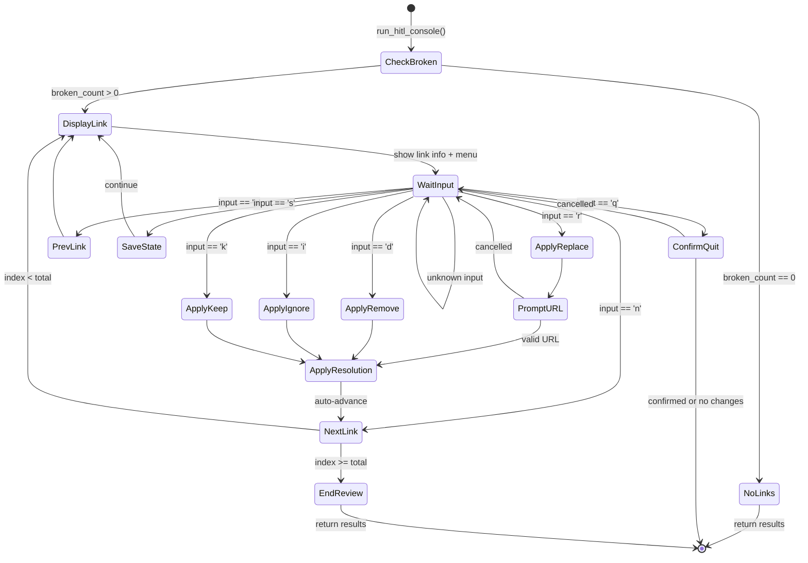

# 10 - Feature: Interactive Console UI (HITL) Loop

## 1. Context & Goal
* **Issue:** #10
* **Objective:** Implement an interactive `input()` loop that enables human-in-the-loop resolution of broken links discovered during URL scanning.
* **Status:** Draft
* **Related Issues:** #6 (CLI Argument Parser), #8 (JSON Report Schema)

### Open Questions

- [x] Should the HITL loop support batch operations (e.g., "ignore all 404s")? — **Answer:** Not in initial implementation; single-link resolution only.
- [x] What happens if the user closes stdin unexpectedly (Ctrl+D)? — **Answer:** Graceful exit with partial results saved.

## 2. Proposed Changes

*This section is the **source of truth** for implementation. Describes exactly what will be built.*

### 2.1 Files Changed

| File | Change Type | Description |
|------|-------------|-------------|
| `hitl_console.py` | Add | Core HITL interactive console implementation |
| `check_links.py` | Modify | Integrate HITL mode invocation via `--resolve` flag |

### 2.1.1 Path Validation (Mechanical - Auto-Checked)

*Issue #277: Before human or Gemini review, paths are verified programmatically.*

Mechanical validation automatically checks:
- All "Modify" files must exist in repository ✓ (`check_links.py` exists)
- All "Delete" files must exist in repository — N/A
- All "Add" files must have existing parent directories ✓ (root directory)
- No placeholder prefixes (`src/`, `lib/`, `app/`) unless directory exists ✓

**If validation fails, the LLD is BLOCKED before reaching review.**

### 2.2 Dependencies

*No new dependencies required. Uses only Python standard library.*

```toml
# pyproject.toml additions (if any)
# None - uses standard library only (input, json, datetime)
```

### 2.3 Data Structures

```python
# Pseudocode - NOT implementation
from typing import TypedDict, Literal

class Resolution(TypedDict):
    action: Literal["replace", "remove", "ignore", "keep"]
    new_url: str | None  # Only for "replace" action
    resolved_by: Literal["human", "llm"]
    resolved_at: str  # ISO 8601 timestamp
    note: str | None  # Optional user-provided note

class HITLState(TypedDict):
    current_index: int  # Current position in broken links list
    total_broken: int  # Total number of broken links
    results: list[dict]  # Full results array from scan
    modified: bool  # Whether any resolutions have been made
```

### 2.4 Function Signatures

```python
# Signatures only - implementation in source files

def run_hitl_console(results: list[dict]) -> list[dict]:
    """
    Main entry point for HITL resolution mode.
    
    Filters results to broken links, presents interactive menu,
    and returns updated results with resolution data.
    """
    ...

def filter_broken_links(results: list[dict]) -> list[dict]:
    """
    Extract only broken links (status != 'ok') from results.
    
    Returns references to original result objects for in-place updates.
    """
    ...

def display_link_info(link: dict, index: int, total: int) -> None:
    """
    Print formatted details about a broken link.
    
    Shows URL, status, error, and file locations.
    """
    ...

def display_menu() -> None:
    """Print the available action menu."""
    ...

def get_user_action() -> str:
    """
    Prompt user for action input.
    
    Returns lowercase single character or command string.
    """
    ...

def prompt_replacement_url() -> str | None:
    """
    Prompt user to enter a replacement URL.
    
    Returns validated URL or None if cancelled.
    """
    ...

def prompt_note() -> str | None:
    """
    Prompt user for optional resolution note.
    
    Returns note string or None if skipped.
    """
    ...

def apply_resolution(link: dict, action: str, new_url: str | None, note: str | None) -> None:
    """
    Apply resolution data to a link result in-place.
    
    Updates the 'resolution' field per JSON schema (00008).
    """
    ...

def validate_url(url: str) -> bool:
    """
    Basic URL validation for replacement URLs.
    
    Checks for valid http/https scheme and basic structure.
    """
    ...

def save_results(results: list[dict], output_path: str) -> None:
    """
    Save current results to JSON file.
    
    Writes full JSON report per schema (00008).
    """
    ...

def handle_quit(modified: bool, results: list[dict]) -> bool:
    """
    Handle quit command with unsaved changes prompt.
    
    Returns True if user confirms quit, False to continue.
    """
    ...

def handle_signal_exit(results: list[dict], modified: bool) -> None:
    """
    Handle EOF (Ctrl+D) and KeyboardInterrupt (Ctrl+C) gracefully.
    
    Saves partial results and exits cleanly.
    """
    ...
```

### 2.5 Logic Flow (Pseudocode)

```
1. Receive results array from scan
2. Filter to broken_links = [r for r in results if r.status != 'ok']
3. IF broken_links is empty THEN
   - Print "No broken links to resolve"
   - Return results unchanged
4. current_index = 0
5. LOOP while current_index < len(broken_links):
   a. Display link info (index, total, URL, status, locations)
   b. Display menu (r=replace, d=remove, i=ignore, k=keep, n=next, p=prev, s=save, q=quit)
   c. Get user input
   d. SWITCH on input:
      - 'r': prompt for new URL, validate, apply resolution
      - 'd': apply resolution(action=remove)
      - 'i': apply resolution(action=ignore)
      - 'k': apply resolution(action=keep)
      - 'n': current_index += 1 (clamp to max)
      - 'p': current_index -= 1 (clamp to 0)
      - 's': save current state, print confirmation
      - 'q': prompt for unsaved changes, exit loop
      - else: print "Unknown command"
6. Return modified results
```

### 2.6 Technical Approach

* **Module:** `hitl_console.py` (new file at repository root)
* **Pattern:** Command loop with state machine
* **Key Decisions:**
  - Direct `input()` calls for simplicity (no curses/readline complexity)
  - In-place mutation of results array (matches JSON schema expectations)
  - Single-link focus per iteration (batch operations deferred)

### 2.7 Architecture Decisions

| Decision | Options Considered | Choice | Rationale |
|----------|-------------------|--------|-----------|
| UI Framework | curses, prompt_toolkit, raw input() | raw input() | Minimal dependencies, cross-platform, sufficient for MVP |
| State Management | Global state, class instance, function params | Function params with mutation | Simplest approach, results list is already mutable |
| Navigation Model | Linear, random access | Linear with prev/next | Matches typical review workflow |
| Persistence | Auto-save, manual save, exit-only | Manual save command | User control over when changes persist |

**Architectural Constraints:**
- Must integrate with existing `check_links.py` without major refactoring
- Must produce output compatible with JSON schema (00008)
- No external dependencies (standard library only)

## 3. Requirements

*What must be true when this is done. These become acceptance criteria.*

1. User can invoke HITL mode via `--resolve` flag after scan completes
2. Only broken links (status != 'ok') are presented for resolution
3. User can navigate forward/backward through broken links
4. User can apply resolution actions: replace, remove, ignore, keep
5. Resolution data is stored per JSON schema (00008) with timestamp and action
6. User can save progress at any point
7. User can quit with prompt about unsaved changes
8. Graceful handling of EOF (Ctrl+D) and keyboard interrupt (Ctrl+C)

## 4. Alternatives Considered

| Option | Pros | Cons | Decision |
|--------|------|------|----------|
| Raw `input()` loop | Simple, no deps, portable | Limited editing, no autocomplete | **Selected** |
| `prompt_toolkit` | Rich editing, autocomplete | External dependency, complexity | Rejected |
| `curses`-based TUI | Full screen control, menus | Platform issues (Windows), complexity | Rejected |
| Web-based UI | Rich interface, familiar | Requires server, browser, overkill | Rejected |

**Rationale:** The `input()` approach provides the simplest path to a working HITL mode. The interaction pattern (view link → pick action → move to next) doesn't require sophisticated UI features. This can be enhanced later if needed.

## 5. Data & Fixtures

### 5.1 Data Sources

| Attribute | Value |
|-----------|-------|
| Source | Scan results from `check_links.py` (in-memory list) |
| Format | Python list of dicts matching JSON schema (00008) |
| Size | Typically < 100 broken links per scan |
| Refresh | Real-time from scan, modified in-place |
| Copyright/License | N/A - generated data |

### 5.2 Data Pipeline

```
check_links.py scan ──returns──► results list ──passed to──► run_hitl_console()
                                                                    │
                                               user modifications ◄─┘
                                                                    │
results list (mutated) ◄────────────────────────────────────────────┘
        │
        └──► JSON output via --output flag
```

### 5.3 Test Fixtures

| Fixture | Source | Notes |
|---------|--------|-------|
| Mock results with broken links | Generated | Covers all status types |
| Mock results with all OK | Generated | Tests empty state handling |
| Mock results with mixed statuses | Generated | Tests filtering logic |

### 5.4 Deployment Pipeline

N/A - This is a local CLI tool. No deployment pipeline required.

## 6. Diagram

### 6.1 Mermaid Quality Gate

Before finalizing any diagram, verify in [Mermaid Live Editor](https://mermaid.live) or GitHub preview:

- [x] **Simplicity:** Similar components collapsed (per 0006 §8.1)
- [x] **No touching:** All elements have visual separation (per 0006 §8.2)
- [x] **No hidden lines:** All arrows fully visible (per 0006 §8.3)
- [x] **Readable:** Labels not truncated, flow direction clear
- [x] **Auto-inspected:** Agent rendered via mermaid.ink and viewed (per 0006 §8.5)

**Agent Auto-Inspection (MANDATORY):**

**Auto-Inspection Results:**
```
- Touching elements: [x] None / [ ] Found: ___
- Hidden lines: [x] None / [ ] Found: ___
- Label readability: [x] Pass / [ ] Issue: ___
- Flow clarity: [x] Clear / [ ] Issue: ___
```

### 6.2 Diagram



## 7. Security & Safety Considerations

### 7.1 Security

| Concern | Mitigation | Status |
|---------|------------|--------|
| URL injection in replacement | Validate URL format before accepting | Addressed |
| Path traversal in file output | Use existing `--output` handling from check_links.py | Addressed |

### 7.2 Safety

| Concern | Mitigation | Status |
|---------|------------|--------|
| Data loss on unexpected exit | Save command available; prompt on quit with unsaved changes | Addressed |
| Infinite loop on bad input | Unknown commands print error and re-prompt | Addressed |
| EOF handling (Ctrl+D) | Catch EOFError, treat as quit with save prompt | Addressed |

**Fail Mode:** Fail Closed - On unexpected error, save current state and exit gracefully.

**Recovery Strategy:** Manual save ('s' command) writes current state to output file. User can resume from saved state by re-running with `--resolve`.

## 8. Performance & Cost Considerations

### 8.1 Performance

| Metric | Budget | Approach |
|--------|--------|----------|
| Latency | < 10ms per interaction | No I/O except user input and optional save |
| Memory | < 10MB additional | Only holds reference to existing results array |
| Disk I/O | On save only | User-triggered, writes full JSON report |

**Bottlenecks:** None expected. HITL mode is human-speed bound, not compute bound.

### 8.2 Cost Analysis

| Resource | Unit Cost | Estimated Usage | Monthly Cost |
|----------|-----------|-----------------|--------------|
| Compute | N/A | Local execution | $0 |
| Storage | N/A | Text files < 1MB | $0 |

**Cost Controls:**
- [x] No external API calls
- [x] No cloud resources

**Worst-Case Scenario:** N/A - purely local tool with no external dependencies.

## 9. Legal & Compliance

| Concern | Applies? | Mitigation |
|---------|----------|------------|
| PII/Personal Data | No | Tool only processes URLs, no personal data |
| Third-Party Licenses | No | Standard library only |
| Terms of Service | No | No external APIs in HITL mode |
| Data Retention | No | User controls all file output |
| Export Controls | No | No restricted algorithms |

**Data Classification:** Public

**Compliance Checklist:**
- [x] No PII stored without consent
- [x] All third-party licenses compatible with project license
- [x] External API usage compliant with provider ToS
- [x] Data retention policy documented

## 10. Verification & Testing

### 10.0 Test Plan (TDD - Complete Before Implementation)

**TDD Requirement:** Tests MUST be written and failing BEFORE implementation begins.

| Test ID | Test Description | Expected Behavior | Status |
|---------|------------------|-------------------|--------|
| T010 | test_run_hitl_console_invoked_via_resolve_flag | HITL mode starts when --resolve flag is passed | RED |
| T020 | test_filter_broken_links_extracts_errors | Returns only non-ok status links | RED |
| T030 | test_navigation_forward_backward | User can navigate through broken links | RED |
| T040 | test_apply_resolution_actions | All four actions (replace, remove, ignore, keep) work | RED |
| T050 | test_resolution_data_matches_schema | Resolution dict matches JSON schema (00008) | RED |
| T060 | test_save_progress_writes_json | Save command writes current state to file | RED |
| T070 | test_quit_with_unsaved_changes_prompts | Quit prompts user about unsaved changes | RED |
| T080 | test_eof_handling_graceful | EOFError triggers graceful exit with save | RED |
| T090 | test_keyboard_interrupt_handling | KeyboardInterrupt saves and exits cleanly | RED |
| T100 | test_validate_url_accepts_https | Returns True for valid https URL | RED |

**Coverage Target:** ≥95% for all new code

**TDD Checklist:**
- [ ] All tests written before implementation
- [ ] Tests currently RED (failing)
- [ ] Test IDs match scenario IDs in 10.1
- [ ] Test file created at: `tests/test_hitl_console.py`

### 10.1 Test Scenarios

| ID | Scenario | Type | Input | Expected Output | Pass Criteria |
|----|----------|------|-------|-----------------|---------------|
| 010 | HITL mode invoked via --resolve flag (REQ-1) | Auto | --resolve flag after scan | HITL console starts | Console prompts for first broken link |
| 020 | Filter broken links only (REQ-2) | Auto | Results with mixed statuses | List of only non-ok links | Length matches expected count |
| 030 | Navigate forward/backward (REQ-3) | Auto | Simulated n/p commands | Index changes appropriately | Index clamped 0 to max |
| 040 | Apply resolution actions (REQ-4) | Auto | Simulated r/d/i/k commands | Resolution applied to link | Action field matches input |
| 050 | Resolution matches JSON schema (REQ-5) | Auto | Apply resolution | Resolution field populated | All schema fields present with timestamp |
| 060 | Save progress at any point (REQ-6) | Auto | Simulated 's' command | JSON file written | File contains current state |
| 070 | Quit with unsaved changes prompt (REQ-7) | Auto | Simulated 'q' with modifications | Prompt displayed | User asked to confirm |
| 080 | EOF handling graceful (REQ-8) | Auto | Simulated EOFError | Graceful exit with save | No exception propagation, partial results saved |
| 090 | Keyboard interrupt handling (REQ-8) | Auto | Simulated KeyboardInterrupt | Save and exit | Results contain applied changes |
| 100 | Validate HTTPS URL | Auto | "https://example.com" | True | Returns True |
| 110 | Validate invalid URL | Auto | "not-a-url" | False | Returns False |
| 120 | Filter with all OK | Auto | Results with all ok status | Empty list | Length == 0, message printed |
| 130 | Replace action flow | Auto | Simulated 'r' + URL input | Resolution with new_url | new_url matches input |

### 10.2 Test Commands

```bash
# Run all automated tests
poetry run pytest tests/test_hitl_console.py -v

# Run only fast/mocked tests (exclude live)
poetry run pytest tests/test_hitl_console.py -v -m "not live"

# Run with coverage
poetry run pytest tests/test_hitl_console.py -v --cov=hitl_console --cov-report=term-missing
```

### 10.3 Manual Tests (Only If Unavoidable)

| ID | Scenario | Why Not Automated | Steps |
|----|----------|-------------------|-------|
| M010 | Full interactive session | Requires actual human interaction to test UX flow | 1. Run `python check_links.py --resolve` on a file with broken links 2. Navigate using n/p 3. Apply each resolution type 4. Save and verify JSON output |

## 11. Risks & Mitigations

| Risk | Impact | Likelihood | Mitigation |
|------|--------|------------|------------|
| User confusion on actions | Med | Med | Clear menu labels and help text |
| Lost work on crash | High | Low | Manual save command; prompt on quit with unsaved changes |
| Platform-specific input issues | Med | Low | Use only standard `input()` function |
| Large link count overwhelms user | Med | Low | Display progress (X of Y) prominently |

## 12. Definition of Done

### Code
- [ ] Implementation complete and linted
- [ ] Code comments reference this LLD

### Tests
- [ ] All test scenarios pass
- [ ] Test coverage meets threshold (≥95%)

### Documentation
- [ ] LLD updated with any deviations
- [ ] Implementation Report (0103) completed
- [ ] Test Report (0113) completed if applicable

### Review
- [ ] Code review completed
- [ ] User approval before closing issue

### 12.1 Traceability (Mechanical - Auto-Checked)

*Issue #277: Cross-references are verified programmatically.*

Files in Definition of Done mapping to Section 2.1:
- `hitl_console.py` (Add) ✓
- `check_links.py` (Modify) ✓

Risk mitigations mapping to Section 2.4:
- User confusion → `display_menu()`, `display_link_info()` ✓
- Lost work on crash → `run_hitl_console()` with save prompts, `handle_quit()`, `handle_signal_exit()` ✓
- Large link count → `display_link_info()` shows index/total ✓

**If files are missing from Section 2.1, the LLD is BLOCKED.**

---

## Appendix: Review Log

*Track all review feedback with timestamps and implementation status.*

### Review Summary

| Review | Date | Verdict | Key Issue |
|--------|------|---------|-----------|
| Mechanical #1 | 2026-02-16 | REJECTED | 62.5% coverage - REQ-1, REQ-6, REQ-7 had no test coverage |

### Mechanical Review #1 (REJECTED)

**Reviewer:** Mechanical Validator
**Verdict:** REJECTED

#### Comments

| ID | Comment | Implemented? |
|----|---------|--------------|
| M1.1 | "Requirement REQ-1 has no test coverage" | YES - Added scenario 010 with (REQ-1) suffix |
| M1.2 | "Requirement REQ-6 has no test coverage" | YES - Added scenario 060 with (REQ-6) suffix |
| M1.3 | "Requirement REQ-7 has no test coverage" | YES - Added scenario 070 with (REQ-7) suffix |
| M1.4 | "Test scenarios must reference requirements with (REQ-N) suffix" | YES - All scenarios updated with requirement references |

**Final Status:** PENDING