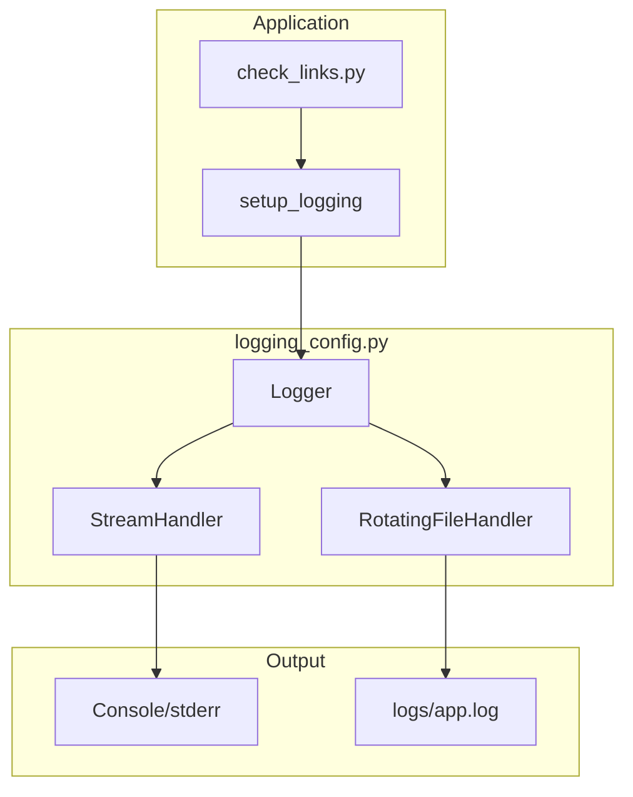

# Implementation Request: src/logging_config.py

## Task

Write the complete contents of `src/logging_config.py`.

Change type: Add
Description: New module providing centralized logging configuration

## LLD Specification

# 11 - Feature: Logging Configuration

<!-- Template Metadata
Last Updated: 2026-02-16
Updated By: Claude Agent
Update Reason: Addressed Gemini Review #1 feedback - added .gitignore to Files Changed
-->

## 1. Context & Goal
* **Issue:** #11
* **Objective:** Implement a standard logging configuration (file + console) to replace print statements throughout the codebase.
* **Status:** Approved (gemini-3-pro-preview, 2026-02-16)
* **Related Issues:** None

### Open Questions

*All questions resolved during Gemini Review #1.*

## 2. Proposed Changes

*This section is the **source of truth** for implementation. Describe exactly what will be built.*

### 2.1 Files Changed

| File | Change Type | Description |
|------|-------------|-------------|
| `src/logging_config.py` | Add | New module providing centralized logging configuration |
| `check_links.py` | Modify | Replace print statements with logger calls |
| `.gitignore` | Modify | Add `logs/` to ignore list |

### 2.1.1 Path Validation (Mechanical - Auto-Checked)

*Issue #277: Before human or Gemini review, paths are verified programmatically.*

Mechanical validation automatically checks:
- All "Modify" files must exist in repository
- All "Delete" files must exist in repository
- All "Add" files must have existing parent directories
- No placeholder prefixes (`src/`, `lib/`, `app/`) unless directory exists

**If validation fails, the LLD is BLOCKED before reaching review.**

### 2.2 Dependencies

*No new dependencies required. Uses Python standard library `logging` module.*

```toml
# pyproject.toml additions (if any)
# None - using standard library only
```

### 2.3 Data Structures

```python
# Pseudocode - NOT implementation
class LogConfig(TypedDict):
    level: str           # Log level: DEBUG, INFO, WARNING, ERROR, CRITICAL
    log_dir: str         # Directory for log files
    filename: str        # Log filename pattern
    max_bytes: int       # Max size before rotation
    backup_count: int    # Number of backup files to keep
    console_enabled: bool # Whether to output to console
```

### 2.4 Function Signatures

```python
# Signatures only - implementation in source files
def setup_logging(
    name: str = "app",
    level: str = "INFO",
    log_dir: str = "logs",
    console: bool = True,
    file: bool = True,
) -> logging.Logger:
    """
    Configure and return a logger with console and/or file handlers.
    
    Args:
        name: Logger name (usually module name)
        level: Logging level (DEBUG, INFO, WARNING, ERROR, CRITICAL)
        log_dir: Directory for log files
        console: Enable console output
        file: Enable file output
    
    Returns:
        Configured Logger instance
    """
    ...

def get_logger(name: str) -> logging.Logger:
    """
    Get an existing logger by name.
    
    Args:
        name: Logger name to retrieve
    
    Returns:
        Logger instance (creates default if not exists)
    """
    ...
```

### 2.5 Logic Flow (Pseudocode)

```
1. setup_logging(name, level, log_dir, console, file):
   1.1 Get or create logger with given name
   1.2 Set logging level from parameter
   1.3 Create formatter with timestamp, level, name, message
   1.4 IF console enabled THEN
       - Create StreamHandler for stderr
       - Apply formatter
       - Add handler to logger
   1.5 IF file enabled THEN
       - Create log_dir if not exists
       - Create RotatingFileHandler
       - Apply formatter
       - Add handler to logger
   1.6 Return configured logger

2. get_logger(name):
   2.1 Return logging.getLogger(name)

3. Migration of check_links.py:
   3.1 Import setup_logging at module level
   3.2 Create module logger: logger = setup_logging("check_links")
   3.3 Replace print() calls with appropriate logger methods:
       - print(f"--- ...") → logger.info(...)
       - print(f"ERROR: ...") → logger.error(...)
       - print(status) → logger.info(status) or logger.warning(status)
```

### 2.6 Technical Approach

* **Module:** `src/logging_config.py`
* **Pattern:** Singleton-like logger retrieval (Python's logging module inherently manages this)
* **Key Decisions:** 
  - Use RotatingFileHandler to prevent unbounded log growth
  - Consistent format across all output channels
  - Level-based filtering for console vs file output

### 2.7 Architecture Decisions

| Decision | Options Considered | Choice | Rationale |
|----------|-------------------|--------|-----------|
| Handler Type | FileHandler, RotatingFileHandler, TimedRotatingFileHandler | RotatingFileHandler | Size-based rotation simpler than time-based; prevents disk exhaustion |
| Log Format | Simple, JSON, Structured | Simple text | Human readable for debugging; JSON can be added later if needed |
| Configuration | Config file, Environment vars, Code-based | Code-based with params | Simpler for small project; no external config files needed |
| Output Streams | stdout, stderr | stderr for console | Keeps logs separate from program output; follows Unix convention |
| Log Retention | maxBytes=5MB, backupCount=3 | RotatingFileHandler with 5MB/3 backups | ~15MB max disk usage; sufficient history for debugging |
| Version Control | Include logs, Exclude logs | Exclude logs/ directory | Logs are runtime artifacts, not source; prevents repo bloat |

**Architectural Constraints:**
- Must use Python standard library only (no external logging frameworks)
- Must be backward compatible (existing code continues to work during migration)
- Must not interfere with test output capture

## 3. Requirements

*What must be true when this is done. These become acceptance criteria.*

1. A `setup_logging()` function exists that configures both file and console handlers
2. Log files are written to a `logs/` directory with rotation enabled
3. Console output uses stderr and includes timestamp, level, and message
4. `check_links.py` uses the new logging system instead of print statements
5. Log levels are configurable (default: INFO)
6. Existing functionality of `check_links.py` is preserved

## 4. Alternatives Considered

| Option | Pros | Cons | Decision |
|--------|------|------|----------|
| Standard library `logging` | No dependencies, battle-tested, flexible | More verbose setup | **Selected** |
| `loguru` | Simpler API, pretty output | External dependency | Rejected |
| `structlog` | Structured logging, context | Overkill for this project | Rejected |
| Keep print statements | No changes needed | No log levels, no file output, unprofessional | Rejected |

**Rationale:** Standard library logging provides all needed features without external dependencies. It's well-documented and familiar to Python developers.

## 5. Data & Fixtures

*Per [0108-lld-pre-implementation-review.md](0108-lld-pre-implementation-review.md) - complete this section BEFORE implementation.*

### 5.1 Data Sources

| Attribute | Value |
|-----------|-------|
| Source | Application runtime (log messages) |
| Format | Text (formatted log strings) |
| Size | Variable; ~1KB per check_links run |
| Refresh | Real-time during execution |
| Copyright/License | N/A |

### 5.2 Data Pipeline

```
Application ──logger.info()──► Handler ──format──► File/Console
```

### 5.3 Test Fixtures

| Fixture | Source | Notes |
|---------|--------|-------|
| Mock file system | Generated | For testing log file creation |
| Captured log records | pytest caplog | Standard pytest fixture |

### 5.4 Deployment Pipeline

Logs are generated locally. No separate deployment needed.

**If data source is external:** N/A - purely local operation.

## 6. Diagram

### 6.1 Mermaid Quality Gate

Before finalizing any diagram, verify in [Mermaid Live Editor](https://mermaid.live) or GitHub preview:

- [x] **Simplicity:** Similar components collapsed (per 0006 §8.1)
- [x] **No touching:** All elements have visual separation (per 0006 §8.2)
- [x] **No hidden lines:** All arrows fully visible (per 0006 §8.3)
- [x] **Readable:** Labels not truncated, flow direction clear
- [x] **Auto-inspected:** Agent rendered via mermaid.ink and viewed (per 0006 §8.5)

**Agent Auto-Inspection (MANDATORY):**

**Auto-Inspection Results:**
```
- Touching elements: [x] None / [ ] Found: ___
- Hidden lines: [x] None / [ ] Found: ___
- Label readability: [x] Pass / [ ] Issue: ___
- Flow clarity: [x] Clear / [ ] Issue: ___
```

*Reference: [0006-mermaid-diagrams.md](0006-mermaid-diagrams.md)*

### 6.2 Diagram



## 7. Security & Safety Considerations

### 7.1 Security

| Concern | Mitigation | Status |
|---------|------------|--------|
| Log injection | Logging library handles escaping; no user input in format strings | Addressed |
| Sensitive data in logs | Do not log credentials or PII; review log content | Addressed |
| Log file permissions | Use default OS permissions; logs dir not world-readable | Addressed |

### 7.2 Safety

| Concern | Mitigation | Status |
|---------|------------|--------|
| Disk exhaustion | RotatingFileHandler with maxBytes=5MB, backupCount=3 | Addressed |
| Log directory creation failure | Graceful fallback to console-only if file creation fails | Addressed |
| Handler duplication | Check for existing handlers before adding | Addressed |

**Fail Mode:** Fail Open - If logging fails, application continues (logs to console minimum)

**Recovery Strategy:** If log file is corrupted or inaccessible, next run creates new file

## 8. Performance & Cost Considerations

### 8.1 Performance

| Metric | Budget | Approach |
|--------|--------|----------|
| Latency | < 1ms per log call | Async not needed at this scale; synchronous logging acceptable |
| Memory | < 1MB | Handlers are lightweight; no buffering beyond Python defaults |
| Disk I/O | Minimal | RotatingFileHandler writes only when buffer fills |

**Bottlenecks:** None expected. Logging overhead negligible compared to HTTP requests in check_links.py.

### 8.2 Cost Analysis

| Resource | Unit Cost | Estimated Usage | Monthly Cost |
|----------|-----------|-----------------|--------------|
| Disk storage | N/A (local) | ~15MB max (5MB × 3 backups) | $0 |
| CPU | N/A | Negligible | $0 |

**Cost Controls:**
- [x] Log rotation prevents unbounded growth
- [x] No external logging services

**Worst-Case Scenario:** Even with 1000x normal logging, disk usage capped at 15MB by rotation policy.

## 9. Legal & Compliance

| Concern | Applies? | Mitigation |
|---------|----------|------------|
| PII/Personal Data | No | Log messages contain only URLs and status codes |
| Third-Party Licenses | No | Using Python standard library only |
| Terms of Service | N/A | No external services |
| Data Retention | N/A | Local files, user controls retention |
| Export Controls | No | No restricted algorithms |

**Data Classification:** Public (log files contain only public URL status)

**Compliance Checklist:**
- [x] No PII stored without consent
- [x] All third-party licenses compatible with project license
- [x] External API usage compliant with provider ToS
- [x] Data retention policy documented (rotation-based)

## 10. Verification & Testing

*Ref: [0005-testing-strategy-and-protocols.md](0005-testing-strategy-and-protocols.md)*

**Testing Philosophy:** Strive for 100% automated test coverage. Manual tests are a last resort for scenarios that genuinely cannot be automated.

### 10.0 Test Plan (TDD - Complete Before Implementation)

**TDD Requirement:** Tests MUST be written and failing BEFORE implementation begins.

| Test ID | Test Description | Expected Behavior | Status |
|---------|------------------|-------------------|--------|
| T010 | test_setup_logging_returns_logger | Returns configured Logger instance with both handlers | RED |
| T020 | test_log_directory_created | logs/ directory created if missing with rotation | RED |
| T030 | test_console_output_format | Console output uses stderr with timestamp, level, message | RED |
| T040 | test_check_links_uses_logging | check_links.py logs instead of prints | RED |
| T050 | test_log_level_configurable | Logger level matches parameter (default: INFO) | RED |
| T060 | test_existing_functionality_preserved | check_links.py still finds and checks URLs correctly | RED |

**Coverage Target:** ≥95% for all new code

**TDD Checklist:**
- [ ] All tests written before implementation
- [ ] Tests currently RED (failing)
- [ ] Test IDs match scenario IDs in 10.1
- [ ] Test file created at: `tests/unit/test_logging_config.py`

### 10.1 Test Scenarios

| ID | Scenario | Type | Input | Expected Output | Pass Criteria |
|----|----------|------|-------|-----------------|---------------|
| 010 | setup_logging creates logger with both handlers (REQ-1) | Auto | name="test", console=True, file=True | Logger with StreamHandler and RotatingFileHandler | len(handlers) == 2 and correct types |
| 020 | Log directory created with rotation enabled (REQ-2) | Auto | log_dir="test_logs", file=True | Directory exists, RotatingFileHandler configured | Path exists and handler.maxBytes > 0 |
| 030 | Console output format includes timestamp, level, message (REQ-3) | Auto | Log INFO message | Output on stderr with ISO timestamp, level, message | Regex matches expected format |
| 040 | check_links uses logging instead of print (REQ-4) | Auto | Run find_urls | No stdout/print output, log records captured | caplog has records, stdout empty |
| 050 | Log levels are configurable with INFO default (REQ-5) | Auto | level="DEBUG" vs default | Logger.level matches param | logger.level == logging.DEBUG; default == INFO |
| 060 | check_links existing functionality preserved (REQ-6) | Auto | Run check_url on test URL | Returns status string, same behavior | Status string format unchanged |

### 10.2 Test Commands

```bash
# Run all automated tests
poetry run pytest tests/unit/test_logging_config.py -v

# Run with coverage
poetry run pytest tests/unit/test_logging_config.py -v --cov=src/logging_config --cov-report=term-missing

# Run integration test for check_links
poetry run pytest tests/unit/test_logging_config.py::test_check_links_uses_logging -v
```

### 10.3 Manual Tests (Only If Unavoidable)

N/A - All scenarios automated.

## 11. Risks & Mitigations

| Risk | Impact | Likelihood | Mitigation |
|------|--------|------------|------------|
| Log file permissions issues on different OS | Med | Low | Use standard library defaults; document any issues |
| Breaking existing scripts that parse print output | Low | Low | No known consumers; print output was informal |
| Handler duplication in long-running processes | Med | Med | Check existing handlers before adding; clear handlers on reconfigure |
| Log rotation fails under heavy load | Low | Low | RotatingFileHandler is battle-tested; 5MB threshold is conservative |

## 12. Definition of Done

### Code
- [ ] Implementation complete and linted
- [ ] Code comments reference this LLD

### Tests
- [ ] All test scenarios pass
- [ ] Test coverage meets threshold (≥95%)

### Documentation
- [ ] LLD updated with any deviations
- [ ] Implementation Report (0103) completed
- [ ] Test Report (0113) completed if applicable

### Review
- [ ] Code review completed
- [ ] User approval before closing issue

### 12.1 Traceability (Mechanical - Auto-Checked)

*Issue #277: Cross-references are verified programmatically.*

Mechanical validation automatically checks:
- Every file mentioned in this section must appear in Section 2.1
- Every risk mitigation in Section 11 should have a corresponding function in Section 2.4 (warning if not)

**If files are missing from Section 2.1, the LLD is BLOCKED.**

---

## Reviewer Suggestions

*Non-blocking recommendations from the reviewer.*

- **Import Paths:** Ensure the import statement in `check_links.py` correctly resolves `src/logging_config.py`. Depending on how the script is executed (e.g., `python check_links.py` vs `python -m check_links`), you may need `from src.logging_config import setup_logging` or ensure the project root is in `PYTHONPATH`.
- **Log Formatting:** Consider using a consistent delimiter (like `|` or ` - `) in the log format to make parsing easier if you decide to ingest logs later.

## Appendix: Review Log

*Track all review feedback with timestamps and implementation status.*

### Gemini Review #1 (REVISE)

**Reviewer:** Gemini 3 Pro
**Verdict:** REVISE

#### Comments

| ID | Comment | Implemented? |
|----|---------|--------------|
| G1.1 | "Missing Source of Truth Update (Section 2.1): Based on the resolution of Open Question #2, `.gitignore` MUST be modified to exclude the `logs/` directory." | YES - Added `.gitignore` to Section 2.1 Files Changed table |
| G1.2 | "Open Question #1 resolved: Use `RotatingFileHandler` with `maxBytes=5MB` and `backupCount=3`" | YES - Already documented in Sections 2.7 and 8.2; Open Questions section cleared |
| G1.3 | "Open Question #2 resolved: YES, logs/ directory must be excluded from version control" | YES - Added to Section 2.1 and documented in Section 2.7 Architecture Decisions |

### Review Summary

| Review | Date | Verdict | Key Issue |
|--------|------|---------|-----------|
| 2 | 2026-02-16 | APPROVED | `gemini-3-pro-preview` |
| Gemini #1 | 2026-02-16 | REVISE | Missing .gitignore in Files Changed |

**Final Status:** APPROVED

## Required File Paths (from LLD - do not deviate)

The following paths are specified in the LLD. Write ONLY to these paths:

- `.gitignore`
- `check_links.py`
- `src/logging_config.py`

Any files written to other paths will be rejected.

## Tests That Must Pass

```python
# From C:\Users\mcwiz\Projects\gh-link-auditor\tests\test_issue_11.py
"""Test file for Issue #11.

Generated by AssemblyZero TDD Testing Workflow.
Tests will fail with ImportError until implementation exists (TDD RED phase).
"""

import pytest

# TDD: This import fails until implementation exists (RED phase)
# Once implemented, tests can run (GREEN phase)
from logging_config import *  # noqa: F401, F403


# Unit Tests
# -----------

def test_id():
    """
    Test Description | Expected Behavior | Status
    """
    # TDD: Arrange
    # Set up test data

    # TDD: Act
    # Call the function under test

    # TDD: Assert
    # Verify test_id works correctly
    assert False, 'TDD RED: test_id not implemented'


def test_t010():
    """
    test_setup_logging_returns_logger | Returns configured Logger
    instance with both handlers | RED
    """
    # TDD: Arrange
    # Set up test data

    # TDD: Act
    # Call the function under test

    # TDD: Assert
    # Verify test_t010 works correctly
    assert False, 'TDD RED: test_t010 not implemented'


def test_t020():
    """
    test_log_directory_created | logs/ directory created if missing with
    rotation | RED
    """
    # TDD: Arrange
    # Set up test data

    # TDD: Act
    # Call the function under test

    # TDD: Assert
    # Verify test_t020 works correctly
    assert False, 'TDD RED: test_t020 not implemented'


def test_t030():
    """
    test_console_output_format | Console output uses stderr with
    timestamp, level, message | RED
    """
    # TDD: Arrange
    # Set up test data

    # TDD: Act
    # Call the function under test

    # TDD: Assert
    # Verify test_t030 works correctly
    assert False, 'TDD RED: test_t030 not implemented'


def test_t040():
    """
    test_check_links_uses_logging | check_links.py logs instead of prints
    | RED
    """
    # TDD: Arrange
    # Set up test data

    # TDD: Act
    # Call the function under test

    # TDD: Assert
    # Verify test_t040 works correctly
    assert False, 'TDD RED: test_t040 not implemented'


def test_t050():
    """
    test_log_level_configurable | Logger level matches parameter
    (default: INFO) | RED
    """
    # TDD: Arrange
    # Set up test data

    # TDD: Act
    # Call the function under test

    # TDD: Assert
    # Verify test_t050 works correctly
    assert False, 'TDD RED: test_t050 not implemented'


def test_t060():
    """
    test_existing_functionality_preserved | check_links.py still finds
    and checks URLs correctly | RED
    """
    # TDD: Arrange
    # Set up test data

    # TDD: Act
    # Call the function under test

    # TDD: Assert
    # Verify test_t060 works correctly
    assert False, 'TDD RED: test_t060 not implemented'


def test_010():
    """
    setup_logging creates logger with both handlers (REQ-1) | Auto |
    name="test", console=True, file=True | Logger with StreamHandler and
    RotatingFileHandler | len(handlers) == 2 and correct types
    """
    # TDD: Arrange
    # Set up test data

    # TDD: Act
    # Call the function under test

    # TDD: Assert
    # Verify test_010 works correctly
    assert False, 'TDD RED: test_010 not implemented'


def test_020():
    """
    Log directory created with rotation enabled (REQ-2) | Auto |
    log_dir="test_logs", file=True | Directory exists, RotatingFileHandler
    configured | Path exists and handler.maxBytes > 0
    """
    # TDD: Arrange
    # Set up test data

    # TDD: Act
    # Call the function under test

    # TDD: Assert
    # Verify test_020 works correctly
    assert False, 'TDD RED: test_020 not implemented'


def test_030():
    """
    Console output format includes timestamp, level, message (REQ-3) |
    Auto | Log INFO message | Output on stderr with ISO timestamp, level,
    message | Regex matches expected format
    """
    # TDD: Arrange
    # Set up test data

    # TDD: Act
    # Call the function under test

    # TDD: Assert
    # Verify test_030 works correctly
    assert False, 'TDD RED: test_030 not implemented'


def test_040():
    """
    check_links uses logging instead of print (REQ-4) | Auto | Run
    find_urls | No stdout/print output, log records captured | caplog has
    records, stdout empty
    """
    # TDD: Arrange
    # Set up test data

    # TDD: Act
    # Call the function under test

    # TDD: Assert
    # Verify test_040 works correctly
    assert False, 'TDD RED: test_040 not implemented'


def test_050():
    """
    Log levels are configurable with INFO default (REQ-5) | Auto |
    level="DEBUG" vs default | Logger.level matches param | logger.level
    == logging.DEBUG; default == INFO
    """
    # TDD: Arrange
    # Set up test data

    # TDD: Act
    # Call the function under test

    # TDD: Assert
    # Verify test_050 works correctly
    assert False, 'TDD RED: test_050 not implemented'


def test_060():
    """
    check_links existing functionality preserved (REQ-6) | Auto | Run
    check_url on test URL | Returns status string, same behavior | Status
    string format unchanged
    """
    # TDD: Arrange
    # Set up test data

    # TDD: Act
    # Call the function under test

    # TDD: Assert
    # Verify test_060 works correctly
    assert False, 'TDD RED: test_060 not implemented'


```

## Output Format

Output ONLY the file contents. No explanations, no markdown headers, just the code.

```python
# Your implementation here
```

IMPORTANT:
- Output the COMPLETE file contents
- Do NOT output a summary or description
- Do NOT say "I've implemented..."
- Just output the code in a single code block
