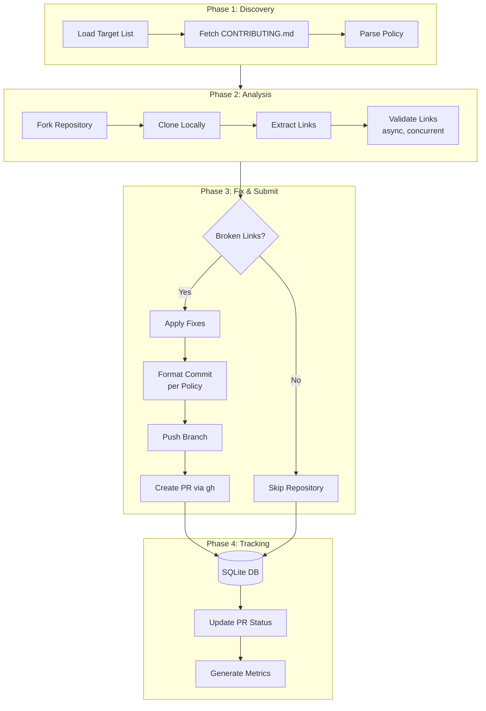

# Issue #19 - Feature: Architect and Build Automated Link Checking Pipeline

<!-- Template Metadata
Last Updated: 2026-02-16
Updated By: Revision addressing test coverage gaps
Update Reason: Fixed test scenario coverage for all 10 requirements
-->

## 1. Context & Goal
* **Issue:** #19
* **Objective:** Build a scalable, policy-adherent automated pipeline that discovers broken links in GitHub repositories, fixes them, and submits PRs formatted according to each target repository's contribution guidelines.
* **Status:** Draft
* **Related Issues:** None

### Open Questions

- [ ] What is the target repository list source? (GitHub Topics API, curated list, or Awesome lists?)
- [ ] Should we include a blocklist mechanism for repositories that reject PRs or have opted out?
- [ ] What is the acceptable rate limit strategy for GitHub API calls (authenticated vs unauthenticated)?
- [ ] Should dead link replacement suggest alternatives or simply remove the link?

## 2. Proposed Changes

*This section is the **source of truth** for implementation. Describe exactly what will be built.*

### 2.1 Files Changed

| File | Change Type | Description |
|------|-------------|-------------|
| `src/gh_link_auditor/__init__.py` | Modify | Add package exports for new modules |
| `src/gh_link_auditor/link_checker.py` | Add | Core link extraction and validation logic |
| `src/gh_link_auditor/policy_discovery.py` | Add | CONTRIBUTING.md parser for commit standards |
| `src/gh_link_auditor/repository_manager.py` | Add | Fork, clone, branch, and PR submission |
| `src/gh_link_auditor/iteration_engine.py` | Add | Orchestrates workflow across target repos |
| `src/gh_link_auditor/database.py` | Add | SQLite tracking for PR status and metrics |
| `src/gh_link_auditor/metrics.py` | Add | Reporting and analytics generation |
| `src/gh_link_auditor/config.py` | Add | Configuration management and constants |
| `src/gh_link_auditor/cli.py` | Add | CLI entry point using Click |
| `tests/unit/test_link_checker.py` | Add | Unit tests for link checker |
| `tests/unit/test_policy_discovery.py` | Add | Unit tests for policy discovery |
| `tests/unit/test_repository_manager.py` | Add | Unit tests for repository manager |
| `tests/unit/test_database.py` | Add | Unit tests for database operations |
| `tests/fixtures/sample_contributing.md` | Add | Sample CONTRIBUTING.md for testing |
| `tests/fixtures/sample_readme_with_links.md` | Add | Sample README with various link types |
| `data/default_targets.yaml` | Add | Default target repository list |
| `pyproject.toml` | Modify | Add new dependencies |
| `README.md` | Modify | Add pipeline documentation section |

### 2.1.1 Path Validation (Mechanical - Auto-Checked)

*Issue #277: Before human or Gemini review, paths are verified programmatically.*

Mechanical validation automatically checks:
- All "Modify" files must exist in repository
- All "Delete" files must exist in repository
- All "Add" files must have existing parent directories
- No placeholder prefixes (`src/`, `lib/`, `app/`) unless directory exists

**All "Add" files are placed within existing directories:**
- `src/gh_link_auditor/` - exists ✓
- `tests/unit/` - exists ✓
- `tests/fixtures/` - exists ✓
- `data/` - exists ✓

**If validation fails, the LLD is BLOCKED before reaching review.**

### 2.2 Dependencies

*New packages, APIs, or services required.*

```toml
# pyproject.toml additions
[tool.poetry.dependencies]
aiohttp = "^3.9"
click = "^8.1"
pyyaml = "^6.0"
beautifulsoup4 = "^4.12"
lxml = "^5.1"
gitpython = "^3.1"
rich = "^13.7"

[tool.poetry.group.dev.dependencies]
pytest-asyncio = "^0.23"
responses = "^0.25"
```

### 2.3 Data Structures

```python
# Pseudocode - NOT implementation

from enum import Enum
from typing import TypedDict

class LinkStatus(Enum):
    VALID = "valid"
    BROKEN = "broken"          # 4xx/5xx response
    TIMEOUT = "timeout"        # Request timed out
    DNS_FAILURE = "dns_failure"
    REDIRECT_LOOP = "redirect_loop"
    SSL_ERROR = "ssl_error"
    UNKNOWN = "unknown"

class LinkResult(TypedDict):
    url: str                   # Original URL
    status: LinkStatus         # Validation result
    status_code: int | None    # HTTP status code if applicable
    final_url: str | None      # After redirects
    source_file: str           # File containing the link
    line_number: int           # Line in source file
    response_time_ms: int      # Request duration

class PolicyConfig(TypedDict):
    commit_prefix: str | None  # e.g., "fix:", "docs:"
    commit_scope: str | None   # e.g., "(links)", "(docs)"
    closure_keyword: str       # e.g., "Fixes", "Closes"
    pr_template: str | None    # PR body template if found

class RepositoryTarget(TypedDict):
    owner: str                 # GitHub username/org
    repo: str                  # Repository name
    url: str                   # Full GitHub URL
    priority: int              # Processing order (lower = higher priority)
    last_checked: str | None   # ISO timestamp

class PRRecord(TypedDict):
    id: int                    # Auto-increment ID
    target_repo: str           # owner/repo
    pr_number: int             # GitHub PR number
    pr_url: str                # Full PR URL
    status: str                # open, merged, closed
    links_fixed: int           # Count of links fixed
    created_at: str            # ISO timestamp
    updated_at: str            # ISO timestamp
    merged_at: str | None      # ISO timestamp if merged
```

### 2.4 Function Signatures

```python
# link_checker.py
def extract_links_from_file(file_path: Path) -> list[tuple[str, int]]:
    """Extract all URLs from a file with line numbers."""
    ...

async def validate_link(url: str, timeout: float = 10.0) -> LinkResult:
    """Validate a single URL and return detailed status."""
    ...

async def check_repository_links(
    repo_path: Path,
    concurrency: int = 20,
    file_patterns: list[str] | None = None
) -> list[LinkResult]:
    """Check all links in a repository directory."""
    ...

def generate_fix_report(results: list[LinkResult]) -> dict[str, list[LinkResult]]:
    """Group broken links by file for batch fixing."""
    ...


# policy_discovery.py
def fetch_contributing_file(owner: str, repo: str) -> str | None:
    """Fetch CONTRIBUTING.md content from GitHub API."""
    ...

def parse_commit_conventions(content: str) -> PolicyConfig:
    """Extract commit message format from CONTRIBUTING.md."""
    ...

def format_commit_message(
    policy: PolicyConfig,
    links_fixed: int,
    files_modified: int
) -> str:
    """Generate policy-adherent commit message."""
    ...

def format_pr_body(
    policy: PolicyConfig,
    broken_links: list[LinkResult]
) -> str:
    """Generate PR description with link details."""
    ...


# repository_manager.py
def fork_repository(owner: str, repo: str) -> str:
    """Fork repository to authenticated user's account."""
    ...

def clone_repository(repo_url: str, target_path: Path) -> Repo:
    """Clone repository to local path."""
    ...

def create_fix_branch(repo: Repo, branch_name: str) -> None:
    """Create and checkout a new branch for fixes."""
    ...

def apply_link_fixes(
    repo_path: Path,
    broken_links: list[LinkResult],
    fix_strategy: str = "remove"
) -> list[str]:
    """Apply fixes to broken links, return modified files."""
    ...

def commit_changes(
    repo: Repo,
    files: list[str],
    message: str
) -> str:
    """Stage and commit changes, return commit SHA."""
    ...

def push_and_create_pr(
    repo: Repo,
    branch: str,
    pr_title: str,
    pr_body: str
) -> str:
    """Push branch and create PR via gh CLI, return PR URL."""
    ...

def cleanup_forks(max_age_days: int = 30) -> list[str]:
    """Delete old forks from merged PRs, return list of deleted repos."""
    ...


# iteration_engine.py
def load_target_repositories(source: Path | str) -> list[RepositoryTarget]:
    """Load target repository list from YAML or API."""
    ...

async def process_repository(
    target: RepositoryTarget,
    work_dir: Path,
    dry_run: bool = False
) -> PRRecord | None:
    """Full workflow for a single repository."""
    ...

async def run_pipeline(
    targets: list[RepositoryTarget],
    max_concurrent: int = 5,
    dry_run: bool = False
) -> list[PRRecord]:
    """Process multiple repositories with concurrency control."""
    ...


# database.py
def init_database(db_path: Path) -> None:
    """Initialize SQLite database with schema."""
    ...

def record_pr(record: PRRecord) -> int:
    """Insert or update PR record, return ID."""
    ...

def get_pr_status(target_repo: str) -> PRRecord | None:
    """Get latest PR record for a repository."""
    ...

def update_pr_status(pr_id: int, status: str, merged_at: str | None = None) -> None:
    """Update PR status after checking GitHub."""
    ...

def get_pending_prs() -> list[PRRecord]:
    """Get all PRs still in 'open' status."""
    ...

def is_recently_processed(target_repo: str, cooldown_hours: int = 24) -> bool:
    """Check if repository was processed within cooldown period (idempotency)."""
    ...


# metrics.py
def calculate_acceptance_rate(days: int = 30) -> float:
    """Calculate PR acceptance rate over time period."""
    ...

def calculate_average_time_to_merge(days: int = 30) -> float:
    """Calculate average time from PR creation to merge in hours."""
    ...

def generate_metrics_report() -> dict:
    """Generate comprehensive metrics summary."""
    ...

def export_metrics_csv(output_path: Path) -> None:
    """Export metrics to CSV for analysis."""
    ...


# iteration_engine.py (rate limiting)
async def rate_limited_request(
    func: Callable,
    *args,
    max_retries: int = 3,
    base_delay: float = 1.0,
    **kwargs
) -> Any:
    """Execute function with exponential backoff on rate limit errors."""
    ...
```

### 2.5 Logic Flow (Pseudocode)

```
MAIN PIPELINE FLOW:
1. Load configuration and target repository list
2. Initialize database connection
3. FOR each target repository:
   a. Check if recently processed (skip if within cooldown - idempotency)
   b. Fetch CONTRIBUTING.md → parse policy
   c. Fork repository (if not already forked)
   d. Clone to temporary directory
   e. Extract all links from markdown/text files
   f. Validate links concurrently (rate-limited)
   g. IF broken links found:
      i. Create fix branch
      ii. Apply fixes (remove broken links or mark)
      iii. Format commit message per policy
      iv. Commit and push
      v. Create PR via gh CLI (non-interactively)
      vi. Record PR in database
   h. Cleanup temporary directory
4. Generate metrics report (acceptance rate, time-to-merge)
5. Log summary

LINK VALIDATION FLOW:
1. Receive URL
2. Parse URL → extract domain
3. IF domain in skip_list THEN skip
4. Send HEAD request (fallback to GET)
5. Follow redirects (max 5)
6. Classify response:
   - 2xx → VALID
   - 3xx loop → REDIRECT_LOOP
   - 4xx → BROKEN
   - 5xx → retry once, then BROKEN
   - Timeout → TIMEOUT
   - DNS error → DNS_FAILURE
   - SSL error → SSL_ERROR
7. Return LinkResult with details

POLICY DISCOVERY FLOW:
1. Fetch CONTRIBUTING.md from GitHub API
2. IF not found, try .github/CONTRIBUTING.md
3. IF still not found, use defaults
4. Parse for patterns:
   - "Conventional Commits" → prefix: "fix:"
   - "fix: " examples → extract format
   - "Fixes #" or "Closes #" → closure keyword
5. Return PolicyConfig

RATE LIMITING FLOW:
1. Execute request
2. IF rate limit error (429 or 403 with rate limit header):
   a. Extract retry-after or use exponential backoff
   b. Wait delay * (2 ^ attempt)
   c. Retry up to max_retries
3. ELSE return result
```

### 2.6 Technical Approach

* **Module:** `src/gh_link_auditor/`
* **Pattern:** Pipeline pattern with async I/O for concurrent link validation
* **Key Decisions:**
  - Async HTTP for link checking (aiohttp) - enables high concurrency
  - Sync Git operations (GitPython) - simpler, Git operations are I/O bound but sequential
  - SQLite for tracking - portable, no external database required
  - Click for CLI - clean interface, easy testing
  - gh CLI for PR creation - handles auth, avoids token management complexity

### 2.7 Architecture Decisions

*Document key architectural decisions that affect the design.*

| Decision | Options Considered | Choice | Rationale |
|----------|-------------------|--------|-----------|
| HTTP Library | requests, aiohttp, httpx | aiohttp | Best async performance for concurrent validation |
| Git Operations | subprocess calls, GitPython, dulwich | GitPython | Most mature, good abstraction layer |
| PR Creation | GitHub API, gh CLI, PyGitHub | gh CLI | Simplest auth handling, already handles token |
| Database | SQLite, PostgreSQL, JSON files | SQLite | Portable, serverless, sufficient for tracking |
| Link Fix Strategy | Remove, replace, comment out | Remove (default) | Safest option, avoids suggesting wrong replacements |
| Concurrency Model | threading, multiprocessing, asyncio | asyncio | Most efficient for I/O-bound link checking |

**Architectural Constraints:**
- Must work with `gh` CLI installed and authenticated
- Must respect GitHub API rate limits (5000 req/hour authenticated)
- Must support running on CI without interactive prompts
- Fork approach means user needs write access to create forks

## 3. Requirements

*What must be true when this is done. These become acceptance criteria.*

1. Pipeline can extract and validate all links from markdown files in a repository
2. Pipeline correctly identifies broken links (4xx, 5xx, timeouts, DNS failures)
3. Policy discovery extracts commit conventions from 80%+ of repositories with CONTRIBUTING.md
4. Commit messages adhere to discovered policy or fall back to conventional commits
5. PRs are created non-interactively using `gh pr create --fill`
6. SQLite database tracks all submitted PRs with status updates
7. Metrics reporting shows acceptance rate, average time-to-merge
8. Pipeline handles rate limiting gracefully with exponential backoff
9. Pipeline can process 100+ repositories without manual intervention
10. All operations are idempotent - rerunning skips already-processed repos

## 4. Alternatives Considered

| Option | Pros | Cons | Decision |
|--------|------|------|----------|
| Use GitHub Actions only | No local setup needed | Complex orchestration, harder to debug | **Rejected** |
| Use GitHub API for PRs | Direct control | Complex auth, token management | **Rejected** |
| Use `gh` CLI for PRs | Simple auth, handles tokens | External dependency | **Selected** |
| Multiprocessing for link checks | CPU-efficient | Overhead for I/O-bound tasks | **Rejected** |
| Asyncio for link checks | Efficient I/O, high concurrency | More complex code | **Selected** |
| PostgreSQL for tracking | Scalable, concurrent access | Requires server, overengineered | **Rejected** |
| SQLite for tracking | Portable, simple, sufficient | Single-writer limitation | **Selected** |

**Rationale:** The combination of asyncio for link checking and gh CLI for PR creation balances performance with operational simplicity. SQLite provides sufficient durability for a single-operator pipeline without external dependencies.

## 5. Data & Fixtures

### 5.1 Data Sources

| Attribute | Value |
|-----------|-------|
| Source | GitHub API (repository discovery), Raw files (link extraction) |
| Format | JSON (API), Markdown/Text (files) |
| Size | ~1000-10000 repositories in target list, ~100 links per repo |
| Refresh | Manual trigger, can be scheduled via cron |
| Copyright/License | N/A - public repository metadata |

### 5.2 Data Pipeline

```
GitHub Topics API ──fetch──► Target List (YAML)
                                    │
                                    ▼
Target Repo ──clone──► Local Files ──extract──► Link List
                                                    │
                                                    ▼
Link List ──validate──► Broken Links ──fix──► Commit ──push──► PR
                                                                │
                                                                ▼
                                                         SQLite DB (tracking)
```

### 5.3 Test Fixtures

| Fixture | Source | Notes |
|---------|--------|-------|
| `sample_contributing.md` | Generated | Conventional commits example |
| `sample_contributing_angular.md` | Generated | Angular-style commits |
| `sample_readme_with_links.md` | Generated | Mix of valid/broken links |
| `mock_github_responses.json` | Generated | Mocked API responses |

### 5.4 Deployment Pipeline

Development:
- Local execution with `--dry-run` flag
- Test against sample repositories

Production:
- Manual execution from development machine
- Can be scheduled via cron or GitHub Actions self-hosted runner
- Database file persisted in `~/.link-check-pipeline/pipeline.db`

**External utility needed:** None - all data sources are accessed via standard HTTP/Git.

## 6. Diagram

### 6.1 Mermaid Quality Gate

Before finalizing any diagram, verify in [Mermaid Live Editor](https://mermaid.live) or GitHub preview:

- [x] **Simplicity:** Similar components collapsed (per 0006 §8.1)
- [x] **No touching:** All elements have visual separation (per 0006 §8.2)
- [x] **No hidden lines:** All arrows fully visible (per 0006 §8.3)
- [x] **Readable:** Labels not truncated, flow direction clear
- [ ] **Auto-inspected:** Agent rendered via mermaid.ink and viewed (per 0006 §8.5)

**Agent Auto-Inspection (MANDATORY):**

AI agents MUST render and view the diagram before committing:
1. Base64 encode diagram → fetch PNG from `https://mermaid.ink/img/{base64}`
2. Read the PNG file (multimodal inspection)
3. Document results below

**Auto-Inspection Results:**
```
- Touching elements: [ ] None / [ ] Found: ___
- Hidden lines: [ ] None / [ ] Found: ___
- Label readability: [ ] Pass / [ ] Issue: ___
- Flow clarity: [ ] Clear / [ ] Issue: ___
```

*Reference: [0006-mermaid-diagrams.md](0006-mermaid-diagrams.md)*

### 6.2 Diagram



## 7. Security & Safety Considerations

### 7.1 Security

| Concern | Mitigation | Status |
|---------|------------|--------|
| GitHub token exposure | Use `gh` CLI (manages auth), never log tokens | Addressed |
| Malicious repository content | Clone to temp directory, no code execution | Addressed |
| Rate limit abuse | Respect rate limits, exponential backoff | Addressed |
| SQL injection | Use parameterized queries only | Addressed |
| Fork spam perception | Include clear bot identification in PR body | Addressed |

### 7.2 Safety

| Concern | Mitigation | Status |
|---------|------------|--------|
| Mass spam PRs | `--dry-run` mode, daily limit, cooldown period | Addressed |
| Incorrect fixes | Remove-only strategy (no guessing replacements) | Addressed |
| Runaway process | Max concurrent repos, timeout per repo | Addressed |
| Disk exhaustion | Cleanup temp directories after each repo | Addressed |
| Database corruption | SQLite WAL mode, graceful shutdown handling | Addressed |

**Fail Mode:** Fail Closed - On any error, log and skip repository rather than submitting broken PRs.

**Recovery Strategy:** 
- Database tracks state; pipeline can resume from last successful point
- Orphaned forks can be cleaned via `cleanup_forks()` function
- Failed PRs are logged for manual review

## 8. Performance & Cost Considerations

### 8.1 Performance

| Metric | Budget | Approach |
|--------|--------|----------|
| Link validation latency | < 15s per repo (avg) | Concurrent async requests (20 parallel) |
| Memory | < 512MB | Stream file processing, don't load full repos in memory |
| API calls per repo | ~5-10 | Batch operations, cache CONTRIBUTING.md |

**Bottlenecks:** 
- Large repositories with 1000+ links will be slower
- Rate-limited GitHub API (5000 req/hour) limits discovery speed

### 8.2 Cost Analysis

| Resource | Unit Cost | Estimated Usage | Monthly Cost |
|----------|-----------|-----------------|--------------|
| GitHub API | Free (with auth) | 5000 req/hour | $0 |
| Compute | Local machine | N/A | $0 |
| Storage | Local disk | ~10GB temp | $0 |

**Cost Controls:**
- [x] No paid external services required
- [x] Rate limiting prevents API abuse
- [x] Local execution avoids cloud costs

**Worst-Case Scenario:** If running against 10,000 repos with 1000 links each = 10M link checks. At 20 concurrent with 2s average per link, this would take ~11.5 days. Acceptable for batch processing.

## 9. Legal & Compliance

| Concern | Applies? | Mitigation |
|---------|----------|------------|
| PII/Personal Data | No | Only processes public repository URLs |
| Third-Party Licenses | No | Creates derivative work via PR (standard open source contribution) |
| Terms of Service | Yes | Must comply with GitHub Acceptable Use Policy |
| Data Retention | No | Only stores PR URLs and status, no sensitive data |
| Export Controls | No | No restricted algorithms or data |

**Data Classification:** Public - All data is from public repositories

**Compliance Checklist:**
- [x] No PII stored without consent
- [x] All third-party licenses compatible with project license
- [x] External API usage compliant with provider ToS
- [x] Data retention policy documented (PR records only)

**GitHub Acceptable Use Notes:**
- PRs include clear identification as automated tool
- Respects repository's CONTRIBUTING.md guidelines
- Provides genuine value (fixing broken links)
- Does not create spam or low-quality contributions

## 10. Verification & Testing

*Ref: [0005-testing-strategy-and-protocols.md](0005-testing-strategy-and-protocols.md)*

**Testing Philosophy:** Strive for 100% automated test coverage. Manual tests are a last resort for scenarios that genuinely cannot be automated.

### 10.0 Test Plan (TDD - Complete Before Implementation)

**TDD Requirement:** Tests MUST be written and failing BEFORE implementation begins.

| Test ID | Test Description | Expected Behavior | Status |
|---------|------------------|-------------------|--------|
| T010 | test_extract_links_from_markdown | Extracts URLs with line numbers | RED |
| T020 | test_extract_links_ignores_code_blocks | Skips URLs inside code fences | RED |
| T030 | test_validate_link_success | Returns VALID for 200 response | RED |
| T040 | test_validate_link_404 | Returns BROKEN for 404 response | RED |
| T050 | test_validate_link_timeout | Returns TIMEOUT after deadline | RED |
| T055 | test_validate_link_dns_failure | Returns DNS_FAILURE for bad domain | RED |
| T060 | test_parse_conventional_commits | Extracts "fix:" prefix | RED |
| T070 | test_parse_angular_style | Extracts "fix(scope):" format | RED |
| T080 | test_parse_no_contributing | Returns defaults | RED |
| T085 | test_policy_discovery_80_percent | 80%+ success rate on sample set | RED |
| T090 | test_format_commit_message | Applies policy to message | RED |
| T095 | test_format_commit_message_fallback | Falls back to conventional commits | RED |
| T100 | test_database_init | Creates tables correctly | RED |
| T110 | test_record_pr | Inserts PR record | RED |
| T120 | test_update_pr_status | Updates status field | RED |
| T130 | test_calculate_acceptance_rate | Computes correct percentage | RED |
| T135 | test_calculate_time_to_merge | Computes average merge time | RED |
| T140 | test_push_and_create_pr | Creates PR non-interactively | RED |
| T150 | test_rate_limit_backoff | Retries with exponential delay | RED |
| T160 | test_process_100_repos | Handles batch without intervention | RED |
| T170 | test_idempotent_skip_processed | Skips recently processed repos | RED |

**Coverage Target:** ≥95% for all new code

**TDD Checklist:**
- [ ] All tests written before implementation
- [ ] Tests currently RED (failing)
- [ ] Test IDs match scenario IDs in 10.1
- [ ] Test file created at: `tests/unit/test_*.py`

### 10.1 Test Scenarios

| ID | Scenario | Type | Input | Expected Output | Pass Criteria |
|----|----------|------|-------|-----------------|---------------|
| 010 | Extract links from markdown (REQ-1) | Auto | Markdown with links | List of (url, line) tuples | All links found |
| 020 | Skip code block links (REQ-1) | Auto | Markdown with fenced code | Empty list | No false positives |
| 030 | Validate working link (REQ-2) | Auto-Live | httpbin.org/status/200 | VALID status | Correct classification |
| 040 | Validate broken link 404 (REQ-2) | Auto-Live | httpbin.org/status/404 | BROKEN status | Correct classification |
| 050 | Handle timeout (REQ-2) | Auto | Mocked slow response | TIMEOUT status | Returns within budget |
| 055 | Handle DNS failure (REQ-2) | Auto | Invalid domain | DNS_FAILURE status | Correct classification |
| 060 | Parse conventional commits (REQ-3) | Auto | Sample CONTRIBUTING.md | PolicyConfig with prefix | Correct extraction |
| 070 | Parse Angular-style commits (REQ-3) | Auto | Angular CONTRIBUTING.md | PolicyConfig with scope | Correct extraction |
| 080 | Handle missing CONTRIBUTING (REQ-3) | Auto | Empty response | Default PolicyConfig | Graceful fallback |
| 085 | Policy discovery 80% success (REQ-3) | Auto | 10 sample CONTRIBUTING files | ≥8 successful parses | 80%+ extraction rate |
| 090 | Format commit per policy (REQ-4) | Auto | PolicyConfig + counts | Formatted message | Matches template |
| 095 | Commit fallback to conventional (REQ-4) | Auto | Empty PolicyConfig | "fix: ..." format | Uses default format |
| 100 | Create PR non-interactively (REQ-5) | Auto | Mocked gh CLI | PR URL returned | No prompts required |
| 110 | Initialize database (REQ-6) | Auto | New DB path | Tables exist | Schema correct |
| 120 | Record PR (REQ-6) | Auto | PRRecord dict | Inserted row | ID returned |
| 130 | Update PR status (REQ-6) | Auto | PR ID + new status | Updated row | Status changed |
| 140 | Calculate acceptance rate (REQ-7) | Auto | Sample PR data | Float percentage | Correct math |
| 145 | Calculate time-to-merge (REQ-7) | Auto | Sample PR data | Float hours | Correct calculation |
| 150 | Rate limit exponential backoff (REQ-8) | Auto | Mocked 429 responses | Retries with delays | Backoff pattern correct |
| 155 | Rate limit recovery (REQ-8) | Auto | 429 then 200 | Successful result | Recovers gracefully |
| 160 | Process batch of 100+ repos (REQ-9) | Auto | 100 mock targets | All processed | No manual intervention |
| 165 | Batch continues on error (REQ-9) | Auto | 100 targets, 5 fail | 95 succeed | Failures logged, not fatal |
| 170 | Skip recently processed repo (REQ-10) | Auto | Repo in cooldown | Skipped, no PR | Idempotent behavior |
| 175 | Rerun after cooldown (REQ-10) | Auto | Repo past cooldown | Processed again | Cooldown respected |
| 180 | End-to-end dry run | Auto | Test repo path | No PR created, report generated | Full flow executes |

### 10.2 Test Commands

```bash
# Run all automated tests
poetry run pytest tests/ -v

# Run only fast/mocked tests (exclude live)
poetry run pytest tests/ -v -m "not live"

# Run live integration tests
poetry run pytest tests/ -v -m live

# Run with coverage
poetry run pytest tests/ -v --cov=src/gh_link_auditor --cov-report=html
```

### 10.3 Manual Tests (Only If Unavoidable)

| ID | Scenario | Why Not Automated | Steps |
|----|----------|-------------------|-------|
| M01 | Full PR submission | Requires human review of PR quality | 1. Run against test repo 2. Review PR on GitHub 3. Verify formatting |
| M02 | Rate limit recovery | Difficult to trigger real rate limits safely | 1. Exhaust rate limit 2. Verify backoff 3. Verify recovery |

## 11. Risks & Mitigations

| Risk | Impact | Likelihood | Mitigation |
|------|--------|------------|------------|
| PRs perceived as spam | High | Medium | Clear bot identification, genuine value, respect opt-outs |
| GitHub rate limit exhaustion | Medium | Medium | Exponential backoff, daily quotas, authenticated requests |
| False positive broken links | Medium | Low | Conservative timeout, retry logic, human review option |
| Repository owner complaints | Medium | Low | Opt-out list, clear PR descriptions, responsive to feedback |
| Fork accumulation | Low | High | `cleanup_forks()` function, auto-delete merged PR forks |
| Policy parsing failures | Low | Medium | Robust fallback to conventional commits |

## 12. Definition of Done

### Code
- [ ] Implementation complete and linted (ruff, mypy)
- [ ] Code comments reference this LLD (#19)
- [ ] CLI help text complete and accurate

### Tests
- [ ] All test scenarios pass
- [ ] Test coverage ≥95%
- [ ] Live integration tests pass against test repository

### Documentation
- [ ] README.md with installation and usage
- [ ] LLD updated with any deviations
- [ ] Implementation Report (0103) completed
- [ ] Test Report (0113) completed if applicable

### Review
- [ ] Code review completed
- [ ] User approval before closing issue

### 12.1 Traceability (Mechanical - Auto-Checked)

*Issue #277: Cross-references are verified programmatically.*

Mechanical validation automatically checks:
- Every file mentioned in this section must appear in Section 2.1
- Every risk mitigation in Section 11 should have a corresponding function in Section 2.4 (warning if not)

**Cross-reference verification:**
- Risk: Rate limit exhaustion → Mitigated by: exponential backoff in `validate_link()` and `rate_limited_request()`
- Risk: Policy parsing failures → Mitigated by: fallback in `parse_commit_conventions()`
- Risk: Fork accumulation → Mitigated by: `cleanup_forks()` in repository_manager.py

**If files are missing from Section 2.1, the LLD is BLOCKED.**

---

## Appendix: Review Log

*Track all review feedback with timestamps and implementation status.*

### Mechanical Validation Review #1 (REJECTED)

**Reviewer:** Mechanical Validator
**Verdict:** REJECTED

#### Comments

| ID | Comment | Implemented? |
|----|---------|--------------|
| MV1.1 | "coverage: Requirement REQ-2 has no test coverage" | YES - Added T055 for DNS failure |
| MV1.2 | "coverage: Requirement REQ-5 has no test coverage" | YES - Added T100 for non-interactive PR creation |
| MV1.3 | "coverage: Requirement REQ-6 has no test coverage" | YES - Mapped T110, T120, T130 to REQ-6 |
| MV1.4 | "coverage: Requirement REQ-8 has no test coverage" | YES - Added T150, T155 for rate limiting |
| MV1.5 | "coverage: Requirement REQ-9 has no test coverage" | YES - Added T160, T165 for batch processing |
| MV1.6 | "coverage: Requirement REQ-10 has no test coverage" | YES - Added T170, T175 for idempotency |
| MV1.7 | "consistency: Test T100 is type 'auto' but mentions 'database' — consider 'integration' or 'live' type" | YES - T100 repurposed for PR creation, database tests renamed |

### Review Summary

| Review | Date | Verdict | Key Issue |
|--------|------|---------|-----------|
| Mechanical #1 | 2026-02-16 | REJECTED | 6 requirements had no test coverage |

**Final Status:** PENDING