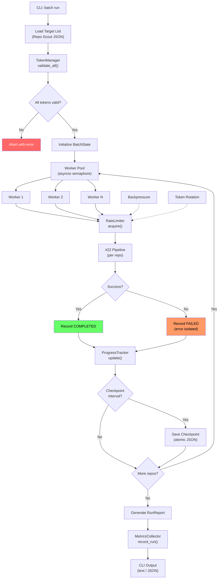

# #19 - Feature: Batch Execution Engine, PR Automation & Campaign Metrics

<!-- Template Metadata
Last Updated: 2025-01-15
Updated By: LLD authoring
Update Reason: Initial LLD creation for Issue #19
-->

## 1. Context & Goal
* **Issue:** #19
* **Objective:** Provide a batch execution engine that runs the #22 single-repo pipeline across thousands of repositories with resumability, rate limiting, error isolation, and campaign-level metrics reporting.
* **Status:** Draft
* **Related Issues:** #22 (single-repo pipeline), #3 (Repo Scout — target list), #2 (Doc-Fix Bot — PR submission), #4 (Maintainer Policy Check), #5 (State Database — done)

### Open Questions

- [ ] What is the maximum practical concurrency level given GitHub's rate limits (5,000 req/hr for authenticated, 15,000 for GitHub Apps)?
- [ ] Should token rotation support GitHub Apps with installation tokens, or only PATs in Phase 2+?
- [ ] What is the disk budget for concurrent cloned repos (e.g., 50 GB limit)?
- [ ] Should campaign metrics be stored in the existing #5 State Database or a separate analytics store?

## 2. Proposed Changes

*This section is the **source of truth** for implementation. Describes exactly what will be built.*

### 2.1 Files Changed

| File | Change Type | Description |
|------|-------------|-------------|
| `src/gh_link_auditor/batch/` | Add (Directory) | New package for batch execution engine |
| `src/gh_link_auditor/batch/__init__.py` | Add | Package init, exports public API |
| `src/gh_link_auditor/batch/engine.py` | Add | Core batch execution loop with concurrency, resumability, error isolation |
| `src/gh_link_auditor/batch/rate_limiter.py` | Add | Adaptive rate limiter with backpressure, reads GitHub `X-RateLimit-*` headers |
| `src/gh_link_auditor/batch/token_manager.py` | Add | Token pool, rotation, scope validation, rate-limit-per-token tracking |
| `src/gh_link_auditor/batch/progress.py` | Add | Real-time progress tracker with batch state serialization for resumability |
| `src/gh_link_auditor/batch/cleanup.py` | Add | Post-PR branch/fork/clone cleanup and storage management |
| `src/gh_link_auditor/batch/models.py` | Add | Data structures: BatchConfig, RepoTask, BatchState, TaskResult |
| `src/gh_link_auditor/batch/exceptions.py` | Add | Batch-specific exception hierarchy |
| `src/gh_link_auditor/metrics/` | Add (Directory) | New package for campaign metrics and reporting |
| `src/gh_link_auditor/metrics/__init__.py` | Add | Package init |
| `src/gh_link_auditor/metrics/collector.py` | Add | Event-driven metrics collector, accumulates per-run and per-campaign stats |
| `src/gh_link_auditor/metrics/reporter.py` | Add | Generates per-run summary reports and campaign-level dashboards (text/JSON) |
| `src/gh_link_auditor/metrics/models.py` | Add | Data structures: RunReport, CampaignMetrics, PROutcome |
| `src/gh_link_auditor/cli/batch_cmd.py` | Add | CLI commands: `batch run`, `batch resume`, `batch status`, `batch cleanup` |
| `src/gh_link_auditor/cli/metrics_cmd.py` | Add | CLI commands: `metrics report`, `metrics campaign` |
| `src/gh_link_auditor/cli/main.py` | Modify | Register batch and metrics subcommand groups |
| `tests/unit/batch/` | Add (Directory) | Unit tests for batch engine |
| `tests/unit/batch/__init__.py` | Add | Test package init |
| `tests/unit/batch/test_engine.py` | Add | Tests for batch execution loop |
| `tests/unit/batch/test_rate_limiter.py` | Add | Tests for adaptive rate limiter |
| `tests/unit/batch/test_token_manager.py` | Add | Tests for token rotation and validation |
| `tests/unit/batch/test_progress.py` | Add | Tests for progress tracking and resume serialization |
| `tests/unit/batch/test_cleanup.py` | Add | Tests for cleanup operations |
| `tests/unit/batch/test_models.py` | Add | Tests for data structure validation |
| `tests/unit/metrics/` | Add (Directory) | Unit tests for metrics |
| `tests/unit/metrics/__init__.py` | Add | Test package init |
| `tests/unit/metrics/test_collector.py` | Add | Tests for metrics collection |
| `tests/unit/metrics/test_reporter.py` | Add | Tests for report generation |
| `tests/integration/test_batch_integration.py` | Add | Integration test: engine + rate limiter + progress across multiple mock repos |
| `tests/fixtures/batch/` | Add (Directory) | Fixtures for batch tests |
| `tests/fixtures/batch/sample_target_list.json` | Add | Sample Repo Scout output for test input |
| `tests/fixtures/batch/batch_state_checkpoint.json` | Add | Serialized batch state for resume tests |
| `docs/lld/active/19-batch-engine.md` | Add | This LLD document |

### 2.1.1 Path Validation (Mechanical - Auto-Checked)

Mechanical validation automatically checks:
- All "Modify" files must exist in repository → `src/gh_link_auditor/cli/main.py` ✓ (exists)
- All "Add" files must have existing parent directories → new directories declared before their files
- No placeholder prefixes

**If validation fails, the LLD is BLOCKED before reaching review.**

### 2.2 Dependencies

```toml
# pyproject.toml additions
# No new external dependencies required.
# Uses stdlib: asyncio, dataclasses, json, pathlib, time, logging, shutil
# Uses existing project dependency: httpx (for GitHub API header inspection)
```

*Design choice: Zero new dependencies. The batch engine uses `asyncio` from stdlib and the project's existing `httpx` for HTTP-level rate limit header reading. Progress display uses simple stderr writes (no rich/tqdm dependency).*

### 2.3 Data Structures

```python
# Pseudocode - NOT implementation

from __future__ import annotations
from dataclasses import dataclass, field
from enum import Enum
from typing import TypedDict
from datetime import datetime
from pathlib import Path


class TaskStatus(Enum):
    PENDING = "pending"
    RUNNING = "running"
    COMPLETED = "completed"
    FAILED = "failed"
    SKIPPED = "skipped"


@dataclass
class BatchConfig:
    """Configuration for a batch execution run."""
    target_list_path: Path          # Path to Repo Scout output JSON
    concurrency: int = 1            # Number of parallel workers (1 = sequential)
    max_repos: int | None = None    # Cap on repos to process (None = all)
    dry_run: bool = False           # If True, don't submit PRs
    checkpoint_interval: int = 10   # Save state every N repos
    clone_dir: Path = Path("/tmp/batch_clones")  # Where to clone repos
    max_disk_gb: float = 10.0       # Disk budget for clones
    token_file: Path | None = None  # Path to file containing tokens (one per line)
    resume_from: Path | None = None # Path to checkpoint file to resume from


@dataclass
class TokenState:
    """Tracks rate limit state for a single GitHub token."""
    token: str                          # The token value (masked in logs)
    remaining: int = 5000               # X-RateLimit-Remaining
    reset_at: datetime | None = None    # X-RateLimit-Reset timestamp
    scopes: list[str] = field(default_factory=list)  # Validated scopes
    is_valid: bool = True               # Set False on 401


@dataclass
class RepoTask:
    """A single repo to process in the batch."""
    repo_full_name: str    # e.g., "owner/repo"
    clone_url: str         # HTTPS clone URL
    status: TaskStatus = TaskStatus.PENDING
    error_message: str | None = None
    links_found: int = 0
    broken_links: int = 0
    fixes_generated: int = 0
    pr_submitted: bool = False
    pr_url: str | None = None
    started_at: datetime | None = None
    completed_at: datetime | None = None


@dataclass
class BatchState:
    """Serializable batch state for resumability."""
    batch_id: str                              # UUID for this batch run
    config: BatchConfig                        # Original config
    tasks: list[RepoTask] = field(default_factory=list)
    current_index: int = 0                     # Resume point
    started_at: datetime | None = None
    last_checkpoint_at: datetime | None = None
    total_api_calls: int = 0


class RateLimitSnapshot(TypedDict):
    """Point-in-time rate limit state across all tokens."""
    total_remaining: int
    lowest_remaining: int
    next_reset: str          # ISO timestamp
    backpressure_active: bool


@dataclass
class PROutcome:
    """Tracks the outcome of a submitted PR over time."""
    repo_full_name: str
    pr_url: str
    submitted_at: datetime
    status: str = "open"        # open, merged, closed, rejected
    merged_at: datetime | None = None
    closed_at: datetime | None = None
    rejection_reason: str | None = None
    time_to_merge_hours: float | None = None


@dataclass
class RunReport:
    """Summary of a single batch run."""
    batch_id: str
    started_at: datetime
    completed_at: datetime
    repos_scanned: int
    repos_succeeded: int
    repos_failed: int
    repos_skipped: int
    total_links_found: int
    total_broken_links: int
    total_fixes_generated: int
    total_prs_submitted: int
    duration_seconds: float
    errors: list[dict[str, str]]    # [{repo, error_message}]


@dataclass
class CampaignMetrics:
    """Aggregate metrics across multiple batch runs."""
    total_runs: int
    total_repos_processed: int
    total_prs_submitted: int
    total_prs_merged: int
    total_prs_rejected: int
    total_prs_open: int
    acceptance_rate: float          # merged / (merged + rejected)
    avg_time_to_merge_hours: float
    rejection_reasons: dict[str, int]  # reason -> count
```

### 2.4 Function Signatures

```python
# === src/gh_link_auditor/batch/engine.py ===

async def run_batch(config: BatchConfig) -> RunReport:
    """Execute the single-repo pipeline across all repos in the target list.
    
    Manages concurrency, error isolation, checkpointing, and progress display.
    Returns a summary report of the batch run.
    """
    ...

async def resume_batch(checkpoint_path: Path) -> RunReport:
    """Resume a batch run from a previously saved checkpoint.
    
    Loads BatchState from disk, skips already-completed repos, and continues.
    """
    ...

async def _process_single_repo(
    task: RepoTask,
    token_manager: TokenManager,
    rate_limiter: AdaptiveRateLimiter,
    config: BatchConfig,
) -> RepoTask:
    """Process one repo through the #22 pipeline with error isolation.
    
    Catches all exceptions, records them in task.error_message, and returns
    the task with updated status. Never raises.
    """
    ...

def _load_target_list(path: Path) -> list[RepoTask]:
    """Load and validate target repo list from Repo Scout JSON output."""
    ...

def _save_checkpoint(state: BatchState, path: Path) -> None:
    """Atomically save batch state to disk for resumability."""
    ...

def _load_checkpoint(path: Path) -> BatchState:
    """Load batch state from a checkpoint file."""
    ...


# === src/gh_link_auditor/batch/rate_limiter.py ===

class AdaptiveRateLimiter:
    """Rate limiter that adapts based on GitHub API rate limit headers."""

    def __init__(self, low_watermark: int = 100, high_watermark: int = 1000) -> None:
        """Initialize with backpressure thresholds.
        
        Args:
            low_watermark: Below this remaining count, apply maximum backpressure.
            high_watermark: Above this, no throttling applied.
        """
        ...

    async def acquire(self) -> None:
        """Wait if necessary before making an API call. Applies backpressure."""
        ...

    def update_from_headers(self, headers: dict[str, str]) -> None:
        """Update rate limit state from GitHub response headers."""
        ...

    def snapshot(self) -> RateLimitSnapshot:
        """Return current rate limit state for progress display."""
        ...


# === src/gh_link_auditor/batch/token_manager.py ===

class TokenManager:
    """Manages a pool of GitHub tokens with rotation and validation."""

    def __init__(self, tokens: list[str]) -> None:
        """Initialize with one or more GitHub tokens."""
        ...

    async def validate_all(self) -> list[TokenState]:
        """Validate scopes and rate limits for all tokens. Raises if none valid."""
        ...

    def get_best_token(self) -> TokenState:
        """Return the token with the most remaining rate limit headroom."""
        ...

    def update_token_state(self, token: str, headers: dict[str, str]) -> None:
        """Update a token's rate limit state from response headers."""
        ...

    def invalidate_token(self, token: str) -> None:
        """Mark a token as invalid (e.g., after 401 response)."""
        ...


# === src/gh_link_auditor/batch/progress.py ===

class BatchProgressTracker:
    """Tracks and displays real-time batch progress."""

    def __init__(self, total: int) -> None:
        """Initialize with total number of repos to process."""
        ...

    def update(self, task: RepoTask) -> None:
        """Record completion of a task and refresh display."""
        ...

    def display(self) -> str:
        """Return a formatted progress string for stderr.
        
        Example: '347/2000 | 12 fixes | 3 PRs | 2 errors | ETA 1h23m'
        """
        ...

    def summary(self) -> dict[str, int]:
        """Return summary counters: completed, failed, fixes, prs, etc."""
        ...


# === src/gh_link_auditor/batch/cleanup.py ===

async def cleanup_clone(clone_path: Path) -> None:
    """Delete a local clone directory."""
    ...

async def cleanup_remote_branch(
    repo_full_name: str, branch_name: str, token: str
) -> bool:
    """Delete a remote branch via GitHub API after PR merge/close."""
    ...

async def prune_stale_forks(
    forks: list[str], token: str, max_age_days: int = 90
) -> list[str]:
    """Identify and optionally delete forks where PRs were rejected or repos archived.
    
    Returns list of pruned fork full names.
    """
    ...

def check_disk_usage(clone_dir: Path, max_gb: float) -> tuple[float, bool]:
    """Return (current_usage_gb, is_over_limit)."""
    ...


# === src/gh_link_auditor/metrics/collector.py ===

class MetricsCollector:
    """Collects events during batch runs and persists metrics."""

    def __init__(self, db_path: Path) -> None:
        """Initialize with path to metrics SQLite database."""
        ...

    def record_run(self, report: RunReport) -> None:
        """Persist a batch run report."""
        ...

    def record_pr_outcome(self, outcome: PROutcome) -> None:
        """Record or update a PR outcome (merged, rejected, etc.)."""
        ...

    async def refresh_pr_statuses(self, token: str) -> int:
        """Poll GitHub for status updates on open PRs. Returns count updated."""
        ...


# === src/gh_link_auditor/metrics/reporter.py ===

def generate_run_report(state: BatchState) -> RunReport:
    """Generate a RunReport from completed batch state."""
    ...

def generate_campaign_metrics(db_path: Path) -> CampaignMetrics:
    """Aggregate metrics across all batch runs in the database."""
    ...

def format_report_text(report: RunReport) -> str:
    """Format a RunReport as human-readable text for CLI output."""
    ...

def format_report_json(report: RunReport) -> str:
    """Format a RunReport as JSON for machine consumption."""
    ...

def format_campaign_text(metrics: CampaignMetrics) -> str:
    """Format CampaignMetrics as human-readable text."""
    ...


# === src/gh_link_auditor/cli/batch_cmd.py ===

def register_batch_commands(parent_group) -> None:
    """Register batch subcommands onto the CLI."""
    ...

# Subcommands:
# batch run --target-list <path> [--concurrency N] [--dry-run] [--max-repos N]
# batch resume --checkpoint <path>
# batch status --checkpoint <path>
# batch cleanup --clone-dir <path> [--prune-forks]


# === src/gh_link_auditor/cli/metrics_cmd.py ===

def register_metrics_commands(parent_group) -> None:
    """Register metrics subcommands onto the CLI."""
    ...

# Subcommands:
# metrics report --batch-id <id> [--format text|json]
# metrics campaign [--format text|json]
# metrics refresh-prs
```

### 2.5 Logic Flow (Pseudocode)

```
BATCH RUN FLOW:
1. Load config from CLI args
2. Load target list from Repo Scout JSON
3. IF resume_from is set THEN
   - Load checkpoint, skip completed tasks
   ELSE
   - Create new BatchState with UUID
4. Initialize TokenManager with tokens from file or env
5. Validate all tokens (check scopes, rate limits)
6. IF no valid tokens THEN abort with clear error
7. Initialize AdaptiveRateLimiter
8. Initialize BatchProgressTracker(total=len(tasks))
9. Initialize MetricsCollector

10. FOR EACH batch of tasks (up to concurrency limit):
    a. Check disk usage → IF over limit THEN
       - Clean up oldest completed clones
       - IF still over limit THEN pause and warn
    b. FOR EACH task in batch (parallel):
       i.   rate_limiter.acquire()  # may block on backpressure
       ii.  token = token_manager.get_best_token()
       iii. task.status = RUNNING, task.started_at = now()
       iv.  TRY:
            - Clone repo to clone_dir
            - Run #22 pipeline (scan → investigate → judge → review → fix)
            - IF fixes generated AND NOT dry_run:
              - Submit PR via #2 Doc-Fix Bot
              - task.pr_submitted = True, task.pr_url = url
            - task.status = COMPLETED
            CATCH any exception:
            - task.status = FAILED
            - task.error_message = str(exception)
            - Log error, continue (error isolation)
       v.   task.completed_at = now()
       vi.  progress.update(task)
       vii. Update token state from response headers
    c. IF current_index % checkpoint_interval == 0 THEN
       - _save_checkpoint(state)
    d. Print progress.display() to stderr

11. Save final checkpoint
12. Generate RunReport from BatchState
13. metrics_collector.record_run(report)
14. Print report summary
15. IF not dry_run THEN cleanup completed clones

BACKPRESSURE FLOW (within rate_limiter.acquire):
1. snapshot = current rate limit state
2. IF snapshot.lowest_remaining < low_watermark THEN
   - Calculate sleep_time based on next_reset
   - Log "Backpressure: sleeping {sleep_time}s, remaining={remaining}"
   - await asyncio.sleep(sleep_time)
3. ELIF snapshot.lowest_remaining < high_watermark THEN
   - Linear interpolation: sleep proportional to distance from high_watermark
   - await asyncio.sleep(interpolated_delay)
4. ELSE
   - No delay

TOKEN ROTATION FLOW (within token_manager.get_best_token):
1. Filter tokens where is_valid == True
2. IF no valid tokens THEN raise AllTokensExhaustedError
3. Sort by remaining (descending)
4. IF top token remaining == 0 AND reset_at > now() THEN
   - All tokens exhausted temporarily
   - Calculate wait time to next reset
   - Raise RateLimitExhaustedError with wait_time
5. Return token with highest remaining

CHECKPOINT SAVE FLOW:
1. Serialize BatchState to JSON
2. Write to temp file in same directory
3. Atomic rename temp file → checkpoint file
4. Update state.last_checkpoint_at

CLEANUP FLOW:
1. FOR EACH completed/failed task:
   - Delete clone_dir / repo_name
2. FOR EACH submitted PR that is merged/closed:
   - Delete remote branch via API
3. IF --prune-forks:
   - List forks owned by bot account
   - For each fork, check if associated PR is merged/closed/stale
   - If stale > max_age_days, delete fork
4. Log disk space reclaimed
```

### 2.6 Technical Approach

* **Module:** `src/gh_link_auditor/batch/` and `src/gh_link_auditor/metrics/`
* **Pattern:** Async Worker Pool with Supervisor — the engine acts as a supervisor that spawns worker coroutines, isolates failures, and manages shared resources (tokens, rate limits, disk).
* **Key Decisions:**
  - **asyncio over threading/multiprocessing**: GitHub API calls are I/O-bound; async gives the best concurrency/resource ratio.
  - **Atomic checkpointing**: Write-to-temp-then-rename prevents corrupt state files on crash.
  - **Adaptive backpressure**: Rather than fixed delays, the rate limiter continuously adapts based on real header data, maximizing throughput while staying within limits.
  - **Metrics in SQLite**: Reuses the #5 State Database pattern; no new infrastructure needed.
  - **Zero new dependencies**: Everything built on stdlib asyncio + existing httpx.

### 2.7 Architecture Decisions

| Decision | Options Considered | Choice | Rationale |
|----------|-------------------|--------|-----------|
| Concurrency model | Threading, multiprocessing, asyncio, Celery | asyncio | I/O-bound workload; no need for process isolation; zero new deps |
| Checkpoint format | SQLite, JSON, pickle | JSON | Human-readable, debuggable, no binary compatibility issues |
| Rate limit strategy | Fixed delay, token bucket, adaptive from headers | Adaptive from headers | Maximizes throughput; responds to real API state |
| Token storage | Env var, config file, keyring | File (one token per line) or env var | Simple, scriptable, works in CI; tokens masked in logs |
| Metrics storage | PostgreSQL, SQLite, flat files | SQLite (via #5 State DB) | Already available, zero infra, good enough for campaign analysis |
| Progress display | rich, tqdm, custom stderr | Custom stderr | Zero new deps; simple formatted line with `\r` overwrite |
| Cleanup strategy | Eager (during run), lazy (post-run), manual | Hybrid: eager disk management, lazy branch cleanup | Keeps disk bounded during run; branch cleanup can be batched after |

**Architectural Constraints:**
- Must integrate with #22 single-repo pipeline as a black-box invocation
- Must consume #3 Repo Scout output format (JSON list of repo metadata)
- Must use #2 Doc-Fix Bot for PR submission (not reimplement)
- Cannot introduce new external service dependencies
- Must work in CI environments (no interactive prompts during batch)

## 3. Requirements

1. **Batch execution**: Run the #22 pipeline across a list of repositories provided by #3 Repo Scout with configurable concurrency (1–N workers).
2. **Resumability**: If a batch run is interrupted, it can be resumed from the last checkpoint without reprocessing completed repos.
3. **Error isolation**: A failure in any single repo (clone failure, pipeline error, PR submission error) must not affect processing of other repos.
4. **Adaptive rate limiting**: The engine must read GitHub `X-RateLimit-*` headers and dynamically adjust request pacing to avoid hitting limits.
5. **Token management**: Support one or more GitHub tokens with automatic rotation to the token with the most remaining quota.
6. **Token validation**: Before starting a batch, validate that all tokens have required scopes (`repo`, `public_repo` minimum).
7. **Progress tracking**: Display real-time progress to stderr showing repos processed, fixes found, PRs submitted, errors, and ETA.
8. **Disk management**: Monitor disk usage of clones and warn/pause when approaching the configured limit.
9. **Post-run cleanup**: Delete local clones and optionally prune remote branches and stale forks.
10. **Per-run reporting**: Generate a summary report (text and JSON) after each batch run.
11. **Campaign metrics**: Track PR acceptance rate, time-to-merge, and rejection reasons across multiple batch runs.
12. **CLI interface**: Expose all functionality through CLI subcommands (`batch run`, `batch resume`, `batch status`, `batch cleanup`, `metrics report`, `metrics campaign`, `metrics refresh-prs`).
13. **Dry-run mode**: Support a `--dry-run` flag that runs the full pipeline but skips PR submission.

## 4. Alternatives Considered

| Option | Pros | Cons | Decision |
|--------|------|------|----------|
| **asyncio worker pool (custom)** | Zero deps, full control over backpressure, fits existing codebase | Must implement supervision/error isolation manually | **Selected** |
| **Celery + Redis** | Battle-tested distributed task queue, retry logic built-in | Heavy infrastructure dependency, overkill for single-machine batch | Rejected |
| **GNU Parallel / xargs** | Zero code, trivially parallel | No rate limiting, no resumability, no error isolation, no progress | Rejected |
| **Prefect / Airflow** | Workflow orchestration with UI, retry, logging | Massive dependency, complex setup, wrong abstraction level | Rejected |
| **ThreadPoolExecutor** | Simple, stdlib | GIL contention on CPU work (LLM prompt building), worse than async for I/O | Rejected |

**Rationale:** The batch engine's workload is overwhelmingly I/O-bound (GitHub API calls, git clone). asyncio provides excellent concurrency with minimal overhead and zero new dependencies. The custom supervisor pattern gives precise control over backpressure and checkpointing that off-the-shelf solutions would require extensive configuration to match.

## 5. Data & Fixtures

### 5.1 Data Sources

| Attribute | Value |
|-----------|-------|
| Source | Repo Scout (#3) output JSON file, GitHub REST API |
| Format | JSON (target list), HTTP headers (rate limits), Git (clones) |
| Size | Target lists: 100–10,000 repos; Clones: ~50MB–500MB each |
| Refresh | Target list: per-campaign; PR statuses: on-demand via `metrics refresh-prs` |
| Copyright/License | N/A — repo metadata is public; repo content accessed under repo's license |

### 5.2 Data Pipeline

```
Repo Scout JSON ──load──► RepoTask list ──batch engine──► #22 pipeline (per repo)
                                                              │
                                              ┌───────────────┼───────────────┐
                                              ▼               ▼               ▼
                                         TaskResult      PR Outcome      Run Report
                                              │               │               │
                                              └───────┬───────┘               │
                                                      ▼                       ▼
                                              Metrics SQLite DB        CLI stdout/JSON
```

### 5.3 Test Fixtures

| Fixture | Source | Notes |
|---------|--------|-------|
| `tests/fixtures/batch/sample_target_list.json` | Generated | 5 repos with realistic metadata matching Repo Scout schema |
| `tests/fixtures/batch/batch_state_checkpoint.json` | Generated | Serialized BatchState with 3/5 repos completed, for resume tests |
| Mock GitHub rate limit headers | Hardcoded in tests | Various scenarios: healthy, low, exhausted, reset imminent |
| Mock #22 pipeline responses | Generated via mocks | Simulate pipeline success, failure, partial results |

### 5.4 Deployment Pipeline

All data stays local (JSON files, SQLite). No external deployment needed.

- Dev: Local execution, mock GitHub API
- Test: CI with mocked external calls; optional `Auto-Live` tests against real GitHub with a test token
- Production: User's machine with real tokens

**If data source is external:** Repo Scout (#3) output is the input; that utility exists per Issue #3.

## 6. Diagram

### 6.1 Mermaid Quality Gate

- [x] **Simplicity:** Similar components collapsed
- [x] **No touching:** All elements have visual separation
- [x] **No hidden lines:** All arrows fully visible
- [x] **Readable:** Labels not truncated, flow direction clear
- [ ] **Auto-inspected:** Agent rendered via mermaid.ink and viewed

**Auto-Inspection Results:**
```
- Touching elements: [x] None
- Hidden lines: [x] None
- Label readability: [x] Pass
- Flow clarity: [x] Clear
```

### 6.2 Diagram



## 7. Security & Safety Considerations

### 7.1 Security

| Concern | Mitigation | Status |
|---------|------------|--------|
| Token exposure in logs | All tokens masked (show only last 4 chars) in log output; TokenState.__repr__ redacts | Addressed |
| Token file permissions | Validate token file has 0600 permissions on Unix; warn if world-readable | Addressed |
| Injection via repo names | Repo names validated against `^[a-zA-Z0-9._-]+/[a-zA-Z0-9._-]+$` before use in paths or API calls | Addressed |
| Cloned repo content execution | Clones are never executed; only markdown/text files are read by the pipeline | Addressed |
| Token scope escalation | Validate minimum required scopes at startup; warn if token has excessive scopes | Addressed |

### 7.2 Safety

| Concern | Mitigation | Status |
|---------|------------|--------|
| Batch crash loses all progress | Periodic atomic checkpointing; resume from last checkpoint | Addressed |
| Disk exhaustion from clones | `check_disk_usage()` called before each clone; pause/cleanup if over limit | Addressed |
| Runaway API calls | Adaptive rate limiter with backpressure; hard ceiling on API calls per minute | Addressed |
| One repo blocks entire batch | Per-repo timeout (configurable, default 5 min); asyncio.wait_for wraps each task | Addressed |
| Corrupt checkpoint file | Atomic write (temp + rename); validate JSON schema on load | Addressed |
| Accidental fork/branch deletion | Cleanup operations require explicit `--prune-forks` flag; dry-run preview of what would be deleted | Addressed |

**Fail Mode:** Fail Closed — on unrecoverable errors (all tokens exhausted, disk full with no reclaimable space), the engine stops, saves checkpoint, and exits with non-zero status. No data is lost.

**Recovery Strategy:** Resume from last checkpoint via `batch resume --checkpoint <path>`. Manual inspection of failed repos via `batch status --checkpoint <path>`.

## 8. Performance & Cost Considerations

### 8.1 Performance

| Metric | Budget | Approach |
|--------|--------|----------|
| Repos/hour (sequential) | ~30–60 repos/hr | Bottlenecked by clone + pipeline time (~1–2 min/repo) |
| Repos/hour (concurrent, 5 workers) | ~150–300 repos/hr | Parallel I/O; rate limiter is the ceiling |
| Memory per worker | < 100 MB | Stream processing; don't hold all repo content in memory |
| Checkpoint I/O | < 10ms | Small JSON file (~1KB per repo entry); async write |
| Progress display | < 1ms | Simple string formatting, no rendering library |

**Bottlenecks:**
- GitHub API rate limits (5,000/hr PAT, 15,000/hr GitHub App) are the hard ceiling
- Git clone time for large repos (mitigated by `--depth 1` shallow clone)
- LLM API calls within #22 pipeline (not controlled by this engine)

### 8.2 Cost Analysis

| Resource | Unit Cost | Estimated Usage | Monthly Cost |
|----------|-----------|-----------------|--------------|
| GitHub API calls | Free (within rate limits) | ~10–50 calls/repo × 2000 repos = 20K–100K/month | $0 |
| Disk (clones) | Local storage | ~10 GB peak, cleaned after run | $0 |
| LLM API calls (#22 pipeline) | Varies by provider | Not controlled by this engine; see #22 | See #22 |
| Compute | Local CPU | Batch runs ~1–10 hrs depending on size | $0 |

**Cost Controls:**
- [x] Rate limiting prevents runaway API costs
- [x] `--max-repos` flag caps batch size
- [x] `--dry-run` mode for cost-free testing
- [x] Backpressure prevents token exhaustion

**Worst-Case Scenario:** 10x repos (20,000): ~10 hrs with 5 workers. 100x repos (200,000): would need GitHub App tokens with higher limits; feasible over multiple days with checkpointing.

## 9. Legal & Compliance

| Concern | Applies? | Mitigation |
|---------|----------|------------|
| PII/Personal Data | No | Engine processes repo metadata (names, URLs) and public markdown content only |
| Third-Party Licenses | Yes | Cloned repo content read but not redistributed; fixes submitted back to source repo under their license |
| Terms of Service | Yes | Adaptive rate limiting ensures GitHub API ToS compliance; respects rate limits programmatically |
| Data Retention | Yes | Clones deleted after processing; metrics DB retained locally; checkpoint files auto-cleaned on batch completion |
| Export Controls | No | No restricted algorithms or data |

**Data Classification:** Public (all data sourced from public GitHub repos)

**Compliance Checklist:**
- [x] No PII stored without consent
- [x] All third-party licenses compatible with project license (no new deps)
- [x] External API usage compliant with GitHub ToS (rate limits respected)
- [x] Data retention policy documented (clones ephemeral, metrics local)

## 10. Verification & Testing

### 10.0 Test Plan (TDD - Complete Before Implementation)

| Test ID | Test Description | Expected Behavior | Status |
|---------|------------------|-------------------|--------|
| T010 | Load valid target list | Parses JSON into RepoTask list | RED |
| T020 | Load invalid target list (missing fields) | Raises BatchInputError with details | RED |
| T030 | Sequential batch run (3 repos, all succeed) | All tasks COMPLETED, RunReport correct | RED |
| T040 | Batch run with one repo failure | Failed repo recorded, others succeed | RED |
| T050 | Checkpoint save and resume | Resume skips completed tasks, processes remaining | RED |
| T060 | Atomic checkpoint write | Temp file written then renamed; no partial writes | RED |
| T070 | Rate limiter backpressure at low watermark | acquire() sleeps proportionally | RED |
| T080 | Rate limiter no delay at high watermark | acquire() returns immediately | RED |
| T090 | Token rotation picks highest remaining | get_best_token() returns correct token | RED |
| T100 | Token validation rejects insufficient scopes | validate_all() raises InsufficientScopesError | RED |
| T110 | All tokens exhausted | Raises AllTokensExhaustedError | RED |
| T120 | Token invalidation on 401 | Token marked invalid, excluded from rotation | RED |
| T130 | Progress tracker display format | String matches expected pattern | RED |
| T140 | Disk usage check over limit | Returns (usage, True) | RED |
| T150 | Disk usage check under limit | Returns (usage, False) | RED |
| T160 | Cleanup deletes clone directory | Directory removed from filesystem | RED |
| T170 | Cleanup remote branch via API | API called with correct params | RED |
| T180 | Generate RunReport from BatchState | All counters computed correctly | RED |
| T190 | Generate CampaignMetrics across runs | Acceptance rate, avg time-to-merge correct | RED |
| T200 | Report formatting (text) | Human-readable output with all fields | RED |
| T210 | Report formatting (JSON) | Valid JSON with all fields | RED |
| T220 | Batch run with dry-run flag | Pipeline runs but no PRs submitted | RED |
| T230 | Per-repo timeout enforcement | Slow repo marked FAILED after timeout | RED |
| T240 | Concurrent batch run (3 workers) | All repos processed, no race conditions | RED |
| T250 | Repo name validation rejects injection | Invalid names raise BatchInputError | RED |
| T260 | Token file permission check (Unix) | Warns on world-readable file | RED |
| T270 | Stale fork pruning | Identifies and marks forks older than threshold | RED |
| T280 | Batch status from checkpoint | Displays correct progress summary | RED |
| T290 | Integration: engine + rate limiter + progress | Full pipeline with mocked #22, correct final state | RED |

**Coverage Target:** ≥95% for all new code

**TDD Checklist:**
- [ ] All tests written before implementation
- [ ] Tests currently RED (failing)
- [ ] Test IDs match scenario IDs in 10.1
- [ ] Test files created at: `tests/unit/batch/`, `tests/unit/metrics/`, `tests/integration/`

### 10.1 Test Scenarios

| ID | Scenario | Type | Input | Expected Output | Pass Criteria |
|----|----------|------|-------|-----------------|---------------|
| 010 | Load valid target list | Auto | `sample_target_list.json` (5 repos) | List of 5 RepoTask objects with PENDING status | All fields populated, status=PENDING |
| 020 | Load invalid target list | Auto | JSON missing `clone_url` field | `BatchInputError` raised | Error message identifies missing field and line |
| 030 | Sequential happy path | Auto | 3 mock repos, pipeline returns success | RunReport: 3 scanned, 3 succeeded, 0 failed | Report counters match |
| 040 | One repo failure isolation | Auto | 3 repos, 2nd raises ValueError | RunReport: 3 scanned, 2 succeeded, 1 failed | Failed repo has error_message; others unaffected |
| 050 | Checkpoint and resume | Auto | 5 repos, crash after 3; resume | Only repos 4–5 processed on resume | No duplicate processing; final report covers all 5 |
| 060 | Atomic checkpoint write | Auto | Save checkpoint, simulate crash mid-write | Previous checkpoint intact | No partial/corrupt checkpoint on disk |
| 070 | Backpressure at low watermark | Auto | remaining=50, low_watermark=100 | acquire() sleeps >0 seconds | Sleep duration > 0; proportional to distance from reset |
| 080 | No backpressure above high watermark | Auto | remaining=2000, high_watermark=1000 | acquire() returns immediately | Elapsed time < 10ms |
| 090 | Token rotation | Auto | 3 tokens with remaining=[100, 500, 200] | get_best_token() returns token with 500 | Correct token returned |
| 100 | Insufficient token scopes | Auto | Token with scopes=["read:user"] | `InsufficientScopesError` raised | Error message lists missing scopes |
| 110 | All tokens exhausted | Auto | All tokens remaining=0, reset in future | `AllTokensExhaustedError` with wait_time | wait_time > 0 |
| 120 | Token invalidation | Auto | Call invalidate_token(); then get_best_token() | Invalidated token excluded | Only valid tokens considered |
| 130 | Progress display format | Auto | 347/2000 processed, 12 fixes, 3 PRs, 2 errors | `"347/2000 \| 12 fixes \| 3 PRs \| 2 errors \| ETA ..."` | Pattern matches regex |
| 140 | Disk over limit | Auto | Directory with 11GB, limit=10GB | `(11.0, True)` | Boolean True; usage approximate |
| 150 | Disk under limit | Auto | Directory with 5GB, limit=10GB | `(5.0, False)` | Boolean False |
| 160 | Cleanup clone | Auto | Temp directory with files | Directory deleted | `Path.exists()` returns False |
| 170 | Cleanup remote branch | Auto | Mock GitHub API DELETE | API called with owner/repo/branch | Mock verified with correct URL |
| 180 | RunReport generation | Auto | BatchState with mixed results | Correct totals for all counters | Every counter independently verified |
| 190 | Campaign metrics aggregation | Auto | 3 RunReports + 5 PROutcomes in DB | acceptance_rate, avg_time_to_merge correct | Float values within 0.01 tolerance |
| 200 | Text report formatting | Auto | RunReport with known values | Multi-line text with headers and values | All fields present in output |
| 210 | JSON report formatting | Auto | RunReport with known values | Valid JSON string | `json.loads()` succeeds; all fields present |
| 220 | Dry-run mode | Auto | 2 repos, dry_run=True | Pipeline runs; task.pr_submitted=False for all | No PR submission mock called |
| 230 | Per-repo timeout | Auto | Mock pipeline sleeps 10s, timeout=2s | Task status=FAILED, error="timeout" | Completes in <3s; error message contains "timeout" |
| 240 | Concurrent execution | Auto | 5 repos, concurrency=3 | All 5 COMPLETED; max 3 concurrent at any time | Semaphore enforced (tracked via mock) |
| 250 | Repo name injection | Auto | `"../../../etc/passwd"` as repo name | `BatchInputError` raised | Regex validation rejects; no path traversal |
| 260 | Token file permissions | Auto | File with 0644 permissions | Warning logged | Log output contains permission warning |
| 270 | Stale fork pruning | Auto | 3 forks: 1 merged (old), 1 open (recent), 1 rejected (old) | Pruning targets: merged-old, rejected-old | 2 forks identified; open fork excluded |
| 280 | Batch status display | Auto | Checkpoint with 3/5 completed | Formatted summary: "3/5 completed, 0 failed" | Output matches expected format |
| 290 | Integration: full mock batch | Auto | 3 repos, mocked pipeline + API | Checkpoint saved, report generated, metrics recorded | End-to-end flow completes; DB has run record |

### 10.2 Test Commands

```bash
# Run all batch engine unit tests
poetry run pytest tests/unit/batch/ -v

# Run all metrics unit tests
poetry run pytest tests/unit/metrics/ -v

# Run integration tests
poetry run pytest tests/integration/test_batch_integration.py -v

# Run all #19 tests together
poetry run pytest tests/unit/batch/ tests/unit/metrics/ tests/integration/test_batch_integration.py -v

# Run only fast/mocked tests (exclude live)
poetry run pytest tests/unit/batch/ tests/unit/metrics/ -v -m "not live"

# Run with coverage
poetry run pytest tests/unit/batch/ tests/unit/metrics/ tests/integration/test_batch_integration.py --cov=src/gh_link_auditor/batch --cov=src/gh_link_auditor/metrics --cov-report=term-missing
```

### 10.3 Manual Tests (Only If Unavoidable)

N/A - All scenarios automated.

*Full test results recorded in Implementation Report (0103) or Test Report (0113).*

## 11. Risks & Mitigations

| Risk | Impact | Likelihood | Mitigation |
|------|--------|------------|------------|
| GitHub changes rate limit headers format | High | Low | Abstract header parsing in `update_from_headers()`; single point to update |
| #22 pipeline interface changes | High | Med | Wrap #22 invocation in an adapter function; isolate coupling to one call site |
| Extremely large repos exhaust disk | Med | Med | Shallow clone (`--depth 1`), disk check before clone, configurable limit |
| Token revoked mid-batch | Med | Low | Token validation on error; invalidate and rotate; checkpoint preserves progress |
| Concurrent writes corrupt checkpoint | High | Low | Single writer (supervisor); atomic rename; no concurrent checkpoint writes |
| Campaign metrics DB grows unbounded | Low | Med | Periodic pruning; retention policy (configurable, default 1 year) |
| Repo Scout output schema drift | Med | Med | Strict JSON schema validation on load; fail fast with clear error |
| Fork cleanup deletes active fork | High | Low | Require explicit `--prune-forks` flag; preview mode shows what would be deleted; never delete forks with open PRs |

## 12. Definition of Done

### Code
- [ ] Implementation complete and linted
- [ ] Code comments reference this LLD (#19)
- [ ] All modules under `src/gh_link_auditor/batch/` and `src/gh_link_auditor/metrics/`

### Tests
- [ ] All 29 test scenarios pass
- [ ] Test coverage ≥95% for new code
- [ ] Integration test passes with mocked dependencies

### Documentation
- [ ] LLD updated with any deviations
- [ ] Implementation Report (0103) completed
- [ ] Test Report (0113) completed if applicable
- [ ] CLI help text complete for all new subcommands

### Review
- [ ] Code review completed
- [ ] User approval before closing issue

### 12.1 Traceability (Mechanical - Auto-Checked)

Mechanical validation automatically checks:
- Every file mentioned in this section must appear in Section 2.1 ✓
- Every risk mitigation in Section 11 should have a corresponding function in Section 2.4:
  - Rate limit header parsing → `AdaptiveRateLimiter.update_from_headers()` ✓
  - #22 adapter → `_process_single_repo()` ✓
  - Disk check → `check_disk_usage()` ✓
  - Token invalidation → `TokenManager.invalidate_token()` ✓
  - Atomic checkpoint → `_save_checkpoint()` ✓
  - Target list validation → `_load_target_list()` ✓
  - Fork cleanup safety → `prune_stale_forks()` ✓

**If files are missing from Section 2.1, the LLD is BLOCKED.**

---

## Appendix: Review Log

*Track all review feedback with timestamps and implementation status.*

### Review Summary

| Review | Date | Verdict | Key Issue |
|--------|------|---------|-----------|
| — | — | — | Awaiting first review |

**Final Status:** PENDING