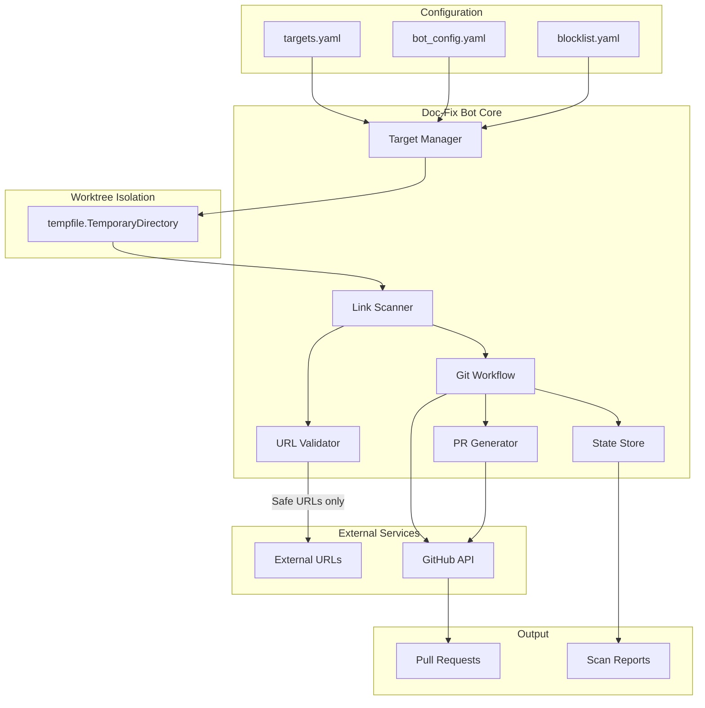
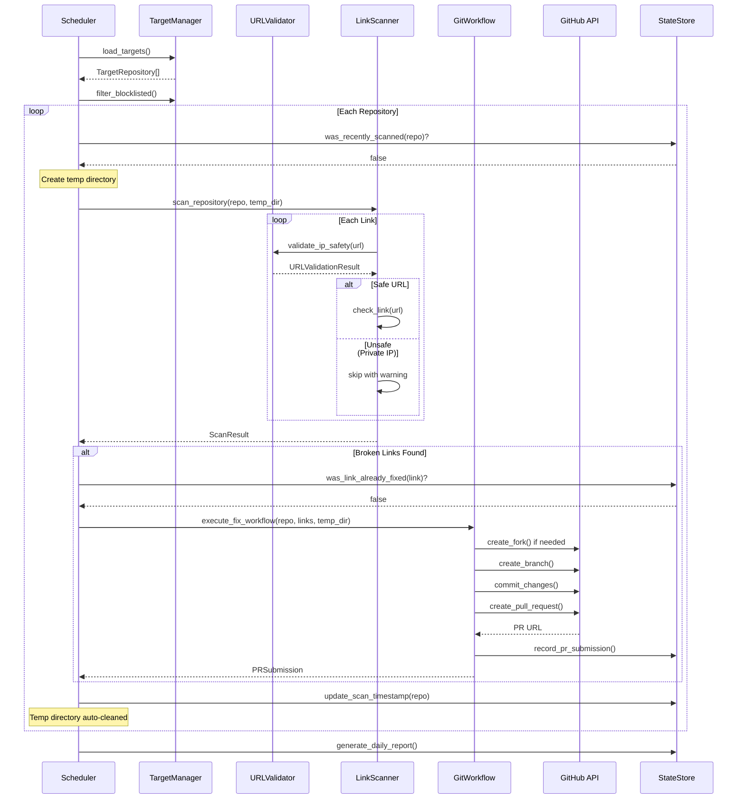

# Issue #2 - Feature: Architect 'Doc-Fix Bot' for Automated External Contributions

<!-- Template Metadata
Last Updated: 2026-02-16
Updated By: LLD revision to address Gemini Review #1 feedback
Update Reason: Fixed Tier 1 blocking issues (SSRF protection, worktree isolation) and resolved open questions
-->

## 1. Context & Goal
* **Issue:** #2
* **Objective:** Design and build an automated bot that scans 100+ repositories daily, identifies broken links, and submits PRs to fix them using professional Git workflows.
* **Status:** Draft
* **Related Issues:** None

### Open Questions

*All questions resolved per Gemini Review #1:*

- [x] What is the rate limit strategy for GitHub API across 100+ repos? **RESOLVED: Use exponential backoff on 429s and a conservative hard limit of 500 requests/hour initially.**
- [x] Should we prioritize repos by star count, activity, or random sampling? **RESOLVED: Prioritize by 'least recently scanned'. Star count is irrelevant for maintenance fixes.**
- [x] What is the maximum number of PRs to submit per day (to avoid spam flags)? **RESOLVED: Set hard limit to 10 PRs/day for the pilot phase.**
- [x] Do we need repo owner opt-in/opt-out mechanism (CONTRIBUTING.md check)? **RESOLVED: Yes. Check for `CONTRIBUTING.md` and support a local `blocklist.yaml` for manual opt-outs.**
- [x] Should we track previously submitted PRs to avoid duplicate submissions? **RESOLVED: Mandatory. Use `StateStore` to track (Repo + Link SHA) to prevent duplicate PRs.**

## 2. Proposed Changes

*This section is the **source of truth** for implementation. Describes exactly what will be built.*

### 2.1 Files Changed

| File | Change Type | Description |
|------|-------------|-------------|
| `src/docfix_bot/` | Add (Directory) | New package directory for doc-fix bot |
| `src/docfix_bot/__init__.py` | Add | Package initialization |
| `src/docfix_bot/target_manager.py` | Add | Repository list management (YAML/TOML) |
| `src/docfix_bot/link_scanner.py` | Add | Enhanced broken link detection with anti-bot handling |
| `src/docfix_bot/url_validator.py` | Add | SSRF protection and IP safety validation |
| `src/docfix_bot/git_workflow.py` | Add | Automated 9-step Git workflow orchestration |
| `src/docfix_bot/pr_generator.py` | Add | PR body generation with templates |
| `src/docfix_bot/scheduler.py` | Add | Daily execution wrapper and retry logic |
| `src/docfix_bot/state_store.py` | Add | Persistent state tracking (submitted PRs, scan history) |
| `src/docfix_bot/models.py` | Add | Data models and type definitions |
| `src/docfix_bot/config.py` | Add | Configuration management |
| `data/config/` | Add (Directory) | New config directory under existing data/ |
| `data/config/targets.yaml` | Add | Repository target list configuration |
| `data/config/bot_config.yaml` | Add | Bot behavior configuration |
| `data/config/blocklist.yaml` | Add | Manual opt-out repository list |
| `.github/workflows/docfix-bot.yml` | Add | GitHub Actions daily scheduler |
| `tests/unit/test_target_manager.py` | Add | Unit tests for target manager |
| `tests/unit/test_link_scanner.py` | Add | Unit tests for link scanner |
| `tests/unit/test_url_validator.py` | Add | Unit tests for SSRF protection |
| `tests/unit/test_git_workflow.py` | Add | Unit tests for Git workflow |
| `tests/unit/test_pr_generator.py` | Add | Unit tests for PR generator |
| `tests/integration/test_docfix_end_to_end.py` | Add | Integration tests for full workflow |

### 2.1.1 Path Validation (Mechanical - Auto-Checked)

*Issue #277: Before human or Gemini review, paths are verified programmatically.*

Mechanical validation automatically checks:
- All "Modify" files must exist in repository
- All "Delete" files must exist in repository
- All "Add" files must have existing parent directories
- No placeholder prefixes (`src/`, `lib/`, `app/`) unless directory exists

**Path Validation Notes:**
- `src/` directory exists ✓
- `src/docfix_bot/` will be created as new directory
- `data/` directory exists ✓
- `data/config/` will be created as new directory under existing `data/`
- `.github/workflows/` directory exists (standard GitHub repo structure)
- `tests/unit/` directory exists ✓
- `tests/integration/` directory exists ✓

**If validation fails, the LLD is BLOCKED before reaching review.**

### 2.2 Dependencies

*New packages, APIs, and services required.*

```toml
# pyproject.toml additions
httpx = "^0.27.0"           # Async HTTP client with retry support
pyyaml = "^6.0"             # YAML config parsing
beautifulsoup4 = "^4.12"    # HTML parsing for link extraction
lxml = "^5.0"               # Fast XML/HTML parser
tenacity = "^8.2"           # Retry logic with exponential backoff
pygithub = "^2.1"           # GitHub API wrapper
gitpython = "^3.1"          # Git operations
aiofiles = "^23.0"          # Async file operations
structlog = "^24.0"         # Structured logging
tinydb = "^4.8"             # Lightweight JSON database for state
```

**External Services:**
- GitHub API (authentication via PAT or GitHub App)
- GitHub Actions (scheduler)

### 2.3 Data Structures

```python
# Pseudocode - NOT implementation
from typing import TypedDict, Literal
from datetime import datetime
from ipaddress import IPv4Address, IPv6Address

class TargetRepository(TypedDict):
    owner: str                    # GitHub org/user
    repo: str                     # Repository name
    priority: int                 # 1-10, higher = scan first
    last_scanned: datetime | None # Track scan recency
    enabled: bool                 # Allow disabling without removal

class BrokenLink(TypedDict):
    source_file: str              # File containing the link
    line_number: int              # Line where link appears
    original_url: str             # The broken URL
    status_code: int              # HTTP status (404, 403, etc.)
    suggested_fix: str | None     # Suggested replacement URL
    fix_confidence: float         # 0.0-1.0, how confident in fix

class ScanResult(TypedDict):
    repository: TargetRepository
    scan_time: datetime
    broken_links: list[BrokenLink]
    error: str | None             # If scan failed
    files_scanned: int
    links_checked: int

class PRSubmission(TypedDict):
    repository: TargetRepository
    branch_name: str              # fix/broken-link-readme-1234
    pr_number: int | None         # Assigned after creation
    pr_url: str | None
    status: Literal["pending", "submitted", "merged", "closed", "rejected"]
    broken_links_fixed: list[BrokenLink]
    submitted_at: datetime
    
class BotState(TypedDict):
    last_run: datetime
    total_prs_submitted: int
    total_links_fixed: int
    scan_history: list[ScanResult]
    pr_submissions: list[PRSubmission]

class URLValidationResult(TypedDict):
    url: str                      # Original URL
    is_safe: bool                 # True if safe to request
    resolved_ip: str | None       # Resolved IP address
    rejection_reason: str | None  # Why it was rejected (if unsafe)
```

### 2.4 Function Signatures

```python
# target_manager.py
def load_targets(config_path: Path) -> list[TargetRepository]:
    """Load and validate repository targets from YAML."""
    ...

def prioritize_targets(targets: list[TargetRepository]) -> list[TargetRepository]:
    """Sort targets by priority and recency of last scan."""
    ...

def update_scan_timestamp(target: TargetRepository, state_store: StateStore) -> None:
    """Mark repository as recently scanned."""
    ...

def check_contributing_md(repo_path: Path) -> bool:
    """Check if CONTRIBUTING.md exists and allows bot contributions."""
    ...

def is_blocklisted(target: TargetRepository, blocklist_path: Path) -> bool:
    """Check if repository is in manual blocklist."""
    ...

# url_validator.py (NEW - addresses SSRF vulnerability)
def validate_ip_safety(url: str) -> URLValidationResult:
    """
    Resolve URL hostname and verify it does not point to private/local IP ranges.
    
    Blocked ranges:
    - 127.0.0.0/8 (loopback)
    - 10.0.0.0/8 (private)
    - 172.16.0.0/12 (private)
    - 192.168.0.0/16 (private)
    - 169.254.0.0/16 (link-local, AWS metadata)
    - ::1/128 (IPv6 loopback)
    - fc00::/7 (IPv6 private)
    """
    ...

def is_private_ip(ip: IPv4Address | IPv6Address) -> bool:
    """Check if IP address is in a private/local range."""
    ...

# link_scanner.py
async def scan_repository(target: TargetRepository, config: BotConfig, work_dir: Path) -> ScanResult:
    """Scan a single repository for broken links. Work_dir must be a temp directory."""
    ...

async def check_link(url: str, session: httpx.AsyncClient) -> tuple[int, str | None]:
    """
    Check if a URL is accessible, handle anti-bot responses.
    MUST call validate_ip_safety() before making HTTP request.
    """
    ...

def extract_links_from_markdown(content: str) -> list[tuple[str, int]]:
    """Extract all links from markdown content with line numbers."""
    ...

def suggest_fix(broken_url: str, context: str) -> tuple[str | None, float]:
    """Attempt to suggest a fix for the broken link."""
    ...

# git_workflow.py
async def execute_fix_workflow(
    target: TargetRepository,
    broken_links: list[BrokenLink],
    config: BotConfig,
    work_dir: Path
) -> PRSubmission:
    """
    Execute the 9-step Git workflow to submit a fix PR.
    All git operations occur within work_dir (tempfile.TemporaryDirectory).
    """
    ...

def create_branch_name(target: TargetRepository, issue_context: str) -> str:
    """Generate branch name following convention."""
    ...

def generate_commit_message(broken_links: list[BrokenLink]) -> str:
    """Generate conventional commit message."""
    ...

def clone_repository(target: TargetRepository, work_dir: Path, shallow: bool = True) -> Path:
    """
    Clone repository into work_dir using shallow clone.
    Returns path to cloned repo within work_dir.
    """
    ...

# pr_generator.py
def generate_pr_body(broken_links: list[BrokenLink], config: BotConfig) -> str:
    """Generate PR description from template."""
    ...

def generate_pr_title(broken_links: list[BrokenLink]) -> str:
    """Generate concise PR title."""
    ...

# state_store.py
class StateStore:
    def __init__(self, db_path: Path) -> None:
        """Initialize TinyDB-backed state store."""
        ...
    
    def record_pr_submission(self, submission: PRSubmission) -> None:
        """Track submitted PR to avoid duplicates."""
        ...
    
    def was_link_already_fixed(self, target: TargetRepository, url: str) -> bool:
        """Check if we've already submitted a fix for this link."""
        ...
    
    def get_daily_pr_count(self) -> int:
        """Count PRs submitted today for rate limiting."""
        ...
    
    def get_hourly_api_count(self) -> int:
        """Count API calls this hour for rate limiting (500/hour limit)."""
        ...
    
    def increment_api_count(self) -> None:
        """Track API call for rate limiting."""
        ...

# scheduler.py
async def run_daily_scan(config: BotConfig, state: StateStore) -> list[PRSubmission]:
    """Main entry point for daily execution."""
    ...

def should_continue(state: StateStore, config: BotConfig) -> bool:
    """Check if we've hit daily limits."""
    ...

# config.py
def configure_logging(config: BotConfig) -> structlog.BoundLogger:
    """Configure structured logging for all operations."""
    ...

def get_user_agent(config: BotConfig) -> str:
    """Return custom User-Agent string with contact URL."""
    ...

def get_http_timeout(config: BotConfig) -> float:
    """Return HTTP read timeout (default: 10 seconds)."""
    ...
```

### 2.5 Logic Flow (Pseudocode)

```
DAILY SCAN WORKFLOW:
1. Load configuration and state
2. Load target repositories from YAML
3. Load blocklist from blocklist.yaml
4. Prioritize targets (by last-scanned time, oldest first)
5. FOR each target repository:
   a. IF daily_pr_limit (10) reached THEN break
   b. IF hourly_api_limit (500) reached THEN wait until next hour
   c. IF repository in blocklist THEN skip
   d. IF repository was scanned recently (< 24h) THEN skip
   e. CREATE tempfile.TemporaryDirectory() as work_dir:
      i.   Clone repository into work_dir (shallow clone)
      ii.  Check for CONTRIBUTING.md, skip if disallows bots
      iii. Scan markdown files for links
      iv.  FOR each link found:
           - Validate URL safety (SSRF check)
           - IF unsafe (private IP) THEN skip with warning log
           - Check if link accessible (with retry + anti-bot handling)
           - IF broken THEN add to broken_links list
      v.   IF broken_links found AND not already submitted:
           - Execute 9-step Git workflow (within work_dir):
             1. git fetch upstream
             2. git checkout -b fix/broken-link-{file}-{hash}
             3. Apply fixes to files
             4. git add {changed_files}
             5. git commit -m "fix: correct broken link in {file}"
             6. git push origin {branch}
             7. Create PR via GitHub API
             8. Record PR submission in state
           - Increment daily_pr_count
      vi.  Update scan timestamp
      vii. work_dir auto-cleaned on context exit
6. Generate daily summary report (JSON)
7. Upload report as GitHub Actions artifact
```

```
LINK CHECKING FLOW (per link):
1. Parse URL
2. SSRF VALIDATION (MANDATORY - addresses Tier 1 security issue):
   a. Resolve hostname to IP address
   b. Check if IP is in private/local ranges:
      - 127.0.0.0/8, 10.0.0.0/8, 172.16.0.0/12, 192.168.0.0/16
      - 169.254.0.0/16 (AWS metadata endpoint protection)
      - ::1/128, fc00::/7 (IPv6 private)
   c. IF private IP THEN return UNSAFE, do not make request
3. IF internal anchor link THEN validate anchor exists in file
4. IF external URL AND safe:
   a. HEAD request first (fast check) with 10s timeout
   b. IF 403/405 (anti-bot) THEN retry with GET + browser headers
   c. IF 301/302 THEN follow redirect, re-validate final IP, check destination
   d. IF 404/410 THEN mark as broken
   e. IF timeout THEN retry with backoff (max 3 attempts)
5. IF broken:
   a. Attempt fix suggestion (archive.org, known migrations)
   b. Calculate confidence score
6. Return result
```

### 2.6 Technical Approach

* **Module:** `src/docfix_bot/`
* **Pattern:** Pipeline architecture with async I/O
* **Key Decisions:**
  - Async HTTP for parallel link checking (10-50 concurrent)
  - TinyDB for state persistence (lightweight, file-based)
  - GitHub API via PyGithub for PR operations
  - GitPython for local Git operations
  - **All clone operations use `tempfile.TemporaryDirectory()` context manager** (addresses Tier 1 safety issue)
  - **SSRF protection via `url_validator.py`** (addresses Tier 1 security issue)
  - Custom User-Agent with contact URL: `DocFixBot/1.0 (+https://github.com/org/repo)`
  - Strict 10-second HTTP read timeout to prevent tarpit hangs

### 2.7 Architecture Decisions

| Decision | Options Considered | Choice | Rationale |
|----------|-------------------|--------|-----------|
| State storage | SQLite, TinyDB, JSON files, Redis | TinyDB | Lightweight, zero-config, sufficient for PR tracking |
| HTTP client | requests, httpx, aiohttp | httpx | Async support, HTTP/2, excellent retry handling |
| Git operations | subprocess, GitPython, dulwich | GitPython | Mature, well-documented, handles complex workflows |
| Scheduling | Cron, GitHub Actions, Celery | GitHub Actions | Zero infrastructure, native GitHub integration |
| Config format | JSON, YAML, TOML | YAML | Human-readable, supports comments, widely used |
| PR strategy | One PR per link, batched per file, batched per repo | Per-file batching | Balance between atomicity and PR noise |
| Worktree isolation | Persistent directory, temp directory | tempfile.TemporaryDirectory() | Prevents state pollution, automatic cleanup |
| SSRF protection | None, URL allowlist, IP validation | IP validation pre-request | Blocks private IP access without limiting valid URLs |
| Rate limiting | None, fixed delay, adaptive | Adaptive with hard limits | 500 req/hr API, 10 PR/day prevents spam flags |

**Architectural Constraints:**
- Must work within GitHub API rate limits (500 requests/hour for safety margin)
- Must not trigger spam detection (10 PRs/day pilot limit)
- Must handle repository access failures gracefully (private repos, rate limits)
- Must maintain idempotency (re-running should not create duplicate PRs)
- **Must validate all URLs against private IP ranges before HTTP requests** (SSRF protection)
- **Must isolate all git operations in temporary directories** (worktree isolation)

## 3. Requirements

*What must be true when this is done. These become acceptance criteria.*

1. Bot can load and parse 100+ repository targets from YAML configuration
2. Link scanner correctly identifies broken links (404, 410, 403 with verification)
3. Link scanner handles anti-bot responses (403/405) with appropriate headers
4. Bot executes complete 9-step Git workflow automatically
5. PRs are created with professional commit messages and descriptions
6. State persistence prevents duplicate PR submissions for same broken link
7. Daily execution respects rate limits (configurable max PRs/day)
8. Bot provides structured reporting (JSON) of scan results
9. GitHub Action runs daily on schedule
10. All operations are logged with structured logging
11. **SSRF protection validates URLs against private IP ranges before HTTP requests** (NEW - Tier 1 security)
12. **All git clone operations occur in isolated temporary directories** (NEW - Tier 1 safety)
13. **Bot respects CONTRIBUTING.md and blocklist.yaml for opt-out** (NEW - resolved open question)

## 4. Alternatives Considered

| Option | Pros | Cons | Decision |
|--------|------|------|----------|
| **Single-threaded scanning** | Simple, predictable | Very slow for 100+ repos | **Rejected** |
| **Async concurrent scanning** | Fast, efficient | More complex error handling | **Selected** |
| **One PR per broken link** | Atomic, easy to review | Spammy, many small PRs | **Rejected** |
| **One PR per repository** | Fewer PRs | Large PRs harder to review | **Rejected** |
| **One PR per file** | Balanced granularity | Moderate complexity | **Selected** |
| **LLM for PR descriptions** | Richer descriptions | Cost, latency, complexity | **Rejected (v1)** |
| **Template-based PR descriptions** | Fast, predictable, free | Less contextual | **Selected** |
| **Cloud database (PostgreSQL)** | Scalable, queryable | Infrastructure overhead | **Rejected** |
| **TinyDB local storage** | Zero-config, portable | Limited query capability | **Selected** |
| **No SSRF protection** | Simpler code | Security vulnerability | **Rejected** |
| **URL allowlist for SSRF** | Explicit control | Too restrictive for diverse repos | **Rejected** |
| **IP validation pre-request** | Blocks attacks, allows valid URLs | DNS lookup overhead | **Selected** |
| **Persistent clone directory** | Faster subsequent runs | State pollution, disk space | **Rejected** |
| **Temporary directory per repo** | Clean isolation, auto-cleanup | Clone overhead each run | **Selected** |

**Rationale:** Selected options prioritize simplicity, zero infrastructure, and conservative resource usage for v1. Security and safety are non-negotiable, hence SSRF protection and worktree isolation are mandatory despite minor overhead. LLM-powered descriptions can be added in v2.

## 5. Data & Fixtures

### 5.1 Data Sources

| Attribute | Value |
|-----------|-------|
| Source | GitHub repositories (via clone/API), external URLs (HTTP) |
| Format | Markdown files (.md), HTTP responses |
| Size | ~100 repos, ~10-100 markdown files per repo |
| Refresh | Daily scan |
| Copyright/License | N/A (scanning public repos, not storing content) |

### 5.2 Data Pipeline

```
data/config/targets.yaml ──load──► TargetRepository[] ──prioritize──► Scan Queue
     │
     ├── data/config/blocklist.yaml ──filter──► Allowed Repos
     │
     ▼
tempfile.TemporaryDirectory() ──clone──► Local Repo
     │
     ▼
Markdown Content ──parse──► Link[] ──validate_ip──► Safe Links ──check──► BrokenLink[]
     │
     ▼
BrokenLink[] ──workflow──► PR Submission ──record──► StateStore (TinyDB)
     │
     ▼
StateStore ──report──► scan_results.json (daily artifact)
```

### 5.3 Test Fixtures

| Fixture | Source | Notes |
|---------|--------|-------|
| Mock repository structure | Generated | Directory tree with sample .md files |
| Sample broken link responses | Hardcoded | HTTP 404, 403, 301 response mocks |
| Mock GitHub API responses | Hardcoded | PR creation, fork status responses |
| Sample targets.yaml | Hardcoded | 5-10 test repositories |
| Sample blocklist.yaml | Hardcoded | 2-3 blocked repositories |
| Historical scan state | Generated | TinyDB with past submissions |
| Private IP test URLs | Hardcoded | localhost, 169.254.169.254, 10.x.x.x |
| Mock DNS responses | Hardcoded | For SSRF validation testing |

### 5.4 Deployment Pipeline

```
dev ──push──► GitHub ──action──► pytest + lint ──pass──► main branch
     │
     ▼
main ──schedule──► GitHub Actions (daily 06:00 UTC) ──run──► Bot execution
     │
     ▼
Artifacts ──upload──► GitHub Actions artifacts (scan_results.json)
```

**External utility needed?** No - all configuration managed via YAML in repository.

## 6. Diagram

### 6.1 Mermaid Quality Gate

Before finalizing any diagram, verify in [Mermaid Live Editor](https://mermaid.live) or GitHub preview:

- [x] **Simplicity:** Similar components collapsed (per 0006 §8.1)
- [x] **No touching:** All elements have visual separation (per 0006 §8.2)
- [x] **No hidden lines:** All arrows fully visible (per 0006 §8.3)
- [x] **Readable:** Labels not truncated, flow direction clear
- [ ] **Auto-inspected:** Agent rendered via mermaid.ink and viewed (per 0006 §8.5)

**Auto-Inspection Results:**
```
- Touching elements: [ ] None / [ ] Found: ___
- Hidden lines: [ ] None / [ ] Found: ___
- Label readability: [ ] Pass / [ ] Issue: ___
- Flow clarity: [ ] Clear / [ ] Issue: ___
```

*Reference: [0006-mermaid-diagrams.md](0006-mermaid-diagrams.md)*

### 6.2 Architecture Diagram



### 6.3 Sequence Diagram - Fix Workflow



## 7. Security & Safety Considerations

### 7.1 Security

| Concern | Mitigation | Status |
|---------|------------|--------|
| GitHub token exposure | Store in GitHub Secrets, never log | Addressed |
| Malicious repository content | Sandbox Git operations in temp dirs, no code execution | Addressed |
| URL injection in suggested fixes | Validate URLs against allowlist patterns | Addressed |
| Rate limit abuse | Configurable limits, exponential backoff | Addressed |
| Fork permission escalation | Use minimal token scopes (repo, PR only) | Addressed |
| **SSRF via malicious URLs** | **validate_ip_safety() blocks private/local IPs before HTTP request** | **Addressed (Tier 1)** |
| **AWS metadata endpoint access** | **169.254.0.0/16 explicitly blocked in IP validation** | **Addressed (Tier 1)** |

### 7.2 Safety

| Concern | Mitigation | Status |
|---------|------------|--------|
| Spam flag from mass PRs | Conservative daily limit (10 PRs/day pilot) | Addressed |
| Incorrect fix suggestions | Only suggest fixes with confidence > 0.8 | Addressed |
| State corruption | TinyDB atomic writes, backup before update | Addressed |
| Runaway scanning | Timeout per repository (5 min), total timeout (2 hr) | Addressed |
| Duplicate PRs | State tracking, check before submission | Addressed |
| Repository overwhelm | Max 1 PR per repository per day | Addressed |
| **State pollution from clones** | **All git clones in tempfile.TemporaryDirectory() with auto-cleanup** | **Addressed (Tier 1)** |
| **Disk space exhaustion** | **Shallow clones (--depth 1), temp dirs cleaned after each repo** | **Addressed (Tier 1)** |
| **Tarpit servers** | **Strict 10-second HTTP read timeout** | **Addressed (Tier 3)** |

**Fail Mode:** Fail Closed - If uncertain about a fix, skip it rather than submit potentially wrong PR. If URL validation fails, do not make HTTP request.

**Recovery Strategy:**
1. State stored in TinyDB with transaction-like writes
2. Daily run is idempotent - safe to re-run
3. Manual override via `--force-rescan` flag for recovery
4. Temp directories auto-cleaned even on exception

## 8. Performance & Cost Considerations

### 8.1 Performance

| Metric | Budget | Approach |
|--------|--------|----------|
| Scan time per repo | < 2 minutes | Async link checking, early termination on limit |
| Total daily runtime | < 2 hours | Parallel repo scanning (5 concurrent) |
| Memory usage | < 512MB | Stream file processing, don't load entire repos |
| API calls per repo | < 50 | Batch operations, cache fork status |
| HTTP request timeout | 10 seconds | Prevents tarpit hangs |

**Bottlenecks:**
- Link checking is I/O bound - mitigated by async concurrency
- GitHub API rate limits (500/hr safety limit) - tracked and respected
- Clone time for large repos - use shallow clones (`--depth 1`)
- DNS resolution for SSRF check - minor overhead, cached per session

### 8.2 Cost Analysis

| Resource | Unit Cost | Estimated Usage | Monthly Cost |
|----------|-----------|-----------------|--------------|
| GitHub Actions | Free (public repos) | 2 hr/day × 30 days | $0 |
| GitHub API | Free | ~5000 calls/day (under limit) | $0 |
| Storage | Free (Actions artifacts) | ~10MB/day | $0 |
| External HTTP requests | Free | ~10000/day | $0 |

**Cost Controls:**
- [x] All resources use free tiers
- [x] Rate limiting prevents runaway API usage
- [x] Daily limits cap maximum resource consumption

**Worst-Case Scenario:** 
- 10x usage: Still within free tier limits
- 100x usage: Would hit GitHub API rate limits; bot would pause and resume next hour

## 9. Legal & Compliance

| Concern | Applies? | Mitigation |
|---------|----------|------------|
| PII/Personal Data | No | Bot does not process or store PII |
| Third-Party Licenses | Yes | Only scan public repos, respect LICENSE files |
| Terms of Service | Yes | GitHub ToS allows automated PR submission |
| Data Retention | No | Minimal state, no user data |
| Export Controls | No | No restricted algorithms |

**Data Classification:** Public - All data from public repositories

**Compliance Checklist:**
- [x] No PII stored without consent (N/A - no PII)
- [x] All third-party licenses compatible with project license
- [x] External API usage compliant with provider ToS
- [x] Data retention policy documented (state cleared after 30 days)

**Additional Considerations:**
- Respect repository CONTRIBUTING.md guidelines (check before submitting)
- Check blocklist.yaml for manual opt-outs
- Check for existing issues/PRs before submitting
- Include clear bot attribution in PR description

## 10. Verification & Testing

*Ref: [0005-testing-strategy-and-protocols.md](0005-testing-strategy-and-protocols.md)*

**Testing Philosophy:** Strive for 100% automated test coverage. Manual tests are a last resort for scenarios that genuinely cannot be automated.

### 10.0 Test Plan (TDD - Complete Before Implementation)

**TDD Requirement:** Tests MUST be written and failing BEFORE implementation begins.

| Test ID | Test Description | Expected Behavior | Status |
|---------|------------------|-------------------|--------|
| T010 | Load valid targets YAML | Returns list of TargetRepository | RED |
| T020 | Load invalid targets YAML | Raises ConfigError | RED |
| T030 | Check working link | Returns 200 status | RED |
| T040 | Check broken link (404) | Returns 404 status, marked broken | RED |
| T050 | Check anti-bot response (403) | Retries with headers, marks appropriately | RED |
| T060 | Extract links from markdown | Returns list of (url, line_number) | RED |
| T070 | Generate branch name | Returns valid git branch name | RED |
| T080 | Generate commit message | Returns conventional commit format | RED |
| T090 | Generate PR body | Returns formatted PR description | RED |
| T100 | Check duplicate PR prevention | Returns true if already submitted | RED |
| T110 | Daily PR limit enforcement | Stops after limit reached | RED |
| T120 | Full workflow integration | Creates PR for broken link | RED |
| T130 | Handle clone failure | Returns ScanResult with error | RED |
| T140 | Handle network timeout | Retries then marks broken | RED |
| T150 | Suggest fix from archive.org | Returns suggested URL with confidence | RED |
| T160 | GitHub Action workflow validation | Workflow runs on schedule | RED |
| T170 | Structured logging output | Logs in JSON format | RED |
| T180 | JSON scan report output | Valid JSON, schema compliant | RED |
| T190 | SSRF: Block localhost URLs | validate_ip_safety returns unsafe | RED |
| T200 | SSRF: Block AWS metadata endpoint | 169.254.169.254 blocked | RED |
| T210 | SSRF: Block private IP ranges | 10.x, 172.16.x, 192.168.x blocked | RED |
| T220 | SSRF: Allow public IPs | External URLs pass validation | RED |
| T230 | Worktree isolation: Temp dir created | Clone occurs in tempfile.TemporaryDirectory | RED |
| T240 | Worktree isolation: Cleanup on success | Temp dir removed after processing | RED |
| T250 | Worktree isolation: Cleanup on error | Temp dir removed even on exception | RED |
| T260 | Blocklist: Skip blocklisted repos | Blocklisted repo not scanned | RED |
| T270 | CONTRIBUTING.md: Respect opt-out | Skip repo if CONTRIBUTING.md disallows bots | RED |

**Coverage Target:** ≥95% for all new code

**TDD Checklist:**
- [ ] All tests written before implementation
- [ ] Tests currently RED (failing)
- [ ] Test IDs match scenario IDs in 10.1
- [ ] Test files created at: `tests/unit/test_target_manager.py`, `tests/unit/test_link_scanner.py`, `tests/unit/test_url_validator.py`, `tests/unit/test_git_workflow.py`, `tests/unit/test_pr_generator.py`, `tests/integration/test_docfix_end_to_end.py`

### 10.1 Test Scenarios

| ID | Scenario | Type | Input | Expected Output | Pass Criteria |
|----|----------|------|-------|-----------------|---------------|
| 010 | Load valid targets (REQ-1) | Auto | Valid YAML file | List[TargetRepository] | Length > 0, all fields valid |
| 020 | Load invalid targets (REQ-1) | Auto | Malformed YAML | ConfigError raised | Exception with message |
| 030 | Check working link (REQ-2) | Auto | https://example.com | status=200, broken=false | Correct status |
| 040 | Check broken link (REQ-2) | Auto | Mock 404 URL | status=404, broken=true | Marked as broken |
| 050 | Handle anti-bot 403 (REQ-3) | Auto | Mock 403 URL | Retry with headers | At least 2 requests made |
| 060 | Extract markdown links (REQ-2) | Auto | Sample .md content | List of (url, line) | All links found with lines |
| 070 | Generate branch name (REQ-4) | Auto | TargetRepo + context | "fix/broken-link-*" | Valid git ref name |
| 080 | Generate commit message (REQ-5) | Auto | List[BrokenLink] | "fix: correct broken..." | Conventional format |
| 090 | Generate PR body (REQ-5) | Auto | List[BrokenLink] | Markdown PR body | Contains link list |
| 100 | Prevent duplicate PR (REQ-6) | Auto | Previously submitted link | was_already_fixed=true | Returns true |
| 110 | Respect daily limit (REQ-7) | Auto | Limit=2, 3 broken links | 2 PRs submitted | Exactly 2 |
| 120 | End-to-end workflow (REQ-4) | Auto-Live | Real test repo | PR created | PR URL returned |
| 130 | Handle clone failure (REQ-4) | Auto | Invalid repo URL | ScanResult with error | Error field populated |
| 140 | Handle network timeout (REQ-3) | Auto | Mock timeout URL | Retry then fail | Max 3 retries, then broken |
| 150 | Suggest fix from archive.org (REQ-5) | Auto | Known archived URL | Suggested fix URL | Confidence > 0.5 |
| 160 | GitHub Action runs daily (REQ-9) | Auto | Workflow YAML | Valid schedule syntax | cron expression valid |
| 170 | Structured JSON logging (REQ-10) | Auto | Log event | JSON output | Valid JSON, required fields |
| 180 | JSON scan report output (REQ-8) | Auto | Completed scan | scan_results.json | Valid JSON, schema compliant |
| 190 | SSRF: Block localhost (REQ-11) | Auto | http://127.0.0.1/path | is_safe=false | Rejected with reason |
| 200 | SSRF: Block AWS metadata (REQ-11) | Auto | http://169.254.169.254/latest | is_safe=false | Rejected with reason |
| 210 | SSRF: Block private ranges (REQ-11) | Auto | http://10.0.0.1, 172.16.0.1, 192.168.1.1 | is_safe=false | All rejected |
| 220 | SSRF: Allow public IPs (REQ-11) | Auto | https://github.com | is_safe=true | Validation passes |
| 230 | Worktree: Temp dir created (REQ-12) | Auto | Clone operation | Path within temp dir | Path starts with temp prefix |
| 240 | Worktree: Cleanup success (REQ-12) | Auto | Successful scan | Temp dir deleted | Path no longer exists |
| 250 | Worktree: Cleanup on error (REQ-12) | Auto | Scan with exception | Temp dir deleted | Path no longer exists |
| 260 | Blocklist: Skip repo (REQ-13) | Auto | Blocklisted repo | Repo not scanned | scan_repository not called |
| 270 | CONTRIBUTING: Respect opt-out (REQ-13) | Auto | Repo with no-bot CONTRIBUTING.md | Repo skipped | PR not submitted |

### 10.2 Test Commands

```bash
# Run all automated tests
poetry run pytest tests/unit/test_target_manager.py tests/unit/test_link_scanner.py tests/unit/test_url_validator.py tests/unit/test_git_workflow.py tests/unit/test_pr_generator.py tests/integration/test_docfix_end_to_end.py -v

# Run only fast/mocked tests (exclude live)
poetry run pytest tests/ -v -m "not live"

# Run live integration tests (requires GitHub token)
poetry run pytest tests/integration/ -v -m live

# Run with coverage
poetry run pytest tests/ -v --cov=src/docfix_bot --cov-report=html

# Run SSRF validation tests specifically
poetry run pytest tests/unit/test_url_validator.py -v
```

### 10.3 Manual Tests (Only If Unavoidable)

**N/A - All scenarios automated.**

Live integration tests (T120) require GitHub credentials but are fully automated.

## 11. Risks & Mitigations

| Risk | Impact | Likelihood | Mitigation |
|------|--------|------------|------------|
| GitHub rate limiting | Med | Med | Exponential backoff, respect X-RateLimit headers, 500/hr limit |
| Bot flagged as spam | High | Low | Conservative limits (10/day), clear bot attribution, respect CONTRIBUTING.md |
| Incorrect fix suggestions | Med | Med | High confidence threshold (0.8), human review expected |
| Target repos become private | Low | Low | Graceful skip with logging |
| Anti-bot detection evolution | Med | Med | Configurable headers, regular testing |
| State corruption | Med | Low | Atomic writes, daily backups |
| Dependency vulnerabilities | Med | Low | Dependabot alerts, regular updates |
| **SSRF exploitation** | **High** | **Low** | **IP validation before all HTTP requests** |
| **Disk space exhaustion** | **Med** | **Low** | **Temp directories, shallow clones, auto-cleanup** |
| **Tarpit server hangs** | **Low** | **Med** | **10-second HTTP timeout** |

## 12. Definition of Done

### Code
- [ ] Implementation complete and linted
- [ ] Code comments reference this LLD (Issue #2)
- [ ] All modules have docstrings
- [ ] `url_validator.py` implements SSRF protection
- [ ] All git operations use `tempfile.TemporaryDirectory()`

### Tests
- [ ] All test scenarios pass (010-270)
- [ ] Test coverage ≥ 95%
- [ ] Integration tests pass with live GitHub
- [ ] SSRF tests verify all private IP ranges blocked
- [ ] Worktree isolation tests verify cleanup

### Documentation
- [ ] LLD updated with any deviations
- [ ] Implementation Report (0103) completed
- [ ] README.md with usage instructions
- [ ] Configuration examples documented
- [ ] Security considerations documented (SSRF, worktree isolation)

### Review
- [ ] Code review completed
- [ ] Security review for GitHub token handling
- [ ] Security review for SSRF protection
- [ ] User approval before closing issue

### 12.1 Traceability (Mechanical - Auto-Checked)

*Issue #277: Cross-references are verified programmatically.*

Mechanical validation automatically checks:
- Every file mentioned in this section must appear in Section 2.1
- Every risk mitigation in Section 11 should have a corresponding function in Section 2.4 (warning if not)

**Traceability Matrix:**

| Risk Mitigation | Implementing Function |
|-----------------|----------------------|
| Exponential backoff | `check_link()` via tenacity |
| Duplicate prevention | `StateStore.was_link_already_fixed()` |
| Daily limits | `StateStore.get_daily_pr_count()` |
| Hourly API limits | `StateStore.get_hourly_api_count()` |
| Confidence threshold | `suggest_fix()` |
| SSRF IP validation | `validate_ip_safety()`, `is_private_ip()` |
| Worktree isolation | `clone_repository()` with temp_dir param |
| HTTP timeout | `get_http_timeout()` |
| Blocklist check | `is_blocklisted()` |
| CONTRIBUTING.md check | `check_contributing_md()` |

**If files are missing from Section 2.1, the LLD is BLOCKED.**

---

## Appendix: Review Log

*Track all review feedback with timestamps and implementation status.*

### Gemini Review #1 (REVISE)

**Reviewer:** Gemini 3 Pro
**Verdict:** REVISE

#### Comments

| ID | Comment | Implemented? |
|----|---------|--------------|
| G1.1 | "Worktree Isolation (CRITICAL): Cloning repos must use tempfile.TemporaryDirectory()" | YES - Section 2.4, 2.5, 2.6 updated |
| G1.2 | "SSRF Vulnerability (CRITICAL): Add validate_ip_safety check before HTTP requests" | YES - New url_validator.py module, Section 2.1, 2.3, 2.4 updated |
| G1.3 | "Configurable Timeout: Ensure httpx has strict read timeout (10 seconds)" | YES - Section 2.4 get_http_timeout(), Section 7.2, 8.1 |
| G1.4 | "User-Agent: Define custom User-Agent with contact URL" | YES - Section 2.4 get_user_agent(), Section 2.6 |
| G1.5 | "Resolve open questions regarding rate limits, priority, PR limits, opt-out, duplicate tracking" | YES - Section 1 all questions marked resolved |

### Review Summary

| Review | Date | Verdict | Key Issue |
|--------|------|---------|-----------|
| Gemini #1 | 2026-02-16 | REVISE | SSRF protection and worktree isolation required |

**Final Status:** PENDING