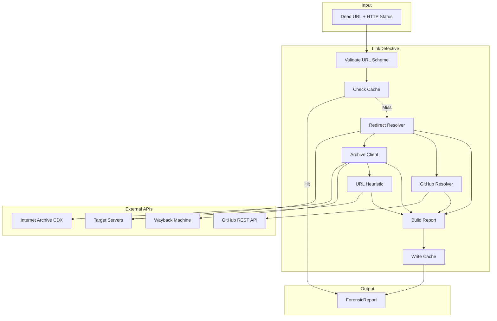

# 20 - Feature: Cheery Littlebottom — Dead Link Detective (Replacement URL Discovery)

<!-- Template Metadata
Last Updated: 2026-02-16
Updated By: LLD Generation for Issue #20
Update Reason: Fixed mechanical validation error - wiki directory does not exist
-->

## 1. Context & Goal
* **Issue:** #20
* **Objective:** Investigate confirmed dead links using archival lookups, redirect detection, URL pattern heuristics, and GitHub API queries to produce forensic reports with candidate replacement URLs ranked by confidence.
* **Status:** Draft
* **Related Issues:** #5 (state database), #7 (backoff algorithm)

### Open Questions
*All questions from requirements have been resolved.*

- [x] Search engine scraping → Resolved: No. Construct URLs programmatically from domain + title patterns.
- [x] beautifulsoup4 dependency → Resolved: Optional with regex fallback.
- [x] Similarity threshold for candidates → Resolved: ≥0.5 included; confidence classification is evaluator's job.

## 2. Proposed Changes

*This section is the **source of truth** for implementation. Describes exactly what will be built.*

### 2.1 Files Changed

| File | Change Type | Description |
|------|-------------|-------------|
| `src/gh_link_auditor/link_detective.py` | Add | Core investigation orchestrator and ForensicReport dataclass |
| `src/gh_link_auditor/archive_client.py` | Add | Internet Archive CDX API client |
| `src/gh_link_auditor/redirect_resolver.py` | Add | Redirect chain follower with SSRF protection |
| `src/gh_link_auditor/url_heuristic.py` | Add | URL pattern construction from domain + title slugification |
| `src/gh_link_auditor/github_resolver.py` | Add | GitHub API rename/transfer detection |
| `src/gh_link_auditor/similarity.py` | Add | Text similarity scoring utilities |
| `tests/unit/test_link_detective.py` | Add | Unit tests for investigation pipeline |
| `tests/unit/test_archive_client.py` | Add | Unit tests for CDX API response parsing |
| `tests/unit/test_redirect_resolver.py` | Add | Unit tests for redirect chain and SSRF blocking |
| `tests/unit/test_url_heuristic.py` | Add | Unit tests for URL pattern construction |
| `tests/unit/test_github_resolver.py` | Add | Unit tests for GitHub URL detection |
| `tests/unit/test_similarity.py` | Add | Unit tests for similarity scoring |
| `docs/design/cheery-littlebottom.md` | Add | Character and subsystem documentation |

### 2.1.1 Path Validation (Mechanical - Auto-Checked)

*Issue #277: Before human or Gemini review, paths are verified programmatically.*

Mechanical validation automatically checks:
- All "Modify" files must exist in repository
- All "Delete" files must exist in repository
- All "Add" files must have existing parent directories
- No placeholder prefixes (`src/`, `lib/`, `app/`) unless directory exists

**If validation fails, the LLD is BLOCKED before reaching review.**

### 2.2 Dependencies

*New packages, APIs, or services required.*

```toml
# pyproject.toml additions
beautifulsoup4 = { version = "^4.12", optional = true }

[project.optional-dependencies]
html = ["beautifulsoup4"]
```

**External APIs (No Cost):**
- Internet Archive CDX API: `https://web.archive.org/cdx/search/cdx`
- GitHub REST API: `https://api.github.com/repos/{owner}/{repo}`

### 2.3 Data Structures

```python
# Pseudocode - NOT implementation
from typing import TypedDict, Optional
from dataclasses import dataclass
from enum import Enum

class InvestigationMethod(Enum):
    REDIRECT_CHAIN = "redirect_chain"
    URL_MUTATION = "url_mutation"
    URL_HEURISTIC = "url_heuristic"
    GITHUB_API_REDIRECT = "github_api_redirect"
    ARCHIVE_ONLY = "archive_only"

@dataclass
class CandidateReplacement:
    url: str                           # Candidate replacement URL
    method: InvestigationMethod        # How this candidate was discovered
    similarity_score: float            # 0.0-1.0 confidence score
    verified_live: bool                # Whether URL returns 2xx

@dataclass
class Investigation:
    archive_snapshot: Optional[str]    # Wayback Machine URL or None
    archive_title: Optional[str]       # Extracted page title or None
    archive_content_summary: Optional[str]  # First 500 chars of content
    candidate_replacements: list[CandidateReplacement]  # Sorted by score desc
    investigation_log: list[str]       # Audit trail of each step

@dataclass
class ForensicReport:
    dead_url: str                      # Original dead URL
    http_status: int | str             # HTTP status code or error type
    investigation: Investigation       # Investigation results

class CDXResponse(TypedDict):
    url: str                           # Original URL
    timestamp: str                     # Archive timestamp (YYYYMMDDHHmmss)
    original: str                      # Original URL
    mimetype: str                      # Content type
    statuscode: str                    # HTTP status at capture time
    digest: str                        # Content digest
    length: str                        # Response length

class SSRFDenylistEntry(TypedDict):
    network: str                       # CIDR notation
    description: str                   # Human-readable description
```

### 2.4 Function Signatures

```python
# src/gh_link_auditor/link_detective.py
class LinkDetective:
    def __init__(self, state_db: StateDatabase, backoff: BackoffStrategy) -> None:
        """Initialize with state database for caching and backoff strategy."""
        ...
    
    def investigate(self, dead_url: str, http_status: int | str) -> ForensicReport:
        """Orchestrate investigation pipeline and return forensic report."""
        ...
    
    def _check_cache(self, dead_url: str) -> Optional[ForensicReport]:
        """Return cached report if URL was previously investigated."""
        ...
    
    def _cache_result(self, report: ForensicReport) -> None:
        """Store investigation result in state database."""
        ...

# src/gh_link_auditor/archive_client.py
class ArchiveClient:
    def __init__(self, backoff: BackoffStrategy) -> None:
        """Initialize with backoff strategy for rate limiting."""
        ...
    
    def get_latest_snapshot(self, url: str) -> Optional[CDXResponse]:
        """Query CDX API for most recent snapshot of URL."""
        ...
    
    def fetch_snapshot_content(self, snapshot_url: str) -> Optional[str]:
        """Fetch HTML content from Wayback Machine snapshot."""
        ...
    
    def extract_title(self, html: str) -> Optional[str]:
        """Extract <title> from HTML using BS4 or regex fallback."""
        ...
    
    def extract_content_summary(self, html: str, max_chars: int = 500) -> Optional[str]:
        """Extract first N chars of visible text content."""
        ...

# src/gh_link_auditor/redirect_resolver.py
class RedirectResolver:
    MAX_REDIRECTS: int = 10
    
    def __init__(self, backoff: BackoffStrategy) -> None:
        """Initialize with backoff strategy for rate limiting."""
        ...
    
    def follow_redirects(self, url: str) -> tuple[Optional[str], list[str]]:
        """Follow redirect chain, return (final_url, chain_log) or (None, log)."""
        ...
    
    def test_url_mutations(self, url: str) -> list[tuple[str, str]]:
        """Test common URL mutations, return list of (live_url, mutation_type)."""
        ...
    
    def verify_live(self, url: str) -> bool:
        """Check if URL returns 2xx status code."""
        ...
    
    def _validate_not_private_ip(self, hostname: str) -> bool:
        """Resolve hostname and validate against SSRF denylist. Raises SSRFBlocked."""
        ...

class SSRFBlocked(Exception):
    """Raised when a URL resolves to a private/reserved IP range."""
    pass

# src/gh_link_auditor/url_heuristic.py
class URLHeuristic:
    PATH_PREFIXES: list[str] = ["/docs/", "/guide/", "/getting-started/", "/tutorials/", "/blog/"]
    PATH_SWAPS: dict[str, list[str]] = {
        "/docs/": ["/documentation/"],
        "/guide/": ["/guides/"],
        "/tutorial/": ["/tutorials/"],
    }
    
    def __init__(self, backoff: BackoffStrategy) -> None:
        """Initialize with backoff strategy for rate limiting."""
        ...
    
    def generate_candidates(self, domain: str, title: str, original_path: str) -> list[str]:
        """Generate candidate URLs from domain + slugified title + path patterns."""
        ...
    
    def probe_candidates(self, candidates: list[str], max_results: int = 3) -> list[str]:
        """Probe candidates for liveness, return up to max_results live URLs."""
        ...
    
    def slugify(self, title: str) -> str:
        """Convert title to kebab-case slug."""
        ...
    
    def _generate_version_variants(self, path: str) -> list[str]:
        """Generate /v1/ -> /v2/, /v3/, /latest/ variants."""
        ...

# src/gh_link_auditor/github_resolver.py
class GitHubResolver:
    GITHUB_DOMAINS: set[str] = {"github.com", "raw.githubusercontent.com"}
    
    def __init__(self, backoff: BackoffStrategy, token: Optional[str] = None) -> None:
        """Initialize with backoff strategy and optional auth token."""
        ...
    
    def is_github_url(self, url: str) -> bool:
        """Check if URL is a GitHub URL."""
        ...
    
    def resolve_repo_redirect(self, owner: str, repo: str) -> Optional[str]:
        """Query GitHub API to detect repo rename/transfer."""
        ...
    
    def reconstruct_file_url(self, original_url: str, new_repo_url: str) -> str:
        """Reconstruct full file URL from new repo location."""
        ...
    
    def _parse_github_url(self, url: str) -> tuple[str, str, Optional[str]]:
        """Parse GitHub URL into (owner, repo, file_path)."""
        ...

# src/gh_link_auditor/similarity.py
def compute_similarity(text_a: str, text_b: str) -> float:
    """Compute text similarity score (0.0-1.0) using SequenceMatcher."""
    ...

def normalize_text(text: str) -> str:
    """Normalize text for comparison (lowercase, strip whitespace, etc.)."""
    ...
```

### 2.5 Logic Flow (Pseudocode)

```
INVESTIGATE(dead_url, http_status):
    1. Validate URL scheme (must be http/https)
       IF invalid scheme THEN raise ValueError
    
    2. Check cache for previous investigation
       IF cached THEN return cached_report
    
    3. Initialize investigation_log = []
    
    4. REDIRECT DETECTION (highest priority):
       TRY:
           (final_url, chain_log) = follow_redirects(dead_url)
           investigation_log.extend(chain_log)
           IF final_url AND verify_live(final_url) THEN
               candidate = CandidateReplacement(
                   url=final_url,
                   method=REDIRECT_CHAIN,
                   similarity=0.98,
                   verified_live=True
               )
               IF similarity >= 0.95 THEN
                   RETURN early with this candidate (short-circuit)
       EXCEPT SSRFBlocked:
           investigation_log.append("SSRF blocked: {url}")
    
    5. URL MUTATIONS:
       mutations = test_url_mutations(dead_url)
       FOR (live_url, mutation_type) IN mutations:
           candidates.append(CandidateReplacement(
               url=live_url,
               method=URL_MUTATION,
               similarity=0.90,
               verified_live=True
           ))
    
    6. ARCHIVE LOOKUP:
       snapshot = archive_client.get_latest_snapshot(dead_url)
       IF snapshot THEN
           html = archive_client.fetch_snapshot_content(snapshot.url)
           archive_title = extract_title(html)
           archive_summary = extract_content_summary(html)
           investigation_log.append(f"Archive found: {snapshot.timestamp}")
       ELSE
           investigation_log.append("No archive snapshot found")
           archive_title = None
           archive_summary = None
    
    7. URL PATTERN HEURISTICS (requires archive title):
       IF archive_title THEN
           domain = extract_domain(dead_url)
           original_path = extract_path(dead_url)
           candidate_urls = url_heuristic.generate_candidates(
               domain, archive_title, original_path
           )
           live_urls = url_heuristic.probe_candidates(candidate_urls, max=3)
           FOR url IN live_urls:
               page_content = fetch_content(url)
               similarity = compute_similarity(archive_summary, page_content)
               IF similarity >= 0.5 THEN
                   candidates.append(CandidateReplacement(
                       url=url,
                       method=URL_HEURISTIC,
                       similarity=similarity,
                       verified_live=True
                   ))
    
    8. GITHUB-SPECIFIC RESOLUTION:
       IF github_resolver.is_github_url(dead_url) THEN
           (owner, repo, file_path) = parse_github_url(dead_url)
           new_repo_url = github_resolver.resolve_repo_redirect(owner, repo)
           IF new_repo_url THEN
               new_file_url = reconstruct_file_url(dead_url, new_repo_url)
               IF verify_live(new_file_url) THEN
                   candidates.append(CandidateReplacement(
                       url=new_file_url,
                       method=GITHUB_API_REDIRECT,
                       similarity=1.0,
                       verified_live=True
                   ))
    
    9. IF snapshot exists BUT no live candidates THEN
       candidates.append(CandidateReplacement(
           url=snapshot_url,
           method=ARCHIVE_ONLY,
           similarity=0.0,
           verified_live=False
       ))
    
    10. Sort candidates by similarity_score DESC
    
    11. Build ForensicReport with all data
    
    12. Cache report in state database
    
    13. RETURN report
```

### 2.6 Technical Approach

* **Module:** `src/gh_link_auditor/link_detective.py` as orchestrator
* **Pattern:** Pipeline pattern with early exit on high-confidence match
* **Key Decisions:**
  - Pre-connection SSRF validation using `socket.getaddrinfo()` before any socket opens
  - Optional BeautifulSoup4 with regex fallback for zero mandatory dependencies
  - State database caching to avoid redundant external requests
  - Backoff algorithm integration from #7 for all HTTP requests

### 2.7 Architecture Decisions

| Decision | Options Considered | Choice | Rationale |
|----------|-------------------|--------|-----------|
| SSRF Protection Timing | Post-redirect validation, Pre-connection validation | Pre-connection validation | Must block before socket opens per security requirements |
| HTML Parsing | BS4 required, BS4 optional, regex only | BS4 optional with regex fallback | Balances capability with minimal dependencies |
| Candidate URL Generation | Search engine scraping, Programmatic construction | Programmatic construction | Avoids ToS issues, no external search dependency |
| Similarity Algorithm | ML-based, difflib.SequenceMatcher | difflib.SequenceMatcher | Stdlib, no dependencies, sufficient for MVP |
| Caching Strategy | In-memory, File-based, State database | State database (#5) | Persistent, integrates with existing infrastructure |

**Architectural Constraints:**
- Must use state database from #5 for caching
- Must use backoff algorithm from #7 for rate limiting
- Budget: $0 / Free tier API usage only
- No search engine scraping

## 3. Requirements

*What must be true when this is done. These become acceptance criteria.*

1. `LinkDetective.investigate()` returns a complete `ForensicReport` for every input URL
2. Archive snapshots are retrieved from Internet Archive CDX API when available
3. Redirect chains (301/302/307/308) are followed up to 10 hops with SSRF protection
4. GitHub repository renames/transfers are detected via GitHub API
5. URL pattern heuristics construct candidates from domain + slugified title (no search engines)
6. All external HTTP requests use the backoff algorithm from #7
7. Investigation results are cached in the state database from #5
8. SSRF protection validates IP addresses before socket connection for every hop
9. Non-HTTP(S) URL schemes are rejected with `ValueError`
10. Candidates are sorted by similarity score descending

## 4. Alternatives Considered

| Option | Pros | Cons | Decision |
|--------|------|------|----------|
| Search engine integration for URL discovery | Higher recall for moved content | ToS violations, API costs, complexity | **Rejected** |
| ML-based similarity (sentence transformers) | Better semantic matching | Heavy dependency, complexity, cost | **Rejected** |
| BeautifulSoup4 as required dependency | Reliable HTML parsing | Adds mandatory dependency | **Rejected** |
| Programmatic URL construction + difflib | Zero cost, stdlib, ToS compliant | Lower recall than search | **Selected** |
| Post-connection SSRF validation | Simpler implementation | Security risk - connection already made | **Rejected** |
| Pre-connection SSRF validation | Blocks before any socket opens | More complex | **Selected** |

**Rationale:** 
- Programmatic URL construction avoids legal/ToS issues with search engines
- difflib is stdlib and sufficient for MVP; ML similarity can be added later
- Pre-connection SSRF validation is required by security specifications

## 5. Data & Fixtures

*Per [0108-lld-pre-implementation-review.md](0108-lld-pre-implementation-review.md) - complete this section BEFORE implementation.*

### 5.1 Data Sources

| Attribute | Value |
|-----------|-------|
| Source | Internet Archive CDX API, GitHub REST API, Dead URLs from scanner |
| Format | CDX response (space-separated values), GitHub JSON API responses, HTTP responses |
| Size | Variable - typically 1-50 dead URLs per scan batch |
| Refresh | On-demand per investigation |
| Copyright/License | Internet Archive: Public API, GitHub: Public API with rate limits |

### 5.2 Data Pipeline

```
Dead URL ──investigate()──► ForensicReport ──cache──► State Database
     │
     ├──► Archive Client ──CDX API──► Wayback Machine
     ├──► Redirect Resolver ──HTTP──► Target Servers
     ├──► URL Heuristic ──HTTP──► Candidate URLs
     └──► GitHub Resolver ──API──► GitHub
```

### 5.3 Test Fixtures

| Fixture | Source | Notes |
|---------|--------|-------|
| CDX API responses | Generated | Mock valid/empty/error responses |
| Archived HTML pages | Generated | Sample HTML with title tags |
| Redirect chains | Generated | Mock 301/302/307/308 responses |
| GitHub API responses | Generated | Mock 301 redirect with new location |
| SSRF test hostnames | Generated | Hostnames resolving to private IPs |

### 5.4 Deployment Pipeline

Investigation results are stored locally in the state database. No external deployment of data.

**External API Usage:**
- Internet Archive CDX API: No API key required, rate-limited by backoff
- GitHub API: Optional `GITHUB_TOKEN` env var for higher rate limits

## 6. Diagram

### 6.1 Mermaid Quality Gate

Before finalizing any diagram, verify in [Mermaid Live Editor](https://mermaid.live) or GitHub preview:

- [x] **Simplicity:** Similar components collapsed (per 0006 §8.1)
- [x] **No touching:** All elements have visual separation (per 0006 §8.2)
- [x] **No hidden lines:** All arrows fully visible (per 0006 §8.3)
- [x] **Readable:** Labels not truncated, flow direction clear
- [ ] **Auto-inspected:** Agent rendered via mermaid.ink and viewed (per 0006 §8.5)

**Agent Auto-Inspection (MANDATORY):**

AI agents MUST render and view the diagram before committing:
1. Base64 encode diagram → fetch PNG from `https://mermaid.ink/img/{base64}`
2. Read the PNG file (multimodal inspection)
3. Document results below

**Auto-Inspection Results:**
```
- Touching elements: [ ] None / [ ] Found: ___
- Hidden lines: [ ] None / [ ] Found: ___
- Label readability: [ ] Pass / [ ] Issue: ___
- Flow clarity: [ ] Clear / [ ] Issue: ___
```

*Reference: [0006-mermaid-diagrams.md](0006-mermaid-diagrams.md)*

### 6.2 Diagram



## 7. Security & Safety Considerations

### 7.1 Security

| Concern | Mitigation | Status |
|---------|------------|--------|
| SSRF via redirect chains | Pre-connection IP validation against denylist | Addressed |
| SSRF via URL heuristics | Same pre-connection validation for all requests | Addressed |
| URL injection in API queries | URL validation and proper encoding | Addressed |
| Non-HTTP scheme attacks | Reject non-http/https schemes with ValueError | Addressed |
| GitHub token exposure | Read from env only, never logged or in reports | Addressed |

**SSRF Denylist (validated before socket connection):**
- `127.0.0.0/8` - Loopback
- `10.0.0.0/8` - Private Class A
- `172.16.0.0/12` - Private Class B
- `192.168.0.0/16` - Private Class C
- `169.254.0.0/16` - Link-local
- `::1/128` - IPv6 loopback
- `fc00::/7` - IPv6 unique local

### 7.2 Safety

| Concern | Mitigation | Status |
|---------|------------|--------|
| Runaway redirect loops | Max 10 redirects limit | Addressed |
| External API rate limiting | Backoff algorithm from #7 | Addressed |
| Resource exhaustion | Max 3 heuristic candidates, content summary limited to 500 chars | Addressed |
| Cache corruption | State database handles atomicity | Addressed |

**Fail Mode:** Fail Open - Investigation failures produce report with empty candidates and documented failure in investigation_log. Scanner continues processing other links.

**Recovery Strategy:** 
- Failed investigations can be retried by clearing cache entry
- Investigation log provides audit trail for debugging
- No state modification of source files (read-only investigation)

## 8. Performance & Cost Considerations

### 8.1 Performance

| Metric | Budget | Approach |
|--------|--------|----------|
| Investigation latency | < 30s per URL | Early exit on high-confidence redirect |
| Memory | < 50MB per batch | Stream content, limit summaries to 500 chars |
| API calls per URL | ≤ 6 (1 CDX + 1 snapshot + 3 heuristics + 1 GitHub) | Short-circuit on redirect match |

**Bottlenecks:**
- Internet Archive CDX API can be slow (2-5s per request)
- GitHub API rate limits (60/hr unauthenticated, 5000/hr authenticated)
- Candidate URL probing is sequential (but limited to 3)

### 8.2 Cost Analysis

| Resource | Unit Cost | Estimated Usage | Monthly Cost |
|----------|-----------|-----------------|--------------|
| Internet Archive API | $0 (free public API) | ~1000 queries | $0 |
| GitHub API | $0 (free tier) | ~500 queries | $0 |
| Compute | Local | N/A | $0 |
| Storage | Local state DB | ~10MB | $0 |

**Cost Controls:**
- [x] Budget constraint: $0 / Free tier only (per requirements)
- [x] Rate limiting via backoff algorithm prevents API abuse
- [x] Caching prevents redundant requests

**Worst-Case Scenario:** 
- 10x usage: Still within free tier limits
- 100x usage: May hit GitHub unauthenticated rate limit; use GITHUB_TOKEN for 5000/hr

## 9. Legal & Compliance

| Concern | Applies? | Mitigation |
|---------|----------|------------|
| PII/Personal Data | No | Dead URLs from documentation are not personal data |
| Third-Party Licenses | Yes | Internet Archive CDX API (public), GitHub API (standard ToS) |
| Terms of Service | Yes | Respecting rate limits via backoff; no scraping |
| Data Retention | No | Cached results can be regenerated; no retention policy needed |
| Export Controls | No | No restricted algorithms or data |

**Data Classification:** Internal (investigation results are operational data)

**Compliance Checklist:**
- [x] No PII stored without consent
- [x] All third-party licenses compatible with project license
- [x] External API usage compliant with provider ToS
- [x] Data retention policy documented (N/A - regenerable cache)

## 10. Verification & Testing

*Ref: [0005-testing-strategy-and-protocols.md](0005-testing-strategy-and-protocols.md)*

**Testing Philosophy:** Strive for 100% automated test coverage. All external HTTP calls mocked in unit tests.

### 10.0 Test Plan (TDD - Complete Before Implementation)

**TDD Requirement:** Tests MUST be written and failing BEFORE implementation begins.

| Test ID | Test Description | Expected Behavior | Status |
|---------|------------------|-------------------|--------|
| T010 | test_investigate_returns_forensic_report | Returns ForensicReport with all required fields | RED |
| T020 | test_archive_hit_extracts_title | archive_title populated from archived HTML | RED |
| T030 | test_archive_miss_continues | Investigation continues when no archive | RED |
| T040 | test_redirect_chain_detected | redirect_chain candidate with verified_live | RED |
| T050 | test_ssrf_blocked_before_connection | urlopen never called for private IPs | RED |
| T060 | test_github_rename_detected | github_api_redirect candidate produced | RED |
| T070 | test_url_heuristic_slugification | Candidates include slugified title paths | RED |
| T080 | test_url_heuristic_max_three | Maximum 3 heuristic candidates returned | RED |
| T090 | test_no_search_engine_queries | No requests to search engine domains | RED |
| T100 | test_cache_hit_no_external_calls | Second call uses cache, no HTTP | RED |
| T110 | test_rate_limit_backoff | 429 response triggers backoff retry | RED |
| T120 | test_invalid_scheme_rejected | Non-HTTP scheme raises ValueError | RED |
| T130 | test_candidates_sorted_by_score | Candidates in descending similarity order | RED |
| T140 | test_no_candidates_returns_empty | Empty candidates array when nothing found | RED |

**Coverage Target:** ≥95% for all new code

**TDD Checklist:**
- [ ] All tests written before implementation
- [ ] Tests currently RED (failing)
- [ ] Test IDs match scenario IDs in 10.1
- [ ] Test files created at: `tests/unit/test_*.py`

### 10.1 Test Scenarios

| ID | Scenario | Type | Input | Expected Output | Pass Criteria |
|----|----------|------|-------|-----------------|---------------|
| 010 | Happy path - redirect found | Auto | URL with 301 redirect | ForensicReport with redirect_chain candidate | candidate.method == REDIRECT_CHAIN, verified_live == True |
| 020 | Archive hit with title extraction | Auto | URL with CDX snapshot | archive_title extracted from HTML | archive_title == mocked title value |
| 030 | Archive miss continues investigation | Auto | URL with no CDX results | Empty archive fields, investigation continues | investigation_log shows "No archive snapshot found" |
| 040 | SSRF blocking - private IP | Auto | Redirect to 127.0.0.1 | Connection blocked before socket opens | urlopen call_count == 0 for blocked URL, log contains "SSRF blocked" |
| 050 | SSRF blocking - 10.x.x.x | Auto | Redirect to 10.0.0.1 | Connection blocked | Same as 040 |
| 060 | SSRF blocking - 192.168.x.x | Auto | Redirect to 192.168.1.1 | Connection blocked | Same as 040 |
| 070 | GitHub repo rename | Auto | github.com/old/repo 404 | github_api_redirect candidate | candidate.similarity == 1.0 |
| 080 | URL heuristic - title slugification | Auto | Archive title "Installation Guide" | Candidates include /installation-guide paths | At least one candidate with slugified title |
| 090 | URL heuristic - max 3 results | Auto | 5 live candidate URLs | Only 3 returned | len(candidates) <= 3 |
| 100 | No search engine queries | Auto | Any dead URL | No requests to google/bing | Mock call log contains no search domains |
| 110 | Cache hit on second call | Auto | Same URL twice | Second call no external HTTP | Mock call count same after second call |
| 120 | Rate limit with backoff | Auto | 429 then 200 response | Successful after retry | Final response is 200, backoff applied |
| 130 | Invalid scheme rejected | Auto | ftp://example.com | ValueError raised | Exception type is ValueError |
| 140 | Candidates sorted by score | Auto | Multiple candidates | Descending similarity order | candidates[0].similarity >= candidates[1].similarity |
| 150 | Empty candidates when nothing found | Auto | URL with no matches | Empty candidates array | len(candidates) == 0, investigation_log not empty |
| 160 | Similarity score computation | Auto | Two similar texts | Score between 0.0-1.0 | 0.0 <= score <= 1.0 |
| 170 | URL mutation detection | Auto | URL with /v1/ path | Tests /v2/, /v3/ variants | mutations tested and logged |

### 10.2 Test Commands

```bash
# Run all automated tests
poetry run pytest tests/unit/test_link_detective.py tests/unit/test_archive_client.py tests/unit/test_redirect_resolver.py tests/unit/test_url_heuristic.py tests/unit/test_github_resolver.py tests/unit/test_similarity.py -v

# Run only link detective tests
poetry run pytest tests/unit/test_link_detective.py -v

# Run with coverage
poetry run pytest tests/unit/test_link_detective.py tests/unit/test_archive_client.py tests/unit/test_redirect_resolver.py tests/unit/test_url_heuristic.py tests/unit/test_github_resolver.py tests/unit/test_similarity.py -v --cov=src --cov-report=term-missing
```

### 10.3 Manual Tests (Only If Unavoidable)

**N/A - All scenarios automated.**

All external HTTP calls are mocked using `unittest.mock.patch` on `urllib.request.urlopen`. No real network requests are made during testing.

## 11. Risks & Mitigations

| Risk | Impact | Likelihood | Mitigation |
|------|--------|------------|------------|
| Internet Archive API downtime | Med | Low | Graceful degradation; continue investigation with other methods |
| GitHub API rate limiting | Low | Med | Use GITHUB_TOKEN env var; backoff algorithm handles 429s |
| False positive candidates | Low | Med | Similarity threshold (≥0.5) filters low-quality matches |
| SSRF bypass via DNS rebinding | High | Low | Resolve and validate IP immediately before each connection |
| BeautifulSoup4 not installed | Low | Med | Regex fallback for title extraction documented |

## 12. Definition of Done

### Code
- [ ] Implementation complete and linted
- [ ] Code comments reference this LLD

### Tests
- [ ] All test scenarios pass
- [ ] Test coverage ≥95% for new code

### Documentation
- [ ] LLD updated with any deviations
- [ ] Implementation Report (0103) completed
- [ ] Test Report (0113) completed if applicable
- [ ] `docs/design/cheery-littlebottom.md` created

### Review
- [ ] Code review completed
- [ ] User approval before closing issue

### 12.1 Traceability (Mechanical - Auto-Checked)

*Issue #277: Cross-references are verified programmatically.*

Mechanical validation automatically checks:
- Every file mentioned in this section must appear in Section 2.1
- Every risk mitigation in Section 11 should have a corresponding function in Section 2.4 (warning if not)

**Traceability Matrix:**

| Risk Mitigation | Corresponding Function |
|-----------------|----------------------|
| Graceful degradation | `LinkDetective.investigate()` - try/except blocks |
| Backoff algorithm | All clients use `BackoffStrategy` from #7 |
| Similarity threshold | `compute_similarity()` in `similarity.py` |
| SSRF pre-connection validation | `_validate_not_private_ip()` in `redirect_resolver.py` |
| Regex fallback | `extract_title()` in `archive_client.py` |

**If files are missing from Section 2.1, the LLD is BLOCKED.**

---

## Appendix: Review Log

*Track all review feedback with timestamps and implementation status.*

### Review Summary

| Review | Date | Verdict | Key Issue |
|--------|------|---------|-----------|
| (pending) | (auto) | (pending) | Initial LLD creation |

**Final Status:** PENDING

---

*"The thing about forensic evidence is that it doesn't lie. It just sits there until someone smart enough comes along to read it."*
— paraphrasing the spirit of **Cheery Littlebottom**, Ankh-Morpork City Watch