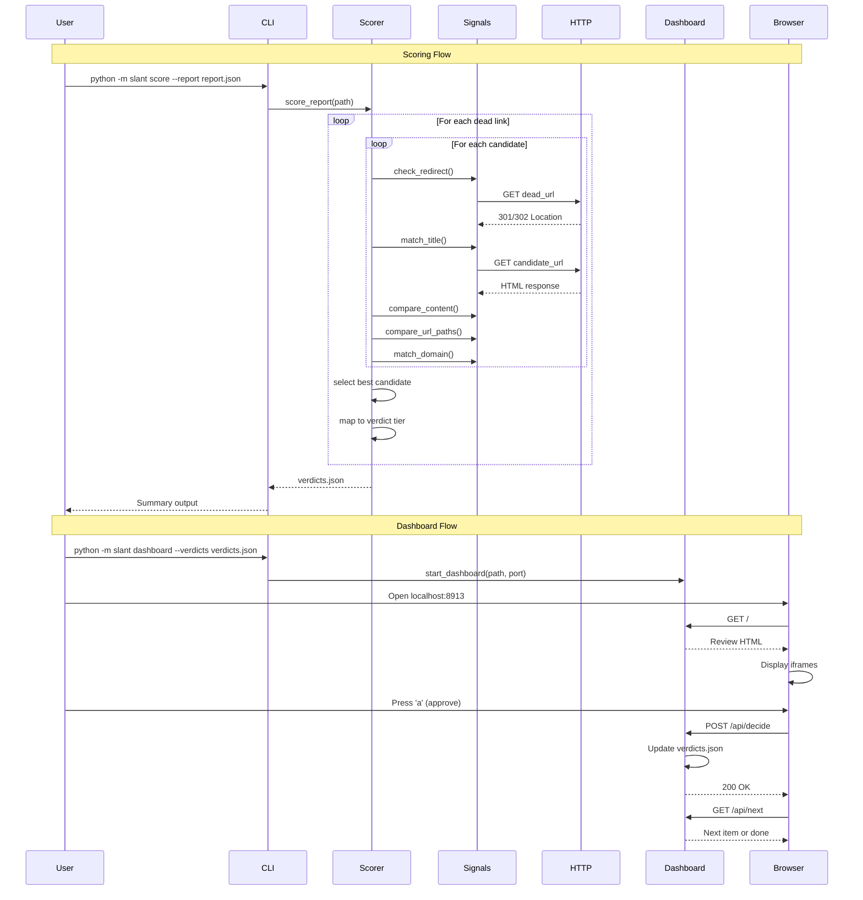

# 21 - Feature: Mr. Slant — Scoring Engine & HITL Dashboard

## 1. Context & Goal
* **Issue:** #21
* **Objective:** Implement a scoring engine that evaluates candidate replacement URLs against 5 weighted signals and provide a human-in-the-loop dashboard for reviewing uncertain matches.
* **Status:** Approved (gemini-3-pro-preview, 2026-02-16)
* **Related Issues:** None (first judge module; Cheery's report format defined by interface contract)

### Open Questions
*All questions resolved during requirements phase.*

## 2. Proposed Changes

*This section is the **source of truth** for implementation. Describe exactly what will be built.*

### 2.1 Files Changed

| File | Change Type | Description |
|------|-------------|-------------|
| `src/slant/` | Add (Directory) | New package directory for scoring engine |
| `src/slant/__init__.py` | Add | Package init with version and exports |
| `src/slant/__main__.py` | Add | CLI entry point for `python -m slant` |
| `src/slant/cli.py` | Add | Argument parsing for `score` and `dashboard` subcommands |
| `src/slant/config.py` | Add | Configurable signal weights with defaults |
| `src/slant/scorer.py` | Add | Main scoring engine: loads report, iterates candidates, computes verdicts |
| `src/slant/models.py` | Add | Verdict dataclass/TypedDict definitions |
| `src/slant/signals/` | Add (Directory) | Signals subpackage directory |
| `src/slant/signals/__init__.py` | Add | Signals subpackage init |
| `src/slant/signals/redirect.py` | Add | HTTP redirect detection signal |
| `src/slant/signals/title.py` | Add | Title fuzzy match signal |
| `src/slant/signals/content.py` | Add | Content similarity signal |
| `src/slant/signals/url_path.py` | Add | URL path similarity signal |
| `src/slant/signals/domain.py` | Add | Domain match signal |
| `src/slant/dashboard.py` | Add | HITL dashboard HTTP server with inline HTML/CSS/JS |
| `tests/unit/test_scorer.py` | Add | Unit tests for scoring engine |
| `tests/unit/test_signals.py` | Add | Unit tests for individual signal modules |
| `tests/unit/test_dashboard.py` | Add | Unit tests for dashboard API endpoints |
| `tests/fixtures/sample_forensic_report.json` | Add | Test fixture: Cheery's forensic report |
| `tests/fixtures/expected_verdicts.json` | Add | Test fixture: expected verdict output |
| `docs/reports/active/21/` | Add (Directory) | Report directory for issue 21 |
| `docs/reports/active/21/implementation-report.md` | Add | Implementation report |
| `docs/reports/active/21/test-report.md` | Add | Test report |

### 2.1.1 Path Validation (Mechanical - Auto-Checked)

*Issue #277: Before human or Gemini review, paths are verified programmatically.*

Mechanical validation automatically checks:
- All "Add" files have valid parent directories
- No placeholder prefixes used

**Parent directories to create:**
- `src/slant/` (Add Directory)
- `src/slant/signals/` (Add Directory)
- `docs/reports/active/21/` (Add Directory)

**Existing directories used:**
- `tests/unit/` (exists)
- `tests/fixtures/` (exists)

### 2.2 Dependencies

*New packages, APIs, or services required.*

```toml
# pyproject.toml additions
# No new dependencies - uses stdlib only
# requests already in project dependencies
```

**Standard Library Usage:**
- `http.server` - Dashboard HTTP server
- `difflib.SequenceMatcher` - Fuzzy string matching
- `urllib.parse` - URL parsing
- `json` - Data serialization
- `pathlib` - Path handling
- `argparse` - CLI argument parsing
- `html` - HTML escaping for XSS prevention
- `re` - HTML tag stripping

**Existing Dependency:**
- `requests` - HTTP requests for redirect/content checks

### 2.3 Data Structures

```python
# Pseudocode - NOT implementation

class SignalScore(TypedDict):
    """Individual signal score with metadata."""
    signal_name: str       # e.g., "redirect", "title_match"
    raw_score: float       # 0.0-1.0 ratio
    weighted_score: float  # After weight applied
    weight: int            # Weight used (e.g., 40)

class ScoringBreakdown(TypedDict):
    """All 5 signal scores for a candidate."""
    redirect: float          # 0-40 (weighted)
    title_match: float       # 0-25 (weighted)
    content_similarity: float # 0-20 (weighted)
    url_similarity: float    # 0-10 (weighted)
    domain_match: float      # 0-5 (weighted)

class Verdict(TypedDict):
    """Verdict for a single dead link."""
    dead_url: str                    # Original dead URL
    verdict: str                     # AUTO-APPROVE | HUMAN-REVIEW | LOW-CONFIDENCE | INSUFFICIENT
    confidence: int                  # 0-100 composite score
    replacement_url: Optional[str]   # Best candidate URL or null
    scoring_breakdown: ScoringBreakdown
    human_decision: Optional[str]    # null | "auto" | "approved" | "rejected" | "abandoned" | "keep_looking"
    decided_at: Optional[str]        # ISO 8601 timestamp or null

class VerdictsFile(TypedDict):
    """Root structure of verdicts.json."""
    generated_at: str      # ISO 8601 timestamp
    source_report: str     # Path to forensic report
    verdicts: List[Verdict]

class SignalWeights(TypedDict):
    """Configurable signal weights."""
    redirect: int          # Default: 40
    title: int             # Default: 25
    content: int           # Default: 20
    url_path: int          # Default: 10
    domain: int            # Default: 5

class ForensicReportEntry(TypedDict):
    """Single dead link from Cheery's report (input format)."""
    dead_url: str
    archived_url: str              # Wayback Machine URL
    archived_title: str
    archived_content: str          # Plain text content
    investigation_method: str
    candidates: List[CandidateEntry]

class CandidateEntry(TypedDict):
    """Candidate replacement URL from forensic report."""
    url: str
    source: str            # e.g., "wayback_redirect", "search", "domain_crawl"
```

### 2.4 Function Signatures

```python
# src/slant/config.py
def get_default_weights() -> SignalWeights:
    """Return default signal weights (redirect=40, title=25, content=20, url_path=10, domain=5)."""
    ...

def load_weights(config_path: Optional[Path] = None) -> SignalWeights:
    """Load weights from config file or return defaults."""
    ...

# src/slant/scorer.py
def score_report(report_path: Path, weights: Optional[SignalWeights] = None) -> VerdictsFile:
    """Load forensic report and produce verdicts for all dead links."""
    ...

def score_dead_link(entry: ForensicReportEntry, weights: SignalWeights) -> Verdict:
    """Score all candidates for a single dead link and return best verdict."""
    ...

def score_candidate(dead_url: str, candidate: CandidateEntry, archived_title: str, 
                    archived_content: str, weights: SignalWeights) -> Tuple[float, ScoringBreakdown]:
    """Compute composite score and breakdown for a single candidate."""
    ...

def map_confidence_to_tier(confidence: int) -> str:
    """Map 0-100 score to verdict tier (AUTO-APPROVE, HUMAN-REVIEW, LOW-CONFIDENCE, INSUFFICIENT)."""
    ...

def write_verdicts(verdicts: VerdictsFile, output_path: Path) -> None:
    """Write verdicts to JSON file with validation. Uses atomic write via temp file + rename."""
    ...

# src/slant/signals/redirect.py
def check_redirect(dead_url: str, candidate_url: str, timeout: float = 10.0) -> float:
    """Check if dead URL redirects to candidate. Returns 0.0-1.0 ratio. Returns 0.0 on timeout/error."""
    ...

# src/slant/signals/title.py
def match_title(candidate_url: str, archived_title: str, timeout: float = 10.0) -> float:
    """Fetch candidate page title, compare to archived. Returns 0.0-1.0 ratio."""
    ...

def extract_title(html: str) -> str:
    """Extract <title> text from HTML."""
    ...

# src/slant/signals/content.py
def compare_content(candidate_url: str, archived_content: str, timeout: float = 10.0) -> float:
    """Fetch candidate, strip HTML, compare to archived content. Returns 0.0-1.0 ratio. Returns 0.0 on error."""
    ...

def strip_html(html: str) -> str:
    """Remove HTML tags, return plain text."""
    ...

# src/slant/signals/url_path.py
def compare_url_paths(dead_url: str, candidate_url: str) -> float:
    """Compare URL path components. Returns 0.0-1.0 ratio."""
    ...

# src/slant/signals/domain.py
def match_domain(dead_url: str, candidate_url: str) -> float:
    """Compare domains. Returns 1.0 for exact match, 0.0 otherwise."""
    ...

# src/slant/dashboard.py
def start_dashboard(verdicts_path: Path, port: int = 8913) -> None:
    """Start HITL dashboard HTTP server."""
    ...

class SlantRequestHandler(BaseHTTPRequestHandler):
    """HTTP request handler for dashboard."""
    
    def do_GET(self) -> None:
        """Handle GET requests (/, /api/next)."""
        ...
    
    def do_POST(self) -> None:
        """Handle POST requests (/api/decide)."""
        ...

def render_dashboard_html(verdict: Verdict) -> str:
    """Generate dashboard HTML for a single review item. Displays fallback text when iframe fails."""
    ...

def render_summary_html(verdicts: VerdictsFile) -> str:
    """Generate summary HTML when all items decided."""
    ...

def validate_decision(decision: str) -> bool:
    """Validate decision value against allowed set."""
    ...

def update_verdict_file(verdicts_path: Path, dead_url: str, decision: str) -> None:
    """Update verdict in file with human decision and timestamp. Uses atomic write."""
    ...

# src/slant/cli.py
def main() -> int:
    """Main CLI entry point."""
    ...

def cmd_score(args: argparse.Namespace) -> int:
    """Handle 'score' subcommand."""
    ...

def cmd_dashboard(args: argparse.Namespace) -> int:
    """Handle 'dashboard' subcommand."""
    ...
```

### 2.5 Logic Flow (Pseudocode)

**Scoring Engine Flow:**
```
1. Load forensic report JSON from --report path
2. Validate report structure (must have dead_links array)
3. Initialize weights from config (or use defaults)
4. FOR each dead_link in report:
   a. IF candidates array is empty:
      - Create INSUFFICIENT verdict with confidence=0, replacement_url=null
   b. ELSE:
      - FOR each candidate:
        i. Compute redirect signal (0-40)
        ii. Compute title match signal (0-25)
        iii. Compute content similarity signal (0-20)
        iv. Compute URL path signal (0-10)
        v. Compute domain match signal (0-5)
        vi. Sum to composite score (0-100)
      - Select candidate with highest score
      - Map score to tier (AUTO-APPROVE ≥95, HUMAN-REVIEW 75-94, LOW-CONFIDENCE 50-74, INSUFFICIENT <50)
      - IF AUTO-APPROVE:
        - Set human_decision="auto", decided_at=now()
      - ELSE:
        - Set human_decision=null, decided_at=null
   c. Append verdict to results
5. Write verdicts.json with timestamp and source path
6. Print summary (counts per tier)
7. Return 0 on success
```

**Dashboard Flow:**
```
1. Load verdicts.json from --verdicts path
2. Validate verdicts structure
3. Start HTTPServer on 127.0.0.1:PORT
4. LOOP (handle requests):
   a. GET /: 
      - Find first verdict where human_decision is null
      - IF found: render review HTML
      - ELSE: render summary HTML
   b. GET /api/next:
      - Return JSON with next undecided verdict or {done: true}
   c. POST /api/decide:
      - Parse JSON body
      - Validate decision in [approved, rejected, abandoned, keep_looking]
      - IF invalid: return 400 with error
      - Update verdict in file (human_decision, decided_at)
      - Return 200 OK
5. On SIGINT: shutdown gracefully
```

**Redirect Signal Flow:**
```
1. Send GET to dead_url with allow_redirects=False, timeout=10s
2. IF timeout or connection error: return 0.0
3. IF response.status_code in [301, 302, 303, 307, 308]:
   a. Get Location header
   b. IF Location matches candidate_url (normalized): return 1.0
   c. ELSE: follow redirect, recurse (max 5 hops)
4. ELSE: return 0.0
```

**Title Match Signal Flow:**
```
1. Send GET to candidate_url with timeout=10s
2. IF timeout or error: return 0.0
3. Extract <title> from HTML
4. Normalize both titles (lowercase, strip whitespace)
5. Return SequenceMatcher.ratio(archived_title, candidate_title)
```

**Content Similarity Signal Flow:**
```
1. Send GET to candidate_url with timeout=10s
2. IF timeout or error: return 0.0
3. Strip HTML tags from response
4. Return SequenceMatcher.ratio(archived_content, candidate_content)
```

### 2.6 Technical Approach

* **Module:** `src/slant/`
* **Pattern:** Signal-based scoring with weighted aggregation; single-file dashboard server
* **Key Decisions:**
  - Pure Python with stdlib where possible (no Flask/FastAPI overhead for simple dashboard)
  - Signals as separate modules for testability and future extensibility
  - JSON file storage for verdicts (SQLite deferred to future)
  - Polling over WebSocket for simplicity in single-user local scenario
  - Inline HTML/CSS/JS to avoid static file serving complexity

### 2.7 Architecture Decisions

| Decision | Options Considered | Choice | Rationale |
|----------|-------------------|--------|-----------|
| Dashboard framework | Flask, FastAPI, http.server | `http.server` | Single-file simplicity, no dependencies, sufficient for localhost single-user |
| State storage | SQLite, JSON file, in-memory | JSON file | Simple persistence, human-readable, no schema migrations needed |
| Real-time updates | WebSocket, SSE, Polling | Polling (500ms) | Simplicity; WebSocket adds complexity with no benefit for local single-user |
| Signal weights | Hardcoded, env vars, config file | Config file with defaults | Allows tuning without code changes; env vars are awkward for 5 values |
| HTML rendering | Template engine (Jinja), inline | Inline | Avoids dependency; dashboard HTML is static enough to inline |

**Architectural Constraints:**
- Must integrate downstream of Cheery's forensic report output
- Dashboard binds to localhost only (no network exposure)
- No destructive operations (verdict writing is the only mutation)

## 3. Requirements

*What must be true when this is done. These become acceptance criteria.*

1. Scoring engine loads Cheery's forensic report JSON and produces one verdict per dead link
2. Each verdict contains: `dead_url`, `verdict`, `confidence` (0-100), `replacement_url`, `scoring_breakdown`, `human_decision`, `decided_at`
3. Five signals computed: redirect (40), title_match (25), content_similarity (20), url_similarity (10), domain_match (5)
4. Confidence tiers: ≥95 AUTO-APPROVE, 75-94 HUMAN-REVIEW, 50-74 LOW-CONFIDENCE, <50 INSUFFICIENT
5. AUTO-APPROVE verdicts have `human_decision: "auto"` and valid `decided_at` timestamp
6. Zero candidates produce INSUFFICIENT verdict with confidence 0
7. HTTP requests rate-limited to 1 request/second per domain
8. Dashboard serves on localhost:8913 (configurable port)
9. Dashboard displays side-by-side iframes (Archive left, candidate right)
10. Keyboard shortcuts work: a=approve, r=reject, x=abandon, k=keep_looking
11. POST /api/decide validates decision values, returns 400 for invalid
12. Verdict file updated on disk after each decision
13. Summary screen shows decision counts when all items decided
14. Iframe fallback displays metadata when iframe fails to load

## 4. Alternatives Considered

| Option | Pros | Cons | Decision |
|--------|------|------|----------|
| Flask for dashboard | Familiar, feature-rich | Extra dependency, overkill for localhost | **Rejected** |
| http.server | No dependencies, simple | Limited features | **Selected** |
| SQLite for verdicts | ACID, query capability | Schema migrations, complexity | **Rejected** |
| JSON files | Simple, human-readable, no setup | No concurrent write safety | **Selected** |
| WebSocket for updates | Real-time, efficient | Complexity, browser compatibility | **Rejected** |
| Polling for updates | Simple, universal | Slight latency, more requests | **Selected** |
| LLM for content comparison | Semantic understanding | Cost, latency, complexity | **Rejected** (future) |
| difflib for content comparison | Fast, free, deterministic | Only lexical similarity | **Selected** |

**Rationale:** Prioritize simplicity for MVP. SQLite and LLM-based comparison are good future enhancements but add unnecessary complexity for local single-user use case.

## 5. Data & Fixtures

### 5.1 Data Sources

| Attribute | Value |
|-----------|-------|
| Source | Cheery's forensic report JSON (local file) |
| Format | JSON |
| Size | ~10-500 dead links per report, ~1-20 candidates per link |
| Refresh | Manual (user runs scoring on new reports) |
| Copyright/License | N/A (user's own blog data) |

**External Data Fetched:**
| Attribute | Value |
|-----------|-------|
| Source | Dead URLs and candidate URLs (HTTP requests) |
| Format | HTML pages |
| Size | Variable (typical web pages) |
| Refresh | Real-time during scoring |
| Copyright/License | Respects robots.txt; public web content |

### 5.2 Data Pipeline

```
Cheery Report (JSON) ──load──► Scorer ──score_candidate()──► Verdicts (JSON)
                                  │
                                  ├──► redirect signal (HTTP)
                                  ├──► title signal (HTTP)
                                  ├──► content signal (HTTP)
                                  ├──► url_path signal (local)
                                  └──► domain signal (local)

Verdicts (JSON) ──load──► Dashboard ──/api/decide──► Updated Verdicts (JSON)
```

### 5.3 Test Fixtures

| Fixture | Source | Notes |
|---------|--------|-------|
| `sample_forensic_report.json` | Generated | Synthetic data with various scenarios |
| `expected_verdicts.json` | Generated | Pre-computed expected output |
| Mock HTTP responses | Generated | Simulated redirects, pages, timeouts |

**Fixture Contents:**
- 5 dead links with varying candidate counts (0, 1, 3, 5, 10)
- Candidates with known redirect chains
- Candidates with matching/non-matching titles
- Candidates with varying content similarity
- One dead link with zero candidates (INSUFFICIENT case)

### 5.4 Deployment Pipeline

Local development only. No production deployment.

```
Development ──pytest──► CI (future) ──manual──► User's machine
```

## 6. Diagram

### 6.1 Mermaid Quality Gate

- [x] **Simplicity:** Similar components collapsed
- [x] **No touching:** All elements have visual separation
- [x] **No hidden lines:** All arrows fully visible
- [x] **Readable:** Labels not truncated, flow direction clear
- [ ] **Auto-inspected:** Agent rendered via mermaid.ink and viewed

**Auto-Inspection Results:**
```
- Touching elements: [ ] None / [ ] Found: ___
- Hidden lines: [ ] None / [ ] Found: ___
- Label readability: [ ] Pass / [ ] Issue: ___
- Flow clarity: [ ] Clear / [ ] Issue: ___
```

### 6.2 Diagram



## 7. Security & Safety Considerations

### 7.1 Security

| Concern | Mitigation | Status |
|---------|------------|--------|
| Path traversal | Validate output paths with `Path.resolve()`, check against allowed directory | Addressed |
| XSS in dashboard | HTML-escape all URL strings before rendering | Addressed |
| Invalid API input | Validate decision values against allowlist, return 400 for invalid | Addressed |
| Network exposure | Bind to 127.0.0.1 only, no authentication needed | Addressed |
| Iframe clickjacking | Use `sandbox` attribute on iframes | Addressed |
| URL scheme injection | Validate URLs have `http` or `https` scheme only | Addressed |

### 7.2 Safety

| Concern | Mitigation | Status |
|---------|------------|--------|
| Verdict file corruption | Write to temp file, atomic rename | Addressed |
| Runaway HTTP requests | Rate limit 1 req/sec per domain, 10s timeout | Addressed |
| Resource exhaustion | Limit redirect hops to 5, content fetch to 1MB | Addressed |
| Lost decisions | Write to disk immediately after each decision | Addressed |

**Fail Mode:** Fail Closed - If scoring fails for a candidate, score 0 for that signal rather than crash

**Recovery Strategy:** Verdicts file is the source of truth; can re-run dashboard on existing file to continue review

## 8. Performance & Cost Considerations

### 8.1 Performance

| Metric | Budget | Approach |
|--------|--------|----------|
| Scoring latency | ~1-2s per candidate | Rate limiting is the bottleneck by design |
| Dashboard response | <100ms | All local file operations |
| Memory | <50MB | No large data structures retained |
| HTTP timeout | 10s per request | Prevents hanging on unresponsive servers |

**Bottlenecks:** 
- Rate limiting (1 req/sec) is intentionally slow to be polite to servers
- Content similarity on large pages may be slow (mitigated by 1MB limit)

### 8.2 Cost Analysis

| Resource | Unit Cost | Estimated Usage | Monthly Cost |
|----------|-----------|-----------------|--------------|
| HTTP requests | Free | ~5 per candidate × 500 links = 2500 | $0 |
| Local compute | Free | User's machine | $0 |
| Storage | Free | ~100KB per verdicts file | $0 |

**Cost Controls:**
- [x] No external API costs
- [x] Rate limiting prevents accidental DDoS
- [x] Timeout prevents infinite waits

**Worst-Case Scenario:** User scores 10,000 links with 50 candidates each = 500,000 HTTP requests. At 1 req/sec/domain, spread across many domains, completes in hours but doesn't cost money.

## 9. Legal & Compliance

| Concern | Applies? | Mitigation |
|---------|----------|------------|
| PII/Personal Data | No | URLs are from user's own blog |
| Third-Party Licenses | No | Using stdlib only |
| Terms of Service | Yes | Respects robots.txt, polite rate limiting, standard User-Agent |
| Data Retention | No | User controls their own files |
| Export Controls | No | No restricted algorithms |

**Data Classification:** Internal (user's own data)

**Compliance Checklist:**
- [x] No PII stored
- [x] No third-party licenses to verify
- [x] HTTP requests use standard User-Agent, respect rate limits
- [x] User controls data retention

## 10. Verification & Testing

### 10.0 Test Plan (TDD - Complete Before Implementation)

**TDD Requirement:** Tests MUST be written and failing BEFORE implementation begins.

| Test ID | Test Description | Expected Behavior | Status |
|---------|------------------|-------------------|--------|
| T010 | Scoring engine produces verdict per dead link | Load fixture, get verdicts list matching dead_link count | RED |
| T020 | Verdict contains all required fields | Each verdict has all 7 required fields | RED |
| T030 | Redirect signal scores 40 for 301 redirect to candidate | Mock 301, get score ≥40 | RED |
| T040 | Title match scores correctly for identical titles | Mock page with same title, get score ~25 | RED |
| T050 | Confidence tiers map correctly | 95→AUTO-APPROVE, 87→HUMAN-REVIEW, 62→LOW-CONFIDENCE, 31→INSUFFICIENT | RED |
| T060 | AUTO-APPROVE sets human_decision to "auto" | Score 95+, verify human_decision="auto" | RED |
| T070 | Zero candidates produce INSUFFICIENT | Entry with empty candidates, get INSUFFICIENT | RED |
| T080 | Rate limiting enforced | Multiple requests to same domain spaced ≥1s apart | RED |
| T090 | Dashboard starts and responds to GET / | Start server, GET /, verify 200 | RED |
| T100 | Dashboard HTML contains two iframes | Parse response, find archive and candidate iframes | RED |
| T110 | Keyboard shortcuts trigger correct actions | JavaScript sends correct decision on keypress | RED |
| T120 | POST /api/decide updates verdict file | POST approval, verify file changed | RED |
| T130 | POST /api/decide rejects invalid decision | POST "maybe", verify 400 response | RED |
| T140 | Summary screen shows when all decided | All verdicts decided, verify summary HTML | RED |

**Coverage Target:** ≥95% for all new code

**TDD Checklist:**
- [ ] All tests written before implementation
- [ ] Tests currently RED (failing)
- [ ] Test IDs match scenario IDs in 10.1
- [ ] Test files created at: `tests/unit/test_scorer.py`, `tests/unit/test_signals.py`, `tests/unit/test_dashboard.py`

### 10.1 Test Scenarios

| ID | Scenario | Type | Input | Expected Output | Pass Criteria |
|----|----------|------|-------|-----------------|---------------|
| 010 | Score report produces correct verdict count (REQ-1) | Auto | Fixture with 5 dead links | 5 verdicts | len(verdicts) == 5 |
| 020 | Verdict has all required fields (REQ-2) | Auto | Any verdict | All 7 fields present | All keys exist |
| 030 | Redirect 301 to candidate scores ≥40 (REQ-3) | Auto | Mock 301 redirect | redirect score ≥40 | breakdown.redirect >= 40 |
| 040 | Identical title scores ~25 (REQ-3) | Auto | Same title | title_match ~25 | 24 ≤ score ≤ 25 |
| 050 | Score 95 maps to AUTO-APPROVE (REQ-4) | Auto | Composite 95 | "AUTO-APPROVE" | verdict == "AUTO-APPROVE" |
| 060 | Score 87 maps to HUMAN-REVIEW (REQ-4) | Auto | Composite 87 | "HUMAN-REVIEW" | verdict == "HUMAN-REVIEW" |
| 070 | Score 62 maps to LOW-CONFIDENCE (REQ-4) | Auto | Composite 62 | "LOW-CONFIDENCE" | verdict == "LOW-CONFIDENCE" |
| 080 | Score 31 maps to INSUFFICIENT (REQ-4) | Auto | Composite 31 | "INSUFFICIENT" | verdict == "INSUFFICIENT" |
| 090 | AUTO-APPROVE sets auto decision (REQ-5) | Auto | Score 95+ | human_decision="auto" | field set correctly |
| 100 | Zero candidates = INSUFFICIENT (REQ-6) | Auto | Empty candidates | INSUFFICIENT, confidence=0 | Both conditions met |
| 110 | Rate limiting enforced (REQ-7) | Auto | 3 requests same domain | Requests spaced ≥1s | Timing verified |
| 120 | Dashboard GET / returns 200 (REQ-8) | Auto | Server started | HTTP 200 | response.status == 200 |
| 130 | Dashboard HTML has two iframes (REQ-9) | Auto | GET / | HTML with 2 iframes | iframe count == 2 |
| 140 | Keyboard shortcut 'a' triggers approve (REQ-10) | Auto | Simulate keypress | POST with "approved" | Request sent |
| 150 | POST /api/decide with "approved" succeeds (REQ-11) | Auto | Valid decision | HTTP 200, file updated | Status 200, file changed |
| 160 | POST /api/decide with "maybe" returns 400 (REQ-11) | Auto | Invalid decision | HTTP 400 | Status 400 |
| 170 | POST /api/decide with malformed JSON returns 400 (REQ-11) | Auto | "{invalid" | HTTP 400 | Status 400 |
| 180 | Verdict file updated after decision (REQ-12) | Auto | POST approval | File has human_decision set | Field present in file |
| 190 | Summary screen shows when all decided (REQ-13) | Auto | All verdicts decided | Summary HTML | "Summary" in response |
| 200 | Iframe fallback displays metadata (REQ-14) | Auto | Mock X-Frame-Options | Fallback HTML rendered | Metadata visible |
| 210 | Redirect timeout scores 0 (REQ-3) | Auto | Mock timeout | redirect score = 0 | breakdown.redirect == 0 |
| 220 | Content fetch error scores 0 (REQ-3) | Auto | Mock connection error | content score = 0 | breakdown.content == 0 |
| 230 | URL path similarity computed correctly (REQ-3) | Auto | /blog/post-1 vs /blog/post-1 | 1.0 ratio | score == 10 |
| 240 | Domain exact match scores 5 (REQ-3) | Auto | Same domain | domain score = 5 | breakdown.domain == 5 |
| 250 | Domain mismatch scores 0 (REQ-3) | Auto | Different domains | domain score = 0 | breakdown.domain == 0 |
| 260 | CLI --help works | Auto | --help flag | Help text | Exit 0, contains "usage" |

### 10.2 Test Commands

```bash
# Run all automated tests
poetry run pytest tests/unit/test_scorer.py tests/unit/test_signals.py tests/unit/test_dashboard.py -v

# Run with coverage
poetry run pytest tests/unit/test_scorer.py tests/unit/test_signals.py tests/unit/test_dashboard.py -v --cov=src/slant --cov-report=term-missing

# Run specific test file
poetry run pytest tests/unit/test_scorer.py -v

# Run tests matching pattern
poetry run pytest -k "redirect" -v
```

### 10.3 Manual Tests (Only If Unavoidable)

| ID | Scenario | Why Not Automated | Steps |
|----|----------|-------------------|-------|
| M010 | Visual iframe layout verification | Requires human visual inspection of side-by-side layout | 1. Start dashboard 2. Open browser 3. Verify archive iframe left, candidate right 4. Check header bar layout |

*Note: Keyboard shortcuts (REQ-10) and iframe fallback (REQ-14) are tested via automated JavaScript unit tests and DOM inspection, not manual testing.*

## 11. Risks & Mitigations

| Risk | Impact | Likelihood | Mitigation |
|------|--------|------------|------------|
| Target sites block requests | Med | Med | Use standard User-Agent, respect rate limits, score 0 on failure |
| Large forensic reports slow scoring | Low | Med | Progress output, can interrupt and resume |
| Browser blocks mixed content (http/https) | Med | Low | Dashboard uses relative URLs, iframes load directly |
| Wayback Machine iframe blocked | Med | Low | Fallback to metadata display |
| Verdict file corruption mid-write | High | Low | Atomic write via temp file + rename |

## 12. Definition of Done

### Code
- [ ] All modules implemented (`src/slant/scorer.py`, signals, dashboard, CLI)
- [ ] Code comments reference this LLD (#21)
- [ ] Type hints on all public functions
- [ ] Docstrings on all modules and public functions

### Tests
- [ ] All 26 test scenarios pass
- [ ] Test coverage ≥95% for `src/slant/` package
- [ ] No mocked assertions (test real behavior)

### Documentation
- [ ] Module docstrings complete
- [ ] CLI help text accurate (`--help`)
- [ ] Implementation Report completed
- [ ] Test Report completed

### Review
- [ ] Code review completed
- [ ] User approval before closing issue

### 12.1 Traceability (Mechanical - Auto-Checked)

*Issue #277: Cross-references are verified programmatically.*

Files in Definition of Done:
- `src/slant/scorer.py` ✓ (in Section 2.1)
- `src/slant/dashboard.py` ✓ (in Section 2.1)
- `src/slant/cli.py` ✓ (in Section 2.1)
- `tests/unit/test_scorer.py` ✓ (in Section 2.1)

Risk mitigations mapped to functions:
- "score 0 on failure" → `check_redirect()`, `match_title()`, `compare_content()` (Section 2.4)
- "Atomic write" → `write_verdicts()`, `update_verdict_file()` (Section 2.4)
- "Fallback to metadata" → `render_dashboard_html()` (Section 2.4)

---

## Reviewer Suggestions

*Non-blocking recommendations from the reviewer.*

- **Testing Logic:** For Scenario 140 (Keyboard shortcuts), ensure the test validates that the *API is called* correctly or that the *JS code string* exists in the HTML, as verifying actual keypress events requires a browser driver (Selenium/Playwright) which is not listed in dependencies.
- **Content Signal Testing:** While Scenario 220 covers content fetch errors, explicitly adding a happy-path unit test (e.g., "Identical content returns score 20") would improve granular coverage, though Scenario 010 (Integration) likely exercises this path.

## Appendix: Review Log

*Track all review feedback with timestamps and implementation status.*

### Review Summary

| Review | Date | Verdict | Key Issue |
|--------|------|---------|-----------|
| 1 | 2026-02-16 | APPROVED | `gemini-3-pro-preview` |
| - | - | - | - |

**Final Status:** APPROVED