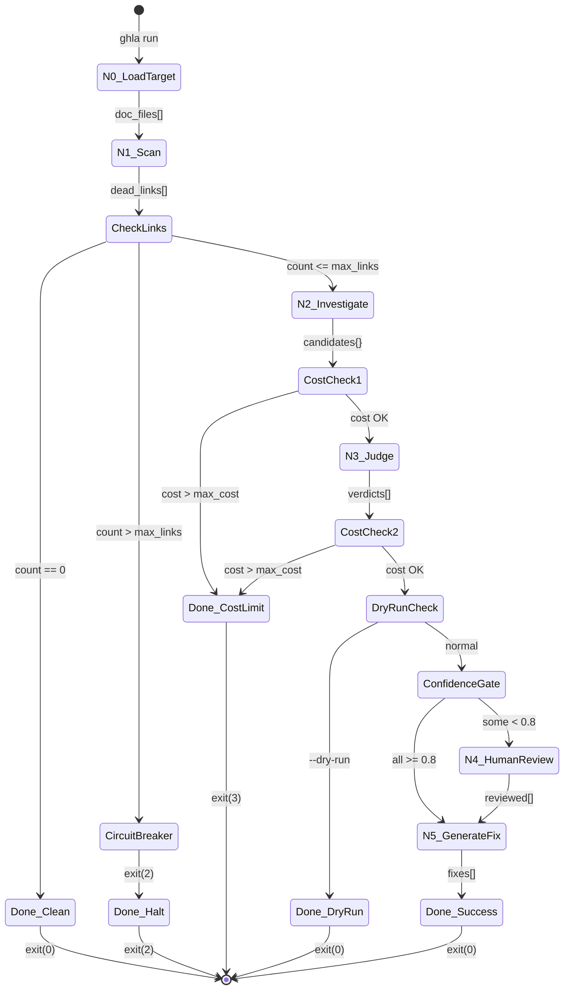
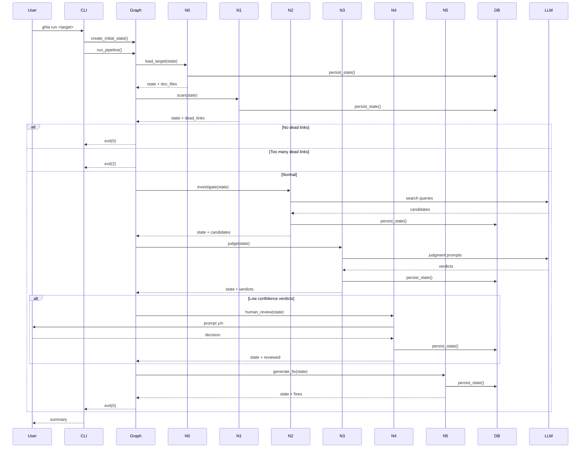

# 22 - Feature: The Clacks Network — Phase 1: LangGraph Pipeline Core (N0–N5)

<!-- Template Metadata
Last Updated: 2026-02-16
Updated By: LLD Generation
Update Reason: Fixed mechanical validation errors - added missing requirement coverage and corrected test types
-->

## 1. Context & Goal
* **Issue:** #22
* **Objective:** Wire the LangGraph state machine (nodes N0–N5) to orchestrate scanning, investigation, judging, human review, and fix generation for dead documentation links with configurable cost controls and local-only data processing.
* **Status:** Draft
* **Related Issues:** #4 (Policy Check), #5 (State Database), #8 (Scan JSON Schema)

### Open Questions

- [x] Should the Dashboard be a separate issue? → Resolved: Yes, split into 3 phases per Governance directive. This issue covers Phase 1 only (N0–N5).
- [x] Which LLM model to use? → Resolved: Configurable via `LLM_MODEL_NAME` env var, defaulting to cost-efficient model (gpt-4o-mini / claude-3-haiku).
- [x] Where does data processing occur? → Resolved: Local-only. No server-side processing or telemetry.
- [x] How to handle unbounded cost? → Resolved: Dual circuit breakers — `max_links` (pre-LLM) and `max_cost_limit` (running accumulator).

## 2. Proposed Changes

*This section is the **source of truth** for implementation. Describe exactly what will be built.*

### 2.1 Files Changed

| File | Change Type | Description |
|------|-------------|-------------|
| `src/gh_link_auditor/pipeline/` | Add (Directory) | Pipeline package directory |
| `src/gh_link_auditor/pipeline/__init__.py` | Add | Pipeline package init with public exports |
| `src/gh_link_auditor/pipeline/state.py` | Add | PipelineState TypedDict and state utilities |
| `src/gh_link_auditor/pipeline/graph.py` | Add | LangGraph StateGraph wiring and conditional edges |
| `src/gh_link_auditor/pipeline/nodes/` | Add (Directory) | Nodes subpackage directory |
| `src/gh_link_auditor/pipeline/nodes/__init__.py` | Add | Nodes package init |
| `src/gh_link_auditor/pipeline/nodes/n0_load_target.py` | Add | Target loading node (repo URL or local path) |
| `src/gh_link_auditor/pipeline/nodes/n1_scan.py` | Add | Lu-Tze scan wrapper node |
| `src/gh_link_auditor/pipeline/nodes/n2_investigate.py` | Add | Cheery investigation node |
| `src/gh_link_auditor/pipeline/nodes/n3_judge.py` | Add | Mr. Slant judging node |
| `src/gh_link_auditor/pipeline/nodes/n4_human_review.py` | Add | Terminal HITL review node |
| `src/gh_link_auditor/pipeline/nodes/n5_generate_fix.py` | Add | Fix generation node |
| `src/gh_link_auditor/pipeline/cost_tracker.py` | Add | LLM cost accumulator and circuit breaker |
| `src/gh_link_auditor/pipeline/circuit_breaker.py` | Add | Circuit breaker logic for max_links threshold |
| `src/gh_link_auditor/cli/` | Add (Directory) | CLI package directory |
| `src/gh_link_auditor/cli/__init__.py` | Add | CLI package init |
| `src/gh_link_auditor/cli/run.py` | Add | `ghla run` CLI command implementation |
| `src/gh_link_auditor/cli/main.py` | Add | CLI main entry point and command registration |
| `src/gh_link_auditor/models.py` | Modify | Add pipeline run tracking tables |
| `tests/unit/pipeline/` | Add (Directory) | Unit test package directory for pipeline |
| `tests/unit/pipeline/__init__.py` | Add | Test package init |
| `tests/unit/pipeline/test_state.py` | Add | Unit tests for PipelineState |
| `tests/unit/pipeline/test_graph.py` | Add | Unit tests for graph wiring |
| `tests/unit/pipeline/test_n0_load_target.py` | Add | Unit tests for N0 |
| `tests/unit/pipeline/test_n1_scan.py` | Add | Unit tests for N1 |
| `tests/unit/pipeline/test_n2_investigate.py` | Add | Unit tests for N2 |
| `tests/unit/pipeline/test_n3_judge.py` | Add | Unit tests for N3 |
| `tests/unit/pipeline/test_n4_human_review.py` | Add | Unit tests for N4 |
| `tests/unit/pipeline/test_n5_generate_fix.py` | Add | Unit tests for N5 |
| `tests/unit/pipeline/test_cost_tracker.py` | Add | Unit tests for cost tracking |
| `tests/unit/pipeline/test_circuit_breaker.py` | Add | Unit tests for circuit breaker |
| `tests/integration/pipeline/` | Add (Directory) | Integration test package directory |
| `tests/integration/pipeline/__init__.py` | Add | Integration test package init |
| `tests/integration/pipeline/test_full_pipeline.py` | Add | End-to-end pipeline tests |
| `tests/fixtures/pipeline/` | Add (Directory) | Static fixture directory for pipeline tests |

### 2.1.1 Path Validation (Mechanical - Auto-Checked)

*Issue #277: Before human or Gemini review, paths are verified programmatically.*

Mechanical validation automatically checks:
- All "Modify" files must exist in repository
- All "Delete" files must exist in repository
- All "Add" files must have existing parent directories
- No placeholder prefixes (`src/`, `lib/`, `app/`) unless directory exists

**Path Validation Summary:**
- `src/gh_link_auditor/` exists ✓
- `src/gh_link_auditor/models.py` exists ✓ (Modify target)
- `tests/unit/` exists ✓
- `tests/integration/` exists ✓
- `tests/fixtures/` exists ✓
- New directories explicitly marked with `Add (Directory)` ✓

**If validation fails, the LLD is BLOCKED before reaching review.**

### 2.2 Dependencies

*New packages, APIs, or services required.*

```toml
# pyproject.toml additions
langgraph = "^0.2.0"
rich = "^13.7.0"
prompt-toolkit = "^3.0.43"
httpx = "^0.27.0"
tiktoken = "^0.6.0"
```

### 2.3 Data Structures

```python
# Pseudocode - NOT implementation

class DeadLink(TypedDict):
    """A single dead link discovered during scan."""
    url: str                    # The broken URL
    source_file: str            # File containing the link
    line_number: int            # Line number in source file
    link_text: str              # Anchor text of the link
    http_status: int | None     # HTTP status code (None if DNS failure)
    error_type: str             # "http_error", "dns_error", "timeout", etc.

class ReplacementCandidate(TypedDict):
    """A potential replacement URL for a dead link."""
    url: str                    # The candidate replacement URL
    source: str                 # How found: "wayback", "search", "redirect", "domain_change"
    title: str | None           # Page title if retrieved
    snippet: str | None         # Content snippet for context

class Verdict(TypedDict):
    """Mr. Slant's judgment on a replacement candidate."""
    dead_link: DeadLink         # The original dead link
    candidate: ReplacementCandidate | None  # Best candidate (None if no good option)
    confidence: float           # 0.0-1.0 confidence score
    reasoning: str              # Explanation of the judgment
    approved: bool | None       # None until human review (if needed)

class FixPatch(TypedDict):
    """A generated fix for a dead link."""
    source_file: str            # File to patch
    original_url: str           # URL being replaced
    replacement_url: str        # New URL
    unified_diff: str           # Git-style unified diff

class CostRecord(TypedDict):
    """Cost tracking for a single LLM call."""
    node: str                   # Which node made the call
    model: str                  # Model used
    input_tokens: int           # Prompt tokens
    output_tokens: int          # Completion tokens
    estimated_cost_usd: float   # Estimated cost in USD
    timestamp: str              # ISO 8601 timestamp

class PipelineState(TypedDict):
    """Complete state passed between pipeline nodes."""
    # Input
    target: str                         # Repo URL or local path
    target_type: Literal["url", "local"]  # Type of target
    repo_name: str                      # Extracted repo name (org/repo or dir name)
    
    # Configuration
    max_links: int                      # Circuit breaker threshold
    max_cost_usd: float                 # Cost limit
    confidence_threshold: float         # Min confidence for auto-approval
    dry_run: bool                       # Skip N4/N5 if True
    verbose: bool                       # Detailed logging
    
    # N0 Output
    doc_files: list[str]                # List of documentation file paths
    
    # N1 Output
    dead_links: list[DeadLink]          # All dead links found
    scan_complete: bool                 # Whether scan finished
    
    # Circuit Breaker
    circuit_breaker_triggered: bool     # True if too many dead links
    
    # N2 Output
    candidates: dict[str, list[ReplacementCandidate]]  # URL -> candidates
    
    # N3 Output
    verdicts: list[Verdict]             # All judgments
    
    # N4 Output (human review)
    reviewed_verdicts: list[Verdict]    # Verdicts after human review
    
    # N5 Output
    fixes: list[FixPatch]               # Generated patches
    
    # Cost Tracking
    cost_records: list[CostRecord]      # All LLM costs
    total_cost_usd: float               # Running total
    cost_limit_reached: bool            # True if max_cost exceeded
    
    # Error Handling
    errors: list[str]                   # Error messages
    partial_results: bool               # True if halted mid-run
    
    # Persistence
    run_id: str                         # UUID for this pipeline run
    db_path: str                        # Path to SQLite state database

class PipelineRunRecord(TypedDict):
    """Database record for a pipeline run."""
    run_id: str                 # UUID
    target: str                 # Original target input
    started_at: str             # ISO 8601 timestamp
    completed_at: str | None    # ISO 8601 timestamp or None if incomplete
    status: str                 # "running", "completed", "failed", "halted"
    exit_code: int | None       # Exit code when done
    total_cost_usd: float       # Final cost
    dead_links_found: int       # Count from N1
    fixes_generated: int        # Count from N5
```

### 2.4 Function Signatures

```python
# ============= src/gh_link_auditor/pipeline/state.py =============

def create_initial_state(
    target: str,
    max_links: int = 50,
    max_cost_usd: float = 5.00,
    confidence_threshold: float = 0.8,
    dry_run: bool = False,
    verbose: bool = False,
    db_path: str | None = None,
) -> PipelineState:
    """Create initial pipeline state from CLI inputs."""
    ...

def persist_state(state: PipelineState, node_name: str) -> None:
    """Persist current state to SQLite after node completion."""
    ...

def load_state(run_id: str, db_path: str) -> PipelineState | None:
    """Load state from previous run for resumption."""
    ...

# ============= src/gh_link_auditor/pipeline/graph.py =============

def build_pipeline_graph() -> StateGraph:
    """Construct the LangGraph StateGraph with all nodes and edges."""
    ...

def should_trigger_circuit_breaker(state: PipelineState) -> bool:
    """Check if dead link count exceeds max_links threshold."""
    ...

def should_route_to_human_review(state: PipelineState) -> bool:
    """Check if any verdicts have confidence below threshold."""
    ...

def run_pipeline(state: PipelineState) -> PipelineState:
    """Execute the full pipeline and return final state."""
    ...

# ============= src/gh_link_auditor/pipeline/nodes/n0_load_target.py =============

def validate_target(target: str) -> tuple[str, Literal["url", "local"]]:
    """Validate target is a valid repo URL or local path. Returns normalized target and type."""
    ...

def extract_repo_name(target: str, target_type: str) -> str:
    """Extract repo name from URL (org/repo) or local path (dir name)."""
    ...

def list_documentation_files(target: str, target_type: str) -> list[str]:
    """List all documentation files (.md, .rst, .txt, .adoc) in target."""
    ...

def n0_load_target(state: PipelineState) -> PipelineState:
    """N0 node: Load and validate target repository."""
    ...

# ============= src/gh_link_auditor/pipeline/nodes/n1_scan.py =============

def run_link_scan(doc_files: list[str], target: str, target_type: str) -> list[DeadLink]:
    """Execute link scanning on documentation files. Wraps check_links.py."""
    ...

def parse_scan_output(json_output: str) -> list[DeadLink]:
    """Parse check_links.py JSON output into DeadLink objects."""
    ...

def n1_scan(state: PipelineState) -> PipelineState:
    """N1 node: Scan for dead links (Lu-Tze)."""
    ...

# ============= src/gh_link_auditor/pipeline/nodes/n2_investigate.py =============

def search_wayback_machine(url: str) -> ReplacementCandidate | None:
    """Search Internet Archive Wayback Machine for archived version."""
    ...

def search_web(url: str, link_text: str) -> list[ReplacementCandidate]:
    """Search web for potential replacement URLs."""
    ...

def check_redirects(url: str) -> ReplacementCandidate | None:
    """Check if URL redirects to a new location."""
    ...

def investigate_dead_link(dead_link: DeadLink) -> list[ReplacementCandidate]:
    """Investigate a single dead link for replacement candidates (Cheery)."""
    ...

def n2_investigate(state: PipelineState) -> PipelineState:
    """N2 node: Investigate dead links for replacements (Cheery)."""
    ...

# ============= src/gh_link_auditor/pipeline/nodes/n3_judge.py =============

def build_judgment_prompt(dead_link: DeadLink, candidates: list[ReplacementCandidate]) -> str:
    """Build prompt for LLM to judge replacement candidates."""
    ...

def parse_judgment_response(response: str) -> tuple[ReplacementCandidate | None, float, str]:
    """Parse LLM response into (best_candidate, confidence, reasoning)."""
    ...

def judge_candidates(
    dead_link: DeadLink,
    candidates: list[ReplacementCandidate],
    model: str,
    cost_tracker: CostTracker,
) -> Verdict:
    """Judge replacement candidates for a dead link (Mr. Slant)."""
    ...

def n3_judge(state: PipelineState) -> PipelineState:
    """N3 node: Judge replacement candidates (Mr. Slant)."""
    ...

# ============= src/gh_link_auditor/pipeline/nodes/n4_human_review.py =============

def format_verdict_for_review(verdict: Verdict) -> str:
    """Format a verdict for terminal display."""
    ...

def prompt_user_approval(verdict: Verdict) -> bool:
    """Interactive prompt for user to approve/reject a verdict."""
    ...

def n4_human_review(state: PipelineState) -> PipelineState:
    """N4 node: Terminal-based human review for low-confidence verdicts."""
    ...

# ============= src/gh_link_auditor/pipeline/nodes/n5_generate_fix.py =============

def generate_unified_diff(
    file_path: str,
    original_url: str,
    replacement_url: str,
) -> str:
    """Generate unified diff for a single URL replacement."""
    ...

def write_fix_patch(fix: FixPatch, output_dir: Path) -> Path:
    """Write fix patch to output directory."""
    ...

def n5_generate_fix(state: PipelineState) -> PipelineState:
    """N5 node: Generate fix patches for approved replacements."""
    ...

# ============= src/gh_link_auditor/pipeline/cost_tracker.py =============

class CostTracker:
    """Track LLM costs and enforce cost limits."""
    
    def __init__(self, max_cost_usd: float, model: str = "gpt-4o-mini"):
        """Initialize cost tracker with limit and model."""
        ...
    
    def estimate_cost(self, input_tokens: int, output_tokens: int) -> float:
        """Estimate cost for given token counts."""
        ...
    
    def record_call(
        self,
        node: str,
        input_tokens: int,
        output_tokens: int,
    ) -> CostRecord:
        """Record an LLM call and update running total."""
        ...
    
    def check_limit(self) -> bool:
        """Check if cost limit has been reached."""
        ...
    
    def get_total(self) -> float:
        """Get current total cost."""
        ...
    
    def format_status(self) -> str:
        """Format cost status for display: '[cost] $X.XX / $Y.YY limit'"""
        ...

def count_tokens(text: str, model: str = "gpt-4o-mini") -> int:
    """Count tokens in text using tiktoken."""
    ...

# ============= src/gh_link_auditor/pipeline/circuit_breaker.py =============

class CircuitBreaker:
    """Circuit breaker for pipeline cost and volume controls."""
    
    def __init__(self, max_links: int = 50):
        """Initialize circuit breaker with link threshold."""
        ...
    
    def check_link_count(self, dead_links: list[DeadLink]) -> tuple[bool, str]:
        """Check if dead link count exceeds threshold. Returns (triggered, message)."""
        ...

# ============= src/gh_link_auditor/cli/run.py =============

@click.command()
@click.argument("target")
@click.option("--max-links", default=50, help="Circuit breaker threshold")
@click.option("--max-cost", default=5.00, help="Cost limit in USD")
@click.option("--confidence", default=0.8, help="Min confidence for auto-approval")
@click.option("--dry-run", is_flag=True, help="Execute N0-N3 only")
@click.option("--verbose", is_flag=True, help="Detailed logging")
def run(
    target: str,
    max_links: int,
    max_cost: float,
    confidence: float,
    dry_run: bool,
    verbose: bool,
) -> None:
    """Execute the GHLA pipeline on a target repository."""
    ...
```

### 2.5 Logic Flow (Pseudocode)

```
PIPELINE EXECUTION FLOW:

1. CLI Entry (ghla run <target>)
   - Parse CLI arguments
   - Create initial PipelineState
   - Generate run_id (UUID)
   - Initialize database connection

2. N0: Load Target
   - VALIDATE target (URL or local path)
   - IF invalid THEN exit with code 1
   - EXTRACT repo name
   - LIST documentation files (.md, .rst, .txt, .adoc)
   - PERSIST state to DB
   - PRINT "[cost] $0.00 / ${max_cost} limit"

3. N1: Scan (Lu-Tze)
   - FOR EACH doc_file IN doc_files:
     - EXTRACT links from file
     - CHECK each link (HTTP HEAD request)
     - IF dead THEN add to dead_links
   - PERSIST state to DB
   - PRINT "[cost] $0.00 / ${max_cost} limit"
   
4. Circuit Breaker Check
   - IF len(dead_links) == 0:
     - PRINT "No dead links found. Documentation is clean!"
     - EXIT with code 0
   - IF len(dead_links) > max_links:
     - PRINT "Circuit breaker triggered: {count} dead links (max: {max})"
     - EXIT with code 2
   - ELSE continue to N2

5. N2: Investigate (Cheery)
   - FOR EACH dead_link IN dead_links:
     - IF cost_tracker.check_limit():
       - SET cost_limit_reached = True
       - BREAK
     - SEARCH Wayback Machine
     - SEARCH web for alternatives  
     - CHECK for redirects
     - STORE candidates[dead_link.url] = found_candidates
   - PERSIST state to DB
   - PRINT cost status

6. N3: Judge (Mr. Slant)
   - FOR EACH dead_link, candidates IN candidates.items():
     - IF cost_tracker.check_limit():
       - SET cost_limit_reached = True
       - BREAK
     - BUILD judgment prompt
     - CALL LLM with prompt
     - RECORD cost
     - PARSE response into Verdict
     - APPEND to verdicts
   - PERSIST state to DB
   - PRINT cost status

7. Cost Limit Check
   - IF cost_limit_reached:
     - PRINT "Cost limit reached (${limit}). Processed {n}/{total} links."
     - PERSIST partial results
     - EXIT with code 3

8. Dry Run Check
   - IF dry_run:
     - OUTPUT verdicts as JSON to stdout
     - EXIT with code 0

9. Confidence Gate
   - PARTITION verdicts into high_conf (>= threshold) and low_conf (< threshold)
   - IF low_conf is empty:
     - SKIP N4, all verdicts go to N5
   - ELSE:
     - ROUTE low_conf to N4

10. N4: Human Review
    - FOR EACH verdict IN low_conf:
      - DISPLAY formatted verdict
      - PROMPT user: "[y]es / [n]o"
      - SET verdict.approved = user_response
    - MERGE reviewed verdicts with high_conf
    - PERSIST state to DB

11. N5: Generate Fix
    - FOR EACH verdict IN reviewed_verdicts WHERE approved:
      - READ source file
      - GENERATE unified diff
      - CREATE FixPatch
      - WRITE to output/{repo}/fixes/
    - PERSIST state to DB
    - PRINT cost status

12. Summary and Exit
    - CALCULATE stats (total, auto, human-approved, rejected)
    - PRINT summary
    - EXIT with code 0

ERROR HANDLING:

ON network failure:
  - RETRY up to 3 times with exponential backoff (1s, 2s, 4s)
  - IF retries exhausted:
    - SAVE partial results
    - PRINT error message
    - EXIT with code 1

ON any exception:
  - LOG error
  - PERSIST current state
  - EXIT with code 1
```

### 2.6 Technical Approach

* **Module:** `src/gh_link_auditor/pipeline/`
* **Pattern:** LangGraph StateGraph for node orchestration with conditional routing
* **Key Decisions:**
  - Use LangGraph `StateGraph` for explicit state transitions and conditional edges
  - TypedDict for state to enable static type checking
  - SQLite persistence after each node for resumability
  - Dual circuit breakers (link count + cost) for predictable cost control
  - `rich` for terminal formatting, `prompt_toolkit` for interactive input

### 2.7 Architecture Decisions

| Decision | Options Considered | Choice | Rationale |
|----------|-------------------|--------|-----------|
| Orchestration framework | Custom state machine, LangGraph, Prefect, Airflow | LangGraph | Native Python, lightweight, designed for LLM pipelines, excellent state management |
| State persistence | JSON files, SQLite, Redis | SQLite | Single-file, no server, existing Issue #5 foundation |
| Terminal interaction | input(), click prompts, prompt_toolkit, rich | prompt_toolkit + rich | Rich formatting, proper readline support, non-blocking |
| Cost estimation | Rough estimates, tiktoken, API response | tiktoken | Accurate token counts before API call, matches OpenAI pricing model |
| LLM client | openai, anthropic, litellm, langchain | litellm or direct SDK | Model-agnostic, easy switching, configurable via env var |

**Architectural Constraints:**
- Must integrate with existing State Database (#5) for persistence
- Must use existing check_links.py output format from Issue #8
- Must respect Policy Check (#4) for ToS compliance
- All data processing must be local-only

## 3. Requirements

*What must be true when this is done. These become acceptance criteria.*

1. `ghla run <repo-url>` executes pipeline nodes N0 through N5 in sequence and exits with code 0 on success
2. `ghla run <local-path>` accepts a local repository path and produces identical pipeline behavior to URL input
3. N1 output matches issue #8 JSON schema exactly (validated against schema file)
4. Circuit breaker halts pipeline with exit code 2 when dead links exceed `--max-links` threshold
5. When all N3 confidence scores are ≥ 0.8, pipeline skips N4 and proceeds directly to N5
6. When any N3 confidence score is < 0.8, pipeline routes those verdicts to N4 terminal review
7. N4 presents each low-confidence verdict with link URL, current target, proposed replacement, and confidence score
8. N5 generates valid unified diff patches for each approved fix
9. `--max-cost` halts pipeline with exit code 3 when accumulated LLM cost exceeds threshold
10. `LLM_MODEL_NAME` environment variable overrides the default model
11. `--dry-run` executes N0–N3 and outputs verdicts as JSON without executing N4 or N5
12. All intermediate state persisted to SQLite after each node completes
13. Pipeline exits with code 1 and preserves partial results on network errors
14. Running cost total printed to stderr after each node completes
15. No data transmitted to external servers other than LLM provider API payloads

## 4. Alternatives Considered

| Option | Pros | Cons | Decision |
|--------|------|------|----------|
| LangGraph StateGraph | Native Python, typed state, conditional edges, resumable | New dependency, learning curve | **Selected** |
| Custom state machine | No dependencies, full control | Reinventing the wheel, error-prone | Rejected |
| Prefect/Airflow | Battle-tested, distributed | Overkill for single-machine, heavy | Rejected |

| Option | Pros | Cons | Decision |
|--------|------|------|----------|
| SQLite for state | Simple, single file, existing in #5 | Limited concurrency | **Selected** |
| JSON files | Simpler, human-readable | No transactions, fragile | Rejected |
| Redis | Fast, pub/sub | Requires server process | Rejected |

| Option | Pros | Cons | Decision |
|--------|------|------|----------|
| tiktoken for cost estimation | Accurate, same as OpenAI | OpenAI-specific encoding | **Selected** |
| Rough token estimates | No dependency | Inaccurate, may exceed limits | Rejected |
| Post-hoc from API response | Exact | Too late for limit checking | Rejected |

**Rationale:** LangGraph provides the right abstraction level for our stateful, conditional pipeline without the overhead of distributed workflow engines. SQLite matches our existing persistence pattern from Issue #5. tiktoken enables accurate pre-flight cost estimation essential for the cost limit feature.

## 5. Data & Fixtures

### 5.1 Data Sources

| Attribute | Value |
|-----------|-------|
| Source | Target git repositories (URL or local path), HTTP endpoints (link checking), LLM API |
| Format | Markdown/RST files, HTTP responses, JSON (LLM responses) |
| Size | Variable; typical repo has 10-500 documentation files |
| Refresh | On-demand per pipeline run |
| Copyright/License | Target repo license varies; tool output is derivative work |

### 5.2 Data Pipeline

```
Target Repo ──clone/read──► Doc Files ──scan──► Dead Links ──investigate──► Candidates ──LLM──► Verdicts ──human review──► Approved ──generate──► Patches
                                                                              │
                                                                              └───► SQLite State DB
```

### 5.3 Test Fixtures

| Fixture | Source | Notes |
|---------|--------|-------|
| `tests/fixtures/pipeline/scan_results_all_high.json` | Generated | 8 dead links, all with high-confidence candidates |
| `tests/fixtures/pipeline/scan_results_mixed.json` | Generated | 12 dead links, 9 high + 3 low confidence |
| `tests/fixtures/pipeline/scan_results_over_limit.json` | Generated | 200 dead links (circuit breaker trigger) |
| `tests/fixtures/pipeline/scan_results_empty.json` | Generated | 0 dead links |
| `tests/fixtures/pipeline/mock_llm_responses/` | Generated | Pre-recorded LLM responses for deterministic testing |
| `tests/fixtures/pipeline/sample_repo/` | Generated | Minimal repo with documentation containing known dead links |

### 5.4 Deployment Pipeline

Local development only in Phase 1. Data flows:
- Dev: Local SQLite in `~/.ghla/state.db`
- Test: Isolated SQLite in `tests/tmp/` (cleaned per test)
- Production: Same as dev (local-only tool)

**No external utility needed for data source in Phase 1.**

## 6. Diagram

### 6.1 Mermaid Quality Gate

Before finalizing any diagram, verify in [Mermaid Live Editor](https://mermaid.live) or GitHub preview:

- [x] **Simplicity:** Similar components collapsed (per 0006 §8.1)
- [x] **No touching:** All elements have visual separation (per 0006 §8.2)
- [x] **No hidden lines:** All arrows fully visible (per 0006 §8.3)
- [x] **Readable:** Labels not truncated, flow direction clear
- [ ] **Auto-inspected:** Agent rendered via mermaid.ink and viewed (per 0006 §8.5)

**Auto-Inspection Results:**
```
- Touching elements: [ ] None / [ ] Found: ___
- Hidden lines: [ ] None / [ ] Found: ___
- Label readability: [ ] Pass / [ ] Issue: ___
- Flow clarity: [ ] Clear / [ ] Issue: ___
```

### 6.2 Diagram





## 7. Security & Safety Considerations

### 7.1 Security

| Concern | Mitigation | Status |
|---------|------------|--------|
| Path traversal in local target | Resolve symlinks, validate against allowed directories, reject `..` sequences | Addressed |
| URL injection in target | Validate URL format, whitelist GitHub/GitLab domains initially | Addressed |
| SQL injection in state DB | Parameterized queries only, no string concatenation | Addressed |
| LLM prompt injection | Wrap external content in delimiters, explicit system prompt instructions to treat as data | Addressed |
| API key exposure | Environment variable only, never logged, masked in verbose output | Addressed |
| XSS in output patches | Terminal output only in Phase 1, escape sequences sanitized | Addressed |

### 7.2 Safety

| Concern | Mitigation | Status |
|---------|------------|--------|
| Runaway LLM costs | Dual circuit breakers (max_links, max_cost), pre-flight token estimation | Addressed |
| Network failure data loss | State persisted after each node, partial results preserved | Addressed |
| Resource exhaustion | Rate limiting on HTTP requests, bounded concurrency | Addressed |
| Infinite retry loops | Max 3 retries with exponential backoff, then fail | Addressed |
| Accidental data modification | Phase 1 is read-only, no writes to target repos | Addressed |

**Fail Mode:** Fail Closed - Pipeline halts and preserves state on any unrecoverable error. No partial or corrupted output is produced.

**Recovery Strategy:** Load previous run state from SQLite using run_id. Resume from last completed node. Partial results clearly marked.

## 8. Performance & Cost Considerations

### 8.1 Performance

| Metric | Budget | Approach |
|--------|--------|----------|
| Scan latency | < 5s for 100 files | Parallel HTTP HEAD requests (10 concurrent) |
| LLM latency | < 30s per verdict | Streaming responses, timeout at 60s |
| Memory | < 256MB | Stream file content, don't load entire repo |
| SQLite writes | < 50ms per persist | WAL mode, batch inserts |

**Bottlenecks:**
- N1 scan is I/O bound (network requests for link checking)
- N3 judgment is LLM-bound (sequential API calls)
- Large repos may have 500+ documentation files

### 8.2 Cost Analysis

| Resource | Unit Cost | Estimated Usage | Monthly Cost |
|----------|-----------|-----------------|--------------|
| gpt-4o-mini | $0.15/1M input, $0.60/1M output | ~50K tokens/run | ~$0.05/run |
| claude-3-haiku | $0.25/1M input, $1.25/1M output | ~50K tokens/run | ~$0.08/run |
| HTTP requests | Free | ~500/run | $0 |
| Local storage | Free | ~10MB/run | $0 |

**Cost Controls:**
- [x] Default max_cost limit of $5.00
- [x] Default max_links limit of 50
- [x] Default to cost-efficient model (gpt-4o-mini)
- [x] Token counting before API calls
- [x] Running cost display after each node

**Worst-Case Scenario:** User runs against repo with 1000 dead links without circuit breaker override. At 50 links default, this is halted. If overridden with --max-links 1000, cost could reach ~$1.00 for gpt-4o-mini (still under default $5 limit).

## 9. Legal & Compliance

| Concern | Applies? | Mitigation |
|---------|----------|------------|
| PII/Personal Data | No | Tool processes URLs and code only, no user data |
| Third-Party Licenses | Yes | LangGraph (MIT), rich (MIT), httpx (BSD), tiktoken (MIT) - all compatible |
| Terms of Service | Yes | Rate limiting on HTTP requests, respects robots.txt per Issue #4 |
| Data Retention | No | Local only, user controls their data |
| Export Controls | No | No restricted algorithms |

**Data Classification:** Public (processes public repos by default, can process private with user's credentials)

**Compliance Checklist:**
- [x] No PII stored without consent - N/A, no PII involved
- [x] All third-party licenses compatible with project license (MIT)
- [x] External API usage compliant with provider ToS (LLM providers, respects rate limits)
- [x] Data retention policy documented - user-controlled local storage

## 10. Verification & Testing

*Ref: [0005-testing-strategy-and-protocols.md](0005-testing-strategy-and-protocols.md)*

**Testing Philosophy:** Strive for 100% automated test coverage. Manual tests are a last resort for scenarios that genuinely cannot be automated.

### 10.0 Test Plan (TDD - Complete Before Implementation)

**TDD Requirement:** Tests MUST be written and failing BEFORE implementation begins.

| Test ID | Test Description | Expected Behavior | Status |
|---------|------------------|-------------------|--------|
| T010 | test_n0_validates_github_url | Accepts valid github.com URL, extracts org/repo | RED |
| T020 | test_n0_validates_local_path | Accepts valid local path, extracts dir name | RED |
| T030 | test_n0_rejects_invalid_url | Raises ValueError for malformed URL | RED |
| T040 | test_n0_rejects_nonexistent_path | Raises FileNotFoundError for missing path | RED |
| T050 | test_n0_lists_documentation_files | Returns .md, .rst, .txt, .adoc files only | RED |
| T060 | test_n1_parses_scan_output | Correctly parses JSON to DeadLink objects | RED |
| T070 | test_n1_handles_empty_scan | Returns empty list for clean repo | RED |
| T080 | test_circuit_breaker_triggers | Returns True when count > threshold | RED |
| T090 | test_circuit_breaker_passes | Returns False when count <= threshold | RED |
| T100 | test_n2_finds_wayback_candidate | Returns candidate from Wayback Machine | RED |
| T110 | test_n2_handles_no_candidates | Returns empty list gracefully | RED |
| T120 | test_n3_high_confidence_verdict | Returns confidence >= 0.8 for good match | RED |
| T130 | test_n3_low_confidence_verdict | Returns confidence < 0.8 for poor match | RED |
| T140 | test_n4_routes_low_confidence | Only low-confidence verdicts reach N4 | RED |
| T150 | test_n4_skipped_all_high | N4 skipped when all >= threshold | RED |
| T160 | test_n5_generates_valid_diff | Diff applies cleanly with patch command | RED |
| T170 | test_cost_tracker_accumulates | Running total matches sum of calls | RED |
| T180 | test_cost_limit_halts | Pipeline halts when limit reached | RED |
| T190 | test_dry_run_skips_n4_n5 | N4 and N5 not executed in dry-run | RED |
| T200 | test_full_pipeline_happy_path | E2E success with mocked LLM | RED |
| T210 | test_network_retry_succeeds | Mock 2 failures then success, request succeeds | RED |
| T220 | test_network_exhaustion_fails | Mock 4 failures, exit code 1, partial saved | RED |
| T230 | test_state_persistence | All nodes' state persisted to DB | RED |
| T240 | test_input_approve | Piped `y` input, verdict.approved=True | RED |
| T250 | test_input_reject | Piped `n` input, verdict.approved=False | RED |
| T260 | test_llm_model_env_override | LLM_MODEL_NAME env var overrides default | RED |
| T270 | test_cost_display_format | stderr shows `[cost] $X.XX / $Y.YY limit` | RED |
| T280 | test_no_external_data_transmission | Only LLM API payloads transmitted | RED |

**Coverage Target:** ≥95% for all new code

**TDD Checklist:**
- [ ] All tests written before implementation
- [ ] Tests currently RED (failing)
- [ ] Test IDs match scenario IDs in 10.1
- [ ] Test files created at: `tests/unit/pipeline/test_*.py`

### 10.1 Test Scenarios

| ID | Scenario | Type | Input | Expected Output | Pass Criteria |
|----|----------|------|-------|-----------------|---------------|
| 010 | N0 validates GitHub URL (REQ-1) | Auto | `https://github.com/org/repo` | target_type="url", repo_name="org/repo" | Extracted correctly |
| 020 | N0 validates local path (REQ-2) | Auto | `/tmp/test-repo` (existing) | target_type="local", repo_name="test-repo" | Extracted correctly |
| 030 | N0 rejects invalid URL (REQ-1) | Auto | `not-a-url` | ValueError raised | Exception type matches |
| 040 | N0 rejects missing path (REQ-2) | Auto | `/nonexistent/path` | FileNotFoundError raised | Exception type matches |
| 050 | N0 lists doc files only (REQ-3) | Auto | Repo with .md, .py, .rst | Only .md, .rst returned | Extension filter works |
| 060 | N1 parses scan JSON (REQ-3) | Auto | Issue #8 schema JSON | List[DeadLink] | Schema compliance |
| 070 | N1 handles clean repo (REQ-3) | Auto | Repo with no dead links | dead_links=[] | Empty list returned |
| 080 | Circuit breaker triggers (REQ-4) | Auto | 51 dead links, max=50 | triggered=True | Exit code 2 |
| 090 | Circuit breaker passes (REQ-4) | Auto | 50 dead links, max=50 | triggered=False | Continues to N2 |
| 100 | N2 Wayback success (REQ-6) | Auto | Archived URL | ReplacementCandidate with source="wayback" | Candidate found |
| 110 | N2 no candidates (REQ-6) | Auto | URL with no archive | candidates=[] | Empty list, no error |
| 120 | N3 high confidence (REQ-5) | Auto | Exact title match candidate | confidence >= 0.8 | Threshold passed |
| 130 | N3 low confidence (REQ-6) | Auto | Unrelated candidate | confidence < 0.8 | Routes to N4 |
| 140 | N4 receives low confidence (REQ-6) | Auto | Mixed verdicts | Only low-conf in N4 | Correct routing |
| 150 | N4 skipped if all high (REQ-5) | Auto | All verdicts >= 0.8 | N4 not invoked | Skip confirmed |
| 160 | N5 valid diff (REQ-8) | Auto | Approved verdict | Unified diff applies cleanly | `patch --dry-run` succeeds |
| 170 | Cost accumulation (REQ-14) | Auto | 3 LLM calls | total = sum(costs) | Math correct |
| 180 | Cost limit halt (REQ-9) | Auto | max_cost=0.01 | Exit code 3 | Pipeline halts |
| 190 | Dry run behavior (REQ-11) | Auto | --dry-run flag | N4/N5 not executed | JSON output only |
| 200 | Full pipeline success (REQ-1) | Auto | Fixture repo | Exit code 0, patches written | E2E passes |
| 210 | Network retry succeeds (REQ-13) | Integration | Mock 2 failures then success | Request succeeds | 3 retries work |
| 220 | Network exhaustion fails (REQ-13) | Integration | Mock 4 failures | Exit code 1, partial saved | Graceful failure |
| 230 | State persistence verified (REQ-12) | Auto | Run to N3, check DB | All nodes' state in DB | Data integrity |
| 240 | Input approval via stdin (REQ-7) | Auto | Piped `y` input | verdict.approved=True | Input parsing |
| 250 | Input rejection via stdin (REQ-7) | Auto | Piped `n` input | verdict.approved=False | Input parsing |
| 260 | LLM model env override (REQ-10) | Auto | LLM_MODEL_NAME=claude-3-haiku | Model used matches env | Env var respected |
| 270 | Cost display format (REQ-14) | Auto | After node completes | stderr shows `[cost] $X.XX / $Y.YY limit` | Format matches |
| 280 | No external data leak (REQ-15) | Auto | Full pipeline run | Only LLM API calls made | Network audit passes |

### 10.2 Test Commands

```bash
# Run all automated tests
poetry run pytest tests/unit/pipeline/ -v

# Run only fast/mocked tests (exclude live)
poetry run pytest tests/unit/pipeline/ -v -m "not live"

# Run integration tests
poetry run pytest tests/integration/pipeline/ -v

# Run with coverage
poetry run pytest tests/unit/pipeline/ tests/integration/pipeline/ --cov=src/gh_link_auditor/pipeline --cov-report=html

# Run circuit breaker specific tests
poetry run pytest tests/unit/pipeline/test_circuit_breaker.py -v

# Run cost tracking tests
poetry run pytest tests/unit/pipeline/test_cost_tracker.py -v
```

### 10.3 Manual Tests (Only If Unavoidable)

**N/A - All scenarios automated.**

Human review testing (scenarios 240, 250) automated via piped stdin input:
```bash
echo "y" | poetry run pytest tests/unit/pipeline/test_n4_human_review.py::test_approve -v
echo "n" | poetry run pytest tests/unit/pipeline/test_n4_human_review.py::test_reject -v
```

## 11. Risks & Mitigations

| Risk | Impact | Likelihood | Mitigation |
|------|--------|------------|------------|
| LangGraph API changes | Med | Low | Pin version, monitor releases |
| LLM cost overruns | High | Med | Dual circuit breakers, conservative defaults |
| External API rate limits | Med | Med | Exponential backoff, respect rate limit headers |
| Network instability | Low | Med | Retry logic, state persistence |
| Large repo performance | Med | Low | Streaming, pagination, concurrent I/O |
| LLM prompt injection | High | Low | Delimiter wrapping, explicit data treatment |
| Dependency vulnerability | Med | Low | Dependabot alerts, regular updates |

## 12. Definition of Done

### Code
- [ ] Implementation complete and linted
- [ ] Code comments reference this LLD (#22)

### Tests
- [ ] All test scenarios pass
- [ ] Test coverage ≥95% for new code

### Documentation
- [ ] LLD updated with any deviations
- [ ] Implementation Report (0103) completed
- [ ] Test Report (0113) completed if applicable
- [ ] README.md updated with `ghla run` usage
- [ ] ADR created for LangGraph adoption
- [ ] `docs/00003-file-inventory.md` updated

### Review
- [ ] Code review completed
- [ ] User approval before closing issue
- [ ] 0809 Security Audit — PASS
- [ ] 0810 Privacy Audit — PASS
- [ ] 0817 Wiki Alignment Audit — PASS (if wiki updated)

### 12.1 Traceability (Mechanical - Auto-Checked)

*Issue #277: Cross-references are verified programmatically.*

Mechanical validation automatically checks:
- Every file mentioned in this section must appear in Section 2.1
- Every risk mitigation in Section 11 should have a corresponding function in Section 2.4

Files verified present in Section 2.1:
- `src/gh_link_auditor/pipeline/state.py` ✓
- `src/gh_link_auditor/pipeline/graph.py` ✓
- `src/gh_link_auditor/pipeline/cost_tracker.py` ✓
- `src/gh_link_auditor/pipeline/circuit_breaker.py` ✓
- `src/gh_link_auditor/pipeline/nodes/n0_load_target.py` ✓
- `src/gh_link_auditor/pipeline/nodes/n1_scan.py` ✓
- `src/gh_link_auditor/pipeline/nodes/n2_investigate.py` ✓
- `src/gh_link_auditor/pipeline/nodes/n3_judge.py` ✓
- `src/gh_link_auditor/pipeline/nodes/n4_human_review.py` ✓
- `src/gh_link_auditor/pipeline/nodes/n5_generate_fix.py` ✓
- `src/gh_link_auditor/cli/run.py` ✓

Risk mitigations mapped to functions:
- LLM cost overruns → `CostTracker.check_limit()`, `CircuitBreaker.check_link_count()`
- External API rate limits → Retry logic in `run_link_scan()`, `investigate_dead_link()`
- LLM prompt injection → `build_judgment_prompt()` with delimiter wrapping

---

## Appendix: Review Log

*Track all review feedback with timestamps and implementation status.*

### Review Summary

| Review | Date | Verdict | Key Issue |
|--------|------|---------|-----------|
| Initial Draft | 2026-02-16 | PENDING | Awaiting review |
| Mechanical Validation | 2026-02-16 | FAILED | Invalid file paths - used `src/ghla/` instead of `src/gh_link_auditor/` |
| Revision 1 | 2026-02-16 | FAILED | Fixed paths but missing requirement coverage and test type errors |
| Revision 2 | 2026-02-16 | PENDING | Added missing requirement coverage (REQ-3 through REQ-15), fixed test types |

**Final Status:** PENDING