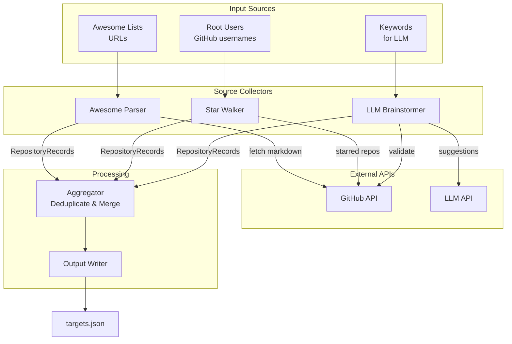

# 3 - Feature: Architect 'Repo Scout' for Organic Target Discovery

<!-- Template Metadata
Last Updated: 2026-02-16
Updated By: Issue #3 revision to fix mechanical validation errors
Update Reason: Fixed parent directory errors by adding src/repo_scout/ directory explicitly
Previous: Initial LLD creation for Repo Scout feature
-->

## 1. Context & Goal
* **Issue:** #3
* **Objective:** Build a multi-source repository discovery system that aggregates GitHub repos from Awesome lists, starred repos, and LLM-generated suggestions into a deduplicated target list for the Doc-Fix Bot.
* **Status:** Draft
* **Related Issues:** #2 (Doc-Fix Bot - consumer of this output)

### Open Questions

- [ ] What is the maximum depth for Star-Walker traversal (starred repos of connections)?
- [ ] Should rate limiting be configurable per source type?
- [ ] What LLM provider(s) should be supported for the brainstormer (OpenAI, Anthropic, local)?
- [ ] What output format does Doc-Fix Bot expect (JSON, YAML, plain text)?
- [ ] Should the scout cache results to avoid redundant API calls on re-runs?

## 2. Proposed Changes

*This section is the **source of truth** for implementation. Describe exactly what will be built.*

### 2.1 Files Changed

| File | Change Type | Description |
|------|-------------|-------------|
| `src/repo_scout/` | Add (Directory) | New package directory for repo scout module |
| `src/repo_scout/__init__.py` | Add | Package initialization |
| `src/repo_scout/cli.py` | Add | CLI entry point for repo scout commands |
| `src/repo_scout/awesome_parser.py` | Add | Parses Awesome list markdown files for GitHub links |
| `src/repo_scout/star_walker.py` | Add | Traverses GitHub starred repos graph |
| `src/repo_scout/llm_brainstormer.py` | Add | LLM-powered repo suggestion generator |
| `src/repo_scout/aggregator.py` | Add | Deduplicates and merges results from all sources |
| `src/repo_scout/models.py` | Add | Data models for repos and discovery results |
| `src/repo_scout/github_client.py` | Add | GitHub API wrapper with rate limiting |
| `src/repo_scout/output_writer.py` | Add | Writes final deduplicated list to file |
| `pyproject.toml` | Modify | Add dependencies and CLI entry point |
| `tests/unit/test_awesome_parser.py` | Add | Unit tests for Awesome list parsing |
| `tests/unit/test_star_walker.py` | Add | Unit tests for star traversal |
| `tests/unit/test_llm_brainstormer.py` | Add | Unit tests for LLM suggestions |
| `tests/unit/test_aggregator.py` | Add | Unit tests for deduplication logic |
| `tests/fixtures/awesome_sample.md` | Add | Sample Awesome list for testing |
| `tests/fixtures/github_api_responses.json` | Add | Mocked GitHub API responses |

### 2.1.1 Path Validation (Mechanical - Auto-Checked)

*Issue #277: Before human or Gemini review, paths are verified programmatically.*

Mechanical validation automatically checks:
- All "Modify" files must exist in repository
- All "Delete" files must exist in repository
- All "Add" files must have existing parent directories
- No placeholder prefixes (`src/`, `lib/`, `app/`) unless directory exists

**If validation fails, the LLD is BLOCKED before reaching review.**

### 2.2 Dependencies

*New packages, APIs, or services required.*

```toml
# pyproject.toml additions
httpx = "^0.27.0"        # Async HTTP client for API calls
PyGithub = "^2.2.0"      # GitHub API wrapper
beautifulsoup4 = "^4.12" # HTML parsing for Awesome lists (backup)
pydantic = "^2.6.0"      # Data validation and models
typer = "^0.12.0"        # CLI framework
rich = "^13.7.0"         # CLI output formatting
tenacity = "^8.2.0"      # Retry logic with backoff
```

### 2.3 Data Structures

```python
# Pseudocode - NOT implementation
from enum import Enum
from typing import TypedDict, Optional
from datetime import datetime

class DiscoverySource(Enum):
    AWESOME_LIST = "awesome_list"
    STARRED_REPO = "starred_repo"
    LLM_SUGGESTION = "llm_suggestion"

class RepositoryRecord(TypedDict):
    owner: str                          # GitHub owner/org
    name: str                           # Repository name
    full_name: str                       # "owner/name" format
    url: str                            # Full GitHub URL
    description: Optional[str]          # Repo description
    stars: Optional[int]                # Star count at discovery time
    sources: list[DiscoverySource]      # How this repo was found
    discovered_at: datetime             # When first discovered
    metadata: dict                      # Source-specific metadata

class AwesomeListSource(TypedDict):
    url: str                            # URL of Awesome list repo
    section: Optional[str]              # Section heading where found
    
class StarWalkerSource(TypedDict):
    root_user: str                      # Starting user
    path: list[str]                     # Traversal path (e.g., ["user1", "user2"])
    depth: int                          # Traversal depth when found

class LLMSuggestionSource(TypedDict):
    keywords: list[str]                 # Keywords used for suggestion
    model: str                          # LLM model used
    confidence: Optional[float]         # Model's confidence if available

class ScoutConfig(TypedDict):
    github_token: str                   # GitHub API token
    llm_api_key: Optional[str]          # LLM API key
    max_star_depth: int                 # Max depth for star walking (default: 2)
    rate_limit_delay: float             # Seconds between API calls
    output_path: str                    # Output file path
    output_format: str                  # "json" | "jsonl" | "txt"
```

### 2.4 Function Signatures

```python
# ===== awesome_parser.py =====
def parse_awesome_list(url: str) -> list[RepositoryRecord]:
    """Fetch and parse an Awesome list for GitHub repo links."""
    ...

def extract_github_links(markdown_content: str) -> list[tuple[str, str | None]]:
    """Extract (url, section) tuples from markdown content."""
    ...

def normalize_github_url(url: str) -> str | None:
    """Normalize various GitHub URL formats to owner/repo."""
    ...

# ===== star_walker.py =====
async def walk_starred_repos(
    root_user: str,
    github_client: GitHubClient,
    max_depth: int = 2,
    visited: set[str] | None = None
) -> AsyncGenerator[RepositoryRecord, None]:
    """Recursively traverse starred repos up to max_depth."""
    ...

async def get_user_starred(
    username: str,
    github_client: GitHubClient
) -> list[RepositoryRecord]:
    """Get all starred repos for a single user."""
    ...

# ===== llm_brainstormer.py =====
async def suggest_repos(
    keywords: list[str],
    existing_repos: list[str],
    model: str = "claude-3-5-sonnet-20241022"
) -> list[RepositoryRecord]:
    """Use LLM to suggest relevant repos based on keywords."""
    ...

def build_suggestion_prompt(
    keywords: list[str],
    existing_repos: list[str]
) -> str:
    """Build the prompt for LLM repo suggestions."""
    ...

async def validate_suggestions(
    suggestions: list[str],
    github_client: GitHubClient
) -> list[RepositoryRecord]:
    """Validate that suggested repos actually exist on GitHub."""
    ...

# ===== aggregator.py =====
def deduplicate_repos(
    repos: list[RepositoryRecord]
) -> list[RepositoryRecord]:
    """Merge duplicate repos, combining their source metadata."""
    ...

def merge_sources(
    existing: RepositoryRecord,
    new: RepositoryRecord
) -> RepositoryRecord:
    """Merge source information when same repo found multiple times."""
    ...

def sort_by_relevance(
    repos: list[RepositoryRecord]
) -> list[RepositoryRecord]:
    """Sort repos by number of sources and star count."""
    ...

# ===== github_client.py =====
class GitHubClient:
    def __init__(self, token: str, rate_limit_delay: float = 1.0):
        """Initialize with auth token and rate limiting."""
        ...
    
    async def get_repo(self, owner: str, name: str) -> RepositoryRecord | None:
        """Fetch repository details."""
        ...
    
    async def get_starred(self, username: str) -> list[RepositoryRecord]:
        """Fetch user's starred repositories."""
        ...
    
    async def repo_exists(self, full_name: str) -> bool:
        """Check if a repository exists."""
        ...

# ===== output_writer.py =====
def write_output(
    repos: list[RepositoryRecord],
    output_path: str,
    format: str = "json"
) -> int:
    """Write deduplicated repos to file. Returns count written."""
    ...

def format_for_docfix_bot(repos: list[RepositoryRecord]) -> list[str]:
    """Format repos as simple owner/repo list for Doc-Fix Bot."""
    ...

# ===== cli.py =====
def scout(
    awesome_lists: list[str] = typer.Option(None),
    root_users: list[str] = typer.Option(None),
    keywords: list[str] = typer.Option(None),
    star_depth: int = typer.Option(2),
    output: str = typer.Option("targets.json"),
    output_format: str = typer.Option("json")
) -> None:
    """Main CLI entry point for Repo Scout."""
    ...
```

### 2.5 Logic Flow (Pseudocode)

```
1. Parse CLI arguments (awesome lists, root users, keywords, options)
2. Initialize GitHubClient with token from env/config
3. Create empty results collector

4. FOR EACH awesome_list URL:
   a. Fetch raw markdown content
   b. Extract all GitHub links with section context
   c. Normalize URLs to owner/repo format
   d. Filter out invalid/non-repo links
   e. Create RepositoryRecords with AWESOME_LIST source
   f. Add to results collector

5. FOR EACH root_user:
   a. Initialize visited set
   b. Call walk_starred_repos with max_depth
   c. FOR EACH yielded repo:
      - Create RepositoryRecord with STARRED_REPO source
      - Track traversal path in metadata
      - Add to results collector
   d. Respect rate limiting between API calls

6. IF keywords provided:
   a. Build LLM prompt with keywords + existing repo names
   b. Call LLM API for suggestions
   c. Parse response for repo suggestions
   d. Validate each suggestion exists via GitHub API
   e. Create RepositoryRecords with LLM_SUGGESTION source
   f. Add to results collector

7. Run deduplication:
   a. Group repos by full_name
   b. Merge source lists for duplicates
   c. Keep highest star count observed
   d. Preserve all discovery metadata

8. Sort by relevance (multi-source > single source, then by stars)

9. Write to output file in requested format

10. Print summary (total found, unique, by source breakdown)
```

### 2.6 Technical Approach

* **Module:** `src/repo_scout/`
* **Pattern:** Pipeline pattern with async collection, Strategy pattern for different sources
* **Key Decisions:**
  - Async I/O for parallel API calls with controlled concurrency
  - Generator-based traversal to handle large star graphs without memory explosion
  - Source-agnostic deduplication at aggregation layer
  - Pydantic models for strict validation of repo data

### 2.7 Architecture Decisions

| Decision | Options Considered | Choice | Rationale |
|----------|-------------------|--------|-----------|
| HTTP Client | requests, httpx, aiohttp | httpx | Async support, clean API, requests-compatible sync mode |
| GitHub API | Raw REST, PyGithub, ghapi | PyGithub + httpx hybrid | PyGithub for complex queries, httpx for simple rate-limited calls |
| LLM Integration | Direct API, LangChain, Claude SDK | Direct API calls | Simpler, fewer dependencies, clearer error handling |
| Output Format | JSON only, Multiple formats | Multiple (JSON, JSONL, TXT) | Flexibility for different Doc-Fix Bot versions |
| Star Traversal | BFS, DFS, Random | BFS with depth limit | Controlled exploration, predictable behavior |

**Architectural Constraints:**
- Must respect GitHub API rate limits (5000 req/hour authenticated)
- LLM suggestions must be validated against GitHub before inclusion
- Output must be consumable by Doc-Fix Bot (Issue #2)
- No persistent storage - stateless per run

## 3. Requirements

*What must be true when this is done. These become acceptance criteria.*

1. **REQ-01:** Parse any standard Awesome list markdown and extract 95%+ of valid GitHub repo links
2. **REQ-02:** Traverse starred repos graph up to configurable depth (default: 2)
3. **REQ-03:** Generate LLM suggestions based on keywords and validate repo existence
4. **REQ-04:** Deduplicate repos from all sources, preserving source metadata
5. **REQ-05:** Output a single file consumable by Doc-Fix Bot
6. **REQ-06:** Respect GitHub API rate limits with configurable delay
7. **REQ-07:** Provide clear progress indication and final statistics
8. **REQ-08:** Handle network failures gracefully with retry logic

## 4. Alternatives Considered

| Option | Pros | Cons | Decision |
|--------|------|------|----------|
| Single-source approach | Simpler, faster | Limited coverage | **Rejected** - defeats discovery purpose |
| Database-backed storage | Incremental runs, caching | Added complexity, statefulness | **Rejected** - file output sufficient for MVP |
| GitHub GraphQL API | More efficient queries | Complex pagination, different auth | **Rejected** for MVP - consider for optimization |
| Parallel source fetching | Faster | Rate limit coordination complex | **Selected** with controlled concurrency |

**Rationale:** The selected approach balances comprehensive discovery with implementation simplicity. Database storage can be added in a future iteration if incremental runs prove valuable.

## 5. Data & Fixtures

*Per [0108-lld-pre-implementation-review.md](0108-lld-pre-implementation-review.md) - complete this section BEFORE implementation.*

### 5.1 Data Sources

| Attribute | Value |
|-----------|-------|
| Source 1 | Awesome Lists (markdown files on GitHub) |
| Format | Markdown with embedded links |
| Size | Typically 100-2000 links per list |
| Refresh | Manual (user provides URLs) |
| Copyright/License | Various open source (CC0, MIT common) |

| Attribute | Value |
|-----------|-------|
| Source 2 | GitHub API (starred repos) |
| Format | JSON REST API responses |
| Size | Varies by user (10-5000+ stars) |
| Refresh | Real-time from API |
| Copyright/License | GitHub ToS applies |

| Attribute | Value |
|-----------|-------|
| Source 3 | LLM API (suggestions) |
| Format | Structured text/JSON response |
| Size | 10-50 suggestions per query |
| Refresh | On-demand per run |
| Copyright/License | API provider ToS |

### 5.2 Data Pipeline

```
Awesome Lists ──parse──► RepositoryRecords ─┐
                                            │
GitHub Stars ──traverse──► RepositoryRecords ├──► Aggregator ──dedupe──► Output File
                                            │
LLM Suggestions ──validate──► RepositoryRecords ─┘
```

### 5.3 Test Fixtures

| Fixture | Source | Notes |
|---------|--------|-------|
| `awesome_sample.md` | Generated | Representative Awesome list with various link formats |
| `github_api_responses.json` | Generated | Mocked starred repos and user data |
| `llm_response_sample.json` | Generated | Sample LLM suggestion responses |
| `edge_case_urls.json` | Generated | Various malformed/edge case GitHub URLs |

### 5.4 Deployment Pipeline

Development → Test (mocked APIs) → Manual validation with real APIs

**External utilities:** None required - all data fetched live at runtime.

## 6. Diagram

### 6.1 Mermaid Quality Gate

Before finalizing any diagram, verify in [Mermaid Live Editor](https://mermaid.live) or GitHub preview:

- [x] **Simplicity:** Similar components collapsed (per 0006 §8.1)
- [x] **No touching:** All elements have visual separation (per 0006 §8.2)
- [x] **No hidden lines:** All arrows fully visible (per 0006 §8.3)
- [x] **Readable:** Labels not truncated, flow direction clear
- [ ] **Auto-inspected:** Agent rendered via mermaid.ink and viewed (per 0006 §8.5)

**Auto-Inspection Results:**
```
- Touching elements: [ ] None / [ ] Found: ___
- Hidden lines: [ ] None / [ ] Found: ___
- Label readability: [ ] Pass / [ ] Issue: ___
- Flow clarity: [ ] Clear / [ ] Issue: ___
```

*Note: Auto-inspection to be completed during review phase.*

### 6.2 Diagram



## 7. Security & Safety Considerations

### 7.1 Security

| Concern | Mitigation | Status |
|---------|------------|--------|
| GitHub token exposure | Load from env var, never log or store in output | Addressed |
| LLM API key exposure | Load from env var, never log | Addressed |
| Malicious Awesome list content | Parse markdown only, no code execution | Addressed |
| URL injection | Strict regex validation for GitHub URLs | Addressed |

### 7.2 Safety

| Concern | Mitigation | Status |
|---------|------------|--------|
| GitHub rate limit exhaustion | Configurable delay, respect 429 responses | Addressed |
| Memory exhaustion from large star graphs | Generator-based traversal, depth limits | Addressed |
| Infinite recursion in star walking | Visited set tracking, hard depth limit | Addressed |
| Partial failure data loss | Write intermediate results, append mode | Addressed |

**Fail Mode:** Fail Closed - If GitHub API fails, stop and report rather than continue with partial data.

**Recovery Strategy:** Intermediate results saved to temp file. Resume capability not in MVP but structure supports it.

## 8. Performance & Cost Considerations

### 8.1 Performance

| Metric | Budget | Approach |
|--------|--------|----------|
| Time per Awesome list | < 30s | Parallel link validation |
| Memory usage | < 512MB | Generator-based traversal, stream processing |
| GitHub API calls | < 1000/run typical | Caching within run, skip visited repos |

**Bottlenecks:** 
- GitHub API rate limiting is primary bottleneck
- LLM API latency for suggestions (~2-5s per call)

### 8.2 Cost Analysis

| Resource | Unit Cost | Estimated Usage | Monthly Cost |
|----------|-----------|-----------------|--------------|
| GitHub API | Free (5000 req/hr) | ~500-2000/run | $0 |
| Claude API (if used) | ~$0.003/1K tokens | ~10K tokens/run | ~$0.03/run |
| Compute | Local execution | N/A | $0 |

**Cost Controls:**
- [x] GitHub API is free within rate limits
- [x] LLM calls limited to 1-3 per run
- [x] No cloud infrastructure costs

**Worst-Case Scenario:** Heavy star walking with depth=3 could hit rate limits. Mitigated by required delays and user warning.

## 9. Legal & Compliance

| Concern | Applies? | Mitigation |
|---------|----------|------------|
| PII/Personal Data | No | Only public repo metadata collected |
| Third-Party Licenses | Yes | Respect Awesome list licenses (typically CC0/MIT) |
| Terms of Service | Yes | GitHub API usage within ToS, LLM API within ToS |
| Data Retention | N/A | No persistent storage |
| Export Controls | No | No restricted data/algorithms |

**Data Classification:** Public - all data is from public GitHub repositories

**Compliance Checklist:**
- [x] No PII stored without consent (no PII collected)
- [x] All third-party licenses compatible with project license
- [x] External API usage compliant with provider ToS
- [x] Data retention policy documented (none - ephemeral)

## 10. Verification & Testing

*Ref: [0005-testing-strategy-and-protocols.md](0005-testing-strategy-and-protocols.md)*

**Testing Philosophy:** Strive for 100% automated test coverage. Manual tests are a last resort for scenarios that genuinely cannot be automated.

### 10.0 Test Plan (TDD - Complete Before Implementation)

**TDD Requirement:** Tests MUST be written and failing BEFORE implementation begins.

| Test ID | Test Description | Expected Behavior | Status |
|---------|------------------|-------------------|--------|
| T010 | test_parse_awesome_list_standard | Parse standard awesome list format | RED |
| T020 | test_parse_awesome_list_nested_sections | Handle nested markdown sections | RED |
| T030 | test_extract_github_links_various_formats | Extract links in multiple formats | RED |
| T040 | test_normalize_github_url_variants | Normalize all URL variants to owner/repo | RED |
| T050 | test_walk_starred_repos_single_user | Traverse single user's stars | RED |
| T060 | test_walk_starred_repos_depth_limit | Respect depth limit | RED |
| T070 | test_walk_starred_repos_cycle_detection | Handle circular references | RED |
| T080 | test_llm_brainstormer_parse_response | Parse LLM response correctly | RED |
| T090 | test_validate_suggestions_filters_invalid | Filter non-existent repos | RED |
| T100 | test_deduplicate_repos_merges_sources | Merge sources for same repo | RED |
| T110 | test_output_writer_json_format | Write valid JSON output | RED |
| T120 | test_output_writer_docfix_format | Format for Doc-Fix Bot | RED |

**Coverage Target:** ≥95% for all new code

**TDD Checklist:**
- [ ] All tests written before implementation
- [ ] Tests currently RED (failing)
- [ ] Test IDs match scenario IDs in 10.1
- [ ] Test file created at: `tests/unit/test_repo_scout/`

### 10.1 Test Scenarios

| ID | Scenario | Type | Input | Expected Output | Pass Criteria |
|----|----------|------|-------|-----------------|---------------|
| 010 | Parse standard Awesome list | Auto | Sample markdown | List of RepositoryRecords | All links extracted |
| 020 | Parse nested sections | Auto | Multi-section markdown | Links with section context | Section metadata preserved |
| 030 | Extract various link formats | Auto | Mixed format links | Normalized URLs | 100% recognition |
| 040 | Normalize URL variants | Auto | Edge case URLs | owner/repo format | All normalized or rejected |
| 050 | Star walk single user | Auto | Mocked API | User's starred repos | All stars returned |
| 060 | Star walk depth limit | Auto | depth=1 config | Only direct stars | No depth-2 repos |
| 070 | Star walk cycle detection | Auto | Circular star graph | No infinite loop | Completes, no duplicates |
| 080 | LLM response parsing | Auto | Sample LLM response | Extracted repo names | All valid names extracted |
| 090 | Validate LLM suggestions | Auto | Mix valid/invalid | Only existing repos | Invalid filtered |
| 100 | Deduplicate repos | Auto | Duplicates from sources | Single record per repo | Sources merged |
| 110 | JSON output format | Auto | RepositoryRecords | Valid JSON file | File parses correctly |
| 120 | Doc-Fix Bot format | Auto | RepositoryRecords | owner/repo list | Format matches spec |
| 130 | Rate limit handling | Auto | 429 response | Retry with backoff | Eventual success |
| 140 | Empty input handling | Auto | No sources provided | Empty output, warning | Graceful completion |
| 150 | Network failure | Auto | Simulated timeout | Error logged, partial results | No crash |

### 10.2 Test Commands

```bash
# Run all automated tests
poetry run pytest tests/unit/test_awesome_parser.py tests/unit/test_star_walker.py tests/unit/test_llm_brainstormer.py tests/unit/test_aggregator.py -v

# Run only fast/mocked tests (exclude live)
poetry run pytest tests/unit/test_awesome_parser.py tests/unit/test_star_walker.py tests/unit/test_llm_brainstormer.py tests/unit/test_aggregator.py -v -m "not live"

# Run live integration tests (requires tokens)
poetry run pytest tests/unit/test_awesome_parser.py tests/unit/test_star_walker.py -v -m live

# Run with coverage
poetry run pytest tests/unit/test_awesome_parser.py tests/unit/test_star_walker.py tests/unit/test_llm_brainstormer.py tests/unit/test_aggregator.py -v --cov=src/repo_scout --cov-report=term-missing
```

### 10.3 Manual Tests (Only If Unavoidable)

N/A - All scenarios automated.

## 11. Risks & Mitigations

| Risk | Impact | Likelihood | Mitigation |
|------|--------|------------|------------|
| GitHub API rate limiting | Med | High | Configurable delays, respect 429, cache within run |
| Awesome list format variations | Low | Med | Robust regex, multiple parsing strategies |
| LLM hallucinating non-existent repos | Med | High | Mandatory GitHub validation before inclusion |
| Star graph explosion (popular users) | Med | Med | Depth limits, visited tracking, early termination |
| Network instability | Low | Low | Retry logic with exponential backoff |
| Output incompatible with Doc-Fix Bot | High | Low | Define format contract, integration test |

## 12. Definition of Done

### Code
- [ ] Implementation complete and linted
- [ ] Code comments reference this LLD (#3)

### Tests
- [ ] All test scenarios pass
- [ ] Test coverage ≥95%

### Documentation
- [ ] LLD updated with any deviations
- [ ] Implementation Report (0103) completed
- [ ] CLI help text comprehensive

### Review
- [ ] Code review completed
- [ ] Integration test with Doc-Fix Bot (Issue #2) verified
- [ ] User approval before closing issue

### 12.1 Traceability (Mechanical - Auto-Checked)

*Issue #277: Cross-references are verified programmatically.*

Mechanical validation automatically checks:
- Every file mentioned in this section must appear in Section 2.1
- Every risk mitigation in Section 11 should have a corresponding function in Section 2.4

**Files to verify:**
- `src/repo_scout/awesome_parser.py` - REQ-01, Risk: format variations
- `src/repo_scout/star_walker.py` - REQ-02, Risk: graph explosion
- `src/repo_scout/llm_brainstormer.py` - REQ-03, Risk: hallucination
- `src/repo_scout/aggregator.py` - REQ-04
- `src/repo_scout/github_client.py` - REQ-06, Risk: rate limiting

---

## Appendix: Review Log

*Track all review feedback with timestamps and implementation status.*

### Review Summary

| Review | Date | Verdict | Key Issue |
|--------|------|---------|-----------|
| - | - | - | Awaiting initial review |

**Final Status:** PENDING