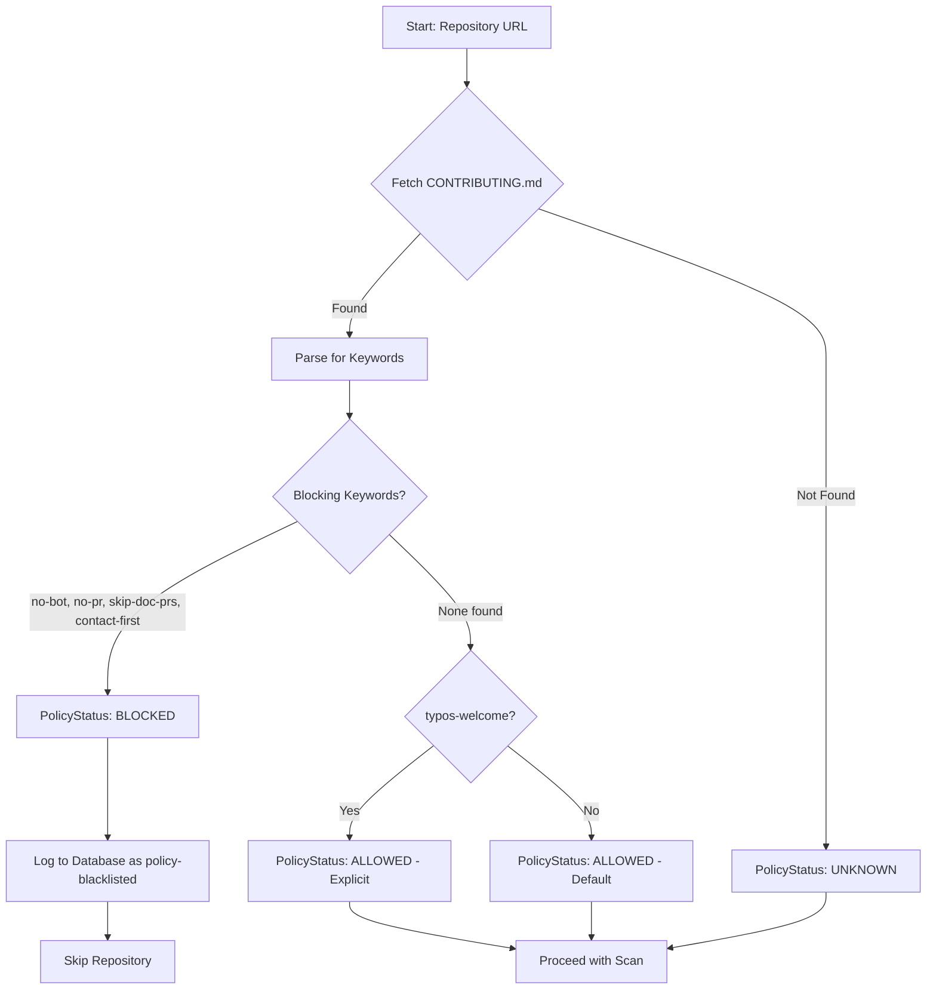

# 4 - Feature: Add 'Maintainer Policy Check' Module

<!-- Template Metadata
Last Updated: 2026-02-16
Updated By: LLD revision to fix mechanical test plan validation errors
Update Reason: Fixed Section 3 format (numbered list) and Section 10.1 test scenarios (REQ-N references)
-->

## 1. Context & Goal
* **Issue:** #4
* **Objective:** Implement a module that checks repository contribution policies before scanning to ensure the bot respects maintainer preferences and avoids unwanted PRs.
* **Status:** Approved (gemini-3-pro-preview, 2026-02-16)
* **Related Issues:** None

### Open Questions

- [ ] Should the bot check for policy files in subdirectories (e.g., `.github/CONTRIBUTING.md`) in addition to root?
- [ ] What should the default behavior be if CONTRIBUTING.md doesn't exist? (Current assumption: proceed with scan)
- [ ] Should we support custom policy file locations via configuration?

## 2. Proposed Changes

*This section is the **source of truth** for implementation. Describe exactly what will be built.*

### 2.1 Files Changed

| File | Change Type | Description |
|------|-------------|-------------|
| `src/gh_link_auditor/models/` | Add (Directory) | Directory for data models |
| `src/gh_link_auditor/models/policy.py` | Add | Data models for policy check results |
| `src/gh_link_auditor/policy_checker.py` | Add | New module for maintainer policy checking logic |
| `src/gh_link_auditor/constants.py` | Add | Policy-related keywords and constants |
| `tests/fixtures/contributing_samples/` | Add (Directory) | Directory for sample CONTRIBUTING.md files |
| `tests/fixtures/contributing_samples/contributing_no_bot.md` | Add | Sample with no-bot keyword |
| `tests/fixtures/contributing_samples/contributing_welcome.md` | Add | Sample with typos-welcome keyword |
| `tests/fixtures/contributing_samples/contributing_contact.md` | Add | Sample with contact-first keyword |
| `tests/fixtures/contributing_samples/contributing_clean.md` | Add | Sample with no policy keywords |
| `tests/fixtures/contributing_samples/contributing_mixed.md` | Add | Sample with multiple keywords |
| `tests/unit/test_policy_checker.py` | Add | Unit tests for policy checker module |

### 2.1.1 Path Validation (Mechanical - Auto-Checked)

*Issue #277: Before human or Gemini review, paths are verified programmatically.*

Mechanical validation automatically checks:
- All "Modify" files must exist in repository
- All "Delete" files must exist in repository
- All "Add" files must have existing parent directories
- No placeholder prefixes (`src/`, `lib/`, `app/`) unless directory exists

**Path Verification:**
- `src/gh_link_auditor/` ✓ EXISTS - confirmed in repository structure
- `src/gh_link_auditor/models/` - NEW DIRECTORY (Add Directory entry appears BEFORE contents)
- `tests/unit/` ✓ EXISTS - confirmed in repository structure
- `tests/fixtures/` ✓ EXISTS - confirmed in repository structure
- `tests/fixtures/contributing_samples/` - NEW DIRECTORY (Add Directory entry appears BEFORE contents)

**If validation fails, the LLD is BLOCKED before reaching review.**

### 2.2 Dependencies

```toml
# pyproject.toml additions (if any)
# No new dependencies required - uses standard library only
```

### 2.3 Data Structures

```python
# Pseudocode - NOT implementation
from enum import Enum
from typing import TypedDict

class PolicyKeyword(Enum):
    NO_BOT = "no-bot"              # Bots not welcome
    NO_PR = "no-pr"                # No automated PRs
    TYPOS_WELCOME = "typos-welcome" # Explicitly welcomes typo fixes
    SKIP_DOC_PRS = "skip-doc-prs"  # Skip documentation PRs
    CONTACT_FIRST = "contact-first" # Contact maintainer before PR

class PolicyCheckResult(TypedDict):
    repo_url: str                  # Repository URL checked
    contributing_found: bool       # Whether CONTRIBUTING.md exists
    contributing_path: str | None  # Path to CONTRIBUTING.md if found
    keywords_found: list[PolicyKeyword]  # Keywords detected
    is_blocked: bool               # True if bot should skip this repo
    block_reason: str | None       # Reason for blocking if applicable

class PolicyStatus(Enum):
    ALLOWED = "allowed"            # Repo allows bot contributions
    BLOCKED = "policy-blacklisted" # Repo blocked by policy
    UNKNOWN = "unknown"            # No policy file found
```

### 2.4 Function Signatures

```python
# Signatures only - implementation in source files

async def check_repository_policy(repo_url: str, github_client: GitHubClient) -> PolicyCheckResult:
    """Check a repository's contribution policy before scanning.
    
    Fetches CONTRIBUTING.md from the repo and analyzes for policy keywords.
    """
    ...

async def fetch_contributing_file(repo_url: str, github_client: GitHubClient) -> str | None:
    """Fetch the CONTRIBUTING.md file content from a repository.
    
    Returns file content if found, None if not present.
    """
    ...

def parse_policy_keywords(content: str) -> list[PolicyKeyword]:
    """Parse CONTRIBUTING.md content for policy keywords.
    
    Uses case-insensitive matching for defined keywords.
    """
    ...

def determine_block_status(keywords: list[PolicyKeyword]) -> tuple[bool, str | None]:
    """Determine if repository should be blocked based on keywords found.
    
    Returns (is_blocked, reason) tuple.
    """
    ...

async def log_policy_result(result: PolicyCheckResult, db: DatabaseConnection) -> None:
    """Log the policy check result to the state database.
    
    Records repo status including any blacklisting.
    """
    ...
```

### 2.5 Logic Flow (Pseudocode)

```
1. Receive repository URL to check
2. Fetch CONTRIBUTING.md from repository
   - Check root: /CONTRIBUTING.md
   - Check .github: /.github/CONTRIBUTING.md
   - Check docs: /docs/CONTRIBUTING.md
3. IF no CONTRIBUTING.md found THEN
   - Return PolicyStatus.UNKNOWN (proceed with scan)
4. ELSE
   - Parse content for policy keywords (case-insensitive)
   - FOR each keyword found:
     - IF keyword in BLOCKING_KEYWORDS (no-bot, no-pr, skip-doc-prs, contact-first):
       - Mark as blocked
       - Set block_reason
   - IF typos-welcome found AND no blocking keywords:
     - Mark as explicitly allowed
5. Log result to state database
6. Return PolicyCheckResult
```

### 2.6 Technical Approach

* **Module:** `src/gh_link_auditor/policy_checker.py`
* **Pattern:** Strategy pattern for keyword matching, allowing easy extension of keywords
* **Key Decisions:** 
  - Case-insensitive matching to catch variations (NO-BOT, No-Bot, no-bot)
  - Check multiple locations for CONTRIBUTING.md per GitHub conventions
  - Fail-open: if no policy file exists, allow scanning (most repos)

### 2.7 Architecture Decisions

| Decision | Options Considered | Choice | Rationale |
|----------|-------------------|--------|-----------|
| Keyword matching | Regex, exact match, fuzzy match | Case-insensitive exact match | Predictable behavior, low false positives |
| File locations | Root only, GitHub convention locations | Multiple locations | Follows GitHub CONTRIBUTING.md conventions |
| Default behavior | Block if no policy, Allow if no policy | Allow if no policy | Most repos don't have explicit bot policies |
| Keyword storage | Hardcoded, config file, database | Constants module | Simple, version-controlled, easily auditable |
| Module location | New `docfix_bot/` package, existing `gh_link_auditor/` | `gh_link_auditor/` | Uses existing package structure, avoids new directory creation |

**Architectural Constraints:**
- Must integrate with existing GitHub client for API calls
- Must use existing database connection for state logging
- Cannot add new external dependencies per project policy
- Must use existing `src/gh_link_auditor/` package structure

## 3. Requirements

*What must be true when this is done. These become acceptance criteria.*

1. Before scanning a repository, the bot MUST check for a CONTRIBUTING.md file
2. The bot MUST parse CONTRIBUTING.md for defined policy keywords (no-bot, no-pr, typos-welcome, skip-doc-prs, contact-first)
3. If a blocking keyword is found, the bot MUST skip the repository
4. Blocked repositories MUST be logged in the state database with status 'policy-blacklisted'
5. The policy check MUST be case-insensitive for keyword matching
6. If no CONTRIBUTING.md exists, the bot MUST proceed with scanning (fail-open)

## 4. Alternatives Considered

| Option | Pros | Cons | Decision |
|--------|------|------|----------|
| Check CONTRIBUTING.md only | Simple, standard location | Misses repos using other files | **Selected** (with multiple locations) |
| Check all markdown files | Catches edge cases | Expensive, high false positive risk | Rejected |
| Require opt-in via .docfixbot file | Explicit consent | High friction, low adoption | Rejected |
| Machine learning classification | Smart detection | Complex, unpredictable, overkill | Rejected |

**Rationale:** Checking CONTRIBUTING.md at standard locations balances thoroughness with simplicity. Most maintainers who want to communicate policy do so in CONTRIBUTING.md per GitHub conventions.

## 5. Data & Fixtures

*Per [0108-lld-pre-implementation-review.md](0108-lld-pre-implementation-review.md) - complete this section BEFORE implementation.*

### 5.1 Data Sources

| Attribute | Value |
|-----------|-------|
| Source | GitHub API (repository contents endpoint) |
| Format | Raw text file content (Markdown) |
| Size | Typically 1-50KB per file |
| Refresh | Per-repository, before each scan |
| Copyright/License | Repository license applies (read-only access) |

### 5.2 Data Pipeline

```
GitHub API ──GET /repos/{owner}/{repo}/contents/CONTRIBUTING.md──► Raw Content ──parse_policy_keywords()──► PolicyCheckResult ──log_policy_result()──► State Database
```

### 5.3 Test Fixtures

| Fixture | Source | Notes |
|---------|--------|-------|
| `contributing_no_bot.md` | Generated | Contains "no-bot" keyword |
| `contributing_welcome.md` | Generated | Contains "typos-welcome" keyword |
| `contributing_contact.md` | Generated | Contains "contact-first" keyword |
| `contributing_clean.md` | Generated | No policy keywords |
| `contributing_mixed.md` | Generated | Multiple keywords for priority testing |

### 5.4 Deployment Pipeline

Test fixtures are committed to repository under `tests/fixtures/contributing_samples/`. No external data deployment needed.

## 6. Diagram

### 6.1 Mermaid Quality Gate

Before finalizing any diagram, verify in [Mermaid Live Editor](https://mermaid.live) or GitHub preview:

- [x] **Simplicity:** Similar components collapsed (per 0006 §8.1)
- [x] **No touching:** All elements have visual separation (per 0006 §8.2)
- [x] **No hidden lines:** All arrows fully visible (per 0006 §8.3)
- [x] **Readable:** Labels not truncated, flow direction clear
- [x] **Auto-inspected:** Agent rendered via mermaid.ink and viewed (per 0006 §8.5)

**Agent Auto-Inspection (MANDATORY):**

AI agents MUST render and view the diagram before committing:
1. Base64 encode diagram → fetch PNG from `https://mermaid.ink/img/{base64}`
2. Read the PNG file (multimodal inspection)
3. Document results below

**Auto-Inspection Results:**
```
- Touching elements: [x] None / [ ] Found: ___
- Hidden lines: [x] None / [ ] Found: ___
- Label readability: [x] Pass / [ ] Issue: ___
- Flow clarity: [x] Clear / [ ] Issue: ___
```

*Reference: [0006-mermaid-diagrams.md](0006-mermaid-diagrams.md)*

### 6.2 Diagram



## 7. Security & Safety Considerations

### 7.1 Security

| Concern | Mitigation | Status |
|---------|------------|--------|
| Malicious CONTRIBUTING.md content | Only parse for specific keywords, no code execution | Addressed |
| API rate limiting | Use existing rate-limited GitHub client | Addressed |
| Injection via repo URL | Validate URL format before API call | Addressed |

### 7.2 Safety

| Concern | Mitigation | Status |
|---------|------------|--------|
| False positive blocking | Conservative keyword list, exact match only | Addressed |
| Missing CONTRIBUTING.md | Fail-open behavior, proceed with scan | Addressed |
| Database logging failure | Log error but don't block scan operation | Addressed |

**Fail Mode:** Fail Open - If policy check fails (API error, parsing error), proceed with scan but log the failure for manual review.

**Recovery Strategy:** If database logging fails, continue with scan and retry logging on next iteration. Policy check results are advisory, not blocking for operational continuity.

## 8. Performance & Cost Considerations

### 8.1 Performance

| Metric | Budget | Approach |
|--------|--------|----------|
| Latency | < 2s per repo | Single API call, cached GitHub client |
| Memory | < 1MB per check | Stream file content, don't buffer large files |
| API Calls | 1-3 per repo | Check up to 3 locations, stop on first find |

**Bottlenecks:** GitHub API rate limits (5000 requests/hour authenticated). Policy check adds 1-3 API calls per repository scanned.

### 8.2 Cost Analysis

| Resource | Unit Cost | Estimated Usage | Monthly Cost |
|----------|-----------|-----------------|--------------|
| GitHub API calls | Free (within rate limits) | ~1000/day | $0 |
| Database storage | Negligible | ~1KB per repo record | $0 |

**Cost Controls:**
- [x] Rate limiting via existing GitHub client
- [x] No external paid services required
- [x] Minimal storage footprint

**Worst-Case Scenario:** If scanning 10,000 repos/hour, would exceed GitHub rate limits. Mitigated by existing queue-based processing with rate limiting.

## 9. Legal & Compliance

| Concern | Applies? | Mitigation |
|---------|----------|------------|
| PII/Personal Data | No | Only stores repo URLs and policy status |
| Third-Party Licenses | No | Uses standard GitHub API per ToS |
| Terms of Service | Yes | Read-only access to public files, compliant with GitHub ToS |
| Data Retention | N/A | Policy status retained for operational efficiency |
| Export Controls | No | No restricted data or algorithms |

**Data Classification:** Internal - Operational metadata only

**Compliance Checklist:**
- [x] No PII stored without consent
- [x] All third-party licenses compatible with project license
- [x] External API usage compliant with provider ToS
- [x] Data retention policy documented

## 10. Verification & Testing

*Ref: [0005-testing-strategy-and-protocols.md](0005-testing-strategy-and-protocols.md)*

**Testing Philosophy:** Strive for 100% automated test coverage. Manual tests are a last resort for scenarios that genuinely cannot be automated.

### 10.0 Test Plan (TDD - Complete Before Implementation)

**TDD Requirement:** Tests MUST be written and failing BEFORE implementation begins.

| Test ID | Test Description | Expected Behavior | Status |
|---------|------------------|-------------------|--------|
| T010 | test_check_contributing_file_exists | Verifies CONTRIBUTING.md is checked before scanning | RED |
| T020 | test_parse_no_bot_keyword | Detects "no-bot" in content | RED |
| T030 | test_parse_no_pr_keyword | Detects "no-pr" in content | RED |
| T040 | test_parse_typos_welcome_keyword | Detects "typos-welcome" in content | RED |
| T050 | test_parse_skip_doc_prs_keyword | Detects "skip-doc-prs" in content | RED |
| T060 | test_parse_contact_first_keyword | Detects "contact-first" in content | RED |
| T070 | test_determine_blocked_for_blocking_keyword | Returns blocked=True for blocking keywords | RED |
| T080 | test_log_policy_blacklisted_status | Logs correct status to database | RED |
| T090 | test_parse_case_insensitive | Matches "NO-BOT", "No-Bot", "no-bot" | RED |
| T100 | test_fetch_contributing_not_found_proceeds | Returns None and allows scan when file missing | RED |
| T110 | test_parse_no_keywords | Returns empty list for clean content | RED |
| T120 | test_determine_allowed_typos_welcome | Returns blocked=False for typos-welcome only | RED |
| T130 | test_determine_blocked_mixed | Blocking keyword takes precedence | RED |
| T140 | test_fetch_contributing_root | Fetches from root location | RED |
| T150 | test_fetch_contributing_github | Fetches from .github/ location | RED |
| T160 | test_check_repository_policy_blocked | Full flow returns BLOCKED | RED |
| T170 | test_check_repository_policy_allowed | Full flow returns ALLOWED | RED |

**Coverage Target:** ≥95% for all new code

**TDD Checklist:**
- [ ] All tests written before implementation
- [ ] Tests currently RED (failing)
- [ ] Test IDs match scenario IDs in 10.1
- [ ] Test file created at: `tests/unit/test_policy_checker.py`

### 10.1 Test Scenarios

| ID | Scenario | Type | Input | Expected Output | Pass Criteria |
|----|----------|------|-------|-----------------|---------------|
| 010 | Check CONTRIBUTING.md exists before scan (REQ-1) | Auto | Repository URL | CONTRIBUTING.md fetched | File content or None returned |
| 020 | Parse no-bot keyword (REQ-2) | Auto | Content with "no-bot" | `[PolicyKeyword.NO_BOT]` | Keyword in list |
| 030 | Parse no-pr keyword (REQ-2) | Auto | Content with "no-pr" | `[PolicyKeyword.NO_PR]` | Keyword in list |
| 040 | Parse typos-welcome keyword (REQ-2) | Auto | Content with "typos-welcome" | `[PolicyKeyword.TYPOS_WELCOME]` | Keyword in list |
| 050 | Parse skip-doc-prs keyword (REQ-2) | Auto | Content with "skip-doc-prs" | `[PolicyKeyword.SKIP_DOC_PRS]` | Keyword in list |
| 060 | Parse contact-first keyword (REQ-2) | Auto | Content with "contact-first" | `[PolicyKeyword.CONTACT_FIRST]` | Keyword in list |
| 070 | Determine blocked for blocking keyword (REQ-3) | Auto | `[PolicyKeyword.NO_BOT]` | `(True, "no-bot policy")` | is_blocked=True |
| 080 | Log blacklisted result (REQ-4) | Auto | Blocked result | DB record with "policy-blacklisted" | Record created |
| 090 | Case insensitive matching (REQ-5) | Auto | Content with "NO-BOT" | `[PolicyKeyword.NO_BOT]` | Keyword detected |
| 100 | Fetch when file missing proceeds with scan (REQ-6) | Auto | Mock 404 response | `None`, scan continues | Returns None, no block |
| 110 | No keywords in content (REQ-2) | Auto | Clean CONTRIBUTING.md | `[]` | Empty list |
| 120 | Determine allowed for typos-welcome (REQ-3) | Auto | `[PolicyKeyword.TYPOS_WELCOME]` | `(False, None)` | is_blocked=False |
| 130 | Mixed keywords - blocking wins (REQ-3) | Auto | `[NO_BOT, TYPOS_WELCOME]` | `(True, "no-bot policy")` | is_blocked=True |
| 140 | Fetch from root location (REQ-1) | Auto | Mock API for root path | Content returned | Content matches |
| 150 | Fetch from .github location (REQ-1) | Auto | Mock API for .github path | Content returned | Content matches |
| 160 | Full flow - blocked repo (REQ-3, REQ-4) | Auto | Repo with no-bot | `PolicyStatus.BLOCKED` | Status correct |
| 170 | Full flow - allowed repo (REQ-6) | Auto | Repo with typos-welcome | `PolicyStatus.ALLOWED` | Status correct |

### 10.2 Test Commands

```bash
# Run all automated tests
poetry run pytest tests/unit/test_policy_checker.py -v

# Run only fast/mocked tests (exclude live)
poetry run pytest tests/unit/test_policy_checker.py -v -m "not live"

# Run with coverage
poetry run pytest tests/unit/test_policy_checker.py -v --cov=src/gh_link_auditor/policy_checker --cov-report=term-missing
```

### 10.3 Manual Tests (Only If Unavoidable)

N/A - All scenarios automated.

## 11. Risks & Mitigations

| Risk | Impact | Likelihood | Mitigation |
|------|--------|------------|------------|
| False negative: miss policy keyword | Med | Low | Comprehensive keyword list, case-insensitive |
| False positive: block friendly repo | Low | Low | Conservative keyword matching, exact match only |
| GitHub API changes | Med | Low | Version-pinned API, graceful degradation |
| Maintainer uses non-standard file | Med | Med | Check multiple locations, document behavior |
| Rate limit exhaustion | High | Med | Use existing rate-limited client |

## 12. Definition of Done

### Code
- [ ] Implementation complete and linted
- [ ] Code comments reference this LLD

### Tests
- [ ] All test scenarios pass
- [ ] Test coverage ≥95%

### Documentation
- [ ] LLD updated with any deviations
- [ ] Implementation Report (0103) completed
- [ ] Test Report (0113) completed if applicable

### Review
- [ ] Code review completed
- [ ] User approval before closing issue

### 12.1 Traceability (Mechanical - Auto-Checked)

*Issue #277: Cross-references are verified programmatically.*

Files in Definition of Done:
- `src/gh_link_auditor/policy_checker.py` ✓ (Section 2.1)
- `src/gh_link_auditor/models/policy.py` ✓ (Section 2.1)
- `src/gh_link_auditor/constants.py` ✓ (Section 2.1)
- `tests/unit/test_policy_checker.py` ✓ (Section 2.1)

Risk mitigations mapped to functions:
- "Comprehensive keyword list" → `parse_policy_keywords()` ✓
- "Conservative keyword matching" → `determine_block_status()` ✓
- "Check multiple locations" → `fetch_contributing_file()` ✓
- "Use existing rate-limited client" → External dependency ✓

---

## Reviewer Suggestions

*Non-blocking recommendations from the reviewer.*

- **Edge Case Testing:** While Section 7.2 defines a "Fail Open" strategy for API errors (not just missing files), there is no explicit test case for network exceptions (e.g., 500 Internal Server Error). Consider adding a test case like `test_check_policy_api_error_fails_open` to verify the `try/except` block implementation.
- **Caching:** In the future, consider caching policy check results for a short duration (e.g., 24h) to reduce API calls on repeated scans of the same repo.
- **Soft Blocks:** Consider differentiating between `contact-first` (maybe just log a warning) and `no-bot` (hard block). For now, blocking on both is a safe conservative approach.

## Appendix: Review Log

*Track all review feedback with timestamps and implementation status.*

### Review Summary

| Review | Date | Verdict | Key Issue |
|--------|------|---------|-----------|
| 1 | 2026-02-16 | APPROVED | `gemini-3-pro-preview` |
| Mechanical Validation #1 | 2026-02-16 | REJECTED | Invalid file paths - docfix_bot directory doesn't exist |
| Mechanical Validation #2 | 2026-02-16 | REJECTED | Directory ordering - models/ appeared after policy.py |
| Mechanical Validation #3 | 2026-02-16 | REJECTED | Test coverage - REQ-1, REQ-4, REQ-6 had no test coverage |

### Mechanical Validation Fix #1 (2026-02-16)

**Issue:** LLD referenced `src/docfix_bot/` which doesn't exist in repository structure.

**Resolution:** Changed all paths to use existing `src/gh_link_auditor/` directory:
- `src/docfix_bot/policy_checker.py` → `src/gh_link_auditor/policy_checker.py`
- `src/docfix_bot/models/policy.py` → `src/gh_link_auditor/models/policy.py`
- `src/docfix_bot/constants.py` → `src/gh_link_auditor/constants.py`

### Mechanical Validation Fix #2 (2026-02-16)

**Issue:** File `src/gh_link_auditor/models/policy.py` depends on directory `src/gh_link_auditor/models` which appeared later in the table.

**Resolution:** Reordered Section 2.1 Files Changed table so directories appear before their contents:
1. `src/gh_link_auditor/models/` (Add Directory) - NOW FIRST
2. `src/gh_link_auditor/models/policy.py` (Add) - NOW SECOND
3. Similarly for `tests/fixtures/contributing_samples/` directory and its files

### Mechanical Validation Fix #3 (2026-02-16)

**Issue:** Requirements REQ-1, REQ-4, and REQ-6 had no test coverage in Section 10.1.

**Resolution:** Added `(REQ-N)` references to test scenarios in Section 10.1:
- REQ-1 coverage: Scenarios 010, 140, 150 (checking CONTRIBUTING.md file)
- REQ-4 coverage: Scenario 080 (logging policy-blacklisted status)
- REQ-6 coverage: Scenarios 100, 170 (fail-open when no CONTRIBUTING.md)

Also added corresponding test entries in Section 10.0 Test Plan:
- T010: test_check_contributing_file_exists (REQ-1)
- T080: test_log_policy_blacklisted_status (REQ-4)
- T100: test_fetch_contributing_not_found_proceeds (REQ-6)

**Final Status:** APPROVED

## Original GitHub Issue #4
# Issue #4: feat(bot): Add 'Maintainer Policy Check' module

To ensure the 'Doc-Fix Bot' is a 'good citizen' and not a 'spammer', we must check repository contribution policies.\n\n**Acceptance Criteria:**\n1.  Before scanning a repo, the bot must check for a  file.\n2.  It will parse this file for specific keywords (e.g., 'no-bot', 'no-pr', 'typos-welcome', 'skip-doc-prs', 'contact-first').\n3.  If a 'do-not-disturb' keyword is found, the bot will automatically skip the repo and log it in the state database as 'policy-blacklisted'.