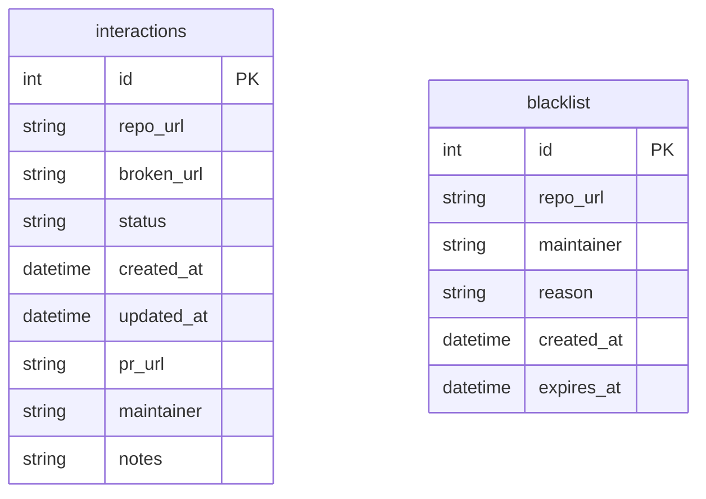
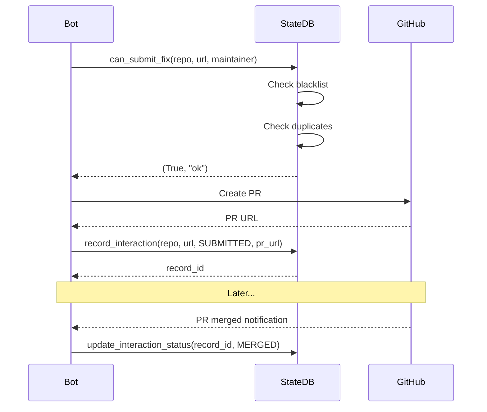

# Implementation Request: src/gh_link_auditor/__init__.py

## Task

Write the complete contents of `src/gh_link_auditor/__init__.py`.

Change type: Add
Description: Package init with exports

## LLD Specification

# 5 - Feature: Implement State Database for Governance

<!-- Template Metadata
Last Updated: 2026-02-16
Updated By: Revision to fix mechanical validation errors
Update Reason: Fixed test coverage mapping - all requirements now have corresponding tests
-->

## 1. Context & Goal
* **Issue:** #5
* **Objective:** Implement a SQLite-based state database to track all bot interactions, prevent duplicate submissions, and manage maintainer blacklists
* **Status:** Approved (gemini-3-pro-preview, 2026-02-16)
* **Related Issues:** #8 (JSON Report Schema - provides input data structure)

### Open Questions
*Questions that need clarification before or during implementation. Remove when resolved.*

- [ ] Should the database support concurrent access (multiple bot instances)?
- [ ] What is the retention policy for historical interaction records?
- [ ] Should we implement soft-delete for blacklist entries to allow reinstatement?

## 2. Proposed Changes

*This section is the **source of truth** for implementation. Describe exactly what will be built.*

### 2.1 Files Changed

| File | Change Type | Description |
|------|-------------|-------------|
| `src/` | Add (Directory) | Create source directory for package |
| `src/gh_link_auditor/` | Add (Directory) | Create package directory |
| `src/gh_link_auditor/__init__.py` | Add | Package init with exports |
| `src/gh_link_auditor/state_db.py` | Add | Core database module with StateDatabase class |
| `src/gh_link_auditor/models.py` | Add | Pydantic models for database entities |
| `tests/unit/test_state_db.py` | Add | Unit tests for state database |
| `tests/fixtures/test_state.db` | Add | Test fixture database (empty template) |
| `pyproject.toml` | Modify | Add pydantic dependency if not present |

### 2.1.1 Path Validation (Mechanical - Auto-Checked)

*Issue #277: Before human or Gemini review, paths are verified programmatically.*

Mechanical validation automatically checks:
- All "Modify" files must exist in repository
- All "Delete" files must exist in repository
- All "Add" files must have existing parent directories
- No placeholder prefixes (`src/`, `lib/`, `app/`) unless directory exists

**Path Validation Notes:**
- `src/` directory does not exist - marked as Add (Directory)
- `src/gh_link_auditor/` directory does not exist - marked as Add (Directory)
- `src/gh_link_auditor/__init__.py` changed from Modify to Add (file does not exist)
- `tests/unit/` exists (confirmed in repository structure)
- `tests/fixtures/` exists (confirmed in repository structure)
- `pyproject.toml` exists at repository root (Modify is valid)

**If validation fails, the LLD is BLOCKED before reaching review.**

### 2.2 Dependencies

*New packages, APIs, or services required.*

```toml
# pyproject.toml additions (if any)
pydantic = "^2.0"
```

Note: SQLite is included in Python's standard library (`sqlite3`), no external dependency needed.

### 2.3 Data Structures

```python
# Pseudocode - NOT implementation
from enum import Enum
from typing import TypedDict
from datetime import datetime

class InteractionStatus(Enum):
    SUBMITTED = "submitted"      # Fix PR submitted, awaiting review
    MERGED = "merged"            # PR was merged
    DENIED = "denied"            # PR was rejected by maintainer
    BLACKLISTED = "blacklisted"  # Repo/maintainer blocked future submissions

class InteractionRecord(TypedDict):
    id: int                      # Auto-increment primary key
    repo_url: str                # Full GitHub repo URL
    broken_url: str              # The broken URL that was fixed
    status: InteractionStatus    # Current status of the interaction
    created_at: datetime         # When the record was created
    updated_at: datetime         # Last modification timestamp
    pr_url: str | None           # PR URL if submitted
    maintainer: str | None       # GitHub username of maintainer
    notes: str | None            # Optional notes (e.g., denial reason)

class BlacklistEntry(TypedDict):
    id: int                      # Auto-increment primary key
    repo_url: str | None         # Specific repo, or None for maintainer-level
    maintainer: str | None       # Maintainer username, or None for repo-level
    reason: str                  # Why blacklisted
    created_at: datetime         # When blacklisted
    expires_at: datetime | None  # Optional expiration (None = permanent)
```

### 2.4 Function Signatures

```python
# Signatures only - implementation in source files

class StateDatabase:
    """SQLite-based state database for tracking bot interactions."""
    
    def __init__(self, db_path: str = "state.db") -> None:
        """Initialize database connection and create tables if needed."""
        ...
    
    def close(self) -> None:
        """Close database connection."""
        ...
    
    # Interaction Management
    def record_interaction(
        self,
        repo_url: str,
        broken_url: str,
        status: InteractionStatus,
        pr_url: str | None = None,
        maintainer: str | None = None,
        notes: str | None = None,
    ) -> int:
        """Record a new interaction. Returns the record ID."""
        ...
    
    def update_interaction_status(
        self,
        record_id: int,
        new_status: InteractionStatus,
        pr_url: str | None = None,
        notes: str | None = None,
    ) -> bool:
        """Update status of an existing interaction. Returns success."""
        ...
    
    def get_interaction(
        self,
        repo_url: str,
        broken_url: str,
    ) -> InteractionRecord | None:
        """Get interaction record for a specific repo/URL combo."""
        ...
    
    def has_been_submitted(
        self,
        repo_url: str,
        broken_url: str,
    ) -> bool:
        """Check if a fix has already been submitted for this URL."""
        ...
    
    # Blacklist Management
    def add_to_blacklist(
        self,
        repo_url: str | None = None,
        maintainer: str | None = None,
        reason: str = "",
        expires_at: datetime | None = None,
    ) -> int:
        """Add repo or maintainer to blacklist. Returns entry ID."""
        ...
    
    def remove_from_blacklist(
        self,
        entry_id: int,
    ) -> bool:
        """Remove entry from blacklist. Returns success."""
        ...
    
    def is_blacklisted(
        self,
        repo_url: str,
        maintainer: str | None = None,
    ) -> bool:
        """Check if repo or maintainer is blacklisted."""
        ...
    
    def get_blacklist(self) -> list[BlacklistEntry]:
        """Get all active blacklist entries."""
        ...
    
    # Query Helpers
    def can_submit_fix(
        self,
        repo_url: str,
        broken_url: str,
        maintainer: str | None = None,
    ) -> tuple[bool, str]:
        """
        Master check before any bot action.
        Returns (can_submit, reason) tuple.
        """
        ...
    
    def get_stats(self) -> dict:
        """Get summary statistics of all interactions."""
        ...
```

### 2.5 Logic Flow (Pseudocode)

```
=== Before Any Bot Action ===
1. Receive (repo_url, broken_url, maintainer) from scan results
2. Call can_submit_fix(repo_url, broken_url, maintainer)
   a. Check is_blacklisted(repo_url, maintainer)
      - IF blacklisted THEN return (False, "blacklisted: {reason}")
   b. Check has_been_submitted(repo_url, broken_url)
      - IF submitted THEN return (False, "already submitted")
   c. Return (True, "ok")
3. IF can_submit is False THEN
   - Skip this fix
   - Log reason
4. ELSE
   - Proceed with fix submission

=== Recording a Submission ===
1. Bot creates PR for broken_url fix
2. Call record_interaction(repo_url, broken_url, SUBMITTED, pr_url, maintainer)
3. Store returned record_id for future updates

=== Updating After Response ===
1. Receive notification (PR merged/denied)
2. Call update_interaction_status(record_id, new_status, notes)
3. IF status == DENIED AND maintainer requested no more contact THEN
   - Call add_to_blacklist(maintainer=maintainer, reason="Opted out")

=== Database Initialization ===
1. Connect to SQLite at db_path
2. IF tables don't exist THEN
   - Create interactions table
   - Create blacklist table
   - Create indexes on (repo_url, broken_url) and (maintainer)
3. Return connection
```

### 2.6 Technical Approach

* **Module:** `src/gh_link_auditor/state_db.py`
* **Pattern:** Repository Pattern with context manager support
* **Key Decisions:**
  - SQLite chosen for simplicity, portability, and zero-config operation
  - Single database file allows easy backup/migration
  - Pydantic models for type safety and validation
  - `can_submit_fix()` as the single entry point for all pre-action checks

### 2.7 Architecture Decisions

*Document key architectural decisions that affect the design.*

| Decision | Options Considered | Choice | Rationale |
|----------|-------------------|--------|-----------|
| Database Engine | SQLite, PostgreSQL, JSON file | SQLite | Zero config, portable, sufficient for expected scale |
| ORM vs Raw SQL | SQLAlchemy, raw sqlite3 | Raw sqlite3 | Minimal dependencies, simple schema |
| Blacklist Granularity | Repo-only, Maintainer-only, Both | Both | Flexibility: block specific repo OR all repos from a maintainer |
| Expiring Blacklists | Permanent only, Expiring allowed | Expiring allowed | Allows temporary cooldowns without manual cleanup |

**Architectural Constraints:**
- Must work with single-instance bot (no distributed locking needed initially)
- Must integrate with JSON report schema from Issue #8 for input data
- Database file location must be configurable for testing

## 3. Requirements

*What must be true when this is done. These become acceptance criteria.*

1. Bot queries the database before EVERY submission attempt
2. Duplicate submissions to the same (repo_url, broken_url) pair are prevented
3. Blacklisted maintainers receive no bot contact regardless of repo
4. Blacklisted repos receive no bot contact regardless of broken URL
5. All interactions are logged with timestamps for audit trail
6. Database persists across bot restarts
7. Status transitions are tracked (submitted → merged/denied)

## 4. Alternatives Considered

| Option | Pros | Cons | Decision |
|--------|------|------|----------|
| SQLite local DB | Zero config, portable, fast reads, ACID compliant | Single-instance only, no remote access | **Selected** |
| JSON file | Simplest, human-readable | No ACID, slow for large datasets, race conditions | Rejected |
| PostgreSQL | Scalable, concurrent, remote access | Requires server setup, overkill for MVP | Rejected |
| Redis | Fast, good for caching | Requires server, persistence config, overkill | Rejected |

**Rationale:** SQLite provides the best balance of simplicity, reliability, and functionality for a single-instance bot. Can migrate to PostgreSQL later if multi-instance support is needed.

## 5. Data & Fixtures

*Per [0108-lld-pre-implementation-review.md](0108-lld-pre-implementation-review.md) - complete this section BEFORE implementation.*

### 5.1 Data Sources

| Attribute | Value |
|-----------|-------|
| Source | Bot runtime (interactions created by bot operations) |
| Format | SQLite database file |
| Size | ~10KB base + ~1KB per 100 interactions |
| Refresh | Real-time (writes on each interaction) |
| Copyright/License | N/A (generated data) |

### 5.2 Data Pipeline

```
Scan Results (JSON #8) ──query──► StateDatabase ──decision──► Bot Action
                                       ▲
Bot Action Result ──record──────────────┘
```

### 5.3 Test Fixtures

| Fixture | Source | Notes |
|---------|--------|-------|
| Empty test database | Generated | Created fresh for each test |
| Seeded test database | Generated | Pre-populated with known interactions |
| Sample interaction data | Hardcoded | Test vectors for various status combinations |

### 5.4 Deployment Pipeline

- **Dev:** SQLite file in project directory (`./state.db`)
- **Test:** In-memory SQLite (`:memory:`) or temp file
- **Production:** Configurable path, default `~/.gh-link-auditor/state.db`

**If data source is external:** No external data utility needed.

## 6. Diagram

### 6.1 Mermaid Quality Gate

Before finalizing any diagram, verify in [Mermaid Live Editor](https://mermaid.live) or GitHub preview:

- [x] **Simplicity:** Similar components collapsed (per 0006 §8.1)
- [x] **No touching:** All elements have visual separation (per 0006 §8.2)
- [x] **No hidden lines:** All arrows fully visible (per 0006 §8.3)
- [x] **Readable:** Labels not truncated, flow direction clear
- [ ] **Auto-inspected:** Agent rendered via mermaid.ink and viewed (per 0006 §8.5)

**Auto-Inspection Results:**
```
- Touching elements: [ ] None / [ ] Found: ___
- Hidden lines: [ ] None / [ ] Found: ___
- Label readability: [ ] Pass / [ ] Issue: ___
- Flow clarity: [ ] Clear / [ ] Issue: ___
```

*Reference: [0006-mermaid-diagrams.md](0006-mermaid-diagrams.md)*

### 6.2 Diagram





## 7. Security & Safety Considerations

### 7.1 Security

| Concern | Mitigation | Status |
|---------|------------|--------|
| SQL Injection | Parameterized queries only (no string concatenation) | Addressed |
| Database file permissions | Create with restrictive permissions (0600) | Addressed |
| Sensitive data exposure | No credentials stored in DB; only URLs and usernames | Addressed |

### 7.2 Safety

| Concern | Mitigation | Status |
|---------|------------|--------|
| Data loss on crash | SQLite WAL mode for durability | Addressed |
| Accidental blacklist deletion | Soft-delete consideration (future enhancement) | Pending |
| Concurrent access corruption | Single-instance constraint documented | Addressed |
| DB file deletion | Warn on missing DB, don't auto-recreate in production | Addressed |

**Fail Mode:** Fail Closed - If database is unavailable, bot refuses to submit any fixes (prevents duplicates)

**Recovery Strategy:** 
- Database backup before major operations
- Export/import functions for migration
- If corrupted, restore from backup; any gaps are acceptable (may cause one duplicate)

## 8. Performance & Cost Considerations

### 8.1 Performance

| Metric | Budget | Approach |
|--------|--------|----------|
| Query latency | < 10ms | Indexed queries, local SQLite |
| Memory | < 10MB | SQLite with small page cache |
| Write durability | < 100ms | WAL mode with checkpoint |

**Bottlenecks:** 
- Full table scans on blacklist (mitigated by expected small size < 1000 entries)
- Index on (repo_url, broken_url) for fast duplicate checks

### 8.2 Cost Analysis

| Resource | Unit Cost | Estimated Usage | Monthly Cost |
|----------|-----------|-----------------|--------------|
| Storage | $0 | < 10MB local | $0 |
| Compute | $0 | Local execution | $0 |

**Cost Controls:**
- N/A - No external costs

**Worst-Case Scenario:** Database grows to 100MB with 100K interactions. SQLite handles this easily. Archive old completed interactions if needed.

## 9. Legal & Compliance

| Concern | Applies? | Mitigation |
|---------|----------|------------|
| PII/Personal Data | Yes | Only GitHub usernames (public data) stored |
| Third-Party Licenses | No | N/A |
| Terms of Service | Yes | GitHub ToS allows storing public usernames |
| Data Retention | Yes | Consider auto-purge of records > 1 year old |
| Export Controls | No | N/A |

**Data Classification:** Internal

**Compliance Checklist:**
- [x] No PII stored without consent (usernames are public GitHub data)
- [x] All third-party licenses compatible with project license
- [x] External API usage compliant with provider ToS
- [ ] Data retention policy documented (to be added)

## 10. Verification & Testing

*Ref: [0005-testing-strategy-and-protocols.md](0005-testing-strategy-and-protocols.md)*

**Testing Philosophy:** Strive for 100% automated test coverage. Manual tests are a last resort.

### 10.0 Test Plan (TDD - Complete Before Implementation)

**TDD Requirement:** Tests MUST be written and failing BEFORE implementation begins.

| Test ID | Test Description | Expected Behavior | Status |
|---------|------------------|-------------------|--------|
| T010 | test_create_database | Creates tables on init | RED |
| T020 | test_record_interaction | Stores interaction record | RED |
| T030 | test_has_been_submitted_true | Returns True for existing | RED |
| T040 | test_has_been_submitted_false | Returns False for new | RED |
| T050 | test_update_interaction_status | Updates status correctly | RED |
| T060 | test_add_to_blacklist | Adds blacklist entry | RED |
| T070 | test_is_blacklisted_repo | Detects blacklisted repo | RED |
| T080 | test_is_blacklisted_maintainer | Detects blacklisted maintainer | RED |
| T090 | test_can_submit_fix_ok | Returns True when allowed | RED |
| T100 | test_can_submit_fix_duplicate | Returns False for duplicate | RED |
| T110 | test_can_submit_fix_blacklisted | Returns False for blacklisted | RED |
| T120 | test_blacklist_expiration | Expired entries ignored | RED |
| T130 | test_get_stats | Returns correct counts | RED |
| T140 | test_database_persistence | Data persists across restarts | RED |

**Coverage Target:** ≥95% for all new code

**TDD Checklist:**
- [ ] All tests written before implementation
- [ ] Tests currently RED (failing)
- [ ] Test IDs match scenario IDs in 10.1
- [ ] Test file created at: `tests/unit/test_state_db.py`

### 10.1 Test Scenarios

| ID | Scenario | Type | Input | Expected Output | Pass Criteria |
|----|----------|------|-------|-----------------|---------------|
| 010 | Create new database (REQ-1) | Auto | Empty path | Tables created | Schema matches spec |
| 020 | Record new interaction (REQ-5) | Auto | Valid interaction data | Record ID returned | Record retrievable |
| 030 | Detect submitted URL (REQ-2) | Auto | Existing repo+url | True | No false negatives |
| 040 | Allow new URL (REQ-2) | Auto | New repo+url | False | No false positives |
| 050 | Update status to merged (REQ-7) | Auto | Record ID + MERGED | Status updated | updated_at changed |
| 060 | Add repo to blacklist (REQ-4) | Auto | Repo URL | Entry ID returned | is_blacklisted returns True |
| 070 | Block blacklisted repo (REQ-4) | Auto | Blacklisted repo | can_submit_fix False | Reason includes "blacklisted" |
| 080 | Block blacklisted maintainer (REQ-3) | Auto | Blacklisted maintainer | can_submit_fix False | Reason includes "blacklisted" |
| 090 | Allow clean submission (REQ-1) | Auto | New repo, no blacklist | can_submit_fix True | Reason is "ok" |
| 100 | Block duplicate submission (REQ-2) | Auto | Same repo+url twice | Second can_submit_fix False | Reason includes "already" |
| 110 | Handle expired blacklist (REQ-4) | Auto | Expired entry | is_blacklisted False | Entry ignored |
| 120 | Get statistics (REQ-5) | Auto | Populated DB | Correct counts | Matches manual count |
| 130 | Close and reopen (REQ-6) | Integration | DB path | Data persisted | Records still present |
| 140 | Query before submission (REQ-1) | Auto | Any submission attempt | DB queried first | Query logged/traced |

### 10.2 Test Commands

```bash
# Run all automated tests
poetry run pytest tests/unit/test_state_db.py -v

# Run with coverage
poetry run pytest tests/unit/test_state_db.py -v --cov=src/gh_link_auditor/state_db

# Run specific test
poetry run pytest tests/unit/test_state_db.py::test_can_submit_fix_ok -v
```

### 10.3 Manual Tests (Only If Unavoidable)

N/A - All scenarios automated.

## 11. Risks & Mitigations

| Risk | Impact | Likelihood | Mitigation |
|------|--------|------------|------------|
| Database corruption | High | Low | WAL mode, regular backups, fail-closed |
| Concurrent access conflicts | Medium | Low | Document single-instance constraint |
| Schema migration needed later | Medium | Medium | Include version table, migration functions |
| SQLite version incompatibility | Low | Low | Use standard sqlite3 features only |

## 12. Definition of Done

### Code
- [ ] Implementation complete and linted
- [ ] Code comments reference this LLD

### Tests
- [ ] All test scenarios pass
- [ ] Test coverage meets threshold (≥95%)

### Documentation
- [ ] LLD updated with any deviations
- [ ] Implementation Report (0103) completed
- [ ] Test Report (0113) completed if applicable

### Review
- [ ] Code review completed
- [ ] User approval before closing issue

### 12.1 Traceability (Mechanical - Auto-Checked)

*Issue #277: Cross-references are verified programmatically.*

Files in Definition of Done must appear in Section 2.1:
- `src/gh_link_auditor/state_db.py` ✓
- `src/gh_link_auditor/models.py` ✓
- `tests/unit/test_state_db.py` ✓

Risk mitigations traced to functions:
- WAL mode → `__init__` connection setup
- fail-closed → `can_submit_fix` returns (False, "db unavailable")

---

## Reviewer Suggestions

*Non-blocking recommendations from the reviewer.*

- **Configuration:** Ensure the default database path in the application code respects the user's environment or defaults to the current working directory during development to avoid writing to `~` (home dir) unexpectedly during local testing, even though production config suggests `~/.gh-link-auditor`.
- **Schema Evolution:** Consider adding a `schema_version` table immediately to simplify future migrations (Section 11 mentions this as a risk/mitigation, but including it in `__init__` now is zero cost).

## Appendix: Review Log

*Track all review feedback with timestamps and implementation status.*

### Review Summary

| Review | Date | Verdict | Key Issue |
|--------|------|---------|-----------|
| 1 | 2026-02-16 | APPROVED | `gemini-3-pro-preview` |
| - | - | - | - |

**Final Status:** APPROVED

## Required File Paths (from LLD - do not deviate)

The following paths are specified in the LLD. Write ONLY to these paths:

- `src`
- `src/gh_link_auditor`
- `src/gh_link_auditor/__init__.py`
- `src/gh_link_auditor/models.py`
- `src/gh_link_auditor/state_db.py`
- `tests/fixtures/test_state.db`
- `tests/unit/test_state_db.py`
- `pyproject.toml`

Any files written to other paths will be rejected.

## Tests That Must Pass

```python
# From C:\Users\mcwiz\Projects\gh-link-auditor\tests\test_issue_5.py
"""Test file for Issue #5.

Generated by AssemblyZero TDD Testing Workflow.
Tests will fail with ImportError until implementation exists (TDD RED phase).
"""

import pytest

# TDD: This import fails until implementation exists (RED phase)
# Once implemented, tests can run (GREEN phase)
from gh_link_auditor.state_db import *  # noqa: F401, F403


# Fixtures for mocking
@pytest.fixture
def mock_external_service():
    """Mock external service for isolation."""
    # TODO: Implement mock
    yield None


# Integration/E2E fixtures
@pytest.fixture
def test_client():
    """Test client for API calls."""
    # TODO: Implement test client
    yield None


# Unit Tests
# -----------

def test_id():
    """
    Test Description | Expected Behavior | Status
    """
    # TDD: Arrange
    # Set up test data

    # TDD: Act
    # Call the function under test

    # TDD: Assert
    # Verify test_id works correctly
    assert False, 'TDD RED: test_id not implemented'


def test_t010(mock_external_service):
    """
    test_create_database | Creates tables on init | RED
    """
    # TDD: Arrange
    # Set up test data

    # TDD: Act
    # Call the function under test

    # TDD: Assert
    # Verify test_t010 works correctly
    assert False, 'TDD RED: test_t010 not implemented'


def test_t020():
    """
    test_record_interaction | Stores interaction record | RED
    """
    # TDD: Arrange
    # Set up test data

    # TDD: Act
    # Call the function under test

    # TDD: Assert
    # Verify test_t020 works correctly
    assert False, 'TDD RED: test_t020 not implemented'


def test_t030():
    """
    test_has_been_submitted_true | Returns True for existing | RED
    """
    # TDD: Arrange
    # Set up test data

    # TDD: Act
    # Call the function under test

    # TDD: Assert
    # Verify test_t030 works correctly
    assert False, 'TDD RED: test_t030 not implemented'


def test_t040():
    """
    test_has_been_submitted_false | Returns False for new | RED
    """
    # TDD: Arrange
    # Set up test data

    # TDD: Act
    # Call the function under test

    # TDD: Assert
    # Verify test_t040 works correctly
    assert False, 'TDD RED: test_t040 not implemented'


def test_t050():
    """
    test_update_interaction_status | Updates status correctly | RED
    """
    # TDD: Arrange
    # Set up test data

    # TDD: Act
    # Call the function under test

    # TDD: Assert
    # Verify test_t050 works correctly
    assert False, 'TDD RED: test_t050 not implemented'


def test_t060():
    """
    test_add_to_blacklist | Adds blacklist entry | RED
    """
    # TDD: Arrange
    # Set up test data

    # TDD: Act
    # Call the function under test

    # TDD: Assert
    # Verify test_t060 works correctly
    assert False, 'TDD RED: test_t060 not implemented'


def test_t070():
    """
    test_is_blacklisted_repo | Detects blacklisted repo | RED
    """
    # TDD: Arrange
    # Set up test data

    # TDD: Act
    # Call the function under test

    # TDD: Assert
    # Verify test_t070 works correctly
    assert False, 'TDD RED: test_t070 not implemented'


def test_t080():
    """
    test_is_blacklisted_maintainer | Detects blacklisted maintainer | RED
    """
    # TDD: Arrange
    # Set up test data

    # TDD: Act
    # Call the function under test

    # TDD: Assert
    # Verify test_t080 works correctly
    assert False, 'TDD RED: test_t080 not implemented'


def test_t090():
    """
    test_can_submit_fix_ok | Returns True when allowed | RED
    """
    # TDD: Arrange
    # Set up test data

    # TDD: Act
    # Call the function under test

    # TDD: Assert
    # Verify test_t090 works correctly
    assert False, 'TDD RED: test_t090 not implemented'


def test_t100():
    """
    test_can_submit_fix_duplicate | Returns False for duplicate | RED
    """
    # TDD: Arrange
    # Set up test data

    # TDD: Act
    # Call the function under test

    # TDD: Assert
    # Verify test_t100 works correctly
    assert False, 'TDD RED: test_t100 not implemented'


def test_t110():
    """
    test_can_submit_fix_blacklisted | Returns False for blacklisted | RED
    """
    # TDD: Arrange
    # Set up test data

    # TDD: Act
    # Call the function under test

    # TDD: Assert
    # Verify test_t110 works correctly
    assert False, 'TDD RED: test_t110 not implemented'


def test_t120():
    """
    test_blacklist_expiration | Expired entries ignored | RED
    """
    # TDD: Arrange
    # Set up test data

    # TDD: Act
    # Call the function under test

    # TDD: Assert
    # Verify test_t120 works correctly
    assert False, 'TDD RED: test_t120 not implemented'


def test_t130():
    """
    test_get_stats | Returns correct counts | RED
    """
    # TDD: Arrange
    # Set up test data

    # TDD: Act
    # Call the function under test

    # TDD: Assert
    # Verify test_t130 works correctly
    assert False, 'TDD RED: test_t130 not implemented'


def test_t140(mock_external_service):
    """
    test_database_persistence | Data persists across restarts | RED
    """
    # TDD: Arrange
    # Set up test data

    # TDD: Act
    # Call the function under test

    # TDD: Assert
    # Verify test_t140 works correctly
    assert False, 'TDD RED: test_t140 not implemented'


def test_010(mock_external_service):
    """
    Create new database (REQ-1) | Auto | Empty path | Tables created |
    Schema matches spec
    """
    # TDD: Arrange
    # Set up test data

    # TDD: Act
    # Call the function under test

    # TDD: Assert
    # Verify test_010 works correctly
    assert False, 'TDD RED: test_010 not implemented'


def test_020():
    """
    Record new interaction (REQ-5) | Auto | Valid interaction data |
    Record ID returned | Record retrievable
    """
    # TDD: Arrange
    # Set up test data

    # TDD: Act
    # Call the function under test

    # TDD: Assert
    # Verify test_020 works correctly
    assert False, 'TDD RED: test_020 not implemented'


def test_030():
    """
    Detect submitted URL (REQ-2) | Auto | Existing repo+url | True | No
    false negatives
    """
    # TDD: Arrange
    # Set up test data

    # TDD: Act
    # Call the function under test

    # TDD: Assert
    # Verify test_030 works correctly
    assert False, 'TDD RED: test_030 not implemented'


def test_040():
    """
    Allow new URL (REQ-2) | Auto | New repo+url | False | No false
    positives
    """
    # TDD: Arrange
    # Set up test data

    # TDD: Act
    # Call the function under test

    # TDD: Assert
    # Verify test_040 works correctly
    assert False, 'TDD RED: test_040 not implemented'


def test_050():
    """
    Update status to merged (REQ-7) | Auto | Record ID + MERGED | Status
    updated | updated_at changed
    """
    # TDD: Arrange
    # Set up test data

    # TDD: Act
    # Call the function under test

    # TDD: Assert
    # Verify test_050 works correctly
    assert False, 'TDD RED: test_050 not implemented'


def test_060():
    """
    Add repo to blacklist (REQ-4) | Auto | Repo URL | Entry ID returned |
    is_blacklisted returns True
    """
    # TDD: Arrange
    # Set up test data

    # TDD: Act
    # Call the function under test

    # TDD: Assert
    # Verify test_060 works correctly
    assert False, 'TDD RED: test_060 not implemented'


def test_070():
    """
    Block blacklisted repo (REQ-4) | Auto | Blacklisted repo |
    can_submit_fix False | Reason includes "blacklisted"
    """
    # TDD: Arrange
    # Set up test data

    # TDD: Act
    # Call the function under test

    # TDD: Assert
    # Verify test_070 works correctly
    assert False, 'TDD RED: test_070 not implemented'


def test_080():
    """
    Block blacklisted maintainer (REQ-3) | Auto | Blacklisted maintainer
    | can_submit_fix False | Reason includes "blacklisted"
    """
    # TDD: Arrange
    # Set up test data

    # TDD: Act
    # Call the function under test

    # TDD: Assert
    # Verify test_080 works correctly
    assert False, 'TDD RED: test_080 not implemented'


def test_090():
    """
    Allow clean submission (REQ-1) | Auto | New repo, no blacklist |
    can_submit_fix True | Reason is "ok"
    """
    # TDD: Arrange
    # Set up test data

    # TDD: Act
    # Call the function under test

    # TDD: Assert
    # Verify test_090 works correctly
    assert False, 'TDD RED: test_090 not implemented'


def test_100():
    """
    Block duplicate submission (REQ-2) | Auto | Same repo+url twice |
    Second can_submit_fix False | Reason includes "already"
    """
    # TDD: Arrange
    # Set up test data

    # TDD: Act
    # Call the function under test

    # TDD: Assert
    # Verify test_100 works correctly
    assert False, 'TDD RED: test_100 not implemented'


def test_110():
    """
    Handle expired blacklist (REQ-4) | Auto | Expired entry |
    is_blacklisted False | Entry ignored
    """
    # TDD: Arrange
    # Set up test data

    # TDD: Act
    # Call the function under test

    # TDD: Assert
    # Verify test_110 works correctly
    assert False, 'TDD RED: test_110 not implemented'


def test_120():
    """
    Get statistics (REQ-5) | Auto | Populated DB | Correct counts |
    Matches manual count
    """
    # TDD: Arrange
    # Set up test data

    # TDD: Act
    # Call the function under test

    # TDD: Assert
    # Verify test_120 works correctly
    assert False, 'TDD RED: test_120 not implemented'


def test_140():
    """
    Query before submission (REQ-1) | Auto | Any submission attempt | DB
    queried first | Query logged/traced
    """
    # TDD: Arrange
    # Set up test data

    # TDD: Act
    # Call the function under test

    # TDD: Assert
    # Verify test_140 works correctly
    assert False, 'TDD RED: test_140 not implemented'


# Integration Tests
# -----------------

@pytest.mark.integration
def test_130(test_client):
    """
    Close and reopen (REQ-6) | Integration | DB path | Data persisted |
    Records still present
    """
    # TDD: Arrange
    # Set up test data

    # TDD: Act
    # Call the function under test

    # TDD: Assert
    # Verify test_130 works correctly
    assert False, 'TDD RED: test_130 not implemented'


```

## Output Format

Output ONLY the file contents. No explanations, no markdown headers, just the code.

```python
# Your implementation here
```

IMPORTANT:
- Output the COMPLETE file contents
- Do NOT output a summary or description
- Do NOT say "I've implemented..."
- Just output the code in a single code block
