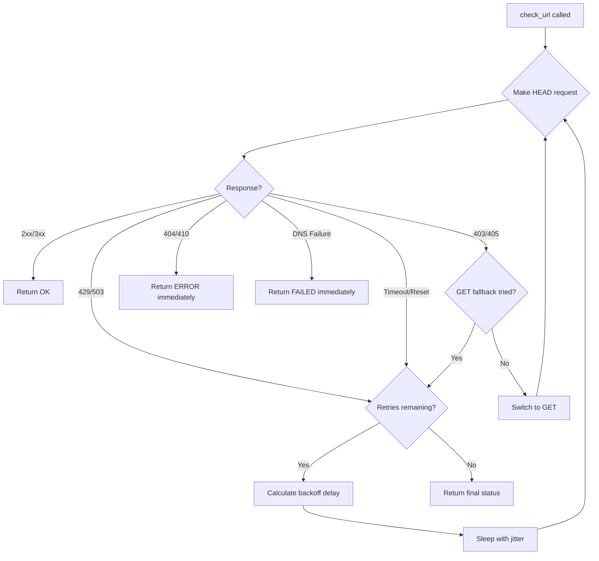

# 9 - Feature: Implement Request Wrapper Module

<!-- Template Metadata
Last Updated: 2026-02-16
Updated By: LLD Generation
Update Reason: Fixed mechanical validation errors - added requirement references to test scenarios
-->

## 1. Context & Goal
* **Issue:** #9
* **Objective:** Create a core `network.py` module to abstract `urllib` complexity and header management for HTTP requests.
* **Status:** Approved (gemini-3-pro-preview, 2026-02-16)
* **Related Issues:** #7 (Anti-Bot Backoff Algorithm), #8 (JSON Report Schema)

### Open Questions

- [x] Should the module support async operations? **Decision: No, synchronous only for MVP. Concurrency can be added later.**
- [x] Should SSL verification be configurable? **Decision: Yes, with secure defaults (verify=True) but allow override.**

## 2. Proposed Changes

*This section is the **source of truth** for implementation. Describes exactly what will be built.*

### 2.1 Files Changed

| File | Change Type | Description |
|------|-------------|-------------|
| `src/gh_link_auditor/` | Add (Directory) | New package directory for link auditor module |
| `src/gh_link_auditor/__init__.py` | Add | Package init file |
| `src/gh_link_auditor/network.py` | Add | Core HTTP request wrapper module |
| `tests/unit/test_network.py` | Add | Unit tests for network module |

### 2.1.1 Path Validation (Mechanical - Auto-Checked)

*Issue #277: Before human or Gemini review, paths are verified programmatically.*

Mechanical validation automatically checks:
- All "Modify" files must exist in repository
- All "Delete" files must exist in repository
- All "Add" files must have existing parent directories
- No placeholder prefixes (`src/`, `lib/`, `app/`) unless directory exists

**If validation fails, the LLD is BLOCKED before reaching review.**

### 2.2 Dependencies

*No new external dependencies required. Uses Python standard library only.*

```toml
# pyproject.toml additions (if any)
# None - using stdlib only (urllib, ssl, http.client)
```

### 2.3 Data Structures

```python
# Pseudocode - NOT implementation
from typing import TypedDict

class RequestConfig(TypedDict):
    """Configuration for HTTP requests."""
    timeout: float           # Request timeout in seconds (default: 10.0)
    verify_ssl: bool         # Whether to verify SSL certificates (default: True)
    user_agent: str          # User-Agent header value

class BackoffConfig(TypedDict):
    """Configuration for retry backoff per 00007."""
    base_delay: float        # Initial delay in seconds (default: 1.0)
    max_delay: float         # Maximum delay ceiling (default: 30.0)
    max_retries: int         # Maximum retry attempts (default: 2)
    jitter_range: float      # Random jitter 0 to this value (default: 1.0)

class RequestResult(TypedDict):
    """Result of an HTTP request."""
    url: str                 # The requested URL
    status: str              # ok, error, timeout, failed, disconnected, invalid
    status_code: int | None  # HTTP status code or None
    method: str              # HEAD or GET
    response_time_ms: int | None  # Response time in milliseconds
    retries: int             # Number of retries attempted
    error: str | None        # Error description if not ok
```

### 2.4 Function Signatures

```python
# Signatures only - implementation in source files

def create_request_config(
    timeout: float = 10.0,
    verify_ssl: bool = True,
    user_agent: str | None = None,
) -> RequestConfig:
    """Create a request configuration with sensible defaults."""
    ...

def create_backoff_config(
    base_delay: float = 1.0,
    max_delay: float = 30.0,
    max_retries: int = 2,
    jitter_range: float = 1.0,
) -> BackoffConfig:
    """Create a backoff configuration per standard 00007."""
    ...

def calculate_backoff_delay(
    attempt: int,
    config: BackoffConfig,
    retry_after: int | None = None,
) -> float:
    """Calculate delay for a retry attempt with exponential backoff and jitter."""
    ...

def should_retry(status_code: int | None, error_type: str | None) -> tuple[bool, bool]:
    """
    Determine if a request should be retried based on response.
    
    Returns:
        (should_retry: bool, try_get_fallback: bool)
    """
    ...

def check_url(
    url: str,
    request_config: RequestConfig | None = None,
    backoff_config: BackoffConfig | None = None,
) -> RequestResult:
    """
    Check a single URL with retry logic and HEAD→GET fallback.
    
    Implements the full request flow per standards 00007 and 00008.
    """
    ...

def _make_request(
    url: str,
    method: str,
    config: RequestConfig,
) -> tuple[int | None, str | None, int | None]:
    """
    Make a single HTTP request (internal helper).
    
    Returns:
        (status_code, error_type, response_time_ms)
    """
    ...

def _create_ssl_context(verify: bool) -> ssl.SSLContext:
    """Create an SSL context with the specified verification setting."""
    ...

def _parse_retry_after(header_value: str | None) -> int | None:
    """Parse Retry-After header value to seconds."""
    ...
```

### 2.5 Logic Flow (Pseudocode)

```
check_url(url):
1. Initialize request_config and backoff_config with defaults if not provided
2. Set method = "HEAD"
3. Set retries = 0
4. Set get_fallback_attempted = False

5. LOOP (max_retries + 1 times):
   a. Call _make_request(url, method, request_config)
   b. IF success (2xx/3xx):
      - RETURN RequestResult(status="ok", ...)
   
   c. IF 405 or 403 AND NOT get_fallback_attempted:
      - Set method = "GET"
      - Set get_fallback_attempted = True
      - CONTINUE (don't count as retry)
   
   d. IF 404 or 410:
      - RETURN RequestResult(status="error", ...) immediately
   
   e. IF 429 or 503 or timeout or connection_reset:
      - IF retries < max_retries:
        - Calculate delay with backoff
        - Honor Retry-After header if present
        - Sleep(delay)
        - Increment retries
        - CONTINUE
      - ELSE:
        - RETURN RequestResult with final status
   
   f. IF DNS failure or other permanent error:
      - RETURN RequestResult(status="failed", ...) immediately

6. RETURN RequestResult with final status after exhausting retries
```

### 2.6 Technical Approach

* **Module:** `src/gh_link_auditor/network.py`
* **Pattern:** Configuration objects with factory functions for testability
* **Key Decisions:**
  - Pure functions where possible for testability
  - Separate configuration from execution
  - Internal helpers prefixed with underscore
  - No global state; all configuration passed explicitly

### 2.7 Architecture Decisions

| Decision | Options Considered | Choice | Rationale |
|----------|-------------------|--------|-----------|
| State management | Class-based, Function-based with config | Function-based with config | Simpler, more testable, no hidden state |
| SSL context | Global default, Per-request | Per-request | Allows flexibility without global mutation |
| Error representation | Exceptions, Status codes, Result objects | Result objects | Matches 00008 schema, easier to aggregate |
| User-Agent | Hardcoded, Configurable | Configurable with default | Allows customization while providing sensible default |

**Architectural Constraints:**
- Must use only Python standard library (urllib, ssl, http.client)
- Must implement backoff algorithm per standard 00007
- Must produce results compatible with schema 00008

## 3. Requirements

*What must be true when this is done. These become acceptance criteria.*

1. Module provides `check_url()` function that returns structured results matching 00008 schema
2. Implements exponential backoff with jitter per standard 00007
3. Supports HEAD→GET fallback for 403/405 responses
4. Respects Retry-After headers on 429 responses
5. Allows configurable timeout, SSL verification, and User-Agent
6. Correctly categorizes all response types (ok, error, timeout, failed, disconnected, invalid)
7. No external dependencies beyond Python standard library

## 4. Alternatives Considered

| Option | Pros | Cons | Decision |
|--------|------|------|----------|
| urllib3 + requests | Simpler API, battle-tested | External dependency, heavier | **Rejected** |
| httpx | Modern async support, clean API | External dependency, overkill for sync-only | **Rejected** |
| Pure urllib (current) | No dependencies, full control | More verbose, manual retries | **Selected** |
| aiohttp | Async native, efficient | External dep, requires async throughout | **Rejected** |

**Rationale:** The project prioritizes minimal dependencies. The reference `check_links.py` already demonstrates urllib is sufficient. Abstracting the complexity into a clean module provides the benefits without external deps.

## 5. Data & Fixtures

### 5.1 Data Sources

| Attribute | Value |
|-----------|-------|
| Source | HTTP endpoints (arbitrary URLs from scanned files) |
| Format | HTTP responses |
| Size | Variable (typically metadata only via HEAD) |
| Refresh | Real-time per request |
| Copyright/License | N/A |

### 5.2 Data Pipeline

```
URL ──check_url()──► HTTP Request ──response parsing──► RequestResult
```

### 5.3 Test Fixtures

| Fixture | Source | Notes |
|---------|--------|-------|
| Mock HTTP responses | Generated via unittest.mock | No external calls in unit tests |
| Retry-After headers | Hardcoded test values | Cover integer and HTTP-date formats |
| Error scenarios | Simulated via mock side_effects | Cover all error types |

### 5.4 Deployment Pipeline

Unit tests run with mocked responses. Integration tests (marked `live`) may hit real URLs but are optional.

**If data source is external:** No separate utility needed; the module IS the utility.

## 6. Diagram

### 6.1 Mermaid Quality Gate

Before finalizing any diagram, verify in [Mermaid Live Editor](https://mermaid.live) or GitHub preview:

- [x] **Simplicity:** Similar components collapsed (per 0006 §8.1)
- [x] **No touching:** All elements have visual separation (per 0006 §8.2)
- [x] **No hidden lines:** All arrows fully visible (per 0006 §8.3)
- [x] **Readable:** Labels not truncated, flow direction clear
- [ ] **Auto-inspected:** Agent rendered via mermaid.ink and viewed (per 0006 §8.5)

**Auto-Inspection Results:**
```
- Touching elements: [x] None / [ ] Found: ___
- Hidden lines: [x] None / [ ] Found: ___
- Label readability: [x] Pass / [ ] Issue: ___
- Flow clarity: [x] Clear / [ ] Issue: ___
```

*Reference: [0006-mermaid-diagrams.md](0006-mermaid-diagrams.md)*

### 6.2 Diagram



## 7. Security & Safety Considerations

### 7.1 Security

| Concern | Mitigation | Status |
|---------|------------|--------|
| SSL verification bypass | Default verify_ssl=True; bypass requires explicit opt-in | Addressed |
| User-Agent spoofing | Configurable but defaults to honest identifier | Addressed |
| URL injection | URLs come from file scanning, not user input directly | Addressed |
| SSRF (Server-Side Request Forgery) | Out of scope for link checker; URLs from local files only | N/A |

### 7.2 Safety

| Concern | Mitigation | Status |
|---------|------------|--------|
| Runaway retries | max_retries cap (default: 2) | Addressed |
| Resource exhaustion | Timeout on all requests (default: 10s) | Addressed |
| Hammering single host | Per-domain rate limiting in future issue | Pending (future scope) |

**Fail Mode:** Fail Closed - On unexpected errors, returns `invalid` status rather than continuing

**Recovery Strategy:** Each URL check is independent; one failure doesn't affect others

## 8. Performance & Cost Considerations

### 8.1 Performance

| Metric | Budget | Approach |
|--------|--------|----------|
| Latency per URL | < 30s worst case | Timeout + max 2 retries with backoff |
| Memory per request | < 1MB | HEAD requests return no body; GET limited by response |
| Connection reuse | N/A for MVP | Future: connection pooling |

**Bottlenecks:** Sequential processing; concurrency deferred to future issue

### 8.2 Cost Analysis

| Resource | Unit Cost | Estimated Usage | Monthly Cost |
|----------|-----------|-----------------|--------------|
| Network bandwidth | ~0 | HEAD requests only | $0 |
| Compute time | N/A (local) | N/A | $0 |

**Cost Controls:**
- [x] No external paid services used
- [x] Timeout prevents stuck connections
- [x] Retry limits prevent infinite loops

**Worst-Case Scenario:** Scanning a file with 1000 URLs, each timing out with max retries = 1000 × 3 × 10s = 8.3 hours. Mitigation: Add concurrency in future issue.

## 9. Legal & Compliance

| Concern | Applies? | Mitigation |
|---------|----------|------------|
| PII/Personal Data | No | Only URL strings processed |
| Third-Party Licenses | No | stdlib only |
| Terms of Service | Yes | Respectful request patterns via backoff |
| Data Retention | No | Results returned, not persisted by this module |
| Export Controls | No | No restricted algorithms |

**Data Classification:** Public - operates on URLs which are public by nature

**Compliance Checklist:**
- [x] No PII stored without consent
- [x] All third-party licenses compatible with project license
- [x] External API usage compliant with provider ToS (via respectful backoff)
- [x] Data retention policy documented (N/A - no persistence)

## 10. Verification & Testing

*Ref: [0005-testing-strategy-and-protocols.md](0005-testing-strategy-and-protocols.md)*

**Testing Philosophy:** 100% automated test coverage for all network module logic using mocked HTTP responses.

### 10.0 Test Plan (TDD - Complete Before Implementation)

**TDD Requirement:** Tests MUST be written and failing BEFORE implementation begins.

| Test ID | Test Description | Expected Behavior | Status |
|---------|------------------|-------------------|--------|
| T010 | test_check_url_success_head | Returns ok status for 200 response | RED |
| T020 | test_check_url_redirect | Returns ok status for 301/302 | RED |
| T030 | test_check_url_not_found | Returns error status for 404 | RED |
| T040 | test_check_url_server_error | Returns error status for 500 | RED |
| T050 | test_head_to_get_fallback_405 | Falls back to GET on 405 | RED |
| T060 | test_head_to_get_fallback_403 | Falls back to GET on 403 | RED |
| T070 | test_retry_on_429 | Retries with backoff on 429 | RED |
| T080 | test_retry_respects_retry_after | Uses Retry-After header value | RED |
| T090 | test_timeout_handling | Returns timeout status | RED |
| T100 | test_connection_reset | Returns disconnected status | RED |
| T110 | test_dns_failure | Returns failed status, no retry | RED |
| T120 | test_backoff_calculation | Correct exponential + jitter | RED |
| T130 | test_max_retries_honored | Stops after max_retries | RED |
| T140 | test_custom_user_agent | Sends configured User-Agent | RED |
| T150 | test_ssl_verification_configurable | Respects verify_ssl setting | RED |

**Coverage Target:** ≥95% for all new code

**TDD Checklist:**
- [ ] All tests written before implementation
- [ ] Tests currently RED (failing)
- [ ] Test IDs match scenario IDs in 10.1
- [ ] Test file created at: `tests/unit/test_network.py`

### 10.1 Test Scenarios

| ID | Scenario | Type | Input | Expected Output | Pass Criteria |
|----|----------|------|-------|-----------------|---------------|
| 010 | Successful HEAD request returns structured result (REQ-1) | Auto | URL returning 200 | status="ok", code=200 | Status and code match |
| 020 | Redirect response treated as success (REQ-1) | Auto | URL returning 301 | status="ok", code=301 | Redirects treated as success |
| 030 | Not found response returns error immediately (REQ-6) | Auto | URL returning 404 | status="error", code=404 | No retry attempted |
| 040 | Server error response categorized correctly (REQ-6) | Auto | URL returning 500 | status="error", code=500 | Correct status |
| 050 | HEAD blocked 405 triggers GET fallback (REQ-3) | Auto | URL returning 405 then 200 on GET | status="ok", method="GET" | Fallback to GET works |
| 060 | HEAD blocked 403 triggers GET fallback (REQ-3) | Auto | URL returning 403 then 200 on GET | status="ok", method="GET" | Fallback to GET works |
| 070 | Rate limited 429 triggers exponential backoff retry (REQ-2) | Auto | URL returning 429 twice then 200 | status="ok", retries=2 | Backoff applied |
| 080 | Retry-After header honored on 429 response (REQ-4) | Auto | 429 with Retry-After: 5 | Delay ≥ 5 seconds | Header respected |
| 090 | Request timeout returns timeout status (REQ-6) | Auto | Simulated timeout | status="timeout" | Timeout detected |
| 100 | Connection reset returns disconnected status (REQ-6) | Auto | RemoteDisconnected exception | status="disconnected" | Exception handled |
| 110 | DNS failure returns failed status without retry (REQ-6) | Auto | URLError with DNS reason | status="failed", retries=0 | No retry on DNS |
| 120 | Backoff calculation uses exponential with jitter (REQ-2) | Auto | attempt=2, base=1.0 | delay in [4.0, 5.0] | Exponential + jitter |
| 130 | Max retries limit enforced (REQ-2) | Auto | Always 429 | retries=2, status="error" | Stops at max |
| 140 | Custom User-Agent configuration applied (REQ-5) | Auto | Custom UA string | Header contains custom value | UA sent correctly |
| 150 | SSL verification configuration respected (REQ-5) | Auto | verify_ssl=False | No SSL errors | Context configured |
| 160 | Module uses only stdlib dependencies (REQ-7) | Auto | Import check | No external imports | Only stdlib used |

### 10.2 Test Commands

```bash
# Run all automated tests
poetry run pytest tests/unit/test_network.py -v

# Run only fast/mocked tests (exclude live)
poetry run pytest tests/unit/test_network.py -v -m "not live"

# Run with coverage
poetry run pytest tests/unit/test_network.py -v --cov=src/gh_link_auditor/network --cov-report=term-missing
```

### 10.3 Manual Tests (Only If Unavoidable)

N/A - All scenarios automated using mocked HTTP responses.

## 11. Risks & Mitigations

| Risk | Impact | Likelihood | Mitigation |
|------|--------|------------|------------|
| Mock tests don't reflect real urllib behavior | Med | Low | Add optional `live` marked integration tests |
| Backoff timing tests flaky | Low | Med | Mock time.sleep, verify call args not actual delay |
| SSL context differences across Python versions | Med | Low | Test on minimum supported Python version |
| Retry-After HTTP-date parsing edge cases | Low | Low | Use email.utils.parsedate for robust parsing |

## 12. Definition of Done

### Code
- [ ] Implementation complete and linted
- [ ] Code comments reference this LLD

### Tests
- [ ] All test scenarios pass
- [ ] Test coverage ≥95%

### Documentation
- [ ] LLD updated with any deviations
- [ ] Implementation Report (0103) completed
- [ ] Test Report (0113) completed if applicable

### Review
- [ ] Code review completed
- [ ] User approval before closing issue

### 12.1 Traceability (Mechanical - Auto-Checked)

*Issue #277: Cross-references are verified programmatically.*

Mechanical validation automatically checks:
- Every file mentioned in this section must appear in Section 2.1
- Every risk mitigation in Section 11 should have a corresponding function in Section 2.4 (warning if not)

**Files referenced:**
- `src/gh_link_auditor/` ✓ (in 2.1 as Add Directory)
- `src/gh_link_auditor/__init__.py` ✓ (in 2.1)
- `src/gh_link_auditor/network.py` ✓ (in 2.1)
- `tests/unit/test_network.py` ✓ (in 2.1)

**Risk mitigations mapped:**
- Mock tests → `_make_request()` (internal helper)
- Backoff timing → `calculate_backoff_delay()`
- SSL context → `_create_ssl_context()`
- Retry-After parsing → `_parse_retry_after()`

---

## Reviewer Suggestions

*Non-blocking recommendations from the reviewer.*

- **Loop Implementation:** For the retry logic (Section 2.5), consider using a `while` loop rather than a `for` loop. This makes handling the "HEAD -> GET fallback (don't count as retry)" logic cleaner, as you can conditionally modify the state without fighting the iterator.
- **T160 Implementation:** Testing for "no external dependencies" in a unit test can be tricky. A practical way is to inspect `sys.modules` after import to ensure no banned packages (like `requests` or `urllib3`) are loaded, or simply rely on the pre-commit hooks/linter which is standard for this check.

## Appendix: Review Log

*Track all review feedback with timestamps and implementation status.*

### Review Summary

| Review | Date | Verdict | Key Issue |
|--------|------|---------|-----------|
| 1 | 2026-02-16 | APPROVED | `gemini-3-pro-preview` |
| - | - | - | - |

**Final Status:** APPROVED