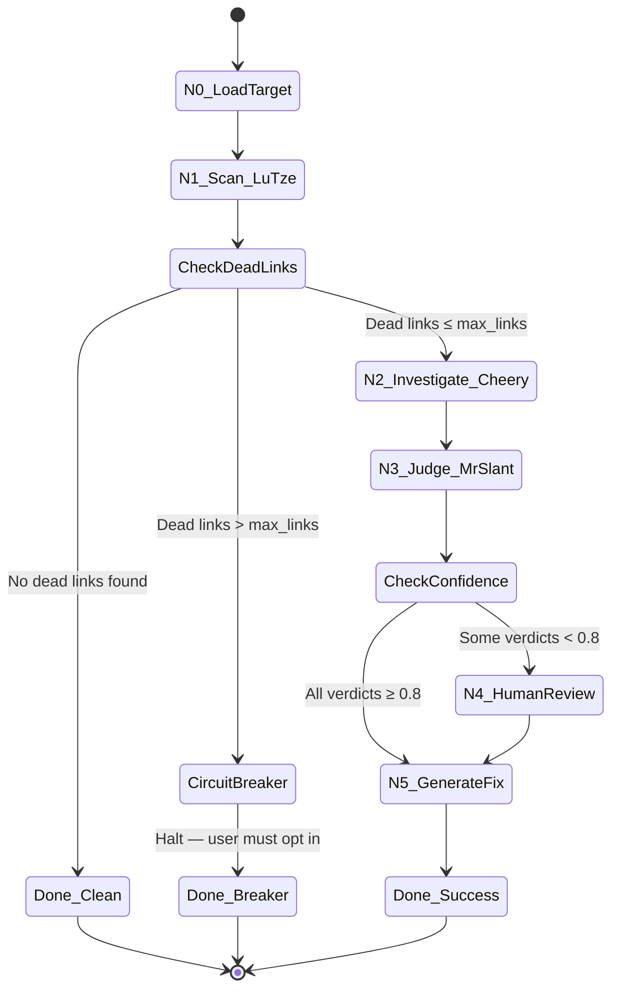

The diagram code for the pipeline state machine (can be rendered in any Mermaid viewer):

```mermaid
stateDiagram-v2
    [*] --> N0_LoadTarget
    N0_LoadTarget --> N1_Scan_LuTze
    N1_Scan_LuTze --> CheckDeadLinks
    
    state CheckDeadLinks <<choice>>
    CheckDeadLinks --> Done_Clean : No dead links found
    CheckDeadLinks --> CircuitBreaker : Dead links > max_links
    CheckDeadLinks --> N2_Investigate_Cheery : Dead links ≤ max_links
    
    CircuitBreaker --> Done_Breaker : Halt — user must opt in
    
    N2_Investigate_Cheery --> N3_Judge_MrSlant
    N3_Judge_MrSlant --> CheckConfidence
    
    state CheckConfidence <<choice>>
    CheckConfidence --> N5_GenerateFix : All verdicts ≥ 0.8
    CheckConfidence --> N4_HumanReview : Some verdicts < 0.8
    
    N4_HumanReview --> N5_GenerateFix
    N5_GenerateFix --> Done_Success
    
    Done_Clean --> [*]
    Done_Breaker --> [*]
    Done_Success --> [*]
```

**Labels:** `phase-1`, `langgraph`, `pipeline`, `size:xl`