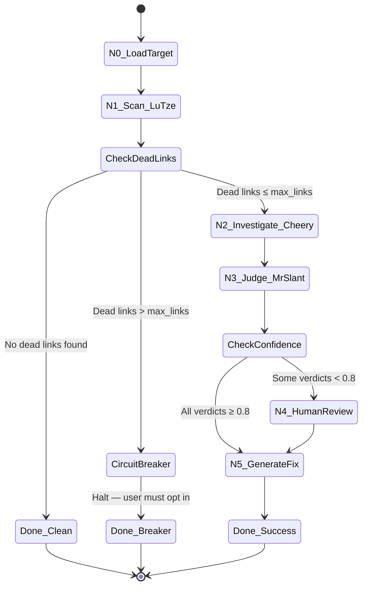

# The Clacks Network — Phase 1: LangGraph Pipeline Core (N0–N5)

> "A man is not dead while his name is still spoken." — GNU Terry Pratchett. And a link is not dead while someone is willing to find where it went.

## User Story

As a documentation maintainer,
I want an automated pipeline that scans repositories for dead links, investigates replacements, and scores confidence on each fix,
So that I can efficiently identify and prepare documentation fixes across open-source projects.

## Objective

Wire the LangGraph state machine (nodes N0–N5) to orchestrate scanning, investigation, judging, human review, and fix generation for dead documentation links — with configurable cost controls and explicit local-only data processing.

## UX Flow

### Scenario 1: Happy Path — All High-Confidence Fixes

1. User runs `ghla run https://github.com/org/project`
2. N0 loads target repo metadata and file list
3. N1 (Lu-Tze) scans all documentation files, finds 8 dead links
4. Circuit breaker checks: 8 ≤ `max_links` (default 50) → proceeds
5. N2 (Cheery) investigates each dead link, finds replacement candidates
6. N3 (Mr. Slant) scores confidence on each replacement — all ≥ 0.8
7. N5 generates fix patches for all 8 links
8. System outputs fix patches to `output/{repo}/fixes/` and exits with code 0
9. Terminal displays summary: `8 dead links found → 8 fixes generated (all high-confidence)`

### Scenario 2: Mixed Confidence — Human Review Required

1. User runs `ghla run https://github.com/org/project`
2. N0–N2 execute as above, finding 12 dead links with candidates
3. N3 scores confidence: 9 links ≥ 0.8, 3 links < 0.8
4. N4 presents the 3 low-confidence verdicts in terminal for human review
5. User approves 2, rejects 1 via interactive prompt
6. N5 generates fix patches for 11 approved links (9 auto + 2 human-approved)
7. System outputs patches and exits with code 0
8. Terminal displays summary: `12 dead links → 11 fixes generated (9 auto, 2 human-approved, 1 rejected)`

### Scenario 3: Circuit Breaker — Too Many Dead Links

1. User runs `ghla run https://github.com/org/project`
2. N1 finds 200 dead links, exceeding `max_links` (default 50)
3. Pipeline halts at circuit breaker with message: `Circuit breaker triggered: 200 dead links found (max: 50). Run with --max-links 200 to override.`
4. System exits with code 2 (circuit breaker halt)
5. No LLM calls are made beyond the scan phase

### Scenario 4: No Dead Links Found

1. User runs `ghla run https://github.com/org/project`
2. N1 scans all files, finds 0 dead links
3. Pipeline completes immediately with message: `No dead links found in org/project. Documentation is clean!`
4. System exits with code 0

### Scenario 5: Cost Limit Reached Mid-Run

1. User runs `ghla run https://github.com/org/project --max-links 100`
2. N1 finds 80 dead links, N2 begins investigation
3. After processing 45 links, estimated cost reaches `max_cost_limit` threshold
4. Pipeline halts with message: `Cost limit reached ($5.00). Processed 45/80 links. Partial results saved to output/{repo}/. Run with --max-cost 10.00 to increase limit.`
5. System exits with code 3 (cost limit halt), partial results are preserved

### Scenario 6: Network Failure During Scan

1. User runs `ghla run https://github.com/org/project`
2. N1 begins scanning, network drops mid-scan
3. System retries failed requests up to 3 times with exponential backoff
4. After retries exhausted, system saves partial scan results and exits with code 1
5. Terminal displays: `Network error during scan. 34/50 files scanned. Partial results saved. Re-run to resume.`

## Requirements

### Pipeline Orchestration

1. LangGraph `StateGraph` wiring nodes N0 through N5 in sequence with conditional edges
2. State object (`PipelineState`) carries all intermediate data between nodes
3. Circuit breaker between N1 and N2: halts if dead links exceed `max_links` (default: 50, configurable via CLI `--max-links`)
4. Confidence gate between N3 and N5: routes low-confidence verdicts (< 0.8 threshold) to N4 (human review)
5. Each node writes its output to the state database for persistence and resumability

### Node Specifications

1. **N0 (LoadTarget):** Accepts repo URL or local path, validates target exists, extracts file list filtered to documentation files (`.md`, `.rst`, `.txt`, `.adoc`)
2. **N1 (Scan — Lu-Tze):** Wraps existing `check_links.py`, outputs dead links report per issue #8 JSON schema
3. **N2 (Investigate — Cheery):** For each dead link, searches for replacement candidates using configured search strategy
4. **N3 (Judge — Mr. Slant):** Scores each replacement candidate with confidence value 0.0–1.0, outputs structured verdict
5. **N4 (HumanReview):** Terminal-based interactive review for low-confidence verdicts; user approves/rejects each
6. **N5 (GenerateFix):** Produces git diff patches from approved replacements

### Cost Controls

1. `max_links` CLI parameter (default: 50) acts as circuit breaker before any LLM calls
2. `max_cost_limit` CLI parameter (default: $5.00) acts as running cost accumulator that halts processing when reached
3. LLM model selection via `LLM_MODEL_NAME` environment variable; defaults to a cost-efficient model (e.g., `gpt-4o-mini` or `claude-3-haiku`) to prevent accidental high-cost usage during development
4. Cost per call is estimated using token counts and logged to the state database
5. Running cost total displayed in terminal output after each node completes

### Data Handling

1. **CRITICAL: All data scraping, processing, and storage must occur locally on the user's machine. No data may be transmitted to external servers other than necessary payloads to the configured LLM provider for content generation.**
2. All intermediate state persisted to local SQLite database (extends State Database #5)
3. Output artifacts (scan results, verdicts, patches) written to local filesystem under `output/{repo}/`

### CLI Interface

1. `ghla run <target>` — execute pipeline N0–N5
2. `--max-links <N>` — circuit breaker threshold (default: 50)
3. `--max-cost <N.NN>` — cost limit in USD (default: 5.00)
4. `--confidence <0.N>` — minimum confidence threshold for auto-approval (default: 0.8)
5. `--dry-run` — execute N0–N3 only, output verdicts without generating fixes
6. `--verbose` — detailed logging of each node's execution

## Technical Approach

- **Orchestration:** LangGraph `StateGraph` with typed `PipelineState` dict; conditional edges for circuit breaker and confidence routing
- **N1 Integration:** Wraps `check_links.py` as a LangGraph node, parsing its JSON output into pipeline state
- **N2/N3 Integration:** Wraps Cheery (detective) and Mr. Slant (judge) modules as LangGraph nodes with LLM calls via configurable model
- **Cost Tracking:** Decorator/middleware on LLM calls that accumulates token usage and estimated cost in state, checked against `max_cost_limit` before each call
- **State Persistence:** SQLite via existing State Database (#5) schema, extended with pipeline-run tracking tables
- **HITL (N4):** Python `prompt_toolkit` or `rich` for terminal-based interactive review (no web UI in Phase 1)

## Risk Checklist

- [x] **Architecture:** Introduces LangGraph as orchestration layer; adds new dependency. State machine design documented in diagram below.
- [x] **Cost:** LLM calls in N2 and N3 (estimated 5–20 per dead link). Mitigated by `max_links` circuit breaker, `max_cost_limit` accumulator, and cost-efficient model default.
- [ ] **Legal/PII:** No personal data handled. All processing is local-only (see Data Handling).
- [x] **Legal/External Data:** Fetches from external repositories (HTTP link checking) and GitHub API. Respects `robots.txt` and rate limits. Confirms ToS compliance via policy check module (#4).
- [ ] **Safety:** Partial results preserved on failure. No destructive operations in Phase 1 (no PRs, no writes to external repos).

## Security Considerations

- **Path Validation:** Target repo paths validated against path traversal attacks. Symlinks resolved and checked against allowed directories. Local paths must be absolute or resolved relative to CWD.
- **Input Sanitization:** Repository URLs validated against URL injection. All external content (link text, page titles) treated as untrusted and sanitized before storage in SQLite (parameterized queries only). Output patches escaped for safe terminal display.
- **Permissions:** Requires read access to target repos only. No write access to external repos in Phase 1. GitHub API token (optional, for rate limit increase) stored in environment variable, never logged.
- **LLM Prompt Injection:** External content (page titles, link text from scanned repos) included in LLM prompts is wrapped in delimiters and the system prompt explicitly instructs the model to treat it as data, not instructions.

## Files to Create/Modify

- `src/ghla/pipeline/state.py` — `PipelineState` TypedDict and state utilities
- `src/ghla/pipeline/graph.py` — LangGraph `StateGraph` wiring and conditional edges
- `src/ghla/pipeline/nodes/n0_load_target.py` — Target loading node
- `src/ghla/pipeline/nodes/n1_scan.py` — Lu-Tze scan wrapper node
- `src/ghla/pipeline/nodes/n2_investigate.py` — Cheery investigation node
- `src/ghla/pipeline/nodes/n3_judge.py` — Mr. Slant judging node
- `src/ghla/pipeline/nodes/n4_human_review.py` — Terminal HITL review node
- `src/ghla/pipeline/nodes/n5_generate_fix.py` — Fix generation node
- `src/ghla/pipeline/cost_tracker.py` — LLM cost accumulator and circuit breaker
- `src/ghla/cli/run.py` — `ghla run` CLI command
- `tests/unit/pipeline/` — Unit tests for all nodes and graph wiring
- `tests/integration/pipeline/` — Integration tests with static fixtures

## Dependencies

- Issue #5 must be completed first (State Database — SQLite persistence layer)
- Issue #4 must be completed first (Policy Check module — `CONTRIBUTING.md` parsing)
- Issue #8 must be completed first (Scan output JSON schema — Lu-Tze's report format)

## Out of Scope (Future)

- **PR Automation (N6)** — deferred to Phase 2 issue (includes fork, branch, commit, push, PR creation, rate limiting)
- **Campaign Dashboard (N7)** — deferred to Phase 3 issue (includes Jinja2 HTML generation, Chart.js visualizations, XSS-safe rendering)
- **GitHub Pages deployment** — deferred to Phase 3
- **Multi-repo batch processing** — deferred to Phase 4
- **Repo Scout integration (#3)** — deferred to Phase 4
- **Scheduling / GitHub Actions cron** — deferred to Phase 4
- **Web-based HITL dashboard** — deferred to Phase 3 (Phase 1 uses terminal-only review)

## Open Questions

- [x] Should the Dashboard be a separate issue? → Resolved: Yes, split into 3 phases per Governance directive. This issue covers Phase 1 only (N0–N5).
- [x] Which LLM model to use? → Resolved: Configurable via `LLM_MODEL_NAME` env var, defaulting to cost-efficient model (gpt-4o-mini / claude-3-haiku).
- [x] Where does data processing occur? → Resolved: Local-only. No server-side processing or telemetry. Only outbound traffic is to the configured LLM provider.
- [x] How to handle unbounded cost? → Resolved: Dual circuit breakers — `max_links` (pre-LLM) and `max_cost_limit` (running accumulator).

## Acceptance Criteria

- [ ] `ghla run <repo-url>` executes pipeline nodes N0 through N5 in sequence and exits with code 0 on success
- [ ] `ghla run <local-path>` accepts a local repository path and produces identical pipeline behavior to URL input
- [ ] N1 output matches issue #8 JSON schema exactly (validated against schema file)
- [ ] Circuit breaker halts pipeline with exit code 2 and message `Circuit breaker triggered: {count} dead links found (max: {max_links})` when dead links exceed `--max-links` threshold
- [ ] When all N3 confidence scores are ≥ 0.8, pipeline skips N4 and proceeds directly to N5
- [ ] When any N3 confidence score is < 0.8, pipeline routes those verdicts to N4 terminal review before N5
- [ ] N4 presents each low-confidence verdict with link URL, current target, proposed replacement, and confidence score; user responds with `y` (approve) or `n` (reject)
- [ ] N5 generates valid unified diff patches for each approved fix, written to `output/{repo}/fixes/`
- [ ] `--max-cost` halts pipeline with exit code 3 and message `Cost limit reached (${limit}). Processed {n}/{total} links.` when accumulated estimated LLM cost exceeds threshold
- [ ] `LLM_MODEL_NAME` environment variable overrides the default model; when unset, defaults to `gpt-4o-mini`
- [ ] `--dry-run` executes N0–N3 and outputs verdicts to stdout as JSON without executing N4 or N5
- [ ] All intermediate state (scan results, verdicts, fixes) is persisted to SQLite state database after each node completes
- [ ] Pipeline exits with code 1 and preserves partial results when a network error occurs after retry exhaustion (3 retries with exponential backoff)
- [ ] Running cost total is printed to stderr after each node completes (format: `[cost] $X.XX / $Y.YY limit`)
- [ ] No data is transmitted to external servers other than LLM provider API payloads (verified by network request audit in integration tests)

## Definition of Done

### Implementation

- [ ] Core pipeline (N0–N5) implemented with LangGraph StateGraph
- [ ] Cost tracking middleware implemented with dual circuit breakers
- [ ] Unit tests written and passing for all 6 nodes individually
- [ ] Integration tests passing for full pipeline with static fixtures (mocked LLM responses)

### Tools

- [ ] `ghla run` CLI command implemented in `src/ghla/cli/run.py`
- [ ] CLI `--help` documents all flags (`--max-links`, `--max-cost`, `--confidence`, `--dry-run`, `--verbose`)

### Documentation

- [ ] Update wiki pages affected by this change (pipeline architecture)
- [ ] Update README.md with `ghla run` usage examples
- [ ] Create ADR for LangGraph adoption and state machine design
- [ ] Add new files to `docs/0003-file-inventory.md`

### Reports (Pre-Merge Gate)

- [ ] `docs/reports/{IssueID}/implementation-report.md` created
- [ ] `docs/reports/{IssueID}/test-report.md` created

### Verification

- [ ] Run 0809 Security Audit — PASS (path validation, input sanitization, LLM prompt injection)
- [ ] Run 0810 Privacy Audit — PASS (local-only data processing verification)
- [ ] Run 0817 Wiki Alignment Audit — PASS (if wiki updated)

## Testing Notes

### Static Fixtures

- Use pre-recorded scan results (JSON) to avoid live HTTP requests in tests
- Mock LLM responses for N2 and N3 with deterministic confidence scores
- Fixture set must include: all-high-confidence, mixed-confidence, all-low-confidence, and zero-dead-links scenarios

### Circuit Breaker Testing

- Set `--max-links 5` and provide fixture with 10 dead links → verify halt at exit code 2
- Set `--max-cost 0.01` and provide fixture requiring multiple LLM calls → verify halt at exit code 3

### HITL Testing

- Pipe `echo "y\nn\ny"` to stdin for automated N4 testing in CI
- Verify rejected verdicts are excluded from N5 output

### Network Failure Testing

- Mock HTTP client to fail after N files scanned → verify partial results saved and exit code 1
- Verify retry logic fires exactly 3 times with increasing delay

### Cost Tracking Testing

- Mock LLM client to return known token counts → verify accumulated cost matches expected value
- Verify cost display format on stderr after each node

## Pipeline State Machine

**Labels:** `phase-1`, `langgraph`, `pipeline`, `size:xl`

---

**Gemini Review:** APPROVED | **Model:** `gemini-3-pro-preview` | **Date:** 2026-02-16 | **Reviews:** 6
